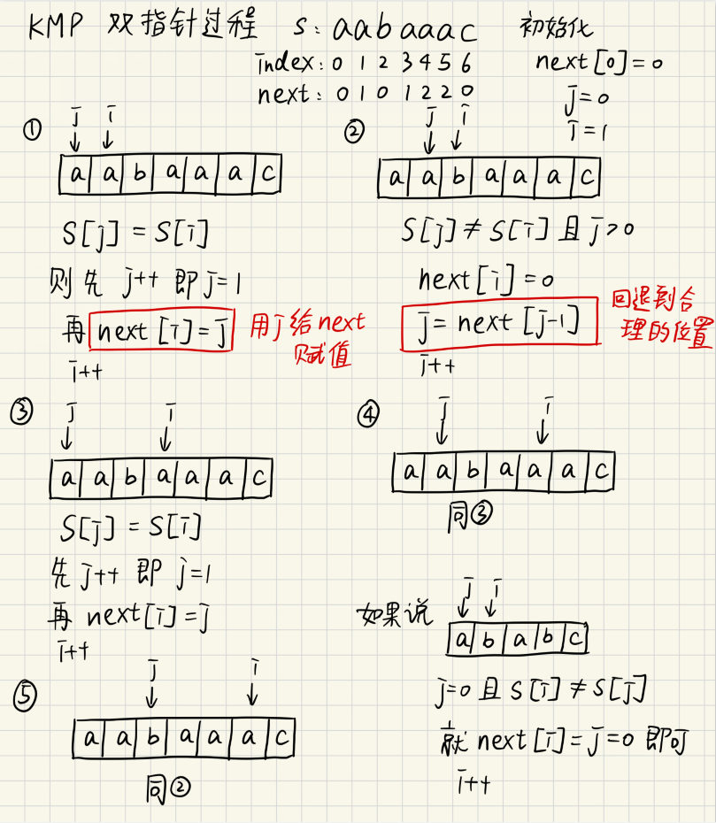

# dfs

dfs递归模板

```c
/*
 * Return true if there is a path from cur to target.
 */
boolean DFS(Node cur, Node target, Set<Node> visited) {
    return true if cur is target;
    pruning; // 剪枝
    for (next: each neighbor of cur) {
        if (next is not in visited) {
            add next to visted;
            return true if DFS(next, target, visited) == true;
        }
    }
    return false;
}

```

```c
void search(int depth, 参数表){
    自定义参数;
	if (当前是目标状态) {
		输出解或者作计数和评价处理;
	} else {
		for (i= 1; i<=状态的拓展可能数; i++) {
			if (第i种状态拓展可行) {
				保存现场(断点),维护自定义参数;
            	search(depth + 1， 参数表);
				恢复现场,回溯到上一个断点继续执行;
            }
		}
    }
}
```

如果递归太深的话会造成栈溢出，以下为dfs显式栈模板

```c
/*
 * Return true if there is a path from cur to target.
 */
boolean DFS(int root, int target) {
    Set<Node> visited;
    Stack<Node> s;
    add root to s;
    while (s is not empty) {
        Node cur = the top element in s;
        return true if cur is target;
        for (Node next: the neighbors of cur) {
            if (next is not in visited) {
                add next to s;
                add next to visited;
            }
        }
        remove cur from s;
    }
    return false;
}
```

https://blog.csdn.net/weixin_43736974/article/details/86672842

https://blog.csdn.net/qq_41851496/article/details/109190375


# bfs

```c
bool BFS(Node& Vs, Node& Vd){  
    queue<Node> Q;  
    Node Vn, Vw;  
    int i;  

    //初始状态将起点放进队列Q  
    Q.push(Vs);  
    hash(Vw) = true;//设置节点已经访问过了！  
    /*这里的hash()不是一个具体的函数，而是说这里利用hash思想，具体实现
    时可以利用数组或者set(集合)*/

    while (!Q.empty()){//队列不为空，继续搜索！  
        //取出队列的头Vn  
        Vn = Q.front();  

        //从队列中移除  
        Q.pop();  

        while(Vw = Vn通过某规则能够到达的节点){/*实际写代码(如迷宫问题)，
        一般是用for()循环来遍历当前点能够到达的节点*/
            if (Vw == Vd){//找到终点了！  
                //把路径记录，这里没给出解法  
                return true;//返回  
            }  

            if (isValid(Vw) && !visit[Vw]){  
                //Vw是一个合法的节点并且为白色节点  
                Q.push(Vw);//加入队列Q  
                hash(Vw) = true;//设置节点颜色  
            }  
        }  
    }  
    return false;//无解  
}  

```

https://blog.csdn.net/m0_51658421/article/details/127568774


# 图

- 邻接矩阵存储边，即二维数组，`a[i][j]`值为1则代表点i和点j间存在一条边（可以存成有向的）， 空间复杂度`O(n ^ 2)`，判断某一条边时间复杂度`O(1)`, 判断所有的边时间复杂度`O(n ^ 2)`

- 邻接表存储边，用几个链表来存储，空间复杂度`O(m + n)`， 判断某一条边时间复杂度`O(degree(u))`判断所有的边时间复杂度`O(m + n)`

  - 用struct来制作链表，但是`creating a struct linked list cost too much time and memory`，在算法题目中不适合

  - 用数组来制作链表

    ```c++
    int end_[kmax];  // 链表每一个节点的数据，代表有向线段的终点
    int next_[kmax];  // 用来指向链表的下一项， 如next[2] = 4意味着end_[2]的下一项为end_[4]，若为-1则为链尾
    int start[kmax];  // 链头，初始化为-1, start[1] = 3表示起点为1的边组成的链，链的第二项为end_[3]
    int idx = 0; // 用于标记每个节点的记号，即为endd的下标
    
    memset(start, -1, sizeof(start));  // 初始化为-1
    
    void AddEdge(int s, int e) {
        end_[idx] = e;  // 在一个新节点放入终点
        next_[idx] = start[s];  // 记录end_[idx]的下一项为该链的第二项
        start[s] = idx;  // 记录该链的第二项为end_[idx]
        idx++;  // 变成新的记号
        return;
    }
    
    // 遍历一条链
    int nextpt = start[pt];  // pt为起点的链的第二项下标，即end_[nextpt]为第二项
    while (true) {
    	if (nextpt == -1) {
    		break;
    	}
    	int endpt = end_[nextpt];  // end_[nextpt]为pt为起点的每一条边的终点
    	nextpt = next_[nextpt];  // 找到endpt的下一项
    }
    ```
    
    ```c++
    // 网上版本
    int h[N], e[N], ne[N], idx = 0;
    memset(h, -1, sizeof h);
    
    // 增加边到链表上
    void add(int a, int b) {
    	e[idx] = b, ne[idx] = h[a], h[a] = idx++;
    }
    
    // 遍历某个点u的边
    for(int i = h[u]; i != -1; i = ne[i])
    ```

    https://blog.csdn.net/SRestia/article/details/126532008

    https://blog.csdn.net/ironman321/article/details/105319203
    
    https://blog.csdn.net/weixin_73922932/article/details/127778609


# 快速排序

**快速排序**（Quick Sort）使用分治法策略。

它的基本思想是：选择一个**基准数**，通过一趟排序将要排序的数据分成独立的两部分；其中一部分的所有数据都比另外一部分的所有数据都要小。然后，再按此方法对着两部分数据分别进行快速排序，整个排序过程可以递归进行，以此达到整个数据变成有序序列。

时间复杂度最好为`O(nlogn)`，最差为`O(n ^ 2)`，一般认为是`O(nlogn)`。

空间复杂度`O(logn)`。

排序算法中速度最快。

不稳定。

```c
#include <stdio.h>
#include <stdlib.h>
 
// 参数说明：
// a -- 待排序的数组
// l -- 数组的左边界(例如，从起始位置开始排序，则l = 0)
// r -- 数组的右边界(例如，排序截止到数组末尾，则r = a.length - 1)
// 从小到大排序
void QuickSort(int a[], int l, int r) {
    if (l < r) {  // 若l = r，则这块排序结束了
        int pivot, i, j;
        pivot = a[l];
        i = l;
        j = r;
        while (i < j) {  // i往右移，j往左移，根据pivot调整a[i]和a[j]的位置，直到i和j重合
            while (a[j] > pivot && i < j) {  // 从右往左找到第一个比pivot小的数
                j--;  // 找到a[j] < pivot
            }
            if (i < j) {
                a[i] = a[j];  // 把a[j]放到左边
                i++;  // i右移
            }
            while (a[i] < pivot && i < j) {  // 从左往右找到第一个比pivot大的数
                i++;  // 找到a[i] > pivot
            }
            if (i < j) {
                a[j] = a[i];  // 把a[i]放到右边
                j--;  // j左移
            }
        }
        a[i] = pivot;  // 此时i = j，a[i]左边全是小于pivot的数，右边全是大于pivot的数，放入pivot
        QuickSort(a, l, i - 1);
        QuickSort(a, i + 1, r);
    }
    return;
}
 
int main() {
	int arr[] = {9, 5, 1, 6, 2, 3, 0, 4, 8, 7};
	QuickSort(arr, 0, 9);  // 从小到大排序
	for (int i = 0; i < 10; i++) {
		printf("%d ", arr[i]);
	}
	printf("\n");
	system("pause");
	return 0;
}
```

https://blog.csdn.net/qq_53436105/article/details/127184536

https://www.bilibili.com/video/BV1at411T75o

时间复杂度：https://blog.csdn.net/weixin_44273302/article/details/113748859

空间复杂度：https://blog.csdn.net/m0_72964546/article/details/126737368


# 归并排序

**归并排序**算法有两个基本的操作，一个是**分**，也就是把原数组划分成两个子数组的过程。另一个是**治**，它将两个有序数组合并成一个更大的有序数组。

1. 将待排序的线性表不断地切分成若干个子表，直到每个子表只包含一个元素，这时，可以认为只包含一个元素的子表是有序表。
2. 将子表两两合并，每合并一次，就会产生一个新的且更长的有序表，重复这一步骤，直到最后只剩下一个子表，这个子表就是排好序的线性表。

时间复杂度`O(nlogn)`。

空间复杂度`O(n)`。

速度仅次于快速排序。

稳定。

```c++
void Merge(int a[], int tmp[], int l, int m, int r) {
    int i, j, k;
    i = l;
    j = m + 1;
    k = l;
    while (i != m + 1 && j != r + 1) {
        if (a[i] < a[j]) {
            tmp[k++] = a[i++];
        }
        else if (a[i] >= a[j]) {
            tmp[k++] = a[j++];
        }
    }
    while (i != m + 1) {
        tmp[k++] = a[i++];
    }
    while (j != r + 1) {
        tmp[k++] = a[j++];
    }
    for (int i = l; i <= r; i++) {
        a[i] = tmp[i];
    }
    return;
}

void MergeSort(int a[], int tmp[], int l, int r) {  // array, left, right
    if (l < r) {
        int m = l + (r - l) / 2;  // 避免计算时溢出，计算mid
        MergeSort(a, tmp, l, m);
        MergeSort(a, tmp, m + 1, r);
        Merge(a, tmp, l, m, r);
    }
    return;
}
 
int main() {
    int a[8] = {5, 1, 2, 3, 7, 4, 8, 6};
    int tmp[8];
    MergeSort(a, tmp, 0, 7);
    for(int i = 0; i < 8; i++)
        printf("%d ", a[i]);
    printf("\n");
    return 0;
}
```

https://blog.csdn.net/justidle/article/details/104203958


# 动态规划

## 背包问题

解法归纳：

- 如果装不下当前物品，那么前n个物品的最佳组合和前n-1个物品的最佳组合是一样的。

- 如果装得下当前物品。

  - 假设1：装当前物品，在给当前物品预留了相应空间的情况下，前n-1个物品的最佳组合加上当前物品的价值就是总价值。

  - 假设2：不装当前物品，那么前n个物品的最佳组合和前n-1个物品的最佳组合是一样的。

​	选取假设1和假设2中较大的价值，为当前最佳组合的价值。

```
opt(i, w) = {
	0, if i = 0
	opt(i - 1, w), if wi > w
	max{opt(o - 1, w), vi + opt(i - 1, w - wi)}, otherwise
}
```

https://www.bilibili.com/video/BV1K4411X766


# KMP算法

两个字符串a，b，求b在a中存在的个数

- 先制作一个部分匹配表next[]

  - 手动的话，字符串每一位的next值为前缀和后缀的最长共有元素长度

    例如字符串abcab：

    对a， next[0] = 0

    对ab，前缀为a，后缀为b，则next[1] = 0

    对abc，前缀为{a, ab}，后缀为{bc, c}，则next[2] = 0

    对abca，前缀为{a, ab, abc}，后缀为{bca, ca, a}，最长共有元素为a，其长度为1，则next[3] = 1

    对abcab，前缀为{a, ab, abc, abca}，后缀为{bcab, cab, ab, b}，最长共有元素为ab，其长度为2，则next[4] = 2

    则next为0, 0, 0, 1, 2

  - 以下为代码实现，与手动方法不同，其利用两个指针直接找重复部分



```cpp
void getNext(int* next, string s) {
    // 初始化
    next[0] = 0;
    int j = 0;
    int i = 1;
    // 开始循环
    while (true) {
        if (i >= s.size()) break;  // next数组完成
        if (s[i] == s[j]) {  // 当两个字符相同，例如ababc中的j = 1, i = 3时这时next[3] = 2
            next[i] = j + 1;
            i++;
            j++;
        } else if (s[i] != s[j]) {
            if (j == 0) {  // 为了j - 1不到-1
                next[i] = 0;
                i++;
            } else if (j != 0) {
                // 最重要的一步，这里j不会跳回开头，而是利用next数组跳到合理的位置
                // 例如aabaaac
                // j = 2, i = 5时两个字符不同，则j跳到第2个a，这样下一次比较时next[5] = 2才是正确的
                j = next[j - 1];
            }
        }
    }
    return;
}
```

```c++
// 简化的代码
void GetNext(int* next, const string& s) {
    int j = 0;
    next[0] = 0;
    for(int i = 1; i < s.size(); i++) {
        while (j > 0 && s[i] != s[j]) { // j要保证大于0，因为下面有取j-1作为数组下标的操作
            j = next[j - 1]; // 注意这里，是要找前一位的对应的回退位置了
        }
        if (s[i] == s[j]) {
            j++;
        }
        next[i] = j;
    }
}
```

- 然后开始在字符串a中找字符串b，当b的前若干位与a的部分位数相同时，下一位若不同，则移动已匹配的字符数减去对应的部分匹配值

  例如：在字符串abcaabcab中找abcab

  当abca四个字符过完都相同时，下一个字符a与b不同，则将abcab往后移动4(已匹配的字符数) - 1(a部分匹配值next[4]) = 3，则再用abcab中的第一个a与abcaabcab中的第二个a对齐了然后继续比较

```c++
int KMP(string a, string b, int next[]) {
    int cnt = 0;
    int i = 0;
    int j = 0;
    while (true) {
        if (i >= a.size()) break;
        if (a[i] != b[j] && j == 0) {
            i++;
        } else if (a[i] != b[j] && j != 0) {
            j = next[j - 1];
        } else if (a[i] == b[j] && j != b.size() - 1) {
            i++;
            j++;
        } else if (a[i] == b[j] && j == b.size() - 1) {  // 匹配字符串b过了一遍完了
            cnt++;
            i++;
            j = next[j];  // j变成next的值相当于匹配字符串b向后移动了(已经匹配的字符数减去next的值)
        }
    }
    return cnt;
}
```

## 求字符串前i个字符的公共前后缀数量

- 求$num[i]$数组为字符串前i个字符的公共前后缀数量

- 这里存在一个性质：对于字符串前$i$位（从1号位置开始为第一个字符），即$[1, i]$

  $next[i], next[next[i]], next[next[next[i]]], ... $表示了所有$[1, i]$的所有公共前后缀的长度，直到$next[i]$的值为0

- $next[i]$表示$[1, i]$中$[1, next[i]]$与$[i - next[i] + 1, i]$的字符串是相同的，且$next[i]$为其长度

  则$next[next[i]]$表示$[1, next[i]]$中$[1, next[next[i]]]$与$[[i - next[next[i]] + 1, next[i]]]$的字符串是相同的，且$next[next[i]]$为其长度

  由于$[1, next[i]]$与$[i - next[i] + 1, i]$的字符串是相同的， 则在$[1, next[i]]$中表示的公共前后缀就是$[1, i]$的公共前后缀，而且长度一定小于原本的$next[i]$

https://www.luogu.com.cn/problem/solution/P2375


# 并查集

- 两个优化：

  - 路径压缩：每次Find找根节点的时候将所有经过的节点直接连接到根节点，这样下次找的时候会快

  - Link By Rank：为每个树维护一个rank值，这个值为树的深度，每次Union连接两棵树的时候，将rank小的连到rank大的上，这样新rank会更小，查询时更快，在数据量比较大的时候很有效

- 加入两个优化后，查并集的效率非常高。对n个元素的查并集进行一次操作的复杂度为`O(a(n))`。在这里a(n)是阿克曼(Ackermann)函数的反函数。这要比`O(log(n))`还要快。

  不过，这是“均摊复杂度”。并不是每次都满足，多次后，平均每次复杂度。

```c++
// 这个Find可以用循环来做，比递归快
int Find(int x, int set[]) {
    if (set[x] == x) return x;
    // 路径压缩，这里从第一个x递归到根节点，每次的返回值都变为了根节点，则每个set[x] = 根节点
    set[x] = Find(set[x], set);  
    return set[x];
}

// 这里没有用LinkByRank优化
void Union(int x, int y, int set[]) {
    int rootx = Find(x, set);  // 找根节点
    int rooty = Find(y, set);
    set[rootx] = rooty;  // 根节点相连
    return;
}

int main() {
    int n;
    cin >> n;
    int set[n + 5];
    for (int i = 0; i < n + 5; i++) 
        set[i] = i;  // 让每个set[x]指向自己，即产生n个树
    ...
    return 0;
}
```

https://blog.csdn.net/qq_42388742/article/details/112464016


# 贪心

## 有时间限制的带权重的安排问题

**题目：**

小伟报名参加中央电视台的智力大冲浪节目。本次挑战赛吸引了众多参赛者，主持人为了表彰大家的勇气，先奖励每个参赛者$m$ 元。先不要太高兴！因为这些钱还不一定都是你的？！接下来主持人宣布了比赛规则：

首先，比赛时间分为$n$个时段，它又给出了很多小游戏，每个小游戏都必须在规定期限$t_i$前完成。如果一个游戏没能在规定期限前完成，则要从奖励费 元$m$中扣去一部分钱$w_i$，$w_i$为自然数，不同的游戏扣去的钱是不一样的。当然，每个游戏本身都很简单，保证每个参赛者都能在一个时段内完成，而且都必须从整时段开始。主持人只是想考考每个参赛者如何安排组织自己做游戏的顺序。作为参赛者，小伟很想赢得冠军，当然更想赢取最多的钱！注意：比赛绝对不会让参赛者赔钱！

**分析过程：**

本题采用贪心算法的思想，首先将所有游戏按其价值从高到低排序。一个游戏只要在规定期限完成之前完成就不会被扣除奖励，为了让一个游戏尽可能不影响其他游戏，我们让其在自己的规定期限内尽可能地往后靠。我们从奖励价值最高的游戏开始考虑，将所有游戏考虑完成后就可以得到的所获得的奖励最大值。

https://blog.csdn.net/weixin_45816954/article/details/124948672

## 糖果传递问题

**题目：**

有 $n$个小朋友坐成一圈，每人有 $a_i$ 颗糖果。每人只能给左右两人传递糖果。每人每次传递一颗糖果的代价为 1。求使所有人获得均等糖果的最小代价。

**分析过程：**

令小朋友已有糖果数组是$a[n]$，给出糖果的是数组$x[n]$，这里的$x[n]$可以是正数或者负数，正数代表给出，负数代表索取。这里要求解的答案就是 $|x[1]| + |x[2]| + |x[3]| +..... + |x[n]|$的最小值。

令$ava$为平均糖果数字。

对于第一个人来说有：

$a[1] - x[1] + x[2] = ava$

依次列出有：

$a[2] - x[2] + x[3] = ava$

$a[3] - x[3] + x[4] = ava$

....

化简一下，用$x[1]$表示所有的$x[n]$，有：

$x[2] = x[1] + ava - a[1] = x[1] - (a[1] - ava)$

$x[3] = x[2] + ava - a[2] = x[1] - (a[1] - ava) - (a[2] - ava)$

......

使用一个新的数组来保存除了$x[1]$的部分

$c[1] = a[1] - ava$

$c[2] = (a[1] - ava) + (a[2] - ava)$

......

那么就有 $x[i] = x[1] - c[i - 1]$

则最终的答案就是 $|x[1] - c[1]|+|x[1] - c[2]| + |x[3] - c[3]| +.....+ |x[n] - c[n]|$

观察发现，上式类似于一维坐标上，所有点到某个定点的总距离和。

那么，我们可以对 $c[i] $排序，即$c[1] <= c[2] <= c[3] .....<= c[n]$，

若$n$为奇数，则原绝对值式的图像值为先下降后上升，在$x[i] = c[\frac {n+1}{2}]$时达到最小值；

若n为偶数，则原绝对值式的图象值为先下降后保持不变再上升，在$x[i] = c[\frac {n}{2}]$或$x[i] = c[\frac {n}{2} + 1]$时达到最小值。

```cPP
#include <iostream>
#include <cstdlib>
#include <cmath>
#include <algorithm>
using namespace std;

int main() {
    int n;
    cin >> n;
    int a[n + 1];
    int c[n + 1] = {0};
    int mid;
    long long sum = 0, ava;
    long long ans = 0;
    for (int i = 1; i <= n; i++) {
        cin >> a[i];
        sum += a[i];
    }
    ava = sum / n;
    c[1] = a[1] - ava;
    for (int i = 2; i <= n; i++) {
        c[i] = c[i - 1] + a[i] - ava;
    }
    sort(c + 1, c + n + 1);
    mid = c[n / 2 + 1];
    for (int i = 1; i <= n; i++) {
        ans += abs(mid - c[i]);
    }
    cout << ans << endl;
    system("pause");
	return 0;
}
```

https://blog.csdn.net/2302_77698668/article/details/133135590

https://www.cnblogs.com/Willems/p/13818003.html


# 线段树

```cpp
void CreatTree(int no, int l, int r, int a[], int tree[]) {
    if (l == r) {  // 到叶子节点了
        tree[no] = a[l];
        return;
    }
    int mid = l + r >> 1;
    CreatTree(no << 1, l, mid, a, tree);
    CreatTree(no << 1 | 1, mid + 1, r, a, tree);
    tree[no] = tree[no << 1] + tree[no << 1 | 1];
    return;
}

// [x, y]中每个数加k
void Add(int no, int l, int r, int tree[], int lazy[], int x, int y, int k) {
    if (x <= l && r <= y) {
        tree[no] += (r - l + 1) * k;
        lazy[no] += k;
        return;
    }
    int mid = l + r >> 1;
    // 这里一定需要lazy往下传递一下，你可能觉得在查询时也会扩散，答案应该是正确的，然而不是这样
    // 这里不传递的话会出现情况：
    // [4, 6] = 3具有lazy = 1标记，[4, 5]终结了递归经过计算变为了2，[6, 6] = 0，此时又会去计算[4, 6] = [4, 5] + [6, 6] = 2，
    // 当然因为[4, 6]具有lazy标记，如果查询[..., 4]的话会传递lazy标记并再计算[4, 6]，这时[4, 6]是正确的
    // 然而如果查询[..., 6]，则不会扩散，而是会将[4, 6] = 2加到答案中而不管它的lazy标记，这样最后答案就会错误
    if (lazy[no]) {  // 该段不全部在[x, y]中，也就是需要继续分段，所以将lazy值传递至下一层
        tree[no << 1] += (mid - l + 1) * lazy[no];
        lazy[no << 1] += lazy[no];
        tree[no << 1 | 1] += (r - mid) * lazy[no];
        lazy[no << 1 | 1] += lazy[no];
        lazy[no] = 0;
    }
    if (x <= mid) {
        Add(no << 1, l, mid, tree, lazy, x, y, k);
    }
    if (y > mid) {
        Add(no << 1 | 1, mid + 1, r, tree, lazy, x, y, k);
    }
    tree[no] = tree[no << 1] + tree[no << 1 | 1];
    // 若前面不将lazy往下传递，这可以在这里写下面这句，也能正确
    // 这里就相当于没有传递但是计算了传递完后的父节点的值，后面再传递计算父节点的值与这个相同
    // tree[no] = tree[no << 1] + tree[no << 1 | 1] + (r - l + 1) * lazy[no];
    return;
}

// 求[x, y]中数的和，ans为和的地址
void Query(int no, int l, int r, int tree[], int lazy[], int x, int y, int* ans) {
    if (x <= l && r <= y) {
        *ans += tree[no];
        return;
    }
    int mid = l + r >> 1;
    if (lazy[no]) {  // 该段不全部在[x, y]中，也就是需要继续分段，所以将lazy值传递至下一层
        tree[no << 1] += (mid - l + 1) * lazy[no];
        lazy[no << 1] += lazy[no];
        tree[no << 1 | 1] += (r - mid) * lazy[no];
        lazy[no << 1 | 1] += lazy[no];
        lazy[no] = 0;
    }
    if (x <= mid) {
        Query(no << 1, l, mid, tree, lazy, x, y, ans);
    }
    if (mid < y) {
        Query(no << 1 | 1, mid + 1, r, tree, lazy, x, y, ans);
    }
    return;
}
```


# 树状数组

```cpp
#define LOWBIT(x) (x & (-x))

void CreateTree(int n, int a[], int tree[]) {  // 造一个树状数组
    for (int i = 1; i <= n; i++) {
        for (int j = i - LOWBIT(i) + 1; j <= i; j++) {
            tree[i] += a[j];
        }
    }
    return;
}

void Add(int x, int k, int n, int tree[]) {  // 为第x个数加k
    while (x <= n) {
        tree[x] += k;
        x += LOWBIT(x);
    }
    return;
}

int Sum(int x, int n, int tree[]) {  // 计算前x个数的和
    if (x == 0) return 0;
    int ans = 0;
    while (x >= 1) {
        ans += tree[x];
        x -= LOWBIT(x);
    }
    return ans;
}
```

