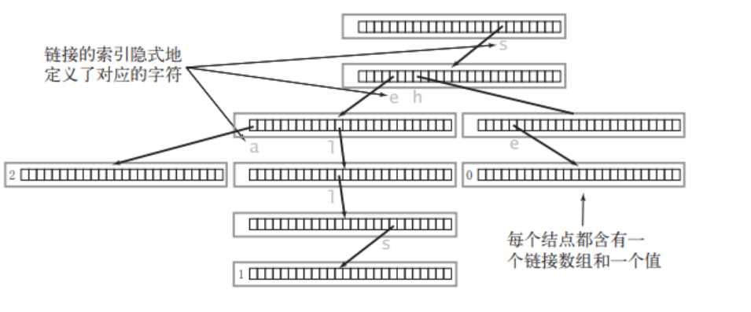
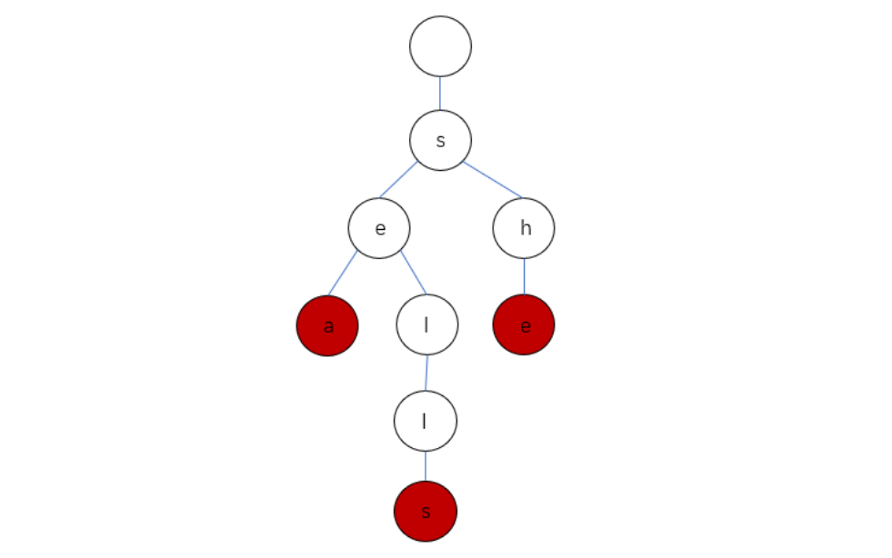

# 哈希

## [49. 字母异位词分组](https://leetcode.cn/problems/group-anagrams/)

用unordered_map作为哈希表。

```c++
unordered_map<string, vector<string>> mp;
```

用sort可以直接排序string

```c++
sort(key.begin(), key.end());
```

```c++
class Solution {
public:
    vector<vector<string>> groupAnagrams(vector<string>& strs) {
        unordered_map<string, vector<string>> mp;
        for (string& str: strs) {
            string key = str;
            sort(key.begin(), key.end());
            mp[key].emplace_back(str);
        }
        vector<vector<string>> ans;
        for (auto it = mp.begin(); it != mp.end(); ++it) {
            ans.emplace_back(it->second);
        }
        return ans;
    }
};
```

## [128. 最长连续序列](https://leetcode.cn/problems/longest-consecutive-sequence/)

实现时间复杂度为 `O(n)` 的算法解决此问题，不能用set（本质是红黑树，查询增删都需要logn，每个数放入set中总共就是nlogn），使用unordered_set（哈希表，o(1)）。

这道题的思路是：将所有数放到unordered_set哈希表中，然后遍历。如果num前面的数字不在哈希表里了，说明num可能是数字连续的最长序列的首个数字，那就循环去找num+1,num+2...，如果num前面的数字在哈希表里，就跳过。

记得直接用max取较大值

```c++
max_len = max{len, max_len};
```

```c++
class Solution {
public:
    int longestConsecutive(vector<int>& nums) {
        unordered_set<int> num_set;
        int max_len = 0;
        for (auto num: nums) {
            num_set.insert(num);
        }
        for (auto num: num_set) {
            if (num_set.find(num - 1) == num_set.end()) {
                int tmp_num = num;
                int len = 1;
                while (num_set.find(tmp_num + 1) != num_set.end()) {
                    tmp_num++;
                    len++;
                }
                max_len = max(max_len, len);
            }

        }
        return max_len;
    }
};
```

# 双指针

## [283. 移动零](https://leetcode.cn/problems/move-zeroes/)

先遍历一遍：记录每个非0数之前有几个0。再遍历一遍：将每个非0数向前移动记录的数，然后将这个非0数的位置变为0，这里有个细节就是如果前面没有0，他是不移动的，要在变为0前判断一下。

## [11. 盛最多水的容器](https://leetcode.cn/problems/container-with-most-water/)

**双指针：**双指针代表了什么？

双指针代表的是 可以作为容器边界的所有位置的范围。在一开始，双指针指向数组的左右边界，表示 数组中所有的位置都可以作为容器的边界，因为我们还没有进行过任何尝试。在这之后，我们每次将 **对应的数字较小的那个指针** 往 另一个指针 的方向移动一个位置，就表示我们认为 这个指针不可能再作为容器的边界了。

```c++
class Solution {
public:
    int maxArea(vector<int>& height) {
        int l = 0, r = height.size() - 1;
        int ans = 0;
        while (l < r) {
            int area = min(height[l], height[r]) * (r - l);
            ans = max(ans, area);
            if (height[l] <= height[r]) {
                l++;
            }
            else {
                r--;
            }
        }
        return ans;
    }
};
```

# 滑动窗口

## [3. 无重复字符的最长子串](https://leetcode.cn/problems/longest-substring-without-repeating-characters/)

使用**滑动数组**：

一个left和一个right指针，分别指向左边和右边，用一个哈希表unordered_set记录当前子串中的字符，如果s[right]的加入导致子串有重复字符，就向左移动left并删除哈希表中的s[left]，直到s[right]能够加入，right加1。

```c++
class Solution {
public:
    int lengthOfLongestSubstring(string s) {
        int ans = 0;
        int l = 0, r = 0;
        unordered_set<char> set;
        while (l <= r && r < s.size()) {
            if(set.find(s[r]) == set.end()) {
                set.insert(s[r]);
                r++;
            } else if (set.find(s[r]) != set.end()) {
                set.erase(s[l]);
                l++;
            }
            ans = max(ans, (int)set.size());
        }
        return ans;
    }
};
```

## [438. 找到字符串中所有字母异位词](https://leetcode.cn/problems/find-all-anagrams-in-a-string/)

使用滑动窗口，这里有个点：对于vector容器，==运算符是被重载过的。当两个vector的元素数量相同，并且对应位置的元素都相等时，就会返回true。因此可以直接用两个vector数组，来统计当前的窗口内的字母，然后判断是否为字母异位。

# 子串

## [560. 和为 K 的子数组](https://leetcode.cn/problems/subarray-sum-equals-k/)

首先，因为数组元素有负数，不能使用滑动窗口。

因此，使用**前缀和**，prefix数组，求有多少个prefix[j]-prefix[i]==k就可以，直接暴力的话遇到一个{0,0,0,0,0,....}全是0的测试用例就会超时，因此使用和[1. 两数之和](https://leetcode.cn/problems/two-sum/)相同的思想：遍历prefix[j]中，使用**哈希表**来记录`prefix[j]`，哈希表的key是`prefix[j]`，value是值为`prefix[j]`的前缀和的个数。遍历到`prefix[j]`时，从哈希表中就可以找到有`map[prefix[j]−k]`个`prefix[i]`，加入答案。

```c++
class Solution {
public:
    int subarraySum(vector<int>& nums, int k) {
        vector<int> prefix_sum{0};
        int sum = 0, ans = 0;
        for (auto num: nums) {
            sum += num;
            prefix_sum.emplace_back(sum);
        }
        unordered_map<int, int> map;
        for (int i = 0; i < prefix_sum.size(); i++) {
            auto it = map.find(prefix_sum[i] - k);
            if (it != map.end()) {
                ans += it->second;
            }
            map[prefix_sum[i]]++;
        }
        return ans;
    }
};
```

# 普通数组

# 矩阵

## [240. 搜索二维矩阵 II](https://leetcode.cn/problems/search-a-2d-matrix-ii/)

看到二维矩阵并且有二分标签，原本想像平面四叉树平面直接分成四块来二分，但是写的递归很麻烦，似乎还会sof

看了题解，两个办法：

1. 只在行/列使用二分
2. 根据行和列都是升序的，从某个角出发，根据升序的规则，每次减少一行或者一列，直到找到或超出边界

这里使用方法2：

```c++
class Solution {
    public:
        bool searchMatrix(vector<vector<int>>& matrix, int target) {
            int m = matrix.size(), n = matrix[0].size();
            int x = 0, y = n - 1;
            while (x < m && y >= 0) {
                if (matrix[x][y] == target) return true;
                else if (matrix[x][y] > target) y--;
                else if (matrix[x][y] < target) x++;
            }
            return false;
        }
};
```

# 链表

## [21. 合并两个有序链表](https://leetcode.cn/problems/merge-two-sorted-lists/)

递归：空间复杂度为O(m + n)

```c++
class Solution {
public:
    ListNode* mergeTwoLists(ListNode* list1, ListNode* list2) {
        if (list1 == NULL) return list2;
        if (list2 == NULL) return list1;
        if (list1->val <= list2->val) {
            list1->next = mergeTwoLists(list1->next, list2);
            return list1;
        } else {
            list2->next = mergeTwoLists(list2->next, list1);
            return list2;
        }
        return list1;
    }
};
```

迭代：空间复杂度为O(1)

需要使用一个**dummyhead虚拟头节点**放在前面，和一个**prev指针**来完成前后的链接：每次只调整prev的next，然后`prev = prev->next`。画一遍就懂了。

```c++
class Solution {
public:
    ListNode* mergeTwoLists(ListNode* list1, ListNode* list2) {
        ListNode* dummyhead = new ListNode();
        ListNode* prev = dummyhead;
        while (list1 != NULL && list2 != NULL) {
            if (list1->val <= list2->val) {
                prev->next = list1;
                prev = prev->next;
                list1 = list1->next;
            } else {
                prev->next = list2;
                prev = prev->next;
                list2 = list2->next;
            }
        }
        if (list1 == NULL) prev->next = list2;
        else if (list2 == NULL) prev->next = list1;
        return dummyhead->next;
    }
};
```

## [148. 排序链表](https://leetcode.cn/problems/sort-list/)

要求 `O(n log n)` 时间复杂度和 `O(1)` 空间复杂度。

前置：[21. 合并两个有序链表](https://leetcode.cn/problems/merge-two-sorted-lists/)，显然为了空间复杂度，需要使用迭代版本。

**递归的归并排序**：空间复杂度为O(log n)，这是递归中的深度，就是平常的归并排序

我在做这个的时候没有写出来，原因是借鉴了数组的归并排序，计算left、right和mid，但这是链表，不要这样做。

```c++
class Solution {
public:
    ListNode* getHeadRight(ListNode* head) {  // 找链表的中间结点（快慢指针）
        ListNode* slow = head;
        ListNode* fast = head;
        ListNode* prev = head;
        while (true) {
            if (fast == NULL) break;
            if (fast->next == NULL) break;
            prev = slow;
            slow = slow->next;
            fast = fast->next->next;
        }
        prev->next = NULL;  // 断开 slow 的前一个节点和 slow 的连接
        return slow;
    }

    ListNode* merge(ListNode* head1, ListNode* head2) {  // 合并两个有序列表
        ListNode* dummyhead = new ListNode();
        ListNode* prev = dummyhead;
        while (head1 != NULL && head2 != NULL) {
            if (head1->val <= head2->val) {
                prev->next = head1;
                prev = prev->next;
                head1 = head1->next;
            } else if (head1->val > head2->val) {
                prev->next = head2;
                prev = prev->next;
                head2 = head2->next;
            }
        }
        if (head1 == NULL) prev->next = head2;
        else prev->next = head1;
        return dummyhead->next;
    }

    ListNode* mergeSort(ListNode* headleft) {
    	// 如果链表为空或者只有一个节点，无需排序
        if (headleft->next == NULL) return headleft;
        // 找到中间节点 headright，并断开 headright 与其前一个节点的连接
        ListNode* headright = getHeadRight(headleft);
        headleft = mergeSort(headleft);
        headright = mergeSort(headright);
        return merge(headleft, headright);
    }
    
    ListNode* sortList(ListNode* head) {
    	//  如果链表为空或者只有一个节点，无需排序
        if (head == NULL || head->next == NULL) return head;
        return mergeSort(head);
    }
};
```

**迭代的归并排序**：自底向上，也就是没有从一个链表拆分的过程，直接将每个节点合并。因为没有的递归了，因此空间复杂度O(1)。自底向上的意思是：

- 首先，归并长度为 1 的子链表。例如 [4,2,1,3]，把第一个节点和第二个节点归并，第三个节点和第四个节点归并，得到 [2,4,1,3]。
- 然后，归并长度为 2 的子链表。例如 [2,4,1,3]，把前两个节点和后两个节点归并，得到 [1,2,3,4]。
- 然后，归并长度为 4 的子链表。
- 依此类推，直到归并的长度大于等于链表长度为止，此时链表已经是有序的了。

具体算法：

1. 遍历链表，获取链表长度 length。
2. 初始化步长 step=1。
3. 循环直到 step≥length。
4. 每轮循环，从链表头节点开始。
5. 分割出两段长为 step 的链表，合并，把合并后的链表插到新链表的末尾。重复该步骤，直到链表遍历完毕。
6. 把 step 扩大一倍。回到第 4 步。

# 二叉树

# 图论

## [208. 实现 Trie (前缀树)](https://leetcode.cn/problems/implement-trie-prefix-tree/)

Trie的节点：

```c++
struct TrieNode {
    bool isEnd; //该结点是否是一个串的结束
    TrieNode* next[26]; //字母映射表
};
```

`TrieNode* next[26]`中保存了对当前结点而言下一个可能出现的所有字符的链接，因此我们可以通过一个父结点来预知它所有子结点的值：

```c++
for (int i = 0; i < 26; i++) {
    char ch = 'a' + i;
    if (parentNode->next[i] == NULL) {
        说明父结点的后一个字母不可为 ch
    } else {
        说明父结点的后一个字母可以是 ch
    }
}
```

包含三个单词 "sea","sells","she" 的 Trie 会长啥样呢？它的真实情况是这样的：



Trie 中一般都含有大量的空链接，因此在绘制一棵单词查找树时一般会忽略空链接，同时为了方便理解我们可以画成这样：



定义类：

```c++
class Trie {
private:
    bool isEnd;
    Trie* next[26];
public:
    //方法将在下文实现...
};
```

其他的所有操作：

```c++
class Trie {
public:
    Trie() {  // 构造函数
        isEnd = false;
        memset(next, 0, sizeof(next));
    }
    
    void insert(string word) {  // 插入一个单词
        Trie* node = this;
        for (char c: word) {
            if (node->next[c - 'a'] == NULL) {
                node->next[c - 'a'] = new Trie();
            }
            node = node->next[c - 'a'];
        }
        node->isEnd = true;
    }
    
    bool search(string word) {  // 查找一个单词在不在
        Trie* node = this;
        for (char c: word) {
            if (node->next[c - 'a'] == NULL) {
                return false;
            }
            node = node->next[c - 'a'];
        }
        if (node->isEnd == false) return false;
        return true;
    }
    
    bool startsWith(string prefix) {  // 查找是否有单词存在该前缀
        Trie* node = this;
        for (char c: prefix) {
            if (node->next[c - 'a'] == NULL) {
                return false;
            }
            node = node->next[c - 'a'];
        }
        return true;
    }

private:
    bool isEnd;
    Trie* next[26];
};
```

# 回溯

## [22. 括号生成](https://leetcode.cn/problems/generate-parentheses/)

这括号生成一看就是要回溯的：

```c++
void backtracking(参数) {
    if (终止条件) {
        存放结果;
        return;
    }

    for (选择：本层集合中元素（树中节点孩子的数量就是集合的大小）) {
        处理节点;
        backtracking(路径，选择列表); // 递归
        回溯，撤销处理结果
    }
}
```

刚开始的做法是把这个for变成三种类型：str前面生成一个括号，str后面生成一个括号，str外套一个括号。但是这样的话像"(())(())"这样就生成不出来。看答案。

**暴力**的话就是生成n个(和n个)组成的字符串，然后判断是否合法。

**回溯：**

如果左括号数量不大于*n*，我们可以放一个左括号。如果右括号数量小于左括号的数量，我们可以放一个右括号。

这样刚开始有疑虑会不会生成不合法的")()("这样的，但是其实他每次都是push_back从后面加，然后只有当右括号数量小于左括号才会加右括号，所以不会不合法

```c++
class Solution {
    void backtrack(vector<string>& ans, string& cur, int open, int close, int n) {
        if (cur.size() == n * 2) {
            ans.push_back(cur);
            return;
        }
        if (open < n) {
            cur.push_back('(');
            backtrack(ans, cur, open + 1, close, n);
            cur.pop_back();
        }
        if (close < open) {
            cur.push_back(')');
            backtrack(ans, cur, open, close + 1, n);
            cur.pop_back();
        }
    }
public:
    vector<string> generateParenthesis(int n) {
        vector<string> result;
        string current;
        backtrack(result, current, 0, 0, n);
        return result;
    }
};
```

**动规：**

这是根据一个观察到的性质来的：任何一个括号序列都一定是由‘(’开头，并且第一个‘(’一定有一个唯一与之对应的‘)’。这样一来，每一个括号序列可以用(a)b来表示，其中a与b分别是一个合法的括号序列（可以为空）。

因此，n的所有答案为：( f(x) ) f(n - x - 1)，f(x)代表有x个括号的所有括号序列，这样组合一下就可以了

```c++
class Solution {
    shared_ptr<vector<string>> cache[100] = {nullptr};
public:
    shared_ptr<vector<string>> generate(int n) {
        if (cache[n] != nullptr)
            return cache[n];
        if (n == 0) {
            cache[0] = shared_ptr<vector<string>>(new vector<string>{""});
        } else {
            auto result = shared_ptr<vector<string>>(new vector<string>);
            for (int i = 0; i != n; ++i) {
                auto lefts = generate(i);
                auto rights = generate(n - i - 1);
                for (const string& left : *lefts)
                    for (const string& right : *rights)
                        result -> push_back("(" + left + ")" + right);
            }
            cache[n] = result;
        }
        return cache[n];
    }
    vector<string> generateParenthesis(int n) {
        return *generate(n);
    }
};
```

这里为了优化，使用shared_ptr为共享内存，减少不必要的数组的复制。可以看到都是直接用地址，而不是用参数，如`for (const string& left : *lefts)`

# 二分查找

# 栈

## [155. 最小栈](https://leetcode.cn/problems/min-stack/)

`int getMin()` 获取堆栈中的最小元素。具体思想是：使用两个栈，一个存数，一个存当前位置到栈底的最小值。push的时候：第一个栈压入一个数，第二个栈比较新数和栈顶的值，压入较小者。

```c++
class MinStack {
    private:
        stack<int> nums;
        stack<int> min_num;

    public:
        MinStack() {
            
        }
        
        void push(int val) {
            nums.push(val);
            if (nums.size() == 1) min_num.push(val);
            else {
                if (val < min_num.top()) min_num.push(val);
                else min_num.push(min_num.top());
            }
        }
        
        void pop() {
            nums.pop();
            min_num.pop();
        }
        
        int top() {
            return nums.top();
        }
        
        int getMin() {
            return min_num.top();
        }
};
```

## [394. 字符串解码](https://leetcode.cn/problems/decode-string/)

显然用栈做，但是仔细写起来不好写。要满足下面这几个输出：

```
"3[a]2[bc]"
"3[a2[c]]"
"qwe2[abc]3[cd]ef"
```

如果写不出，就看看答案怎么写的。

# 堆

# 贪心算法

# 动态规划

# 多维动态规划

# 技巧

## [169. 多数元素](https://leetcode.cn/problems/majority-element/)

简单题，但是要求时间复杂度O(n)，空间复杂度O(1)

直接暴力可以哈希表或者排序后做出来，但不满足时间或者空间复杂度。

题解给了两个有意思的方法：**随机化**和 **Boyer-Moore 投票算法**

**随机化：**由于一个给定的下标对应的数字很有可能是众数，我们随机挑选一个下标，检查它是否是众数，如果是就返回，否则继续随机挑选。

由于众数占据 超过 数组一半的位置，期望的随机次数会小于众数占据数组恰好一半的情况。因此，我们可以计算随机的期望次数（下标为 prob 为原问题，mod 为众数恰好占据数组一半数目的问题）：


计算方法为：当众数恰好占据数组的一半时，第一次随机我们有 1/2 的概率找到众数，如果没有找到，则第二次随机时，包含上一次我们有 1/4 的概率找到众数，以此类推。因此期望的次数为 $i∗\frac{1}{2^i}$ 的和，可以计算出这个和为 2，说明期望的随机次数是常数。每一次随机后，我们需要 O(n) 的时间判断这个数是否为众数，因此期望的时间复杂度为 O(n)。

**BM投票算法：**

如果我们把众数记为 +1，把其他数记为 −1，将它们全部加起来，显然和大于 `0`，从结果本身我们可以看出众数比其他数多。

Boyer-Moore 算法的本质和分治十分类似。我们首先给出 Boyer-Moore 算法的详细步骤：

- 我们维护一个候选众数 candidate 和它出现的次数 count。初始时 candidate 可以为任意值，count 为 0；
- 我们遍历数组 nums 中的所有元素，对于每个元素 x，在判断 x 之前，如果 count 的值为 0，我们先将 x 的值赋予 candidate，随后我们判断 x：
  - 如果 x 与 candidate 相等，那么计数器 count 的值增加 1；
  - 如果 x 与 candidate 不等，那么计数器 count 的值减少 1。
- 在遍历完成后，candidate 即为整个数组的众数。

首先我们根据算法步骤中对 count 的定义，可以发现：在对整个数组进行遍历的过程中，count 的值一定非负。这是因为如果 count 的值为 0，那么在这一轮遍历的开始时刻，我们会将 x 的值赋予 candidate 并在接下来的一步中将 count 的值增加 1。因此 count 的值在遍历的过程中一直保持非负。

那么 count 本身除了计数器之外，还有什么更深层次的意义呢？我们以数组

```
[7, 7, 5, 7, 5, 1 | 5, 7 | 5, 5, 7, 7 | 7, 7, 7, 7]
```

作为例子，首先写下它在每一步遍历时 candidate 和 count 的值：

```
nums:      [7, 7, 5, 7, 5, 1 | 5, 7 | 5, 5, 7, 7 | 7, 7, 7, 7]
candidate:  7  7  7  7  7  7   5  5   5  5  5  5   7  7  7  7
count:      1  2  1  2  1  0   1  0   1  2  1  0   1  2  3  4
```

我们再定义一个变量 value，它和真正的众数 maj 绑定。在每一步遍历时，如果当前的数 x 和 maj 相等，那么 value 的值加 1，否则减 1。value 的实际意义即为：到当前的这一步遍历为止，众数出现的次数比非众数多出了多少次。我们将 value 的值也写在下方：

```
nums:      [7, 7, 5, 7, 5, 1 | 5, 7 | 5, 5, 7, 7 | 7, 7, 7, 7]
value:      1  2  1  2  1  0  -1  0  -1 -2 -1  0   1  2  3  4
```

有没有发现什么？我们将 count 和 value 放在一起：

```
nums:      [7, 7, 5, 7, 5, 1 | 5, 7 | 5, 5, 7, 7 | 7, 7, 7, 7]
count:      1  2  1  2  1  0   1  0   1  2  1  0   1  2  3  4
value:      1  2  1  2  1  0  -1  0  -1 -2 -1  0   1  2  3  4
```

发现在每一步遍历中，count 和 value 要么相等，要么互为相反数！并且在候选众数 candidate 就是 maj 时，它们相等，candidate 是其它的数时，它们互为相反数！

为什么会有这么奇妙的性质呢？这并不难证明：我们将候选众数 candidate 保持不变的连续的遍历称为「一段」。在同一段中，count 的值是根据 candidate == x 的判断进行加减的。那么如果 candidate 恰好为 maj，那么在这一段中，count 和 value 的变化是同步的；如果 candidate 不为 maj，那么在这一段中 count 和 value 的变化是相反的。因此就有了这样一个奇妙的性质。

这样以来，由于：

我们证明了 count 的值一直为非负，在最后一步遍历结束后也是如此；

由于 value 的值与真正的众数 maj 绑定，并且它表示「众数出现的次数比非众数多出了多少次」，那么在最后一步遍历结束后，value 的值为正数；

在最后一步遍历结束后，count 非负，value 为正数，所以它们不可能互为相反数，只可能相等，即 count == value。因此在最后「一段」中，count 的 value 的变化是同步的，也就是说，candidate 中存储的候选众数就是真正的众数 maj。

```c++
// BM投票算法
class Solution {
public:
    int majorityElement(vector<int>& nums) {
        int cnt = 0;
        int cur;
        for (int num: nums) {
            if (cnt == 0) {
                cnt++;
                cur = num;
            } else {
                if (cur == num) cnt++;
                else if (cur != num) cnt--;
            }
        }
        return cur;
    }
};
```
