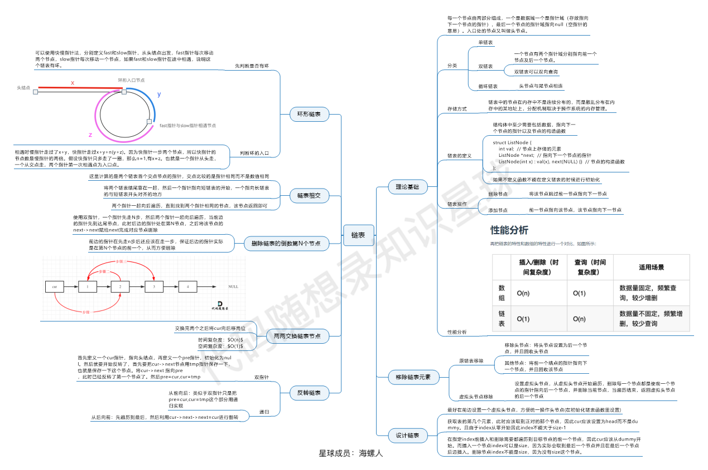

代码随想录算法题：https://github.com/Lwyan127/leetcode-master

# 数组

- **数组**是存放在**连续内存空间**上的**相同类型数据**的集合。
- 数组的元素是**不能删**的，只能**覆盖**。
- C++：注意vector和array的区别，vector的底层实现是array，严格来讲vector是容器，不是数组。
- C++：**二维数组**在地址空间上是**连续**的。

## [704. 二分查找](https://leetcode.cn/problems/binary-search/)

- 时间复杂度：O(log n)
- 空间复杂度：O(1)
- 算好区间，包括是否开闭

```c++
while (left <= right) {
	int middle = left + (right - left) / 2;
	// 防止溢出 等同于(left + right) / 2
    if (nums[middle] > target) {
		right = middle - 1; // target 在左区间，所以[left, middle - 1]
	} else if (nums[middle] < target) {
		left = middle + 1; // target 在右区间，所以[middle + 1, right]
	} else { // nums[middle] == target
		return middle; // 数组中找到目标值，直接返回下标
	}
}
```

## [27. 移除元素](https://leetcode.cn/problems/remove-element/)

### 暴力

- 时间复杂度：O(n^2)
- 空间复杂度：O(1)

### 双指针法

- **双指针法**（快慢指针法）： **通过一个快指针和慢指针在一个for循环下完成两个for循环的工作。**

- 定义快慢指针

  - 快指针：寻找新数组的元素 ，新数组就是不含有目标元素的数组

  - 慢指针：指向更新新数组下标的位置

- 时间复杂度：O(n)
- 空间复杂度：O(1)

```c++
int slowIndex = 0;
for (int fastIndex = 0; fastIndex < nums.size(); fastIndex++) {
    if (val != nums[fastIndex]) {
        nums[slowIndex] = nums[fastIndex];
        slowIndex++;
    }
}
return slowIndex;
```

## [977. 有序数组的平方](https://leetcode.cn/problems/squares-of-a-sorted-array/)

- 双指针分别从左和右向中间逼近，较大数的平方存入ans数组里。

## [209. 长度最小的子数组](https://leetcode.cn/problems/minimum-size-subarray-sum/)

- 窗口包括：

  - 窗口长度：只有在窗口右端点固定，窗口总和大于等于target且窗口长度达到最小时再计算，再与全局最小窗口长度比较得到较小值
  - 窗口左端：在窗口右端点固定时且窗口总和大于等于target时，向右移动，知道窗口长度达到最小且窗口总和大于等于target
  - 窗口右端：在窗口总和小于target时向右移动；在窗口左端移动后达到窗口最小长度后向后移动一位

- ```c++
  int min_len = INT32_MAX;  // 最小长度
  int len = 0;  // 窗口的长度
  int sum = 0;  // 窗口的总和
  int left = 0;
  int right = 0;
  while (right <= nums.size() - 1) {
      sum += nums[right];
      if (sum >= target) {
          while (sum - nums[left] >= target) {
              sum -= nums[left];
              left++;
          }
          len = right - left + 1;
          if (min_len > len) min_len = len;
      }
      right++;
  }
  if (sum < target) return 0;
  return min_len;
  ```


## [59. 螺旋矩阵 II](https://leetcode.cn/problems/spiral-matrix-ii/)

- 对于这种有规律且有各种判定条件的题目来说，一定要找到规律，保证某种规则来完成
- 可以发现这里的边界条件非常多，在一个循环中，如此多的边界条件，如果不按照固定规则来遍历，那非常难写判定条件。
- 这里一圈下来，我们要画每四条边，这四条边怎么画，每画一条边都要坚持一致的左闭右开，或者左开右闭的原则，这样这一圈才能按照统一的规则画下来。
- 

## 总结


# 链表

- 链表是一种通过指针串联在一起的线性结构，每一个节点由两部分组成，一个是数据域一个是指针域（存放指向下一个节点的指针），最后一个节点的指针域指向null（空指针的意思）。
- 数组是在内存中是连续分布的，但是**链表**在内存中可**不是连续分布**的，分配机制取决于操作系统的内存管理。
- 分类
  - 单链表
  - 双链表
  - 循环链表
    - 解决瑟夫环问题

- 链表结构

  ```c++
  // 单链表
  struct ListNode {
      int val;  // 节点上存储的元素
      ListNode *next;  // 指向下一个节点的指针
      ListNode(int x) : val(x), next(NULL) {}  // 节点的构造函数
  };
  ```

  不定义构造函数行也可以，C++默认生成一个构造函数，但是无法赋值

  ```c++
  // 自己定义构造函数
  ListNode* head = new ListNode(5);
  
  // 默认的构造函数，需要自己额外赋值
  ListNode* head = new ListNode();
  head->val = 5;
  ```

- 删除链表节点/添加链表节点

  - 删除：只要将节点的next指针指向后后一节点就可以了。C++里再手动释放需要删除的节点，**释放这块内存**。其他语言例如Java、Python，就有自己的内存回收机制，就不用自己手动释放了。
  - 添加：只要将节点的next指针指向增加的节点，增加的节点的next指针再指向后一节点。
  - 删除第五个节点，需要从头节点查找到第四个节点通过next指针进行删除操作，查找的时间复杂度是O(n)。

- 

## [203. 移除链表元素](https://leetcode.cn/problems/remove-linked-list-elements/)

- 记得使用delete来释放内存块

  ```c++
  ListNode* p = head;
  ListNode* previous = head;
  while (p != NULL) {
      if (p->val == val) {
          if (p == head) {
              ListNode* tmp = p;
              head = head->next;
              p = head;
              delete tmp;
              continue;
          } else {
              ListNode* tmp = p;
              previous->next = p->next;
              p = p->next;
              delete tmp;
          }
      } else {
          previous = p;
          p = p->next;
      }
  }
  return head;
  ```

- 可以使用一个虚拟头节点来判断头节点值是否为val

  ```c++
  ListNode* dummyHead = new ListNode(0); // 设置一个虚拟头结点
  dummyHead->next = head; // 将虚拟头结点指向head，这样方便后面做删除操作
  ListNode* cur = dummyHead;
  while (cur->next != NULL) {
      if(cur->next->val == val) {
          ListNode* tmp = cur->next;
          cur->next = cur->next->next;
          delete tmp;
      } else {
          cur = cur->next;
      }
  }
  head = dummyHead->next;
  delete dummyHead;
  return head;
  ```


## [707. 设计链表](https://leetcode.cn/problems/design-linked-list/)

```c++
class MyLinkedList {
public:
    struct LinkedNode {  // 链表节点结构
        int val;
        LinkedNode* next;
        LinkedNode(int val):val(val), next(nullptr) {}  // 构造函数
    };

    MyLinkedList() {  // 初始化LinkedList对象
        head = new LinkedNode(-1);
        len = 0;
    }
    
    // 获取链表中下标为 index 的节点的值
    int get(int index) {
        if (index > len - 1 || index < 0) {
            return -1;
        }
        LinkedNode* cur = head;
        cur = cur->next;
        while (index--) {
            cur = cur->next;
        }
        return cur->val;
    }
    
    // 将一个值为 val 的节点插入到链表中第一个元素之前。在插入完成后，新节点会成为链表的第一个节点。
    void addAtHead(int val) {
        LinkedNode* newcur = new LinkedNode(val);
        newcur->next = head->next;
        head->next = newcur;
        len++;
        return;
    }
    
    //  将一个值为 val 的节点追加到链表中作为链表的最后一个元素
    void addAtTail(int val) {
        LinkedNode* newcur = new LinkedNode(val);
        LinkedNode* cur = head;
        for (int i = 0; i < len; i++) {
            cur = cur->next;
        }
        cur->next = newcur;
        len++;
        return;
    }
    
    // 将一个值为 val 的节点插入到链表中下标为 index 的节点之前。如果 index 等于链表的长度，那么该节点会被追加到链表的末尾。如果 index 比长度更大，该节点将不会插入到链表中。
    void addAtIndex(int index, int val) {
        if (index > len || index < 0) {
            return;
        } else {
            LinkedNode* newcur = new LinkedNode(val);
            LinkedNode* cur = head;
            while (index--) {
                cur = cur->next;
            }
            newcur->next = cur->next;
            cur->next = newcur;
            len++;
            return;
        }
    }
    
    // 如果下标有效，则删除链表中下标为 index 的节点
    void deleteAtIndex(int index) {
        if (index >= len || index < 0) {
            return;
        } else {
            LinkedNode* cur = head;
            while (index--) {
                cur = cur->next;
            }
            LinkedNode* tmp = cur->next;
            cur->next = cur->next->next;
            delete tmp;
            tmp = nullptr;
            len--;
            return;
        }
    }

private:
    int len;  // 链表长度
    LinkedNode* head;  // 链表虚拟头，即不是第一个节点，其后一个才是
};
```

## [206. 反转链表](https://leetcode.cn/problems/reverse-linked-list/)

- 双指针法

  - 时间复杂度: O(n)
  - 空间复杂度: O(1)

  ```c++
  // 双指针
  class Solution {
  public:
      ListNode* reverseList(ListNode* cur) {
          if (cur == nullptr) return cur;
          ListNode* prev = nullptr;
          ListNode* tmp;
          // cur为第一个节点时，prev为null；cur为最后一个节点后的null时，prev为最后一个节点
          while (cur) {
              tmp = cur->next;
              cur->next = prev;
              prev = cur;
              cur = tmp;
          }
          return prev;
      }
  };
  ```

- 递归

  - 时间复杂度: O(n), 要递归处理链表的每个节点
  - 空间复杂度: O(n), 递归调用了 n 层栈空间

  ```c++
  // 从前往后翻转
  class Solution {
  public:
      ListNode* reverse(ListNode* pre,ListNode* cur){
          if(cur == NULL) return pre;
          ListNode* temp = cur->next;
          cur->next = pre;
          // 可以和双指针法的代码进行对比，如下递归的写法，其实就是做了这两步
          // pre = cur;
          // cur = temp;
          return reverse(cur,temp);
      }
      ListNode* reverseList(ListNode* head) {
          // 和双指针法初始化是一样的逻辑
          // ListNode* cur = head;
          // ListNode* pre = NULL;
          return reverse(NULL, head);
      }
  };
  ```

  ```c++
  // 从后往前翻转
  class Solution {
  public:
      ListNode* reverseList(ListNode* cur) {
          if (cur == nullptr) {
              return cur;
          }
          if (cur->next == nullptr) {
              newhead = cur;
              return cur;
          }
          len++;
          ListNode* newcur = reverseList(cur->next);
          newcur->next = cur;
          len--;
          if (!len) {
              cur->next = nullptr;
              return newhead;
          } else {
              return cur;
          }
      }
  private:
      ListNode* newhead;
      int len = 0;
  };
  
  // 简单点
  class Solution {
  public:
      ListNode* reverseList(ListNode* head) {
          // 边缘条件判断
          if(head == NULL) return NULL;
          if (head->next == NULL) return head;
          
          // 递归调用，翻转第二个节点开始往后的链表
          ListNode *last = reverseList(head->next);
          // 翻转前一节点与后一节点的指向
          head->next->next = head;
          // next 需要指向 NULL，这样到最后的原先的第一个节点也使其 next 指向 NULL 了，而其他的 next 在 return 后会再操作变为原先的前一节点
          head->next = NULL;
          return last;
      }
  }; 
  ```


## [24. 两两交换链表中的节点](https://leetcode.cn/problems/swap-nodes-in-pairs/)

- 普通模拟，记得对两个交换节点的前一节点的next也要修改

- 时间复杂度：O(n)
- 空间复杂度：O(1)

## [19. 删除链表的倒数第 N 个结点](https://leetcode.cn/problems/remove-nth-node-from-end-of-list/)

- 这道题充分体现了虚拟头节点（dummy head）的优点

  - 可能会删除至链表变为空，这时使用虚拟头节点则不用去进行判断是否为空，直接返回虚拟头节点的next（原本的头节点地址，此时为NULL）即可

  - 删除时需要

    ```c++
    slow->next = slow->next->next
    ```

    此时，如果链表为[1]，删除倒数第一个节点，不使用虚拟头节点，则会造成slow的next为NULL，上方语句报错。

```
ListNode* removeNthFromEnd(ListNode* head, int n) {
    ListNode* dummyhead = new ListNode(0, head);
    ListNode* fast = dummyhead;
    ListNode* slow = dummyhead;
    while (n--) {
        fast = fast->next;
    }
    fast = fast->next;  // fast再提前走一步，因为需要让slow指向删除节点的上一个节点
    while (fast != NULL) {
        fast = fast->next;
        slow = slow->next;
    }
    slow->next = slow->next->next;
    return dummyhead->next;
}
```

## [面试题 02.07. 链表相交](https://leetcode.cn/problems/intersection-of-two-linked-lists-lcci/)

- 计算两个链表的长度，再算差值delta，将长的链表往后移动delta次，然后两个链表一起往后走一起比较

```
ListNode *getIntersectionNode(ListNode *headA, ListNode *headB) {
    ListNode *curA = headA;
    ListNode *curB = headB;
    int lenA = 0, lenB = 0;
    while (curA != NULL) {
        curA = curA->next;
        lenA++;
    }
    while (curB != NULL) {
        curB = curB->next;
        lenB++;
    }
    int delta = lenA - lenB;
    if (delta < 0) {
        delta *= -1;
        while (delta--) {
            headB = headB->next;
        }
    } else if (delta > 0) {
        while (delta--) {
            headA = headA->next;
        }
    }
    while (headA != NULL && headB != NULL) {
        if (headA == headB) return headA;
        headA = headA->next;
        headB = headB->next;
    }
    return NULL;
}
```

## [142. 环形链表 II](https://leetcode.cn/problems/linked-list-cycle-ii/)

- 要求O(1)的空间复杂度，因此先用数学方法来计算那这道题

- 使用fast和slow快慢指针

  - fast一次跳两步，slow一次跳一步
  - 如果存在环，则fast与slow一定会相遇（速度差为1，则相遇时间为整数，则一定会相遇）

- 接下来找环的起点

  - 先证明如果fast与slow相遇了，则slow一定没有在环中跑第2圈

    .PNG)

  - 然后计算

    .PNG)

  - 则从fast与slow的相遇点开始跑z+(n-1)圈环，和从链表头开始跑x的距离，同时开始则同时到达环的起点

```c++
if (head == NULL || head->next == NULL) return NULL;
ListNode *fast = head;
ListNode *slow = head;
while (true) {
    if (fast == NULL || fast->next == NULL) {  // fast 是否为空先判断再判断其 next 是否为空
        return NULL;
    }
    fast = fast->next->next;
    slow = slow->next;
    // 这里 fast == slow 不能放在前面，否则需要判断是否两个指针都还没出发、都为 head，但是一旦判断了 head，则会导致 head 就是环的起点的情况陷入死循环
    if (fast == slow) {  
    	break;
    }
}
slow = head;
while (slow != fast) {
    fast = fast->next;
    slow = slow->next;
}
return fast;
```

## 总结

- 记得使用虚拟头节点
- 使用双指针法，这样可以将很多递归变成迭代



# 哈希表

- 哈希表是根据关键码的值而直接进行访问的数据结构。

- 直白来讲，数组就是一张哈希表：哈希表中关键码就是数组的索引下标，然后通过下标直接访问数组中的元素

- **一般哈希表都是用来快速判断一个元素是否出现集合里**
  - 要枚举的话时间复杂度是O(n)，但如果使用哈希表的话， 只需要O(1)就可以做到
  
- **哈希函数**

  - 把元素直接映射为哈希表上的索引
  - 通过hashCode把元素转化为数值，一般hashCode是通过特定编码方式，可以将其他数据格式转化为不同的数值，这样就把元素映射为哈希表上的索引数字了。
    - 例如，把学生名字映射：$hashFunction() = hashCode(name)\mod {tableSize}$
    - tableSize为哈希表的表长，取模保证hashCode的数值在哈希表上
    - 那么，存在可能两个元素映射到同一个索引上

- **哈希碰撞**

  - 两个元素通过hashCode同时映射到了一个相同的索引上

  - 解决方法：

    - **拉链法**：将冲突的元素存在链表上

      

    - **线性探测法**：向下找一个空位放置冲突的元素

      - 因此，tableSize一定要大于dataSize

- 一般选择三种数据结构：数组、set（集合）、map（映射）

  - std::unordered_set底层实现为哈希表，std::set 和std::multiset 的底层实现是红黑树，红黑树是一种平衡二叉搜索树，所以key值是有序的，但key不可以修改，改动key值会导致整棵树的错乱，所以只能删除和增加。

    | 集合               | 底层实现 | 是否有序 | 数值是否可以重复 | 能否更改数值 | 查询效率 | 增删效率 |
    | ------------------ | -------- | -------- | ---------------- | ------------ | -------- | -------- |
    | std::set           | 红黑树   | 升序     | 否               | 否           | O(log n) | O(log n) |
    | std::multiset      | 红黑树   | 升序     | 是               | 否           | O(logn)  | O(logn)  |
    | std::unordered_set | 哈希表   | 无序     | 否               | 否           | O(1)     | O(1)     |

  - std::unordered_map 底层实现为哈希表，std::map 和std::multimap 的底层实现是红黑树。同理，std::map 和std::multimap 的key也是有序的（这个问题也经常作为面试题，考察对语言容器底层的理解）。

    | 映射               | 底层实现 | 是否有序 | 数值是否可以重复 | 能否更改数值 | 查询效率 | 增删效率 |
    | ------------------ | -------- | -------- | ---------------- | ------------ | -------- | -------- |
    | std::map           | 红黑树   | key升序  | key不可重复      | key不可修改  | O(logn)  | O(logn)  |
    | std::multimap      | 红黑树   | key升序  | key可重复        | key不可修改  | O(log n) | O(log n) |
    | std::unordered_map | 哈希表   | key无序  | key不可重复      | key不可修改  | O(1)     | O(1)     |

- 当我们要使用集合来解决哈希问题的时候，优先使用unordered_set，因为它的查询和增删效率是最优的，如果需要集合是有序的，那么就用set，如果要求不仅有序还要有重复数据的话，那么就用multiset。

  那么再来看一下map ，在map 是一个key value 的数据结构，map中，对key是有限制，对value没有限制的，因为key的存储方式使用红黑树实现的。

  虽然std::set、std::multiset 的底层实现是红黑树，不是哈希表，std::set、std::multiset 使用红黑树来索引和存储，不过给我们的使用方式，还是哈希法的使用方式，即key和value。所以使用这些数据结构来解决映射问题的方法，我们依然称之为哈希法。 map也是一样的道理。

## [242. 有效的字母异位词](https://leetcode.cn/problems/valid-anagram/)

- 由于全是小写字母，设置一个长26的数组来记录。遍历第一个字符串，遇到字母，数组[字母位置]+1；遍历第二个字符串，遇到字母，数组[字母位置]-1。如果遍历完，数组全为0，则说明是有效的字母异位词。

```c++
int num[26] = {0};
for (auto ch : s) {
    num[ch - 'a']++;
}
for (auto ch : t) {
    num[ch - 'a']--;
}
for (int i = 0; i < 26; i++) {
    if (num[i]) return false;
}
return true;
```

- 如果输入字符串包含 unicode 字符怎么办？
  - 看到网上的答案，可以对字符串进行排序，然后从头到尾遍历比较，这个时间复杂度高
  - 使用unordered_set来作为哈希表，这样表长没有限制

## [1002. 查找共用字符](https://leetcode.cn/problems/find-common-characters/)

- 对每个字符串进行遍历，将字符出现的个数放入哈希表中；取每个哈希表中的最小值

- 具体实现是先统计第一个字符串，再开始循环统计每个字符串，每次循环时对hash与tmphash比较取最小值更新

- ```c++
  vector<string>& A   
  ```

  A[i] [j] 可以表示第 i - 1 个字符串的第 j - 1 个字符

  A.size() 表示vector中字符串的个数

  A[0].size() 表示第1个字符串的长度

```c++
vector<string> ans;
int hash[26] = {0};
for (auto ch : words[0]) {
    hash[ch - 'a']++;
}
for (int i = 1; i < words.size(); i++) {
    int tmphash[26] = {0};
    for (auto ch : words[i]) {
        tmphash[ch - 'a']++;
    }
    for (int j = 0; j < 26; j++) {
        hash[j] = min(tmphash[j], hash[j]);
    }
}
int num = 0;
while (num < 26) {
    while (hash[num] > 0) {
        string s = string(1, 'a' + num);
        ans.push_back(s);
        hash[num]--;
    }
    num++;
}
return ans;
```

## [349. 两个数组的交集](https://leetcode.cn/problems/intersection-of-two-arrays/)

- **无序**和**不可重复**决定了这道题使用unordered_set
- 先对nums1去重放入set1。再与nums2比较：如果nums2中的num在set1中出现过，则放入set2，set2作为答案的集合。最后放入vector中输出。

```c++
vector<int> intersection(vector<int>& nums1, vector<int>& nums2) {
    unordered_set<int> set1, set2;
    vector<int> ans;
    for (int num : nums1) {
        if (!set1.count(num)) {
            set1.insert(num);
        }
    }
    for (int num : nums2) {
        if (set1.count(num)) {
            set2.insert(num);
        }
    }
    for (int num : set2) {
        ans.push_back(num);
    }
    return ans;
}

// 标答
vector<int> intersection(vector<int>& nums1, vector<int>& nums2) {
    unordered_set<int> result_set;  // 存放结果，之所以用set是为了给结果集去重
    unordered_set<int> nums_set(nums1.begin(), nums1.end());  // 直接用迭代器生成set可以直接去重
    for (int num : nums2) {
        // 发现nums2的元素 在nums_set里又出现过
        if (nums_set.find(num) != nums_set.end()) {
            result_set.insert(num);
        }
    }
    return vector<int>(result_set.begin(), result_set.end());  // 也可以直接用迭代器生成vector
}
```

## [202. 快乐数](https://leetcode.cn/problems/happy-number/)

- 范围：$1<=n<=2 ^ {31} - 1$，即2147483647，也就是说sum最大为：$9*9 ^2 + 1$，则sum为有限的数，那么如果无限循环的话一定是重复出现了sum。
- 因此使用unordered_set来记录已经出现过的sum

```c++
class Solution {
public:
    bool isHappy(int n) {
        unordered_set<int> set;
        set.insert(n);
        while (n != 1) {
            int sum = 0;
            while (n) {  // 计算sum
                sum += (n % 10) * (n % 10);
                n /= 10;
            }
            if (set.count(sum)) {  // 判断有无重复
                return 0;
            } else {
                set.insert(sum);  // 没有重复则放入set
            }
            n = sum;  // 更新n
        }
        return 1;
    }
};
```

## [1. 两数之和](https://leetcode.cn/problems/two-sum/)

- 本题需要一个集合来存放我们遍历过的元素，然后在遍历数组的时候去询问这个集合，某元素是否遍历过，也就是是否出现在这个集合。因此想到使用**哈希表**。
- 这里需要存储数组下标和数据，并且一一对应，则想到使用**map**。
- 由于不需要key有序的要求，因此使用**unordered_map**。
- **注意：**
  - map<key, value>
  - map.find()查询时都是查询key的位置，因此key放数据，value放数组下标

```c++
class Solution {
public:
    vector<int> twoSum(vector<int>& nums, int target) {
        // vector<int> ans;
        unordered_map<int, int> map;
        unordered_map<int, int>::iterator it;
        for (int i = 0; i < nums.size(); i++) {
            it = map.find(target - nums[i]);
            // auto it = map.find(target - nums[i]);  // 可以自动给it赋类型
            if (it == map.end()) {
                map[nums[i]] = i;
                // map.insert(pair<int, int>(nums[i], i));  // 也可以
            } else {
                // ans.push_back(i);
                // ans.push_back(it->second);
                // break;
                return {iter->second, i};  // 相当于返回ans
            }
        }
        // return ans;
        return {};  // 这样相当于返回一个空vector
    }
};
```

## [454. 四数相加 II](https://leetcode.cn/problems/4sum-ii/)

- 暴力的话要：O(n^4)
- 这里要先计算前两个数组的元素和，放到哈希表里；然后计算后两个，在哈希表找加起来能等于0的数。
- 时间复杂度：O(n^2)
- 空间复杂度：O(n^2)，最坏情况下A和B的值各不相同，相加产生的数字个数为 n^2

```c++
class Solution {
public:
    int fourSumCount(vector<int>& nums1, vector<int>& nums2, vector<int>& nums3, vector<int>& nums4) {
        int ans = 0;
        unordered_map<int, int> map;
        for (int i = 0; i < nums1.size(); i++) {
            for (int j = 0; j < nums2.size(); j++) {
                if (!map.count(nums1[i] + nums2[j])) {
                    map.insert(pair<int, int>(nums1[i] + nums2[j], 1));
                } else {
                    map[nums1[i] + nums2[j]]++;
                }
            }
        }
        for (int i = 0; i < nums3.size(); i++) {
            for (int j = 0; j < nums4.size(); j++) {
                if (map.count(- nums3[i] - nums4[j])) {
                    ans += map[- nums3[i] - nums4[j]];
                }
            }
        }
        return ans;
    }
};
```

## [383. 赎金信](https://leetcode.cn/problems/ransom-note/)

- 使用unordered_map统计后一个字符串中的字符即可

```c++
class Solution {
public:
    bool canConstruct(string ransomNote, string magazine) {
        unordered_map<string, int> map;
        for (auto i : magazine) {
            string s = string(1, i);
            if (!map.count(s)) {
                map.insert(pair<string, int>(s, 1));
            } else {
                map[s]++;
            }
        }
        for (auto i : ransomNote) {
            string s = string(1, i);
            if (!map.count(s) || map[s] <= 0) {
                return false;
            }
            if (map[s] > 0) {
                map[s]--;
            }
        }
        return true;
    }
};
```

## [15. 三数之和](https://leetcode.cn/problems/3sum/)

- 这道题最麻烦的点是需要去重相同的三元组
- 如果直接使用哈希表，需要判断很多条件，在考试时很难完全正确
- 这里也不能使用find来找三元组是否在ans中，find不支持查找vector<int>这样的元素
- 时间复杂度: O(n^2)
- 空间复杂度: O(n)，额外的 set 开销

```c++
class Solution {
public:
    vector<vector<int>> threeSum(vector<int>& nums) {
        vector<vector<int>> ans;
        sort(nums.begin(), nums.end());
        // 找出 a + b + c = 0
        // a = nums[i], b = nums[j], c = -(a + b)
        if (nums[0] > 0) return ans;  // 排序后第1个元素大于0，则和不可没能为0
        for (int i = 0; i < nums.size() - 1; i++) {
            if (i > 0 && nums[i] == nums[i - 1]) {  // 第1个元素a去重
                // 遇到第1个a继续操作，后面相同的a则不操作
                // 可能有疑问如果答案中有两个相同的a怎么办呢
                // 实际上第1个a的后续操作会考虑这个答案，即b为第2个a时的操作
                continue;
            }
            unordered_set<int> set;  // 这里用来记录的unordered_set在每个不同的a下循环中是不同的
            for (int j = i + 1; j < nums.size(); j++) {
                if (j > i + 2 && nums[j] == nums[j - 1] && nums[j - 1]== nums[j - 2]) {  // 第2个元素b去重
                    // 举例：-1 -1 -1 -1
                    // 当i指向第1个-1，j指向第3个-1时，set为{-1}，这时需要判断三个数的和
                    // 而当j指向第4个-1时，这时-1 + -1 + -1已经判断过了则跳过
                    // 举例：-2 -1 -1 -1
                    // 当i指向-2，j指向第2个-1时，set为{-1}，这时需要判断三个数的和
                    // 而当j指向第3个-1时，这时候-2 + -1 + -1已经判断过了则跳过
                    // 因此总结来说就是三个数相同时，j指向了第三个数，若i指向第1个数，set中为第2个数则判断三数之和；若i还没指到第1个数，则跳过，等到后来i指到第1个数时再来判断三个相同的数的和
                    continue;
                }
                int c = 0 - nums[i] - nums[j];
                if (set.count(c)) {  // 在set中找到了第3个元素c，但实际上这个c是之前已经经过的b
                    ans.push_back({nums[i], nums[j], c});
                    set.erase(c);  // 第3个元素c去重
                } else {
                    set.insert(nums[j]);    // 第2个元素b放入set中，因此这个查找是通过找b来查值的
                }
            }
        }
        return ans;
    }
};
```

- 然而，这道题需要**求和**，找到三个值但是**不用给出下标（则可以直接排序）**。
- 因此，先排序，然后在第1个数的循环下，使用**双指针法**：两个指针从左从右分别逼近，求的和如果大于0，则右指针左移，反之，左指针右移。
- 时间复杂度: O(n^2)
- 空间复杂度: O(1)，过一遍就行，不用额外的哈希表来存储
- 其中，第1个数的去重：

```c++
if (i > 0 && nums[i] == nums[i - 1]) continue;
```

​		后面两个数（即指针指的数）的去重

```c++
while (left < right && nums[left] == nums[left + 1]) left++;
while (left < right && nums[right] == nums[right - 1]) right--;
```

```c++
// 最优解
class Solution {
public:
    vector<vector<int>> threeSum(vector<int>& nums) {
        vector<vector<int>> ans;
        sort(nums.begin(), nums.end());
        for (int i = 0; i < nums.size() - 2; i++) {
            if (nums[i] > 0) continue;  // 第1个元素如果大于0，则指针制的数一定大于0，则和不为0
            if (i > 0 && nums[i] == nums[i - 1]) {  // 第1个元素a去重
                continue;
            }
            int left = i + 1;
            int right = nums.size() - 1;
            while (left < right) {
                /* 两个指针去重如果放在这里，可能会导致right直接小于left了，比如[0, 0, 0]
                while (left < right && nums[left] == nums[left + 1]) left++;
                while (left < right && nums[right] == nums[right - 1]) right--;
                */
                // 根据和的大小移动指针
                if (nums[i] + nums[left] + nums[right] < 0) left++;
                else if (nums[i] + nums[left] + nums[right] > 0) right--;
                else {
                    ans.push_back({nums[i], nums[left], nums[right]});
                    // 当找到和为0的值时，两个指针都移动
                    while (left < right && nums[left] == nums[left + 1]) left++;
                	while (left < right && nums[right] == nums[right - 1]) right--;
                    right--;
                    left++;
                }

            }
        }
        return ans;
    }
};
```

## [18. 四数之和](https://leetcode.cn/problems/4sum/)

- 与上面的三数之和一模一样，除了多套了一层循环
- 剪枝改变了：
  - 不要判断`nums[k] > target` 就返回了，三数之和 可以通过 `nums[i] > 0` 就返回了，因为 0 已经是确定的数了，四数之和这道题目 target是任意值。比如：数组是`[-4, -3, -2, -1]`，`target`是`-10`，不能因为`-4 > -10`而跳过。但是我们依旧可以去做剪枝，逻辑变成`nums[i] > target && (nums[i] >=0 || target >= 0)`就可以了。
- 这里有一个整型提升的细节，可以看c的笔记

```c++
class Solution {
public:
    vector<vector<int>> fourSum(vector<int>& nums, int target) {
        vector<vector<int>> ans;
        sort(nums.begin(), nums.end());
        for (int i = 0; i < nums.size(); i++) {
            if (nums[i] > target && nums[i] >= 0) return ans;
            if (i > 0 && nums[i] == nums[i - 1]) continue;
            for (int j = i + 1; j < nums.size(); j++) {
                if (nums[i] + nums[j] > target && nums[i] + nums[j] >= 0) {
                    return ans;
                }
                if (j > i + 1 && nums[j] == nums[j - 1]) continue;
                int left = j + 1;
                int right = nums.size() - 1;
                while (left < right) {
                    long long sum = (long long)nums[i] + nums[j] + nums[left] + nums[right];
                    if (sum > target) right--;
                    else if (sum < target) left++;
                    else {
                        ans.push_back(vector<int>{nums[i], nums[j], nums[left], nums[right]});
                        while (left < right && nums[left] == nums[left + 1]) left++;
                	    while (left < right && nums[right] == nums[right - 1]) right--;
                        left++;
                        right--;
                    }
                }
            }
        }
        return ans;
    }
};
```

# 栈与队列

- 那么来介绍一下，三个最为普遍的STL版本：

  1. HP STL 其他版本的C++ STL，一般是以HP STL为蓝本实现出来的，HP STL是C++ STL的第一个实现版本，而且开放源代码。
  2. P.J.Plauger STL 由P.J.Plauger参照HP STL实现出来的，被Visual C++编译器所采用，不是开源的。
  3. SGI STL 由Silicon Graphics Computer Systems公司参照HP STL实现，被Linux的C++编译器GCC所采用，SGI STL是开源软件，源码可读性甚高。

- 我们一般使用的是SGI STL，被GCC(Linux)采用，阅读性非常高。

- SGI STL的栈提供push 和 pop 等等接口，所有元素**必须符合先进后出规则**，所以栈不提供走访功能，也**不提供迭代器(iterator)**。 不像是set 或者map 提供迭代器iterator来遍历所有元素。

  **栈是以底层容器完成其所有的工作，对外提供统一的接口，底层容器是可插拔的（也就是说我们可以控制使用哪种容器来实现栈的功能）。**所以STL中栈往往不被归类为容器，而被归类为container adapter（容器适配器）。

  栈的底层实现可以是vector，deque，list 都是可以的， 主要就是数组和链表的底层实现。

  **Q：栈里面的元素在内存中是连续分布的么？**

  **A：不是，栈的底层实现可以是vector，deque，list 都是可以的，因此不一定是连续分布的。而C++中使用dequeue作为栈和队列的底层结构，其不是连续的。**

- **我们常用的SGI STL，如果没有指定底层实现的话，默认是以deque为缺省情况下栈的底层结构。**

  - deque是一个双向队列，只要封住一段，只开通另一端就可以实现栈的逻辑了。

  - **SGI STL中 队列底层实现缺省情况下一样使用deque实现的。**

  - 我们也可以指定vector为栈的底层实现，初始化语句如下：

    ```c++
    std::stack<int, std::vector<int> > third;  // 使用vector为底层容器的栈
    ```

- 刚刚讲过栈的特性，对应的队列的情况是一样的。

  队列中先进先出的数据结构，同样不允许有遍历行为，**不提供迭代器, SGI STL中队列一样是以deque为缺省情况下的底部结构。**

  也可以指定list 为起底层实现，初始化queue的语句如下：

  ```c++
  std::queue<int, std::list<int>> third; // 定义以list为底层容器的队列
  ```

  所以STL 队列也不被归类为容器，而被归类为container adapter（容器适配器）。

## [232. 用栈实现队列](https://leetcode.cn/problems/implement-queue-using-stacks/)

- 使用输入栈和输出栈：push直接进压输入栈；pop将输入栈全部弹出压入输出栈，然后再弹出；peek类似；判断空看两个栈是否都为空即可

```c++
class MyQueue {
public:
    stack<int> stkin;
    stack<int> stkout;
    MyQueue() {
        
    }

    void push(int x) {
        stkin.push(x);
    }
    
    int pop() {
        if (stkout.empty()) {
            while (!stkin.empty()) {
                int x = stkin.top();
                stkin.pop();
                stkout.push(x);
            }
        }
        int x = stkout.top();
        stkout.pop();
        return x;
    }
    
    int peek() {
        if (stkout.empty()) {
            while (!stkin.empty()) {
                int x = stkin.top();
                stkin.pop();
                stkout.push(x);
            }
        }
        return stkout.top();
    }
    
    bool empty() {
        if (stkout.empty() && stkin.empty()) {
            return true;
        } else return false;
    }
};

```

## [225. 用队列实现栈](https://leetcode.cn/problems/implement-stack-using-queues/)

- 实际使用一个队列即可，弹出栈顶元素相当于队列的元素全部出来一遍然后得到最后一个就是栈顶元素，再把这些元素放回队列里。

```c++
class MyStack {
public:
    queue<int> q;
    MyStack() {

    }
    
    void push(int x) {
        q.push(x);
    }
    
    int pop() {
        int sz = q.size() - 1;
        while(sz--) {
            q.push(q.front());
            q.pop();
        }
        int x = q.front();
        q.pop();
        return x;
    }
    
    int top() {
        return q.back();
    }
    
    bool empty() {
        if (q.empty()) return true;
        return false;
    }
};
```

## [20. 有效的括号](https://leetcode.cn/problems/valid-parentheses/)

- 没啥好说的，注意小心在空栈的情况下访问top元素会报错，增加判断栈是否为空即可

```c++
class Solution {
public:
    bool isValid(string s) {
        stack<char> stk;
        for (auto c : s) {
            if (c == '(' || c == '{' || c == '[') {
                stk.push(c);
            }
            if (c == ')') {
                if (!stk.empty() && stk.top() == '(') {
                    stk.pop();
                } else return false;
            }
            if (c == '}') {
                if (!stk.empty() && stk.top() == '{') {
                    stk.pop();
                } else return false;
            }
            if (c == ']') {
                if (!stk.empty() && stk.top() == '[') {
                    stk.pop();
                } else return false;
            }
        }
        if (!stk.empty()) return false;
        return true;
    }
};
```

## [1047. 删除字符串中的所有相邻重复项](https://leetcode.cn/problems/remove-all-adjacent-duplicates-in-string/)

- 没啥难的，注意栈中是反过来的字符串，最后反转即可

```
class Solution {
public:
    string removeDuplicates(string s) {
        stack<char> st;
        st.push(s[0]);
        for (int i = 1; i < s.size(); i++) {
            if (!st.empty() && s[i] == st.top()) {
                st.pop();
                continue;
            } else {
                st.push(s[i]);
            }
        }
        string ans;
        while (!st.empty()) {
            ans += st.top();
            st.pop();
        }
        reverse(ans.begin(), ans.end());
        return ans;
    }
};
```

## [150. 逆波兰表达式求值](https://leetcode.cn/problems/evaluate-reverse-polish-notation/)

- 注意遇到符号时出栈的两个数字间做运算的顺序
- 使用stoll函数来快速将string转化为longlong

```
class Solution {
public:
    int evalRPN(vector<string>& tokens) {
        stack<long long> st;
        for (int i = 0; i < tokens.size(); i++) {
            if (tokens[i] == "+" || tokens[i] == "-" || tokens[i] == "*" || tokens[i] == "/") {
                long long num1 = st.top();
                st.pop();
                long long num2 = st.top();
                st.pop();
                if (tokens[i] == "+") st.push(num1 + num2);
                if (tokens[i] == "-") st.push(num2 - num1);
                if (tokens[i] == "*") st.push(num1 * num2);
                if (tokens[i] == "/") st.push(num2 / num1);
            } else {
                st.push(stoll(tokens[i]));
            }
        }
        return st.top();
    }
};
```

## [239. 滑动窗口最大值](https://leetcode.cn/problems/sliding-window-maximum/)

- 这里的问题就是在一个滑动的窗口中找到最大值，如果直接暴力，那么就是O(n * k)，超时
- 有三种方法：**优先队列**（这里没写），**单调队列**以及**multiset**（仅限c++）

### 单调队列

- 思考一下，很明显，我们需要维护一个数据结构，而这个数据结构能

  - 给出当前窗口中的最大值
  - 在滑动一个后能不遍历一遍窗口而找到新窗口的最大值（因此需要从大到小的排序）

- 这里有这样的一个思路来帮助我们制造这个数据结构

  - 在一个窗口里，当 i < j 时，如果 nums[i] < nums[j]，那么只要两个数都在窗口中，nums[i] 就不为最大值，直到窗口滑动过 i 。

  - 因此，只要两个数在窗口内，右边的数比左边的大，就不用管左边的数了。我们就不需要将窗口内的所有数据都排序了。这个数据结构是这样的：和窗口的顺序一致，从左边到右边是非递增的，且最左为当前窗口最大值

    例如：3，4，5，2，3， 6，7，8，当 k = 5 时，这个数据结构初始为[5, 3]

  - 在滑动一个时：

    - 看离开窗口的num是否为最大值，如果是，则将数据结构中的最左边的值弹出，这样剩下的值就是除了这个num的最大值（新数还没进入窗口）
    - 看进入窗口的num是否比最右边的值大，如果大就弹出右边的值，直到让num加入这个数据结构

  - 这里可能会有这样的疑问，例如：3，4，5，2，3， 6，7，8，当 k = 5 时，这个数据结构初始为[5, 3]，但是 4 才是比 5 小的第一个数啊，这样会不会答案里有 4，实际上，只有过了 4 才会把 5 从数据结构中弹出，因此不必担心

  - 另外，因为可能有相同的值，所以是非递增的而不是递减的

```c++
class Solution {
private:
    class MyQueue { //单调队列（从大到小）
    public:
        deque<int> que; // 使用deque来实现单调队列
        // 每次弹出的时候，比较当前要弹出的数值是否等于队列出口元素的数值，如果相等则弹出。
        // 同时pop之前判断队列当前是否为空。
        void pop(int value) {
            if (!que.empty() && value == que.front()) {
                que.pop_front();
            }
        }
        // 如果push的数值大于入口元素的数值，那么就将队列后端的数值弹出，直到push的数值小于等于队列入口元素的数值为止。
        // 这样就保持了队列里的数值是单调从大到小的了。
        void push(int value) {
            while (!que.empty() && value > que.back()) {
                que.pop_back();
            }
            que.push_back(value);

        }
        // 查询当前队列里的最大值 直接返回队列前端也就是front就可以了。
        int front() {
            return que.front();
        }
    };
public:
    vector<int> maxSlidingWindow(vector<int>& nums, int k) {
        MyQueue que;
        vector<int> result;
        for (int i = 0; i < k; i++) { // 先将前k的元素放进队列
            que.push(nums[i]);
        }
        result.push_back(que.front()); // result 记录前k的元素的最大值
        for (int i = k; i < nums.size(); i++) {
            que.pop(nums[i - k]); // 滑动窗口移除最前面元素
            que.push(nums[i]); // 滑动窗口前加入最后面的元素
            result.push_back(que.front()); // 记录对应的最大值
        }
        return result;
    }
};
```

### multiset

- 使用multiset作为单调队列

- 多重集合(`multiset`) 用以有序地存储元素的容器。允许存在相等的元素。

- 在遍历原数组的时候，只需要把窗口的头元素加入到multiset中，然后把窗口的尾元素删除即可。因为multiset是有序的，并且提供了*rbegin()（反向迭代器），可以直接获取窗口最大值。

- | 集合          | 底层实现 | 是否有序 | 数值是否可以重复 | 能否更改数值 | 查询效率 | 增删效率 |
  | ------------- | -------- | -------- | ---------------- | ------------ | -------- | -------- |
  | std::multiset | 红黑树   | 有序升序 | 是               | 否           | O(log n) | O(log n) |

```c++
class Solution {
public:
    vector<int> maxSlidingWindow(vector<int>& nums, int k) {
        multiset<int> st;
        vector<int> ans;
        for (int i = 0; i < nums.size(); i++) {
            if (i >= k) st.erase(st.find(nums[i - k]));
            st.insert(nums[i]);
            if (i >= k - 1) ans.push_back(*st.rbegin());
        }
        return ans;
    }
};
```

## [347. 前 K 个高频元素](https://leetcode.cn/problems/top-k-frequent-elements/)

- 我自己的方法：由题意，需要记录元素的个数，还需要对元素的个数排序。因此，记录个数使用哈希表unordered_map，对元素个数排序使用multimap。
- 先过一遍数组，用unordered_map记录元素个数。然后再将unordered_map中的每一对键和值都放入multimap来排序，最后输出即可。之所以需要unordered_map来记录元素个数是因为multimap的排序是对key排序，而key不能改变，因此要先记录元素和元素个数，而unordered_map是查询和增删都是O(1)，是最快的选择。
- 时间复杂度
  - unorder_map：增删和查询都为O(1)；multimap：增删和查询使用红黑树，都为O(logn)
  - 因此时间复杂度为O(nlogn)（n为将数组过一遍后，得到频率数据，将其过一遍来插入multimap则是O(n)）
- 空间复杂度为O(n)

```c++
class Solution {
public:
    vector<int> topKFrequent(vector<int>& nums, int k) {
        vector<int> ans;
        multimap<int, int> sort_m;
        unordered_map<int, int> m;
        for (int i = 0; i < nums.size(); i++) {
            unordered_map<int, int>::iterator it = m.find(nums[i]);
            if (it == m.end()) {
                m.insert(pair<int, int>(nums[i], 1));
            } else {
                it->second++;
            }
        }
        for (auto it = m.begin(); it != m.end(); it++) {
            sort_m.insert(pair<int, int>(it->second, it->first));
        }
        auto sort_it = sort_m.rbegin();
        while (k--) {
            ans.push_back(sort_it->second);
            sort_it++;
        }
        return ans;
    }
};
```

### 优先队列

- 使用优先队列（priority_queue）
  - 其本质为一个堆（大顶堆或小顶堆）
  - 若是大顶堆，pop出来堆中最大的元素（堆顶元素），小顶堆相反
  - 关于堆：https://www.bilibili.com/video/BV1AF411G7cA

- 之所以使用优先队列是因为使用堆可以维护k个最大频率的数，而不用将n个频率都放进去比较。优先队列（堆）的插入删除都是O(logn)，在这里就是O(logk)，因此时间复杂度提升至O(nlogk)（n为将数组过一遍后，得到频率数据，将其过一遍来插入优先队列则是O(n)）。
- 由于我们最后要留下k个最大的频率，因此每次要pop出堆中最小元素，所以使用小顶堆

```c++
class Solution {
public:
    // 小顶堆
    class mycomparison {
    public:
        bool operator()(const pair<int, int>& lhs, const pair<int, int>& rhs) {
            return lhs.second > rhs.second;  // 从堆底到堆顶 降序排序 即小顶堆 
        }
    };
    vector<int> topKFrequent(vector<int>& nums, int k) {
        // 要统计元素出现频率
        unordered_map<int, int> map; // map<nums[i],对应出现的次数>
        for (int i = 0; i < nums.size(); i++) {
            map[nums[i]]++;  // map中value整数默认为0
        }

        // 对频率排序
        // 定义一个小顶堆，大小为k，三个参数是<数据类型，装有数据类型的容器，自定义比较>
        priority_queue<pair<int, int>, vector<pair<int, int>>, mycomparison> pri_que;

        // 用固定大小为k的小顶堆，扫面所有频率的数值
        for (unordered_map<int, int>::iterator it = map.begin(); it != map.end(); it++) {
            pri_que.push(*it);
            if (pri_que.size() > k) { // 如果堆的大小大于了K，则队列弹出，保证堆的大小一直为k
                pri_que.pop();
            }
        }

        // 找出前K个高频元素，因为小顶堆先弹出的是最小的，所以倒序来输出到数组
        vector<int> result(k);
        for (int i = k - 1; i >= 0; i--) {
            result[i] = pri_que.top().first;
            pri_que.pop();
        }
        return result;

    }
};
```

- **PS：例如我们在写快排的cmp函数的时候，`return left > right` 就是从大到小，`return left < right` 就是从小到大。优先级队列的定义正好反过来了，可能和优先级队列的源码实现有关，估计是底层实现上优先队列队首指向后面，队尾指向最前面的缘故！**

# 字符串

## [344. 反转字符串](https://leetcode.cn/problems/reverse-string/)

- 直接反转就行了
- 还可以用algorithm库里的reverse函数，对容器中的元素进行反转

## [541. 反转字符串 II](https://leetcode.cn/problems/reverse-string-ii/)

- 按照题意reverse即可

## [54. 替换数字](https://kamacoder.com/problempage.php?pid=1064)

- 创建一个新串是ok的
- 如果不使用额外空间：
  - 先过一遍找到有多少数字
  - 扩容 s.resize()
  - 从后向前填充，不能从前向后，从前向后填充就是O(n^2)的算法了，因为每次添加元素都要将添加元素之后的所有元素整体向后移动

## [151. 反转字符串中的单词](https://leetcode.cn/problems/reverse-words-in-a-string/)

- 如果使用额外空间的话没什么难的
- 如果不使用额外空间即空间复杂度O(1)，则需要使用类似于数组27移除元素的双指针法，一次去掉多余的空格，一次将每一个单词反转，最后反转全部即可。
- 记得string的erase函数的时间复杂度为O(n)

## [55.右旋字符串](https://kamacoder.com/problempage.php?pid=1065)

- 类似于上一题，将前半段和后半段都反转，最后整体反转
- algorithm中的reverse函数的时间复杂度是O(n)，因此时间复杂度就是O(n)

## [28. 找出字符串中第一个匹配项的下标](https://leetcode.cn/problems/find-the-index-of-the-first-occurrence-in-a-string/)

### kmp

- kmp，next数组为最长共同前后缀，下面为代码实现图解


- 时间复杂度: O(n + m)
- 空间复杂度: O(m), 只需要保存字符串needle的前缀表
- 我写的代码：

```c++
class Solution {
public:
    void GetNext(int* next, string s) {
        // 初始化
        next[0] = 0;
        int j = 0;
        int i = 1;
        // 开始循环
        while (true) {
            if (i >= s.size()) break;  // next数组完成
            if (s[i] == s[j]) {  // 当两个字符相同，例如ababc中的j = 1, i = 3时这时next[3] = 2
                next[i] = j + 1;
                i++;
                j++;
            } else if (s[i] != s[j]) {
                if (j == 0) {  // 为了j - 1不到-1
                    next[i] = 0;
                    i++;
                } else if (j != 0) {
                    // 最重要的一步，这里j不会跳回开头，而是利用next数组跳到合理的位置
                    // 例如aabaaac
                    // j = 2, i = 5时两个字符不同，则j跳到第2个a，这样下一次比较时next[5] = 2才是正确的
                    j = next[j - 1];
                }
            }
        }
        return;
    }

    int strStr(string haystack, string needle) {
        int ans = -1;  // 第一个匹配项的下标
        vector<int> next(needle.size());
        GetNext(&next[0], needle);
        
        int i = 0;
        int j = 0;
        while (true) {
            if (j == needle.size()) {
                ans = i - needle.size();
                break;
            }
            if (i == haystack.size()) break;
            if (haystack[i] == needle[j]) {
                i++;
                j++;
            } else if (haystack[i] != needle[j]) {
                if (j == 0) {
                    i++;
                } else if (j != 0) {
                    if (next[j - 1] == 0) {
                        j = 0;
                    } else if (next[j - 1] != 0) {
                        j = next[j - 1];
                    }
                }
            }
        }
        return ans;
    }
};
```

- 简化代码为

```c++
class Solution {ababc
public:
	void GetNext(int* next, const string& s) {
        int j = 0;
        next[0] = 0;
        for(int i = 1; i < s.size(); i++) {
            while (j > 0 && s[i] != s[j]) { // j要保证大于0，因为下面有取j-1作为数组下标的操作
                j = next[j - 1]; // 注意这里，是要找前一位的对应的回退位置了
            }
            if (s[i] == s[j]) {
                j++;
            }
            next[i] = j;
        }
        return;
    }

    int strStr(string haystack, string needle) {
        if (needle.size() == 0) {
            return 0;
        }
        vector<int> next(needle.size());
        getNext(&next[0], needle);
        int j = 0;
        for (int i = 0; i < haystack.size(); i++) {
            while(j > 0 && haystack[i] != needle[j]) {
                j = next[j - 1];
            }
            if (haystack[i] == needle[j]) {
                j++;
            }
            if (j == needle.size() ) {
                return (i - needle.size() + 1);
            }
        }
        return -1;
    }
};
```

### 移动匹配

- 如果一个字符串s有重复子串，则其为

  

  则将2个s连接，中间还会出现一个s：

  

  这样就可以判断

- 在搜索中间这个s时，将这个连接的串的首字符和尾字符挖掉，这样可以防止找到原本的两个s

- 这里find函数时间复杂度为O(m+n)，因此可以

```c++
class Solution {
public:
    bool repeatedSubstringPattern(string s) {
        string t = s + s;
        t.erase(t.begin());
        t.erase(t.end() - 1); // 掐头去尾
        if (t.find(s) != std::string::npos) return true; // std::string::npos用于表示一个无效或未找到的位置
        return false;
    }
};
```

# 二叉树

## 种类

**满二叉树**

- 深度为k，则有2^k-1个节点

**完全二叉树**

- 除了最后一层都全满，最后一层节点从左到右集中
- **堆**就是一个完全二叉树
- 

**二叉搜索树**

- 若它的左子树不空，则左子树上所有结点的值均小于它的根结点的值；
- 若它的右子树不空，则右子树上所有结点的值均大于它的根结点的值；
- 它的左、右子树也分别为二叉排序树
- 

**平衡二叉搜索树**

- AVL（Adelson-Velsky and Landis）树
- 它是一棵空树或它的左右两个子树的高度差的绝对值不超过1，并且左右两个子树都是一棵平衡二叉树。

- **C++中map、set、multimap，multiset的底层实现都是平衡二叉搜索树**，所以map、set的增删操作时间时间复杂度是logn，注意这里没有unordered_map、unordered_set，他们底层实现是哈希表。
- 

## 存储方式

**顺序存储：数组**

- 如果父节点的数组下标是 i，那么它的左孩子就是 i \* 2 + 1，右孩子就是 i \* 2 + 2。
- 

**链式存储：链表**

- 

**将树从数组转换为链表：**

```c++
class Tree{
public:
    TreeNode* CreateTree(vector<int> tree_array, TreeNode* node, int idx) {
        // tree_array为树的数组形式，node为当前节点，idx为当前节点在数组中的位置
        if (2 * idx + 1 < tree_array.size()) {
            if (tree_array[2 * idx + 1] == NULL) {  // 特殊处理NULL，因为数组中的NULL为0为值
                node->left = NULL;
            } else {
                TreeNode* left_child = new TreeNode(tree_array[2 * idx + 1]);
                node->left = left_child;
                CreateTree(tree_array, left_child, 2 * idx + 1);
            }
        }
        if (2 * idx + 2 < tree_array.size()) {
            if (tree_array[2 * idx + 2] == NULL) {
                node->right = NULL;
            } else {
                TreeNode* right_child = new TreeNode(tree_array[2 * idx + 2]);
                node->right = right_child;
                CreateTree(tree_array, right_child, 2 * idx + 2);
            }
        }
        return node;
    }
};

int main() {
    vector<int> tree_array{1, 2, 2, 3, 4, 4, 3};
    // vector<int> tree_array{1, 2, 2, NULL, 3, NULL, 3};

    TreeNode* root = new TreeNode(tree_array[0]);  // 创建根节点
    Tree tree;
    root = tree.CreateTree(tree_array, root, 0);
    
    system("pause");
    return 0;
}
```


## 遍历方式

- 深度优先搜索
  - 前序遍历：中左右
  - 中序遍历：左中右
  - 后序遍历：左右中
  - 前中后序遍历的逻辑其实都是可以借助栈使用递归的方式来实现
  - 
- 广度优先搜索：层次遍历

## 定义

```c++
struct TreeNode {
    int val;
    TreeNode *left;
    TreeNode *right;
    TreeNode(int x) : val(x), left(NULL), right(NULL) {}
};
```

## 二叉树递归遍历

[144.二叉树的前序遍历](https://leetcode.cn/problems/binary-tree-preorder-traversal/)

[94.二叉树的中序遍历](https://leetcode.cn/problems/binary-tree-inorder-traversal/)

[145.二叉树的后序遍历](https://leetcode.cn/problems/binary-tree-postorder-traversal/)

```c++
// Definition for a binary tree node.
struct TreeNode {
	int val;
	TreeNode *left;
	TreeNode *right;
	TreeNode() : val(0), left(nullptr), right(nullptr) {}
	TreeNode(int x) : val(x), left(nullptr), right(nullptr) {}
	TreeNode(int x, TreeNode *left, TreeNode *right) : val(x), left(left), right(right) {}
};

// 前序遍历
class Solution {
public:
    vector<int> preorderTraversal(TreeNode* root) {
        if (root == NULL) return ans;
        ans.push_back(root->val);
        preorderTraversal(root->left);
        preorderTraversal(root->right);
        return ans;
    }
private:
    vector<int>ans;
};

// 中序遍历
class Solution {
public:
    vector<int> inorderTraversal(TreeNode* root) {
        if (root == NULL) return ans;
        inorderTraversal(root->left);
        ans.push_back(root->val);
        inorderTraversal(root->right);
        return ans;
    }
private:
    vector<int>ans;
};

// 后序遍历
class Solution {
public:
    vector<int> postorderTraversal(TreeNode* root) {
        if (root == NULL) return ans;
        postorderTraversal(root->left);
        postorderTraversal(root->right);
        ans.push_back(root->val);
        return ans;
    }
private:
    vector<int>ans;
};
```

## 二叉树迭代遍历

题目同上，递归显然使用栈实现的，那么也可以使用迭代与栈来实现三种遍历

```c++
// 前序遍历 压栈然后取出与访问节点顺序相同，所以可以不用指针来指示节点到哪里了
class Solution {
public:
    vector<int> preorderTraversal(TreeNode* root) {
        vector<int> ans;
        stack<TreeNode*> st;
        st.push(root);
        TreeNode* p;
        if (!root) return ans;
        while (!st.empty()) {
            p = st.top();  // 用栈顶来放下一层的中
            st.pop();
            ans.push_back(p->val);
            if (p->right) st.push(p->right);  // 先进后出，所以先进右
            if (p->left) st.push(p->left);
        }
        return ans;
    }
};

// 中序遍历 压栈然后取出与访问节点顺序不同，因此需要额外指针来指示节点
class Solution {
public:
    vector<int> inorderTraversal(TreeNode* root) {
        vector<int> ans;
        stack<TreeNode*> st;
        TreeNode* p = root;
        if (!root) return ans;
        while (p || !st.empty()) {
            if (p) {  // 一路找左
                st.push(p);
                p = p->left;
            } else {  // 左找完了，放中，向右
                p = st.top();
                st.pop();
                ans.push_back(p->val);
                p = p->right;
            }
        }
        return ans;
    }
};

// 后序遍历 仔细过一遍二叉树会发现：前后中，相当于中前后里前后顺序换一下，然后reverse一下，因此直接使用前序遍历的代码即可
class Solution {
public:
    vector<int> postorderTraversal(TreeNode* root) {
        vector<int> ans;
        stack<TreeNode*> st;
        st.push(root);
        TreeNode* p;
        if (!root) return ans;
        while (!st.empty()) {
            p = st.top();
            st.pop();
            ans.push_back(p->val);
            if (p->left) st.push(p->left);  // 换前后顺序
            if (p->right) st.push(p->right);
        }
        reverse(ans.begin(), ans.end());  // reverse一下
        return ans;
    }
};
```

还有一种可以基本上统一三种遍历方法，让代码一致:压进栈里但是暂时还不处理，则再压一个NULL作为标记，下一次弹出NULL了则来处理。每次都压父节点，这样子节点作为叶子变成node时也会压一个NULL，然后紧接着就处理。

```c++
// 中序遍历
class Solution {
public:
    vector<int> inorderTraversal(TreeNode* root) {
        vector<int> result;
        stack<TreeNode*> st;
        if (root != NULL) st.push(root);
        while (!st.empty()) {
            TreeNode* node = st.top();
            if (node != NULL) {
                st.pop(); // 将该节点弹出，避免重复操作，下面再将右中左节点添加到栈中
                if (node->right) st.push(node->right);  // 添加右节点（空节点不入栈）

                st.push(node);                          // 添加中节点
                st.push(NULL); // 中节点访问过，但是还没有处理，加入空节点做为标记。

                if (node->left) st.push(node->left);    // 添加左节点（空节点不入栈）
            } else { // 只有遇到空节点的时候，才将下一个节点放进结果集
                st.pop();           // 将空节点弹出
                node = st.top();    // 重新取出栈中元素
                st.pop();
                result.push_back(node->val); // 加入到结果集
            }
        }
        return result;
    }
};

// 前序遍历修改如下
if (node != NULL) {
    st.pop();
    if (node->right) st.push(node->right);  // 右
    if (node->left) st.push(node->left);    // 左
    st.push(node);                          // 中
    st.push(NULL);
}

// 后序遍历
if (node != NULL) {
    st.pop();
    st.push(node);                          // 中
    st.push(NULL);
    if (node->right) st.push(node->right);  // 右
    if (node->left) st.push(node->left);    // 左
}
```

## 二叉树层序遍历

[102. 二叉树的层序遍历](https://leetcode.cn/problems/binary-tree-level-order-traversal/)

```c++
// 我这里用endoflevel来表示这一层结束了
class Solution {
public:
    vector<vector<int>> levelOrder(TreeNode* root) {
        vector<vector<int>> ans;
        queue<TreeNode*> q;
        TreeNode* p;
        vector<int> level;

        if (root == NULL) return ans;

        TreeNode* endoflevel = root;
        q.push(root);

        while (!q.empty()) {
            p = q.front();
            q.pop();
            level.push_back(p->val);
            
            if (p->left) q.push(p->left);
            if (p->right) q.push(p->right);

            if (p == endoflevel) {  // 这一层取完了
                ans.push_back(level);
                level.clear();
                endoflevel = q.back();
            }
        }
        return ans;
    }
};

// 标准代码，每次用size取一下queue中元素的个数即这一层系欸但的个数，然后用一个for来控制取这一层的所有节点
class Solution {
public:
    vector<vector<int>> levelOrder(TreeNode* root) {
        queue<TreeNode*> que;
        if (root != NULL) que.push(root);
        vector<vector<int>> result;
        while (!que.empty()) {
            int size = que.size();
            vector<int> vec;
            // 这里一定要使用固定大小size，不要使用que.size()，因为que.size是不断变化的
            for (int i = 0; i < size; i++) {
                TreeNode* node = que.front();
                que.pop();
                vec.push_back(node->val);
                if (node->left) que.push(node->left);
                if (node->right) que.push(node->right);
            }
            result.push_back(vec);
        }
        return result;
    }
};

// 递归代码
# 递归法
class Solution {
public:
    void order(TreeNode* cur, vector<vector<int>>& result, int depth)
    {
        if (cur == nullptr) return;
        if (result.size() == depth) result.push_back(vector<int>());
        result[depth].push_back(cur->val);
        order(cur->left, result, depth + 1);
        order(cur->right, result, depth + 1);
    }
    vector<vector<int>> levelOrder(TreeNode* root) {
        vector<vector<int>> result;
        int depth = 0;
        order(root, result, depth);
        return result;
    }
};
```

## [107. 二叉树的层序遍历 II](https://leetcode.cn/problems/binary-tree-level-order-traversal-ii/)

将每一层放入ans时放到最前

```c++
ans.insert(ans.begin(), level);
```

不过这样时间复杂度比较高为O(n)，要么就用上面的递归，用depth，直接可以ans[depth].push_back，这样插入的复杂度为O(1)

## [199. 二叉树的右视图](https://leetcode.cn/problems/binary-tree-right-side-view/)

用我的代码改一下，endoflevel就是所有的答案，放入ans中即可。

## [637. 二叉树的层平均值](https://leetcode.cn/problems/average-of-levels-in-binary-tree/)

在每层求和，在这层结束时求平均值放入ans

## [429. N 叉树的层序遍历](https://leetcode.cn/problems/n-ary-tree-level-order-traversal/)

每个节点将其子节压入队列：

```c++
for (auto child: node->children) {
	que.push(child);
}
```

## [515. 在每个树行中找最大值](https://leetcode.cn/problems/find-largest-value-in-each-tree-row/)

立个flag找最大值即可

## [116. 填充每个节点的下一个右侧节点指针](https://leetcode.cn/problems/populating-next-right-pointers-in-each-node/)

## [117. 填充每个节点的下一个右侧节点指针 II](https://leetcode.cn/problems/populating-next-right-pointers-in-each-node-ii/)

```c++
if (p == endoflevel) {  // 这一层取完了
    p->next = NULL;
    endoflevel = q.back();
} else {
    p->next = q.front();
}
```

## [104. 二叉树的最大深度](https://leetcode.cn/problems/maximum-depth-of-binary-tree/)

- 层序遍历：设个depth，每结束一层加一

- 从上到下求深度，用前序遍历

  ```c++
  class Solution {
  public:
      int result;
      void getDepth(TreeNode* node, int depth) {
          result = depth > result ? depth : result; // 中
  
          if (node->left == NULL && node->right == NULL) return ;
  
          if (node->left) { // 左
              depth++;    // 深度+1
              getDepth(node->left, depth);
              depth--;    // 回溯，深度-1
          }
          if (node->right) { // 右
              depth++;    // 深度+1
              getDepth(node->right, depth);
              depth--;    // 回溯，深度-1
          }
          return ;
      }
      int maxDepth(TreeNode* root) {
          result = 0;
          if (root == NULL) return result;
          getDepth(root, 1);
          return result;
      }
  };
  ```

## [111. 二叉树的最小深度](https://leetcode.cn/problems/minimum-depth-of-binary-tree/)

```c++
// 这里判断是depth还是上一层的层数，因此要加1
// 因为是一层一层下去的，所以一旦是叶子就是最小深度
if (!p->left && !p->right) return (depth + 1); 
```

## 二叉树深度与高度

- 如图，为深度与高度的不同。


- 看起来就是一个正过来数、一个反过来数的关系，似乎做题时只要倒过来即可，然而并非如此。**深度从上到下递增得到，高度从下到上递增得到**，因此两者使用的遍历方式不同，强行使用对方的遍历方式也可以，但不管是时空复杂度还是代码复杂度都高得多。
  - **深度从上到下数：层序遍历、前序遍历。**
  - **高度从下到上数：后序遍历**
- 求最大深度因为最大深度和最大高度相同，所以都可以使用

## [226. 翻转二叉树](https://leetcode.cn/problems/invert-binary-tree/)

可以使用前序遍历，后序遍历和层序遍历反转，中序遍历可能会将某些节点反转两次比较麻烦

## [101. 对称二叉树](https://leetcode.cn/problems/symmetric-tree/)

- 我的想法：

  层序遍历，然后NULL的位置就放NULL，将每一层的前半用栈来倒序，然后和后半来对比。

  但是有两个问题：1.这样的话空间复杂度比较大，相当于需要2^(depth-1)的栈的空间和队列的空间；2.NULL没法放进队列和栈里，需要新创建一个节点放一个超过题目范围的值来标记NULL。

- 标答：

  实质是比较左子树和右子树两棵树。

  这样的话就是左子树以后序遍历：前后中，右子树反过来（非前序遍历，实际为前序遍历完的顺序倒过来）：后前中。

  然后递归来完成。

```c++
class Solution {
public:
    bool compare(TreeNode* left, TreeNode* right) {
        // 首先排除空节点的情况
        if (left == NULL && right != NULL) return false;
        else if (left != NULL && right == NULL) return false;
        else if (left == NULL && right == NULL) return true;
        // 排除了空节点，再排除数值不相同的情况
        else if (left->val != right->val) return false;

        // 此时就是：左右节点都不为空，且数值相同的情况
        // 此时才做递归，做下一层的判断
        bool outside = compare(left->left, right->right);   // 左子树：左、 右子树：右
        bool inside = compare(left->right, right->left);    // 左子树：右、 右子树：左
        bool isSame = outside && inside;                    // 左子树：中、 右子树：中 （逻辑处理）
        return isSame;

    }
    bool isSymmetric(TreeNode* root) {
        if (root == NULL) return true;
        return compare(root->left, root->right);
    }
};
```

## [222. 完全二叉树的节点个数](https://leetcode.cn/problems/count-complete-tree-nodes/)

层次遍历遍历一遍完事了。

## [559. N 叉树的最大深度](https://leetcode.cn/problems/maximum-depth-of-n-ary-tree/)

层序遍历一遍完事了。

## [110. 平衡二叉树](https://leetcode.cn/problems/balanced-binary-tree/)

- 需要从下到上计算高度，也就是说需要递归返回来增加高度，因此不能使用层序遍历或者前序遍历（中前后，最后递归无法返回到root），使用后序遍历

- 递归方法：

  ```c++
  class Solution {
  public:
      int GetHeight(TreeNode* node) {
          if (node== NULL) return 0;  // 到叶子
          int left_height = GetHeight(node->left);
          int right_height = GetHeight(node->right);
          if (left_height == -1 || right_height == -1) return -1;  // 用-1标记非平衡树
          int delta = abs(left_height - right_height);
          if (delta > 1) return -1;
          return max(left_height, right_height) + 1;
      }
  
      bool isBalanced(TreeNode* root) {
          if (root == NULL) return true;
          if (GetHeight(root) == -1) return false;
          return true;
      }
  };
  ```

- 此题用迭代法，其实效率很低，因为没有很好的模拟回溯的过程，所以迭代法有很多重复的计算。

  虽然理论上所有的递归都可以用迭代来实现，但是有的场景难度可能比较大。

  例如：都知道回溯法其实就是递归，但是很少人用迭代的方式去实现回溯算法！

  因为对于回溯算法已经是非常复杂的递归了，如果再用迭代的话，就是自己给自己找麻烦，效率也并不一定高。

## [257. 二叉树的所有路径](https://leetcode.cn/problems/binary-tree-paths/)

我的代码：没有使用回溯，使用一个全局变量来存储答案。其实原本时使用最下面那个精简版本的，但是在写的时候犯了个大错误：在左右子节点处理时没有返回ans，也就是相当于没有回溯，把答案传回来。最后还是用全局变量舒服点。

```c++
class Solution {
public:
    void FindPaths(TreeNode* node, string s, TreeNode* root) {
        if (node != root) {  // 不要处理root，因为进入递归前s已经加过root了
            s += "->";
            s += to_string(node->val);
        }
        if (node->left == NULL && node->right == NULL) {
            ans.push_back(s);
            return;
        }
        if (node->left) FindPaths(node->left, s, root);
        if (node->right) FindPaths(node->right, s, root);
        return;
    }
    
    /* 我的初始版本，是正确的
    vector<string> FindPaths(TreeNode* node, vector<string> ans, string s, TreeNode* root) {
        if (node != root) {
            s += "->";
            s += to_string(node->val);
        }
        if (node->left == NULL && node->right == NULL) {
            ans.push_back(s);
            return ans;
        }
        if (node->left) ans = FindPaths(node->left, ans, s, root);  // 刚开始这里没有返回ans，所以没对
        if (node->right) ans = FindPaths(node->right, ans, s, root);
        return ans;
    }
    */
    

    vector<string> binaryTreePaths(TreeNode* root) {
        if (root == NULL) return ans;
        string s = to_string(root->val);
        FindPaths(root, s, root);
        return ans;
    }

private:
    vector<string> ans;
};
```

使用回溯的办法：

**回溯要和递归永远在一起!**

```c++
// 版本一
class Solution {
private:
    void traversal(TreeNode* cur, vector<int>& path, vector<string>& result) {
        path.push_back(cur->val); // 中，中为什么写在这里，因为最后一个节点也要加入到path中 
        // 这才到了叶子节点
        if (cur->left == NULL && cur->right == NULL) {
            string sPath;
            for (int i = 0; i < path.size() - 1; i++) {
                sPath += to_string(path[i]);
                sPath += "->";
            }
            sPath += to_string(path[path.size() - 1]);
            result.push_back(sPath);
            return;
        }
        if (cur->left) { // 左 
            traversal(cur->left, path, result);  // 回溯要和递归永远在一起
            path.pop_back(); // 回溯
        }
        if (cur->right) { // 右
            traversal(cur->right, path, result);
            path.pop_back(); // 回溯
        }
    }

public:
    vector<string> binaryTreePaths(TreeNode* root) {
        vector<string> result;
        vector<int> path;
        if (root == NULL) return result;
        traversal(root, path, result);
        return result;
    }
};
```

精简后将回溯变成在参数中的字符串相加，这样可以不用回溯：

```c++
class Solution {
private:

    void traversal(TreeNode* cur, string path, vector<string>& result) {
        path += to_string(cur->val); // 中
        if (cur->left == NULL && cur->right == NULL) {
            result.push_back(path);
            return;
        }
        if (cur->left) traversal(cur->left, path + "->", result); // 左，这里字符串相加就不用回溯了
        if (cur->right) traversal(cur->right, path + "->", result); // 右
    }

public:
    vector<string> binaryTreePaths(TreeNode* root) {
        vector<string> result;
        string path;
        if (root == NULL) return result;
        traversal(root, path, result);
        return result;

    }
};
```

## [404. 左叶子之和](https://leetcode.cn/problems/sum-of-left-leaves/)

使用层序遍历的话判断一下是否是叶子

使用后序遍历的话，前后中

```c++
class Solution {
public:
    int sumOfLeftLeaves(TreeNode* root) {
        if (root == NULL) return 0;
        int leftValue = 0;
        if (root->left != NULL && root->left->left == NULL && root->left->right == NULL) {
            leftValue = root->left->val;
        }
        return leftValue + sumOfLeftLeaves(root->left) + sumOfLeftLeaves(root->right);
        // 前，后，中（加起来返回就是中）
    }
};
```

## [513. 找树左下角的值](https://leetcode.cn/problems/find-bottom-left-tree-value/)

层序遍历，在每一层取一下首个节点，最后得到最后一层的首个节点，返回值即可。

## [112. 路径总和](https://leetcode.cn/problems/path-sum/)

前中后序遍历都可以，后序遍历的话，到叶子节点就判断sum然后返回true或者falsel，用子节点的flag值或一下返回。

## [106. 从中序与后序遍历序列构造二叉树](https://leetcode.cn/problems/construct-binary-tree-from-inorder-and-postorder-traversal/)

例如：inorder = [9,3,15,20,7], postorder = [9,15,7,20,3]，构造时如下：


每次将中序遍历数组和后序遍历数组都切三段即可，中序遍历的中间和后序遍历的最后一个为相同的中间节点，以此来划分中序遍历的三段，后序遍历的三段根据中序遍历的三段的长度来划分。

如图的一层层切割，则使用递归。三段我这里全部考虑为闭区间。

```c++
class Solution {
public:
    TreeNode* CutTree(vector<int>& in, int inl, int inr, vector<int>& post, int postl, int postr) {
        if (inl > inr || postl > postr) return NULL;  // 这一段为空，说明不存在子节点
        if (inl == inr && postl == postr) {  // 这一段只有一个节点，不用划分
            TreeNode* node = new TreeNode(in[inl]);
            return node;
        }
        int m;
        TreeNode* midnode;
        for (int i = inl; i <= inr; i++) {  // 寻找中间节点
            if (in[i] == post[postr]) {
                m = i;
                midnode = new TreeNode(in[i]);
                break;
            }
        }
        // 如下三段划分已经放在里面了，要根据闭区间仔细划分
        midnode->left = CutTree(in, inl, m - 1, post, postl, postl + m - inl - 1);
        midnode->right = CutTree(in, m + 1, inr, post, postl + m - inl, postr - 1);
        return midnode;  // 回溯
    }

    TreeNode* buildTree(vector<int>& inorder, vector<int>& postorder) {
        if (inorder.size() == 0 || postorder.size() == 0) return NULL;  // 空树
        return CutTree(inorder, 0, inorder.size() - 1, postorder, 0, postorder.size() - 1);
    }
};
```

## [105. 从前序与中序遍历序列构造二叉树](https://leetcode.cn/problems/construct-binary-tree-from-preorder-and-inorder-traversal/)

和上面一道一样，划分有些修改

```
if (in[i] == pre[prel]) {  // prel才是每一段的中间节点，不是0
    m = i;
    midnode = new TreeNode(in[i]);
    break;
}

midnode->left = CutTree(in, inl, m - 1, pre, prel + 1, prel + m - inl);
midnode->right = CutTree(in, m + 1, inr, pre, prel + m - inl + 1, prer);
```

由上可知：

**前序和中序**、**后序和中序**都可以唯一确定一棵树，但是**前序和后序不行**，如下图示，没有中序遍历无法确定左右部分，也就是无法分割。

****

## [654. 最大二叉树](https://leetcode.cn/problems/maximum-binary-tree/)

 相当于后序遍历一下，递归就好了。
