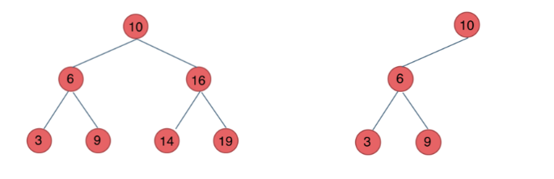
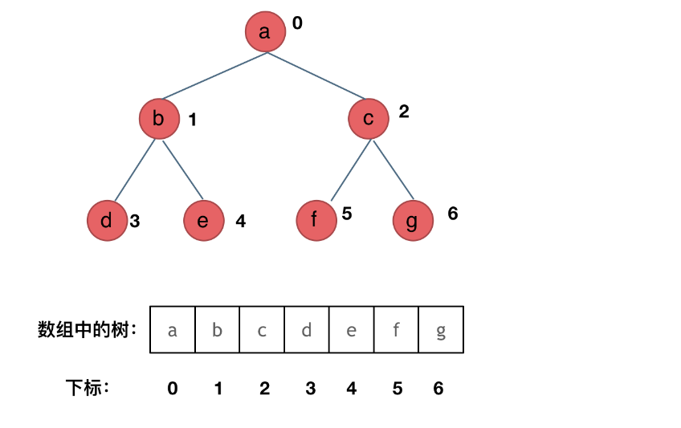
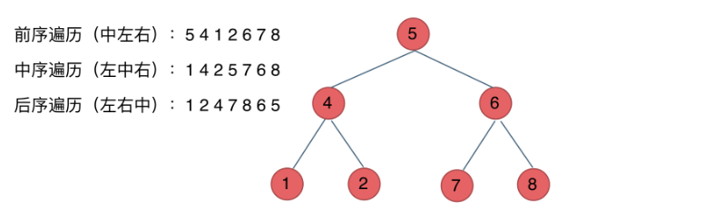
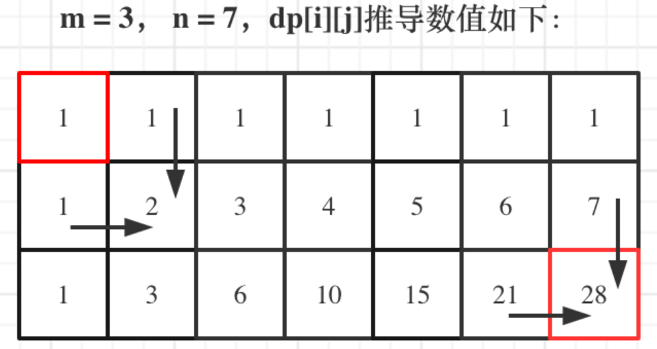

代码随想录算法题：https://github.com/Lwyan127/leetcode-master

# 数组

- **数组**是存放在**连续内存空间**上的**相同类型数据**的集合。
- 数组的元素是**不能删**的，只能**覆盖**。
- C++：注意vector和array的区别，vector的底层实现是array，严格来讲vector是容器，不是数组。
- C++：**二维数组**在地址空间上是**连续**的。

## [704. 二分查找](https://leetcode.cn/problems/binary-search/)

- 时间复杂度：O(log
- 空间复杂度：O(1)
- 算好区间，包括是否开闭。**如果是左闭右闭，则循环中while (left <= right)；如果是左闭右开，则循环中while (left < right)，因为left == right在区间[left, right)是没有意义的**

```c++
while (left <= right) {
	int middle = left + (right - left) / 2;
	// 防止溢出 等同于(left + right) / 2
    if (nums[middle] > target) {
		right = middle - 1; // target 在左区间，所以[left, middle - 1]
	} else if (nums[middle] < target) {
		left = middle + 1; // target 在右区间，所以[middle + 1, right]
	} else { // nums[middle] == target
		return middle; // 数组中找到目标值，直接返回下标
	}
}
```

## [27. 移除元素](https://leetcode.cn/problems/remove-element/)

### 暴力

- 时间复杂度：O(n^2)
- 空间复杂度：O(1)

### 双指针法

- **双指针法**（快慢指针法）： **通过一个快指针和慢指针在一个for循环下完成两个for循环的工作。**

- 定义快慢指针

  - 快指针：寻找新数组的元素 ，新数组就是不含有目标元素的数组

  - 慢指针：指向更新新数组下标的位置

- 时间复杂度：O(n)
- 空间复杂度：O(1)

```c++
int slowIndex = 0;
for (int fastIndex = 0; fastIndex < nums.size(); fastIndex++) {
    if (val != nums[fastIndex]) {
        nums[slowIndex] = nums[fastIndex];
        slowIndex++;
    }
}
return slowIndex;
```

## [977. 有序数组的平方](https://leetcode.cn/problems/squares-of-a-sorted-array/)

- 双指针分别从左和右向中间逼近，较大数的平方存入ans数组里。

## [209. 长度最小的子数组](https://leetcode.cn/problems/minimum-size-subarray-sum/)

- 窗口包括：

  - 窗口长度：只有在窗口右端点固定，窗口总和大于等于target且窗口长度达到最小时再计算，再与全局最小窗口长度比较得到较小值
  - 窗口左端：在窗口右端点固定时且窗口总和大于等于target时，向右移动，知道窗口长度达到最小且窗口总和大于等于target
  - 窗口右端：在窗口总和小于target时向右移动；在窗口左端移动后达到窗口最小长度后向后移动一位

- ```c++
  int min_len = INT32_MAX;  // 最小长度
  int len = 0;  // 窗口的长度
  int sum = 0;  // 窗口的总和
  int left = 0;
  int right = 0;
  while (right <= nums.size() - 1) {
      sum += nums[right];
      if (sum >= target) {
          while (sum - nums[left] >= target) {
              sum -= nums[left];
              left++;
          }
          len = right - left + 1;
          if (min_len > len) min_len = len;
      }
      right++;
  }
  if (sum < target) return 0;
  return min_len;
  ```


## [59. 螺旋矩阵 II](https://leetcode.cn/problems/spiral-matrix-ii/)

- 对于这种有规律且有各种判定条件的题目来说，一定要找到规律，保证某种规则来完成
- 可以发现这里的边界条件非常多，在一个循环中，如此多的边界条件，如果不按照固定规则来遍历，那非常难写判定条件。
- 这里一圈下来，我们要画每四条边，这四条边怎么画，每画一条边都要坚持一致的左闭右开，或者左开右闭的原则，这样这一圈才能按照统一的规则画下来。
- 

## 总结


## [1365. 有多少小于当前数字的数字](https://leetcode.cn/problems/how-many-numbers-are-smaller-than-the-current-number/)

弱智题，排序来提升效率。

## [941. 有效的山脉数组](https://leetcode.cn/problems/valid-mountain-array/)

简单题，直接写但是不好写。使用双指针从左从右向中间靠拢。

## [1207. 独一无二的出现次数](https://leetcode.cn/problems/unique-number-of-occurrences/)

用unordered_map记录，unordered_set去重。

## [283. 移动零](https://leetcode.cn/problems/move-zeroes/)

先遍历一遍对不是0的数进行记录它前面有几个0，再遍历一遍将不是0的数向前移动。

## [189. 轮转数组](https://leetcode.cn/problems/rotate-array/)

空间为`O(1)`的方法就是：对前半数组反转，对后半数组反转，最后对全部反转。

测试样例有个[-1]，k=2。优化一下就是让k去个模，因为轮转nums.size()就相当于不变。

## [724. 寻找数组的中心下标](https://leetcode.cn/problems/find-pivot-index/)

读懂题。看看例子，中心下标在最左端/最右端，nums数组只有1个数/2个数，看看这些特殊情况能不能跑对。做其他的题也要这样，找特殊例子看能不能跑对。

## [35. 搜索插入位置](https://leetcode.cn/problems/search-insert-position/)

这是一道使用二分的题目，但是有一些插入需要的条件。

想好用左闭右闭还是左闭右开，两者写法不同。

```c++
class Solution {
public:
    int searchInsert(vector<int>& nums, int target) {
        int n = nums.size();
        int left = 0;
        int right = n - 1; // 定义target在左闭右闭的区间里，[left, right]
        while (left <= right) { // 当left==right，区间[left, right]依然有效
            int middle = left + ((right - left) / 2);// 防止溢出 等同于(left + right)/2
            if (nums[middle] > target) {
                right = middle - 1; // target 在左区间，所以[left, middle - 1]
            } else if (nums[middle] < target) {
                left = middle + 1; // target 在右区间，所以[middle + 1, right]
            } else { // nums[middle] == target
                return middle;
            }
        }
        // 分别处理如下四种情况
        // 目标值在数组所有元素之前  [0, -1]
        // 目标值等于数组中某一个元素  return middle;
        // 目标值插入数组中的位置 [left, right]，return  right + 1
        // 目标值在数组所有元素之后的情况 [left, right]， 因为是右闭区间，所以 return right + 1
        return right + 1;
    }
};
```

## [34. 在排序数组中查找元素的第一个和最后一个位置](https://leetcode.cn/problems/find-first-and-last-position-of-element-in-sorted-array/)

恶心到极点的一道题。边界情况麻烦的要死。

寻找target在数组里的左右边界，有如下三种情况：

- 情况一：target 在数组范围的右边或者左边，例如数组{3, 4, 5}，target为2或者数组{3, 4, 5},target为6，此时应该返回{-1, -1}
- 情况二：target 在数组范围中，且数组中不存在target，例如数组{3,6,7},target为5，此时应该返回{-1, -1}
- 情况三：target 在数组范围中，且数组中存在target，例如数组{3,6,7},target为6，此时应该返回{1, 1}

找右边界：

```c++
// 二分查找，寻找target的右边界（不包括target）
// 如果rightBorder为没有被赋值（即target在数组范围的左边，例如数组[3,3]，target为2），为了处理情况一
int getRightBorder(vector<int>& nums, int target) {
    int left = 0;
    int right = nums.size() - 1; // 定义target在左闭右闭的区间里，[left, right]
    int rightBorder = -100; // 记录一下rightBorder没有被赋值的情况
    while (left <= right) { // 当left==right，区间[left, right]依然有效
        int middle = left + ((right - left) / 2);// 防止溢出 等同于(left + right)/2
        if (nums[middle] > target) {
            right = middle - 1; // target 在左区间，所以[left, middle - 1]
        } else { // 当nums[middle] == target的时候，更新left，这样才能得到target的右边界
            left = middle + 1;
            rightBorder = left;
        }
    }
    return rightBorder;  // 返回的是[left, right]中left再左边一位 或者 -100 如果返回[left, right] 中的left/right的话，就不是-100了，而是-99和-101
}
```

左边界完全相反就行了。

主函数：

```c++
vector<int> searchRange(vector<int>& nums, int target) {
    int leftBorder = getLeftBorder(nums, target);
    int rightBorder = getRightBorder(nums, target);
    // 情况一
    if (leftBorder == -100 || rightBorder == -100) return {-1, -1};
    // 情况三
    if (rightBorder - leftBorder > 1) return {leftBorder + 1, rightBorder - 1};
    // 情况二
    return {-1, -1};
}
```

## [922. 按奇偶排序数组 II](https://leetcode.cn/problems/sort-array-by-parity-ii/)

空间O(n)的话，每次遇到位置不对的就往后找到另一个奇偶相反的看能不能互换，这样时间不是O(n^2)，时间也是O(n)，因为偶数位和奇数位都只操作一次，不是n/2 * n/2的关系，而是n/2 + n/2的关系！

# 链表

- 链表是一种通过指针串联在一起的线性结构，每一个节点由两部分组成，一个是数据域一个是指针域（存放指向下一个节点的指针），最后一个节点的指针域指向null（空指针的意思）。

- 数组是在内存中是连续分布的，但是**链表**在内存中可**不是连续分布**的，分配机制取决于操作系统的内存管理。

- 分类

  - 单链表
  - 双链表
  - 循环链表
    - 解决瑟夫环问题

- 链表结构

  ```c++
  // 单链表
  struct ListNode {
      int val;  // 节点上存储的元素
      ListNode *next;  // 指向下一个节点的指针
      ListNode(int x) : val(x), next(NULL) {}  // 节点的构造函数
  };
  ```

  不定义构造函数行也可以，C++默认生成一个构造函数，但是无法赋值

  ```c++
  // 自己定义构造函数
  ListNode* head = new ListNode(5);
  
  // 默认的构造函数，需要自己额外赋值
  ListNode* head = new ListNode();
  head->val = 5;
  ```

- 删除链表节点/添加链表节点

  - 删除：只要将节点的next指针指向后后一节点就可以了。C++里再手动释放需要删除的节点，**释放这块内存**。其他语言例如Java、Python，就有自己的内存回收机制，就不用自己手动释放了。
  - 添加：只要将节点的next指针指向增加的节点，增加的节点的next指针再指向后一节点。
  - 删除第五个节点，需要从头节点查找到第四个节点通过next指针进行删除操作，查找的时间复杂度是O(n)。

- 

## [203. 移除链表元素](https://leetcode.cn/problems/remove-linked-list-elements/)

- 记得使用delete来释放内存块

  ```c++
  ListNode* p = head;
  ListNode* previous = head;
  while (p != NULL) {
      if (p->val == val) {
          if (p == head) {
              ListNode* tmp = p;
              head = head->next;
              p = head;
              delete tmp;
              continue;
          } else {
              ListNode* tmp = p;
              previous->next = p->next;
              p = p->next;
              delete tmp;
          }
      } else {
          previous = p;
          p = p->next;
      }
  }
  return head;
  ```

- 可以使用一个虚拟头节点来判断头节点值是否为val

  ```c++
  ListNode* dummyHead = new ListNode(0); // 设置一个虚拟头结点
  dummyHead->next = head; // 将虚拟头结点指向head，这样方便后面做删除操作
  ListNode* cur = dummyHead;
  while (cur->next != NULL) {
      if(cur->next->val == val) {
          ListNode* tmp = cur->next;
          cur->next = cur->next->next;
          delete tmp;
      } else {
          cur = cur->next;
      }
  }
  head = dummyHead->next;
  delete dummyHead;
  return head;
  ```


## [707. 设计链表](https://leetcode.cn/problems/design-linked-list/)

```c++
class MyLinkedList {
public:
    struct LinkedNode {  // 链表节点结构
        int val;
        LinkedNode* next;
        LinkedNode(int val):val(val), next(nullptr) {}  // 构造函数
    };

    MyLinkedList() {  // 初始化LinkedList对象
        head = new LinkedNode(-1);
        len = 0;
    }
    
    // 获取链表中下标为 index 的节点的值
    int get(int index) {
        if (index > len - 1 || index < 0) {
            return -1;
        }
        LinkedNode* cur = head;
        cur = cur->next;
        while (index--) {
            cur = cur->next;
        }
        return cur->val;
    }
    
    // 将一个值为 val 的节点插入到链表中第一个元素之前。在插入完成后，新节点会成为链表的第一个节点。
    void addAtHead(int val) {
        LinkedNode* newcur = new LinkedNode(val);
        newcur->next = head->next;
        head->next = newcur;
        len++;
        return;
    }
    
    //  将一个值为 val 的节点追加到链表中作为链表的最后一个元素
    void addAtTail(int val) {
        LinkedNode* newcur = new LinkedNode(val);
        LinkedNode* cur = head;
        for (int i = 0; i < len; i++) {
            cur = cur->next;
        }
        cur->next = newcur;
        len++;
        return;
    }
    
    // 将一个值为 val 的节点插入到链表中下标为 index 的节点之前。如果 index 等于链表的长度，那么该节点会被追加到链表的末尾。如果 index 比长度更大，该节点将不会插入到链表中。
    void addAtIndex(int index, int val) {
        if (index > len || index < 0) {
            return;
        } else {
            LinkedNode* newcur = new LinkedNode(val);
            LinkedNode* cur = head;
            while (index--) {
                cur = cur->next;
            }
            newcur->next = cur->next;
            cur->next = newcur;
            len++;
            return;
        }
    }
    
    // 如果下标有效，则删除链表中下标为 index 的节点
    void deleteAtIndex(int index) {
        if (index >= len || index < 0) {
            return;
        } else {
            LinkedNode* cur = head;
            while (index--) {
                cur = cur->next;
            }
            LinkedNode* tmp = cur->next;
            cur->next = cur->next->next;
            delete tmp;
            tmp = nullptr;
            len--;
            return;
        }
    }

private:
    int len;  // 链表长度
    LinkedNode* head;  // 链表虚拟头，即不是第一个节点，其后一个才是
};
```

## [206. 反转链表](https://leetcode.cn/problems/reverse-linked-list/)

- 双指针法

  - 时间复杂度: O(n)
  - 空间复杂度: O(1)

  ```c++
  // 双指针
  class Solution {
  public:
      ListNode* reverseList(ListNode* cur) {
          if (cur == nullptr) return cur;
          ListNode* prev = nullptr;
          ListNode* tmp;
          // cur为第一个节点时，prev为null；cur为最后一个节点后的null时，prev为最后一个节点
          while (cur) {
              tmp = cur->next;
              cur->next = prev;
              prev = cur;
              cur = tmp;
          }
          return prev;
      }
  };
  ```

- 递归

  - 时间复杂度: O(n), 要递归处理链表的每个节点
  - 空间复杂度: O(n), 递归调用了 n 层栈空间

  ```c++
  // 从前往后翻转
  class Solution {
  public:
      ListNode* reverse(ListNode* pre,ListNode* cur){
          if(cur == NULL) return pre;
          ListNode* temp = cur->next;
          cur->next = pre;
          // 可以和双指针法的代码进行对比，如下递归的写法，其实就是做了这两步
          // pre = cur;
          // cur = temp;
          return reverse(cur,temp);
      }
      ListNode* reverseList(ListNode* head) {
          // 和双指针法初始化是一样的逻辑
          // ListNode* cur = head;
          // ListNode* pre = NULL;
          return reverse(NULL, head);
      }
  };
  ```

  ```c++
  // 从后往前翻转
  class Solution {
  public:
      ListNode* reverseList(ListNode* cur) {
          if (cur == nullptr) {
              return cur;
          }
          if (cur->next == nullptr) {
              newhead = cur;
              return cur;
          }
          len++;
          ListNode* newcur = reverseList(cur->next);
          newcur->next = cur;
          len--;
          if (!len) {
              cur->next = nullptr;
              return newhead;
          } else {
              return cur;
          }
      }
  private:
      ListNode* newhead;
      int len = 0;
  };
  
  // 简单点
  class Solution {
  public:
      ListNode* reverseList(ListNode* head) {
          // 边缘条件判断
          if(head == NULL) return NULL;
          if (head->next == NULL) return head;
          
          // 递归调用，翻转第二个节点开始往后的链表
          ListNode *last = reverseList(head->next);
          // 翻转前一节点与后一节点的指向
          head->next->next = head;
          // next 需要指向 NULL，这样到最后的原先的第一个节点也使其 next 指向 NULL 了，而其他的 next 在 return 后会再操作变为原先的前一节点
          head->next = NULL;
          return last;
      }
  }; 
  ```


## [24. 两两交换链表中的节点](https://leetcode.cn/problems/swap-nodes-in-pairs/)

- 普通模拟，记得对两个交换节点的前一节点的next也要修改

- 时间复杂度：O(n)
- 空间复杂度：O(1)

## [19. 删除链表的倒数第 N 个结点](https://leetcode.cn/problems/remove-nth-node-from-end-of-list/)

- 这道题充分体现了虚拟头节点（dummy head）的优点

  - 可能会删除至链表变为空，这时使用虚拟头节点则不用去进行判断是否为空，直接返回虚拟头节点的next（原本的头节点地址，此时为NULL）即可

  - 删除时需要

    ```c++
    slow->next = slow->next->next
    ```

    此时，如果链表为[1]，删除倒数第一个节点，不使用虚拟头节点，则会造成slow的next为NULL，上方语句报错。

```
ListNode* removeNthFromEnd(ListNode* head, int n) {
    ListNode* dummyhead = new ListNode(0, head);
    ListNode* fast = dummyhead;
    ListNode* slow = dummyhead;
    while (n--) {
        fast = fast->next;
    }
    fast = fast->next;  // fast再提前走一步，因为需要让slow指向删除节点的上一个节点
    while (fast != NULL) {
        fast = fast->next;
        slow = slow->next;
    }
    slow->next = slow->next->next;
    return dummyhead->next;
}
```

## [面试题 02.07. 链表相交](https://leetcode.cn/problems/intersection-of-two-linked-lists-lcci/)

- 计算两个链表的长度，再算差值delta，将长的链表往后移动delta次，然后两个链表一起往后走一起比较

```
ListNode *getIntersectionNode(ListNode *headA, ListNode *headB) {
    ListNode *curA = headA;
    ListNode *curB = headB;
    int lenA = 0, lenB = 0;
    while (curA != NULL) {
        curA = curA->next;
        lenA++;
    }
    while (curB != NULL) {
        curB = curB->next;
        lenB++;
    }
    int delta = lenA - lenB;
    if (delta < 0) {
        delta *= -1;
        while (delta--) {
            headB = headB->next;
        }
    } else if (delta > 0) {
        while (delta--) {
            headA = headA->next;
        }
    }
    while (headA != NULL && headB != NULL) {
        if (headA == headB) return headA;
        headA = headA->next;
        headB = headB->next;
    }
    return NULL;
}
```

## [142. 环形链表 II](https://leetcode.cn/problems/linked-list-cycle-ii/)

- 要求O(1)的空间复杂度，因此先用数学方法来计算那这道题

- 使用fast和slow快慢指针

  - fast一次跳两步，slow一次跳一步
  - 如果存在环，则fast与slow一定会相遇（速度差为1，则相遇时间为整数，则一定会相遇）

- 接下来找环的起点

  - 先证明如果fast与slow相遇了，则slow一定没有在环中跑第2圈

    .PNG)

  - 然后计算

    .PNG)

  - 则从fast与slow的相遇点开始跑z+(n-1)圈环，和从链表头开始跑x的距离，同时开始则同时到达环的起点

```c++
if (head == NULL || head->next == NULL) return NULL;
ListNode *fast = head;
ListNode *slow = head;
while (true) {
    if (fast == NULL || fast->next == NULL) {  // fast 是否为空先判断再判断其 next 是否为空
        return NULL;
    }
    fast = fast->next->next;
    slow = slow->next;
    // 这里 fast == slow 不能放在前面，否则需要判断是否两个指针都还没出发、都为 head，但是一旦判断了 head，则会导致 head 就是环的起点的情况陷入死循环
    if (fast == slow) {  
    	break;
    }
}
slow = head;
while (slow != fast) {
    fast = fast->next;
    slow = slow->next;
}
return fast;
```

## 总结

- 记得使用虚拟头节点
- 使用双指针法，这样可以将很多递归变成迭代


## [234. 回文链表](https://leetcode.cn/problems/palindrome-linked-list/)

空间O(1)就是双指针找到中点，然后后半翻转链表，最后和前半比较。

## [143. 重排链表](https://leetcode.cn/problems/reorder-list/)

快慢指针找到中点。后半翻转。前半和后半合并。

# 哈希表

- 哈希表是根据关键码的值而直接进行访问的数据结构。

- 直白来讲，数组就是一张哈希表：哈希表中关键码就是数组的索引下标，然后通过下标直接访问数组中的元素

- **一般哈希表都是用来快速判断一个元素是否出现集合里**

  - 要枚举的话时间复杂度是O(n)，但如果使用哈希表的话， 只需要O(1)就可以做到

- **哈希函数**

  - 把元素直接映射为哈希表上的索引
  - 通过hashCode把元素转化为数值，一般hashCode是通过特定编码方式，可以将其他数据格式转化为不同的数值，这样就把元素映射为哈希表上的索引数字了。
    - 例如，把学生名字映射：$hashFunction() = hashCode(name)\mod {tableSize}$
    - tableSize为哈希表的表长，取模保证hashCode的数值在哈希表上
    - 那么，存在可能两个元素映射到同一个索引上

- **哈希碰撞**

  - 两个元素通过hashCode同时映射到了一个相同的索引上

  - 解决方法：

    - **拉链法**：将冲突的元素存在链表上

      

    - **线性探测法**：向下找一个空位放置冲突的元素

      - 因此，tableSize一定要大于dataSize

- 一般选择三种数据结构：数组、set（集合）、map（映射）

  - std::unordered_set底层实现为哈希表，std::set 和std::multiset 的底层实现是红黑树，红黑树是一种平衡二叉搜索树，所以key值是有序的，但key不可以修改，改动key值会导致整棵树的错乱，所以只能删除和增加。

    | 集合               | 底层实现 | 是否有序 | 数值是否可以重复 | 能否更改数值 | 查询效率 | 增删效率 |
    | ------------------ | -------- | -------- | ---------------- | ------------ | -------- | -------- |
    | std::set           | 红黑树   | 升序     | 否               | 否           | O(log n) | O(log n) |
    | std::multiset      | 红黑树   | 升序     | 是               | 否           | O(logn)  | O(logn)  |
    | std::unordered_set | 哈希表   | 无序     | 否               | 否           | O(1)     | O(1)     |

  - std::unordered_map 底层实现为哈希表，std::map 和std::multimap 的底层实现是红黑树。同理，std::map 和std::multimap 的key也是有序的（这个问题也经常作为面试题，考察对语言容器底层的理解）。

    | 映射               | 底层实现 | 是否有序 | 数值是否可以重复 | 能否更改数值 | 查询效率 | 增删效率 |
    | ------------------ | -------- | -------- | ---------------- | ------------ | -------- | -------- |
    | std::map           | 红黑树   | key升序  | key不可重复      | key不可修改  | O(logn)  | O(logn)  |
    | std::multimap      | 红黑树   | key升序  | key可重复        | key不可修改  | O(log n) | O(log n) |
    | std::unordered_map | 哈希表   | key无序  | key不可重复      | key不可修改  | O(1)     | O(1)     |

- 当我们要使用集合来解决哈希问题的时候，优先使用unordered_set，因为它的查询和增删效率是最优的，如果需要集合是有序的，那么就用set，如果要求不仅有序还要有重复数据的话，那么就用multiset。

  那么再来看一下map ，在map 是一个key value 的数据结构，map中，对key是有限制，对value没有限制的，因为key的存储方式使用红黑树实现的。

  虽然std::set、std::multiset 的底层实现是红黑树，不是哈希表，std::set、std::multiset 使用红黑树来索引和存储，不过给我们的使用方式，还是哈希法的使用方式，即key和value。所以使用这些数据结构来解决映射问题的方法，我们依然称之为哈希法。 map也是一样的道理。

## [242. 有效的字母异位词](https://leetcode.cn/problems/valid-anagram/)

- 由于全是小写字母，设置一个长26的数组来记录。遍历第一个字符串，遇到字母，数组[字母位置]+1；遍历第二个字符串，遇到字母，数组[字母位置]-1。如果遍历完，数组全为0，则说明是有效的字母异位词。

```c++
int num[26] = {0};
for (auto ch : s) {
    num[ch - 'a']++;
}
for (auto ch : t) {
    num[ch - 'a']--;
}
for (int i = 0; i < 26; i++) {
    if (num[i]) return false;
}
return true;
```

- 如果输入字符串包含 unicode 字符怎么办？
  - 看到网上的答案，可以对字符串进行排序，然后从头到尾遍历比较，这个时间复杂度高
  - 使用unordered_set来作为哈希表，这样表长没有限制

## [1002. 查找共用字符](https://leetcode.cn/problems/find-common-characters/)

- 对每个字符串进行遍历，将字符出现的个数放入哈希表中；取每个哈希表中的最小值

- 具体实现是先统计第一个字符串，再开始循环统计每个字符串，每次循环时对hash与tmphash比较取最小值更新

- ```c++
  vector<string>& A   
  ```

  A[i] [j] 可以表示第 i - 1 个字符串的第 j - 1 个字符

  A.size() 表示vector中字符串的个数

  A[0].size() 表示第1个字符串的长度

```c++
vector<string> ans;
int hash[26] = {0};
for (auto ch : words[0]) {
    hash[ch - 'a']++;
}
for (int i = 1; i < words.size(); i++) {
    int tmphash[26] = {0};
    for (auto ch : words[i]) {
        tmphash[ch - 'a']++;
    }
    for (int j = 0; j < 26; j++) {
        hash[j] = min(tmphash[j], hash[j]);
    }
}
int num = 0;
while (num < 26) {
    while (hash[num] > 0) {
        string s = string(1, 'a' + num);
        ans.push_back(s);
        hash[num]--;
    }
    num++;
}
return ans;
```

## [349. 两个数组的交集](https://leetcode.cn/problems/intersection-of-two-arrays/)

- **无序**和**不可重复**决定了这道题使用unordered_set
- 先对nums1去重放入set1。再与nums2比较：如果nums2中的num在set1中出现过，则放入set2，set2作为答案的集合。最后放入vector中输出。

```c++
vector<int> intersection(vector<int>& nums1, vector<int>& nums2) {
    unordered_set<int> set1, set2;
    vector<int> ans;
    for (int num : nums1) {
        if (!set1.count(num)) {
            set1.insert(num);
        }
    }
    for (int num : nums2) {
        if (set1.count(num)) {
            set2.insert(num);
        }
    }
    for (int num : set2) {
        ans.push_back(num);
    }
    return ans;
}

// 标答
vector<int> intersection(vector<int>& nums1, vector<int>& nums2) {
    unordered_set<int> result_set;  // 存放结果，之所以用set是为了给结果集去重
    unordered_set<int> nums_set(nums1.begin(), nums1.end());  // 直接用迭代器生成set可以直接去重
    for (int num : nums2) {
        // 发现nums2的元素 在nums_set里又出现过
        if (nums_set.find(num) != nums_set.end()) {
            result_set.insert(num);
        }
    }
    return vector<int>(result_set.begin(), result_set.end());  // 也可以直接用迭代器生成vector
}
```

## [202. 快乐数](https://leetcode.cn/problems/happy-number/)

- 范围：$1<=n<=2 ^ {31} - 1$，即2147483647，也就是说sum最大为：$9*9 ^2 + 1$，则sum为有限的数，那么如果无限循环的话一定是重复出现了sum。
- 因此使用unordered_set来记录已经出现过的sum

```c++
class Solution {
public:
    bool isHappy(int n) {
        unordered_set<int> set;
        set.insert(n);
        while (n != 1) {
            int sum = 0;
            while (n) {  // 计算sum
                sum += (n % 10) * (n % 10);
                n /= 10;
            }
            if (set.count(sum)) {  // 判断有无重复
                return 0;
            } else {
                set.insert(sum);  // 没有重复则放入set
            }
            n = sum;  // 更新n
        }
        return 1;
    }
};
```

## [1. 两数之和](https://leetcode.cn/problems/two-sum/)

- 本题需要一个集合来存放我们遍历过的元素，然后在遍历数组的时候去询问这个集合，某元素是否遍历过，也就是是否出现在这个集合。因此想到使用**哈希表**。
- 这里需要存储数组下标和数据，并且一一对应，则想到使用**map**。
- 由于不需要key有序的要求，因此使用**unordered_map**。
- **注意：**
  - map<key, value>
  - map.find()查询时都是查询key的位置，因此key放数据，value放数组下标

```c++
class Solution {
public:
    vector<int> twoSum(vector<int>& nums, int target) {
        // vector<int> ans;
        unordered_map<int, int> map;
        unordered_map<int, int>::iterator it;
        for (int i = 0; i < nums.size(); i++) {
            it = map.find(target - nums[i]);
            // auto it = map.find(target - nums[i]);  // 可以自动给it赋类型
            if (it == map.end()) {
                map[nums[i]] = i;
                // map.insert(pair<int, int>(nums[i], i));  // 也可以
            } else {
                // ans.push_back(i);
                // ans.push_back(it->second);
                // break;
                return {iter->second, i};  // 相当于返回ans
            }
        }
        // return ans;
        return {};  // 这样相当于返回一个空vector
    }
};
```

## [454. 四数相加 II](https://leetcode.cn/problems/4sum-ii/)

- 暴力的话要：O(n^4)
- 这里要先计算前两个数组的元素和，放到哈希表里；然后计算后两个，在哈希表找加起来能等于0的数。
- 时间复杂度：O(n^2)
- 空间复杂度：O(n^2)，最坏情况下A和B的值各不相同，相加产生的数字个数为 n^2

```c++
class Solution {
public:
    int fourSumCount(vector<int>& nums1, vector<int>& nums2, vector<int>& nums3, vector<int>& nums4) {
        int ans = 0;
        unordered_map<int, int> map;
        for (int i = 0; i < nums1.size(); i++) {
            for (int j = 0; j < nums2.size(); j++) {
                if (!map.count(nums1[i] + nums2[j])) {
                    map.insert(pair<int, int>(nums1[i] + nums2[j], 1));
                } else {
                    map[nums1[i] + nums2[j]]++;
                }
            }
        }
        for (int i = 0; i < nums3.size(); i++) {
            for (int j = 0; j < nums4.size(); j++) {
                if (map.count(- nums3[i] - nums4[j])) {
                    ans += map[- nums3[i] - nums4[j]];
                }
            }
        }
        return ans;
    }
};
```

## [383. 赎金信](https://leetcode.cn/problems/ransom-note/)

- 使用unordered_map统计后一个字符串中的字符即可

```c++
class Solution {
public:
    bool canConstruct(string ransomNote, string magazine) {
        unordered_map<string, int> map;
        for (auto i : magazine) {
            string s = string(1, i);
            if (!map.count(s)) {
                map.insert(pair<string, int>(s, 1));
            } else {
                map[s]++;
            }
        }
        for (auto i : ransomNote) {
            string s = string(1, i);
            if (!map.count(s) || map[s] <= 0) {
                return false;
            }
            if (map[s] > 0) {
                map[s]--;
            }
        }
        return true;
    }
};
```

## [15. 三数之和](https://leetcode.cn/problems/3sum/)

- 这道题最麻烦的点是需要去重相同的三元组
- 如果直接使用哈希表，需要判断很多条件，在考试时很难完全正确
- 这里也不能使用find来找三元组是否在ans中，find不支持查找vector<int>这样的元素
- 时间复杂度: O(n^2)
- 空间复杂度: O(n)，额外的 set 开销

```c++
class Solution {
public:
    vector<vector<int>> threeSum(vector<int>& nums) {
        vector<vector<int>> ans;
        sort(nums.begin(), nums.end());
        // 找出 a + b + c = 0
        // a = nums[i], b = nums[j], c = -(a + b)
        if (nums[0] > 0) return ans;  // 排序后第1个元素大于0，则和不可没能为0
        for (int i = 0; i < nums.size() - 1; i++) {
            if (i > 0 && nums[i] == nums[i - 1]) {  // 第1个元素a去重
                // 遇到第1个a继续操作，后面相同的a则不操作
                // 可能有疑问如果答案中有两个相同的a怎么办呢
                // 实际上第1个a的后续操作会考虑这个答案，即b为第2个a时的操作
                continue;
            }
            unordered_set<int> set;  // 这里用来记录的unordered_set在每个不同的a下循环中是不同的
            for (int j = i + 1; j < nums.size(); j++) {
                if (j > i + 2 && nums[j] == nums[j - 1] && nums[j - 1]== nums[j - 2]) {  // 第2个元素b去重
                    // 举例：-1 -1 -1 -1
                    // 当i指向第1个-1，j指向第3个-1时，set为{-1}，这时需要判断三个数的和
                    // 而当j指向第4个-1时，这时-1 + -1 + -1已经判断过了则跳过
                    // 举例：-2 -1 -1 -1
                    // 当i指向-2，j指向第2个-1时，set为{-1}，这时需要判断三个数的和
                    // 而当j指向第3个-1时，这时候-2 + -1 + -1已经判断过了则跳过
                    // 因此总结来说就是三个数相同时，j指向了第三个数，若i指向第1个数，set中为第2个数则判断三数之和；若i还没指到第1个数，则跳过，等到后来i指到第1个数时再来判断三个相同的数的和
                    continue;
                }
                int c = 0 - nums[i] - nums[j];
                if (set.count(c)) {  // 在set中找到了第3个元素c，但实际上这个c是之前已经经过的b
                    ans.push_back({nums[i], nums[j], c});
                    set.erase(c);  // 第3个元素c去重
                } else {
                    set.insert(nums[j]);    // 第2个元素b放入set中，因此这个查找是通过找b来查值的
                }
            }
        }
        return ans;
    }
};
```

- 然而，这道题需要**求和**，找到三个值但是**不用给出下标（则可以直接排序）**。
- 因此，先排序，然后在第1个数的循环下，使用**双指针法**：两个指针从左从右分别逼近，求的和如果大于0，则右指针左移，反之，左指针右移。
- 时间复杂度: O(n^2)
- 空间复杂度: O(1)，过一遍就行，不用额外的哈希表来存储
- 其中，第1个数的去重：

```c++
if (i > 0 && nums[i] == nums[i - 1]) continue;
```

​		后面两个数（即指针指的数）的去重

```c++
while (left < right && nums[left] == nums[left + 1]) left++;
while (left < right && nums[right] == nums[right - 1]) right--;
```

```c++
// 最优解
class Solution {
public:
    vector<vector<int>> threeSum(vector<int>& nums) {
        vector<vector<int>> ans;
        sort(nums.begin(), nums.end());
        for (int i = 0; i < nums.size() - 2; i++) {
            if (nums[i] > 0) continue;  // 第1个元素如果大于0，则指针制的数一定大于0，则和不为0
            if (i > 0 && nums[i] == nums[i - 1]) {  // 第1个元素a去重
                continue;
            }
            int left = i + 1;
            int right = nums.size() - 1;
            while (left < right) {
                /* 两个指针去重如果放在这里，可能会导致right直接小于left了，比如[0, 0, 0]
                while (left < right && nums[left] == nums[left + 1]) left++;
                while (left < right && nums[right] == nums[right - 1]) right--;
                */
                // 根据和的大小移动指针
                if (nums[i] + nums[left] + nums[right] < 0) left++;
                else if (nums[i] + nums[left] + nums[right] > 0) right--;
                else {
                    ans.push_back({nums[i], nums[left], nums[right]});
                    // 当找到和为0的值时，两个指针都移动
                    while (left < right && nums[left] == nums[left + 1]) left++;
                	while (left < right && nums[right] == nums[right - 1]) right--;
                    right--;
                    left++;
                }

            }
        }
        return ans;
    }
};
```

## [18. 四数之和](https://leetcode.cn/problems/4sum/)

- 与上面的三数之和一模一样，除了多套了一层循环
- 剪枝改变了：
  - 不要判断`nums[k] > target` 就返回了，三数之和 可以通过 `nums[i] > 0` 就返回了，因为 0 已经是确定的数了，四数之和这道题目 target是任意值。比如：数组是`[-4, -3, -2, -1]`，`target`是`-10`，不能因为`-4 > -10`而跳过。但是我们依旧可以去做剪枝，逻辑变成`nums[i] > target && (nums[i] >=0 || target >= 0)`就可以了。
- 这里有一个整型提升的细节，可以看c的笔记

```c++
class Solution {
public:
    vector<vector<int>> fourSum(vector<int>& nums, int target) {
        vector<vector<int>> ans;
        sort(nums.begin(), nums.end());
        for (int i = 0; i < nums.size(); i++) {
            if (nums[i] > target && nums[i] >= 0) return ans;
            if (i > 0 && nums[i] == nums[i - 1]) continue;
            for (int j = i + 1; j < nums.size(); j++) {
                if (nums[i] + nums[j] > target && nums[i] + nums[j] >= 0) {
                    return ans;
                }
                if (j > i + 1 && nums[j] == nums[j - 1]) continue;
                int left = j + 1;
                int right = nums.size() - 1;
                while (left < right) {
                    long long sum = (long long)nums[i] + nums[j] + nums[left] + nums[right];
                    if (sum > target) right--;
                    else if (sum < target) left++;
                    else {
                        ans.push_back(vector<int>{nums[i], nums[j], nums[left], nums[right]});
                        while (left < right && nums[left] == nums[left + 1]) left++;
                	    while (left < right && nums[right] == nums[right - 1]) right--;
                        left++;
                        right--;
                    }
                }
            }
        }
        return ans;
    }
};
```

## [205. 同构字符串](https://leetcode.cn/problems/isomorphic-strings/)

记得s与t同构，则字符全是相互对应的，s[i]对应t[i]且t[i]对应s[i]，所以要使用两个map

## [925. 长按键入](https://leetcode.cn/problems/long-pressed-name/)

特殊情况：`name = "alex", typed = "aaleexa"`要考虑到

## [844. 比较含退格的字符串](https://leetcode.cn/problems/backspace-string-compare/)

简单。

# 栈与队列

- 那么来介绍一下，三个最为普遍的STL版本：

  1. HP STL 其他版本的C++ STL，一般是以HP STL为蓝本实现出来的，HP STL是C++ STL的第一个实现版本，而且开放源代码。
  2. P.J.Plauger STL 由P.J.Plauger参照HP STL实现出来的，被Visual C++编译器所采用，不是开源的。
  3. SGI STL 由Silicon Graphics Computer Systems公司参照HP STL实现，被Linux的C++编译器GCC所采用，SGI STL是开源软件，源码可读性甚高。

- 我们一般使用的是SGI STL，被GCC(Linux)采用，阅读性非常高。

- SGI STL的栈提供push 和 pop 等等接口，所有元素**必须符合先进后出规则**，所以栈不提供走访功能，也**不提供迭代器(iterator)**。 不像是set 或者map 提供迭代器iterator来遍历所有元素。

  **栈是以底层容器完成其所有的工作，对外提供统一的接口，底层容器是可插拔的（也就是说我们可以控制使用哪种容器来实现栈的功能）。**所以STL中栈往往不被归类为容器，而被归类为container adapter（容器适配器）。

  栈的底层实现可以是vector，deque，list 都是可以的， 主要就是数组和链表的底层实现。

  **Q：栈里面的元素在内存中是连续分布的么？**

  **A：不是，栈的底层实现可以是vector，deque，list 都是可以的，因此不一定是连续分布的。而C++中使用dequeue作为栈和队列的底层结构，其不是连续的。**

- **我们常用的SGI STL，如果没有指定底层实现的话，默认是以deque为缺省情况下栈的底层结构。**

  - deque是一个双向队列，只要封住一段，只开通另一端就可以实现栈的逻辑了。

  - **SGI STL中 队列底层实现缺省情况下一样使用deque实现的。**

  - 我们也可以指定vector为栈的底层实现，初始化语句如下：

    ```c++
    std::stack<int, std::vector<int> > third;  // 使用vector为底层容器的栈
    ```

- 刚刚讲过栈的特性，对应的队列的情况是一样的。

  队列中先进先出的数据结构，同样不允许有遍历行为，**不提供迭代器, SGI STL中队列一样是以deque为缺省情况下的底部结构。**

  也可以指定list 为起底层实现，初始化queue的语句如下：

  ```c++
  std::queue<int, std::list<int>> third; // 定义以list为底层容器的队列
  ```

  所以STL 队列也不被归类为容器，而被归类为container adapter（容器适配器）。

## [232. 用栈实现队列](https://leetcode.cn/problems/implement-queue-using-stacks/)

- 使用输入栈和输出栈：push直接进压输入栈；pop将输入栈全部弹出压入输出栈，然后再弹出；peek类似；判断空看两个栈是否都为空即可

```c++
class MyQueue {
public:
    stack<int> stkin;
    stack<int> stkout;
    MyQueue() {
        
    }

    void push(int x) {
        stkin.push(x);
    }
    
    int pop() {
        if (stkout.empty()) {
            while (!stkin.empty()) {
                int x = stkin.top();
                stkin.pop();
                stkout.push(x);
            }
        }
        int x = stkout.top();
        stkout.pop();
        return x;
    }
    
    int peek() {
        if (stkout.empty()) {
            while (!stkin.empty()) {
                int x = stkin.top();
                stkin.pop();
                stkout.push(x);
            }
        }
        return stkout.top();
    }
    
    bool empty() {
        if (stkout.empty() && stkin.empty()) {
            return true;
        } else return false;
    }
};

```

## [225. 用队列实现栈](https://leetcode.cn/problems/implement-stack-using-queues/)

- 实际使用一个队列即可，弹出栈顶元素相当于队列的元素全部出来一遍然后得到最后一个就是栈顶元素，再把这些元素放回队列里。

```c++
class MyStack {
public:
    queue<int> q;
    MyStack() {

    }
    
    void push(int x) {
        q.push(x);
    }
    
    int pop() {
        int sz = q.size() - 1;
        while(sz--) {
            q.push(q.front());
            q.pop();
        }
        int x = q.front();
        q.pop();
        return x;
    }
    
    int top() {
        return q.back();
    }
    
    bool empty() {
        if (q.empty()) return true;
        return false;
    }
};
```

## [20. 有效的括号](https://leetcode.cn/problems/valid-parentheses/)

- 没啥好说的，注意小心在空栈的情况下访问top元素会报错，增加判断栈是否为空即可

```c++
class Solution {
public:
    bool isValid(string s) {
        stack<char> stk;
        for (auto c : s) {
            if (c == '(' || c == '{' || c == '[') {
                stk.push(c);
            }
            if (c == ')') {
                if (!stk.empty() && stk.top() == '(') {
                    stk.pop();
                } else return false;
            }
            if (c == '}') {
                if (!stk.empty() && stk.top() == '{') {
                    stk.pop();
                } else return false;
            }
            if (c == ']') {
                if (!stk.empty() && stk.top() == '[') {
                    stk.pop();
                } else return false;
            }
        }
        if (!stk.empty()) return false;
        return true;
    }
};
```

## [1047. 删除字符串中的所有相邻重复项](https://leetcode.cn/problems/remove-all-adjacent-duplicates-in-string/)

- 没啥难的，注意栈中是反过来的字符串，最后反转即可

```
class Solution {
public:
    string removeDuplicates(string s) {
        stack<char> st;
        st.push(s[0]);
        for (int i = 1; i < s.size(); i++) {
            if (!st.empty() && s[i] == st.top()) {
                st.pop();
                continue;
            } else {
                st.push(s[i]);
            }
        }
        string ans;
        while (!st.empty()) {
            ans += st.top();
            st.pop();
        }
        reverse(ans.begin(), ans.end());
        return ans;
    }
};
```

## [150. 逆波兰表达式求值](https://leetcode.cn/problems/evaluate-reverse-polish-notation/)

- 注意遇到符号时出栈的两个数字间做运算的顺序
- 使用stoll函数来快速将string转化为longlong

```
class Solution {
public:
    int evalRPN(vector<string>& tokens) {
        stack<long long> st;
        for (int i = 0; i < tokens.size(); i++) {
            if (tokens[i] == "+" || tokens[i] == "-" || tokens[i] == "*" || tokens[i] == "/") {
                long long num1 = st.top();
                st.pop();
                long long num2 = st.top();
                st.pop();
                if (tokens[i] == "+") st.push(num1 + num2);
                if (tokens[i] == "-") st.push(num2 - num1);
                if (tokens[i] == "*") st.push(num1 * num2);
                if (tokens[i] == "/") st.push(num2 / num1);
            } else {
                st.push(stoll(tokens[i]));
            }
        }
        return st.top();
    }
};
```

## [239. 滑动窗口最大值](https://leetcode.cn/problems/sliding-window-maximum/)

- 这里的问题就是在一个滑动的窗口中找到最大值，如果直接暴力，那么就是O(n * k)，超时
- 有三种方法：**优先队列**（这里没写），**单调队列**以及**multiset**（仅限c++）

### 单调队列

- 思考一下，很明显，我们需要维护一个数据结构，而这个数据结构能

  - 给出当前窗口中的最大值
  - 在滑动一个后能不遍历一遍窗口而找到新窗口的最大值（因此需要从大到小的排序）

- 这里有这样的一个思路来帮助我们制造这个数据结构

  - 在一个窗口里，当 i < j 时，如果 nums[i] < nums[j]，那么只要两个数都在窗口中，nums[i] 就不为最大值，直到窗口滑动过 i 。

  - 因此，只要两个数在窗口内，右边的数比左边的大，就不用管左边的数了。我们就不需要将窗口内的所有数据都排序了。这个数据结构是这样的：和窗口的顺序一致，从左边到右边是非递增的，且最左为当前窗口最大值

    例如：3，4，5，2，3， 6，7，8，当 k = 5 时，这个数据结构初始为[5, 3]

  - 在滑动一个时：

    - 看离开窗口的num是否为最大值，如果是，则将数据结构中的最左边的值弹出，这样剩下的值就是除了这个num的最大值（新数还没进入窗口）
    - 看进入窗口的num是否比最右边的值大，如果大就弹出右边的值，直到让num加入这个数据结构

  - 这里可能会有这样的疑问，例如：3，4，5，2，3， 6，7，8，当 k = 5 时，这个数据结构初始为[5, 3]，但是 4 才是比 5 小的第一个数啊，这样会不会答案里有 4，实际上，只有过了 4 才会把 5 从数据结构中弹出，因此不必担心

  - 另外，因为可能有相同的值，所以是非递增的而不是递减的

```c++
class Solution {
private:
    class MyQueue { //单调队列（从大到小）
    public:
        deque<int> que; // 使用deque来实现单调队列
        // 每次弹出的时候，比较当前要弹出的数值是否等于队列出口元素的数值，如果相等则弹出。
        // 同时pop之前判断队列当前是否为空。
        void pop(int value) {
            if (!que.empty() && value == que.front()) {
                que.pop_front();
            }
        }
        // 如果push的数值大于入口元素的数值，那么就将队列后端的数值弹出，直到push的数值小于等于队列入口元素的数值为止。
        // 这样就保持了队列里的数值是单调从大到小的了。
        void push(int value) {
            while (!que.empty() && value > que.back()) {
                que.pop_back();
            }
            que.push_back(value);

        }
        // 查询当前队列里的最大值 直接返回队列前端也就是front就可以了。
        int front() {
            return que.front();
        }
    };
public:
    vector<int> maxSlidingWindow(vector<int>& nums, int k) {
        MyQueue que;
        vector<int> result;
        for (int i = 0; i < k; i++) { // 先将前k的元素放进队列
            que.push(nums[i]);
        }
        result.push_back(que.front()); // result 记录前k的元素的最大值
        for (int i = k; i < nums.size(); i++) {
            que.pop(nums[i - k]); // 滑动窗口移除最前面元素
            que.push(nums[i]); // 滑动窗口前加入最后面的元素
            result.push_back(que.front()); // 记录对应的最大值
        }
        return result;
    }
};
```

### multiset

- 使用multiset作为单调队列

- 多重集合(`multiset`) 用以有序地存储元素的容器。允许存在相等的元素。

- 在遍历原数组的时候，只需要把窗口的头元素加入到multiset中，然后把窗口的尾元素删除即可。因为multiset是有序的，并且提供了*rbegin()（反向迭代器），可以直接获取窗口最大值。

- | 集合          | 底层实现 | 是否有序 | 数值是否可以重复 | 能否更改数值 | 查询效率 | 增删效率 |
  | ------------- | -------- | -------- | ---------------- | ------------ | -------- | -------- |
  | std::multiset | 红黑树   | 有序升序 | 是               | 否           | O(log n) | O(log n) |

```c++
class Solution {
public:
    vector<int> maxSlidingWindow(vector<int>& nums, int k) {
        multiset<int> st;
        vector<int> ans;
        for (int i = 0; i < nums.size(); i++) {
            if (i >= k) st.erase(st.find(nums[i - k]));
            st.insert(nums[i]);
            if (i >= k - 1) ans.push_back(*st.rbegin());
        }
        return ans;
    }
};
```

## [347. 前 K 个高频元素](https://leetcode.cn/problems/top-k-frequent-elements/)

- 我自己的方法：由题意，需要记录元素的个数，还需要对元素的个数排序。因此，记录个数使用哈希表unordered_map，对元素个数排序使用multimap。
- 先过一遍数组，用unordered_map记录元素个数。然后再将unordered_map中的每一对键和值都放入multimap来排序，最后输出即可。之所以需要unordered_map来记录元素个数是因为multimap的排序是对key排序，而key不能改变，因此要先记录元素和元素个数，而unordered_map是查询和增删都是O(1)，是最快的选择。
- 时间复杂度
  - unorder_map：增删和查询都为O(1)；multimap：增删和查询使用红黑树，都为O(logn)
  - 因此时间复杂度为O(nlogn)（n为将数组过一遍后，得到频率数据，将其过一遍来插入multimap则是O(n)）
- 空间复杂度为O(n)

```c++
class Solution {
public:
    vector<int> topKFrequent(vector<int>& nums, int k) {
        vector<int> ans;
        multimap<int, int> sort_m;
        unordered_map<int, int> m;
        for (int i = 0; i < nums.size(); i++) {
            unordered_map<int, int>::iterator it = m.find(nums[i]);
            if (it == m.end()) {
                m.insert(pair<int, int>(nums[i], 1));
            } else {
                it->second++;
            }
        }
        for (auto it = m.begin(); it != m.end(); it++) {
            sort_m.insert(pair<int, int>(it->second, it->first));
        }
        auto sort_it = sort_m.rbegin();
        while (k--) {
            ans.push_back(sort_it->second);
            sort_it++;
        }
        return ans;
    }
};
```

### 优先队列

- 使用优先队列（priority_queue）
  - 其本质为一个堆（大顶堆或小顶堆）
  - 若是大顶堆，pop出来堆中最大的元素（堆顶元素），小顶堆相反
  - 关于堆：https://www.bilibili.com/video/BV1AF411G7cA

- 之所以使用优先队列是因为使用堆可以维护k个最大频率的数，而不用将n个频率都放进去比较。优先队列（堆）的插入删除都是O(logn)，在这里就是O(logk)，因此时间复杂度提升至O(nlogk)（n为将数组过一遍后，得到频率数据，将其过一遍来插入优先队列则是O(n)）。
- 由于我们最后要留下k个最大的频率，因此每次要pop出堆中最小元素，所以使用小顶堆

```c++
class Solution {
public:
    // 小顶堆
    class mycomparison {
    public:
        bool operator()(const pair<int, int>& lhs, const pair<int, int>& rhs) {
            return lhs.second > rhs.second;  // 从堆底到堆顶 降序排序 即小顶堆 
        }
    };
    vector<int> topKFrequent(vector<int>& nums, int k) {
        // 要统计元素出现频率
        unordered_map<int, int> map; // map<nums[i],对应出现的次数>
        for (int i = 0; i < nums.size(); i++) {
            map[nums[i]]++;  // map中value整数默认为0
        }

        // 对频率排序
        // 定义一个小顶堆，大小为k，三个参数是<数据类型，装有数据类型的容器，自定义比较>
        priority_queue<pair<int, int>, vector<pair<int, int>>, mycomparison> pri_que;

        // 用固定大小为k的小顶堆，扫面所有频率的数值
        for (unordered_map<int, int>::iterator it = map.begin(); it != map.end(); it++) {
            pri_que.push(*it);
            if (pri_que.size() > k) { // 如果堆的大小大于了K，则队列弹出，保证堆的大小一直为k
                pri_que.pop();
            }
        }

        // 找出前K个高频元素，因为小顶堆先弹出的是最小的，所以倒序来输出到数组
        vector<int> result(k);
        for (int i = k - 1; i >= 0; i--) {
            result[i] = pri_que.top().first;
            pri_que.pop();
        }
        return result;

    }
};
```

- **PS：例如我们在写快排的cmp函数的时候，`return left > right` 就是从大到小，`return left < right` 就是从小到大。优先级队列的定义正好反过来了，可能和优先级队列的源码实现有关，估计是底层实现上优先队列队首指向后面，队尾指向最前面的缘故！**

# 单调栈

**通常是一维数组，要寻找任一个元素的右边或者左边（第一个比自己大或者小的/最大最小）元素的位置，此时我们就要想到可以用单调栈了**。时间复杂度为O(n)。

常见的题型就是下一个更大的元素和那种柱状图。

单调栈本质是**空间换时间**。

```c++
// 模板
stack<int> stk;
stk.push(0);  // stk里存的是下标，单调栈基本上都存下标，要找元素直接num[stk.top()]即可，先将下标0放入 
for (int i = 1; i < nums.size(); i++) {  // 从头下标1开始
    // 我这里是一个栈口为最小的单调栈
    // 分成三类：大于等于小于
    // 每类有对应的操作，操作完记得把i压栈
	if (nums[i] > nums[stk.top()]) {
        ...
        stk.push(i);
	} 
    
    else if (nums[i] == nums[stk.top()]) {
		...
        stk.push(i);
	} 
    
    else {
		while (!stk.empty()) {
		...
		}
		stk.push(i);
	}
	
}
```

## [739. 每日温度](https://leetcode.cn/problems/daily-temperatures/)

**单调栈里只需要存放元素的下标i就可以了：**这样能够计算题目中要求的后面第几个，如果需要使用对应的元素，直接arr[i]就可以获取。

这里使用单调栈主要有三个判断条件。

- 当前遍历的元素T[i]小于栈顶元素T[st.top()]的情况：
- 当前遍历的元素T[i]等于栈顶元素T[st.top()]的情况
- 当前遍历的元素T[i]大于栈顶元素T[st.top()]的情况

分析每一个情况即可。

**注意：只有单调栈递增（从栈口到栈底顺序），就是求右边第一个比自己大的，单调栈递减的话，就是求右边第一个比自己小的。这个两个方向试一下就知道了。**

```c++
class Solution {
public:
    vector<int> dailyTemperatures(vector<int>& temperatures) {
        vector<int> ans(temperatures.size(), 0);
        stack<int> stk;
        stk.push(0);
        for (int i = 1; i < temperatures.size(); i++) {
            if (temperatures[i] <= temperatures[stk.top()]) {
                stk.push(i);
                continue;
            }
            while (stk.empty() != 1 && temperatures[i] > temperatures[stk.top()]) {
                ans[stk.top()] = i - stk.top();
                stk.pop();
            }
            stk.push(i);
        }
        return ans;
    }
};
```

## [496. 下一个更大元素 I](https://leetcode.cn/problems/next-greater-element-i/)

和上一题类似。

## [503. 下一个更大元素 II](https://leetcode.cn/problems/next-greater-element-ii/)

和上一题类似，循环两遍这个数组即可

## [42. 接雨水](https://leetcode.cn/problems/trapping-rain-water/)

可以看出每一列雨水的高度，取决于，该列左侧最高的柱子和右侧最高的柱子中最矮的那个柱子的高度。

**暴力：**直接for循环，每次向左向右找最高的柱子。时间：O(n^2^)

**优化暴力：**用maxLeft和maxRight两个数组存储左侧最高的柱子和右侧最高的柱子，这样每次不用往左往右来找柱子。时间：O(n)。这个方法好！

即从左向右遍历：maxLeft[i] = max(height[i], maxLeft[i - 1]);

从右向左遍历：maxRight[i] = max(height[i], maxRight[i + 1]);

**单调栈：栈内存放的是下标，想知道高度a[stk.top()]即可**

使用单调栈会出现如下的情况，遇到这种情况就可以计算雨水了：


如果遇到相同的元素，更新栈内下标，就是将栈里元素（旧下标）弹出，将新元素（新下标）加入栈中。


```c++
class Solution {
public:
    int trap(vector<int>& height) {
        if (height.size() <= 2) return 0; // 可以不加
        stack<int> st; // 存着下标，计算的时候用下标对应的柱子高度
        st.push(0);
        int sum = 0;
        for (int i = 1; i < height.size(); i++) {
            if (height[i] < height[st.top()]) {     // 情况一
                st.push(i);
            } if (height[i] == height[st.top()]) {  // 情况二
                st.pop(); // 其实这一句可以不加，效果是一样的，但处理相同的情况的思路却变了。
                st.push(i);
            } else {                                // 情况三
                while (!st.empty() && height[i] > height[st.top()]) { // 注意这里是while
                    int mid = st.top();
                    st.pop();
                    if (!st.empty()) {
                        int h = min(height[st.top()], height[i]) - height[mid];
                        int w = i - st.top() - 1; // 注意减一，只求中间宽度
                        sum += h * w;
                    }
                }
                st.push(i);
            }
        }
        return sum;
    }
};
```

## [84. 柱状图中最大的矩形](https://leetcode.cn/problems/largest-rectangle-in-histogram/)

这里相当于找每个柱子左右第一个小于它的柱子，这样可以算出以该柱子为高，向左右延伸，能得到的最大面积。

接雨水是找左右最大的柱子，这个可以用记忆数组优化一下暴力做，这道题是第一个小于， 每次要往左或往右循环走来找，没办法用记忆数组，所以还是用单调栈。

使用单调栈，就会出现如下情况，这和接雨水就是正好相反的情况，：


此时大家应该可以发现其实就是**栈顶和栈顶的下一个元素以及要入栈的三个元素组成了我们要求最大面积的高度和宽度，如图为40，60，50，则对60来说就是60 * 1为最大**

```c++
// 版本一
class Solution {
public:
    int largestRectangleArea(vector<int>& heights) {
        int result = 0;
        stack<int> st;
        heights.insert(heights.begin(), 0); // 数组头部加入元素0
        heights.push_back(0); // 数组尾部加入元素0
        st.push(0);

        // 第一个元素已经入栈，从下标1开始
        for (int i = 1; i < heights.size(); i++) {
            if (heights[i] > heights[st.top()]) { // 情况一
                st.push(i);
            } else if (heights[i] == heights[st.top()]) { // 情况二
                st.pop(); // 这个可以加，可以不加，效果一样，思路不同
                st.push(i);
            } else { // 情况三
                while (!st.empty() && heights[i] < heights[st.top()]) { // 注意是while
                    int mid = st.top();
                    st.pop();
                    if (!st.empty()) {
                        int left = st.top();
                        int right = i;
                        int w = right - left - 1;
                        int h = heights[mid];
                        result = max(result, w * h);
                    }
                }
                st.push(i);
            }
        }
        return result;
    }
};
```

这里有个细节：在在 height数组前后，都加了一个元素0。

在前面加0：如果数组本身是降序的，例如 [8,6,4,2]，在 8 入栈后，6 开始与8 进行比较，此时我们得到 mid（8），right（6），但是得不到 left。

在后面加0：如果数组本身就是升序的，例如[2,4,6,8]，那么入栈之后 都是单调递减，一直都没有走 情况三 计算结果的那一步。 那么结尾加一个0，就会让栈里的所有元素，走到情况三的逻辑。

# 字符串

## [344. 反转字符串](https://leetcode.cn/problems/reverse-string/)

- 直接反转就行了
- 还可以用algorithm库里的reverse函数，对容器中的元素进行反转

## [541. 反转字符串 II](https://leetcode.cn/problems/reverse-string-ii/)

- 按照题意reverse即可

## [54. 替换数字](https://kamacoder.com/problempage.php?pid=1064)

- 创建一个新串是ok的
- 如果不使用额外空间：
  - 先过一遍找到有多少数字
  - 扩容 s.resize()
  - 从后向前填充，不能从前向后，从前向后填充就是O(n^2)的算法了，因为每次添加元素都要将添加元素之后的所有元素整体向后移动

## [151. 反转字符串中的单词](https://leetcode.cn/problems/reverse-words-in-a-string/)

- 如果使用额外空间的话没什么难的
- 如果不使用额外空间即空间复杂度O(1)，则需要使用类似于数组27移除元素的双指针法，一次去掉多余的空格，一次将每一个单词反转，最后反转全部即可。
- 记得string的erase函数的时间复杂度为O(n)

## [55.右旋字符串](https://kamacoder.com/problempage.php?pid=1065)

- 类似于上一题，将前半段和后半段都反转，最后整体反转
- algorithm中的reverse函数的时间复杂度是O(n)，因此时间复杂度就是O(n)

## [28. 找出字符串中第一个匹配项的下标](https://leetcode.cn/problems/find-the-index-of-the-first-occurrence-in-a-string/)

### kmp

- kmp，next数组为最长共同前后缀，下面为代码实现图解


- 时间复杂度: O(n + m)
- 空间复杂度: O(m), 只需要保存字符串needle的前缀表
- 我写的代码：

```c++
class Solution {
public:
    void GetNext(int* next, string s) {
        // 初始化
        next[0] = 0;
        int j = 0;
        int i = 1;
        // 开始循环
        while (true) {
            if (i >= s.size()) break;  // next数组完成
            if (s[i] == s[j]) {  // 当两个字符相同，例如ababc中的j = 1, i = 3时这时next[3] = 2
                next[i] = j + 1;
                i++;
                j++;
            } else if (s[i] != s[j]) {
                if (j == 0) {  // 为了j - 1不到-1
                    next[i] = 0;
                    i++;
                } else if (j != 0) {
                    // 最重要的一步，这里j不会跳回开头，而是利用next数组跳到合理的位置
                    // 例如aabaaac
                    // j = 2, i = 5时两个字符不同，则j跳到第2个a，这样下一次比较时next[5] = 2才是正确的
                    j = next[j - 1];
                }
            }
        }
        return;
    }

    int strStr(string haystack, string needle) {
        int ans = -1;  // 第一个匹配项的下标
        vector<int> next(needle.size());
        GetNext(&next[0], needle);
        
        int i = 0;
        int j = 0;
        while (true) {
            if (j == needle.size()) {
                ans = i - needle.size();
                break;
            }
            if (i == haystack.size()) break;
            if (haystack[i] == needle[j]) {
                i++;
                j++;
            } else if (haystack[i] != needle[j]) {
                if (j == 0) {
                    i++;
                } else if (j != 0) {
                    if (next[j - 1] == 0) {
                        j = 0;
                    } else if (next[j - 1] != 0) {
                        j = next[j - 1];
                    }
                }
            }
        }
        return ans;
    }
};
```

- 简化代码为

```c++
class Solution {ababc
public:
	void GetNext(int* next, const string& s) {
        int j = 0;
        next[0] = 0;
        for(int i = 1; i < s.size(); i++) {
            while (j > 0 && s[i] != s[j]) { // j要保证大于0，因为下面有取j-1作为数组下标的操作
                j = next[j - 1]; // 注意这里，是要找前一位的对应的回退位置了
            }
            if (s[i] == s[j]) {
                j++;
            }
            next[i] = j;
        }
        return;
    }

    int strStr(string haystack, string needle) {
        if (needle.size() == 0) {
            return 0;
        }
        vector<int> next(needle.size());
        getNext(&next[0], needle);
        int j = 0;
        for (int i = 0; i < haystack.size(); i++) {
            while(j > 0 && haystack[i] != needle[j]) {
                j = next[j - 1];
            }
            if (haystack[i] == needle[j]) {
                j++;
            }
            if (j == needle.size() ) {
                return (i - needle.size() + 1);
            }
        }
        return -1;
    }
};
```

### 移动匹配

- 如果一个字符串s有重复子串，则其为

  

  则将2个s连接，中间还会出现一个s：

  

  这样就可以判断

- 在搜索中间这个s时，将这个连接的串的首字符和尾字符挖掉，这样可以防止找到原本的两个s

- 这里find函数时间复杂度为O(m+n)，因此可以

```c++
class Solution {
public:
    bool repeatedSubstringPattern(string s) {
        string t = s + s;
        t.erase(t.begin());
        t.erase(t.end() - 1); // 掐头去尾
        if (t.find(s) != std::string::npos) return true; // std::string::npos用于表示一个无效或未找到的位置
        return false;
    }
};
```

# 二叉树

## 种类

**满二叉树**

- 深度为k，则有2^k-1个节点

**完全二叉树**

- 除了最后一层都全满，最后一层节点从左到右集中
- **堆**就是一个完全二叉树
- 

**二叉搜索树**

- 若它的左子树不空，则左子树上所有结点的值均小于它的根结点的值；
- 若它的右子树不空，则右子树上所有结点的值均大于它的根结点的值；
- 它的左、右子树也分别为二叉排序树
- 

**平衡二叉搜索树**

- AVL（Adelson-Velsky and Landis）树
- 它是一棵空树或它的左右两个子树的高度差的绝对值不超过1，并且左右两个子树都是一棵平衡二叉树。

- **C++中map、set、multimap，multiset的底层实现都是平衡二叉搜索树**，所以map、set的增删操作时间时间复杂度是logn，注意这里没有unordered_map、unordered_set，他们底层实现是哈希表。
- 

## 存储方式

**顺序存储：数组**

- 如果父节点的数组下标是 i，那么它的左孩子就是 i \* 2 + 1，右孩子就是 i \* 2 + 2。
- 

**链式存储：链表**

- 

**将树从数组转换为链表：**

```c++
class Tree{
public:
    TreeNode* CreateTree(vector<int> tree_array, TreeNode* node, int idx) {
        // tree_array为树的数组形式，node为当前节点，idx为当前节点在数组中的位置
        if (2 * idx + 1 < tree_array.size()) {
            if (tree_array[2 * idx + 1] == NULL) {  // 特殊处理NULL，因为数组中的NULL为0为值
                node->left = NULL;
            } else {
                TreeNode* left_child = new TreeNode(tree_array[2 * idx + 1]);
                node->left = left_child;
                CreateTree(tree_array, left_child, 2 * idx + 1);
            }
        }
        if (2 * idx + 2 < tree_array.size()) {
            if (tree_array[2 * idx + 2] == NULL) {
                node->right = NULL;
            } else {
                TreeNode* right_child = new TreeNode(tree_array[2 * idx + 2]);
                node->right = right_child;
                CreateTree(tree_array, right_child, 2 * idx + 2);
            }
        }
        return node;
    }
};

int main() {
    vector<int> tree_array{1, 2, 2, 3, 4, 4, 3};
    // vector<int> tree_array{1, 2, 2, NULL, 3, NULL, 3};

    TreeNode* root = new TreeNode(tree_array[0]);  // 创建根节点
    Tree tree;
    root = tree.CreateTree(tree_array, root, 0);
    
    system("pause");
    return 0;
}
```


## 遍历方式

- 深度优先搜索
  - 前序遍历：中左右
  - 中序遍历：左中右
  - 后序遍历：左右中
  - 前中后序遍历的逻辑其实都是可以借助栈使用递归的方式来实现
  - 
- 广度优先搜索：层次遍历

## 定义

```c++
struct TreeNode {
    int val;
    TreeNode *left;
    TreeNode *right;
    TreeNode(int x) : val(x), left(NULL), right(NULL) {}
};
```

## 二叉树递归遍历

[144.二叉树的前序遍历](https://leetcode.cn/problems/binary-tree-preorder-traversal/)

[94.二叉树的中序遍历](https://leetcode.cn/problems/binary-tree-inorder-traversal/)

[145.二叉树的后序遍历](https://leetcode.cn/problems/binary-tree-postorder-traversal/)

```c++
// Definition for a binary tree node.
struct TreeNode {
	int val;
	TreeNode *left;
	TreeNode *right;
	TreeNode() : val(0), left(nullptr), right(nullptr) {}
	TreeNode(int x) : val(x), left(nullptr), right(nullptr) {}
	TreeNode(int x, TreeNode *left, TreeNode *right) : val(x), left(left), right(right) {}
};

// 前序遍历
class Solution {
public:
    vector<int> preorderTraversal(TreeNode* root) {
        if (root == NULL) return ans;
        ans.push_back(root->val);
        preorderTraversal(root->left);
        preorderTraversal(root->right);
        return ans;
    }
private:
    vector<int>ans;
};

// 中序遍历
class Solution {
public:
    vector<int> inorderTraversal(TreeNode* root) {
        if (root == NULL) return ans;
        inorderTraversal(root->left);
        ans.push_back(root->val);
        inorderTraversal(root->right);
        return ans;
    }
private:
    vector<int>ans;
};

// 后序遍历
class Solution {
public:
    vector<int> postorderTraversal(TreeNode* root) {
        if (root == NULL) return ans;
        postorderTraversal(root->left);
        postorderTraversal(root->right);
        ans.push_back(root->val);
        return ans;
    }
private:
    vector<int>ans;
};
```

## 二叉树迭代遍历

题目同上，递归显然使用栈实现的，那么也可以使用迭代与栈来实现三种遍历

```c++
// 前序遍历 压栈然后取出与访问节点顺序相同，所以可以不用指针来指示节点到哪里了
class Solution {
public:
    vector<int> preorderTraversal(TreeNode* root) {
        vector<int> ans;
        stack<TreeNode*> st;
        st.push(root);
        TreeNode* p;
        if (!root) return ans;
        while (!st.empty()) {
            p = st.top();  // 用栈顶来放下一层的中
            st.pop();
            ans.push_back(p->val);
            if (p->right) st.push(p->right);  // 先进后出，所以先进右
            if (p->left) st.push(p->left);
        }
        return ans;
    }
};

// 中序遍历 压栈然后取出与访问节点顺序不同，因此需要额外指针来指示节点
class Solution {
public:
    vector<int> inorderTraversal(TreeNode* root) {
        vector<int> ans;
        stack<TreeNode*> st;
        TreeNode* p = root;
        if (!root) return ans;
        while (p || !st.empty()) {
            if (p) {  // 一路找左
                st.push(p);
                p = p->left;
            } else {  // 左找完了，放中，向右
                p = st.top();
                st.pop();
                ans.push_back(p->val);
                p = p->right;
            }
        }
        return ans;
    }
};

// 后序遍历 仔细过一遍二叉树会发现：前后中，相当于中前后里前后顺序换一下，然后reverse一下，因此直接使用前序遍历的代码即可
class Solution {
public:
    vector<int> postorderTraversal(TreeNode* root) {
        vector<int> ans;
        stack<TreeNode*> st;
        st.push(root);
        TreeNode* p;
        if (!root) return ans;
        while (!st.empty()) {
            p = st.top();
            st.pop();
            ans.push_back(p->val);
            if (p->left) st.push(p->left);  // 换前后顺序
            if (p->right) st.push(p->right);
        }
        reverse(ans.begin(), ans.end());  // reverse一下
        return ans;
    }
};
```

还有一种可以基本上统一三种遍历方法，让代码一致:压进栈里但是暂时还不处理，则再压一个NULL作为标记，下一次弹出NULL了则来处理。每次都压父节点，这样子节点作为叶子变成node时也会压一个NULL，然后紧接着就处理。

```c++
// 中序遍历
class Solution {
public:
    vector<int> inorderTraversal(TreeNode* root) {
        vector<int> result;
        stack<TreeNode*> st;
        if (root != NULL) st.push(root);
        while (!st.empty()) {
            TreeNode* node = st.top();
            if (node != NULL) {
                st.pop(); // 将该节点弹出，避免重复操作，下面再将右中左节点添加到栈中
                if (node->right) st.push(node->right);  // 添加右节点（空节点不入栈）

                st.push(node);                          // 添加中节点
                st.push(NULL); // 中节点访问过，但是还没有处理，加入空节点做为标记。

                if (node->left) st.push(node->left);    // 添加左节点（空节点不入栈）
            } else { // 只有遇到空节点的时候，才将下一个节点放进结果集
                st.pop();           // 将空节点弹出
                node = st.top();    // 重新取出栈中元素
                st.pop();
                result.push_back(node->val); // 加入到结果集
            }
        }
        return result;
    }
};

// 前序遍历修改如下
if (node != NULL) {
    st.pop();
    if (node->right) st.push(node->right);  // 右
    if (node->left) st.push(node->left);    // 左
    st.push(node);                          // 中
    st.push(NULL);
}

// 后序遍历
if (node != NULL) {
    st.pop();
    st.push(node);                          // 中
    st.push(NULL);
    if (node->right) st.push(node->right);  // 右
    if (node->left) st.push(node->left);    // 左
}
```

## 二叉树层序遍历

[102. 二叉树的层序遍历](https://leetcode.cn/problems/binary-tree-level-order-traversal/)

```c++
// 我这里用endoflevel来表示这一层结束了
class Solution {
public:
    vector<vector<int>> levelOrder(TreeNode* root) {
        vector<vector<int>> ans;
        queue<TreeNode*> q;
        TreeNode* p;
        vector<int> level;

        if (root == NULL) return ans;

        TreeNode* endoflevel = root;
        q.push(root);

        while (!q.empty()) {
            p = q.front();
            q.pop();
            level.push_back(p->val);
            
            if (p->left) q.push(p->left);
            if (p->right) q.push(p->right);

            if (p == endoflevel) {  // 这一层取完了
                ans.push_back(level);
                level.clear();
                endoflevel = q.back();
            }
        }
        return ans;
    }
};

// 标准代码，每次用size取一下queue中元素的个数即这一层系欸但的个数，然后用一个for来控制取这一层的所有节点
class Solution {
public:
    vector<vector<int>> levelOrder(TreeNode* root) {
        queue<TreeNode*> que;
        if (root != NULL) que.push(root);
        vector<vector<int>> result;
        while (!que.empty()) {
            int size = que.size();
            vector<int> vec;
            // 这里一定要使用固定大小size，不要使用que.size()，因为que.size是不断变化的
            for (int i = 0; i < size; i++) {
                TreeNode* node = que.front();
                que.pop();
                vec.push_back(node->val);
                if (node->left) que.push(node->left);
                if (node->right) que.push(node->right);
            }
            result.push_back(vec);
        }
        return result;
    }
};

// 递归代码
# 递归法
class Solution {
public:
    void order(TreeNode* cur, vector<vector<int>>& result, int depth)
    {
        if (cur == nullptr) return;
        if (result.size() == depth) result.push_back(vector<int>());
        result[depth].push_back(cur->val);
        order(cur->left, result, depth + 1);
        order(cur->right, result, depth + 1);
    }
    vector<vector<int>> levelOrder(TreeNode* root) {
        vector<vector<int>> result;
        int depth = 0;
        order(root, result, depth);
        return result;
    }
};
```

## [107. 二叉树的层序遍历 II](https://leetcode.cn/problems/binary-tree-level-order-traversal-ii/)

将每一层放入ans时放到最前

```c++
ans.insert(ans.begin(), level);
```

不过这样时间复杂度比较高为O(n)，要么就用上面的递归，用depth，直接可以ans[depth].push_back，这样插入的复杂度为O(1)

## [199. 二叉树的右视图](https://leetcode.cn/problems/binary-tree-right-side-view/)

用我的代码改一下，endoflevel就是所有的答案，放入ans中即可。

## [637. 二叉树的层平均值](https://leetcode.cn/problems/average-of-levels-in-binary-tree/)

在每层求和，在这层结束时求平均值放入ans

## [429. N 叉树的层序遍历](https://leetcode.cn/problems/n-ary-tree-level-order-traversal/)

每个节点将其子节压入队列：

```c++
for (auto child: node->children) {
	que.push(child);
}
```

## [515. 在每个树行中找最大值](https://leetcode.cn/problems/find-largest-value-in-each-tree-row/)

立个flag找最大值即可

## [116. 填充每个节点的下一个右侧节点指针](https://leetcode.cn/problems/populating-next-right-pointers-in-each-node/)

## [117. 填充每个节点的下一个右侧节点指针 II](https://leetcode.cn/problems/populating-next-right-pointers-in-each-node-ii/)

```c++
if (p == endoflevel) {  // 这一层取完了
    p->next = NULL;
    endoflevel = q.back();
} else {
    p->next = q.front();
}
```

## [104. 二叉树的最大深度](https://leetcode.cn/problems/maximum-depth-of-binary-tree/)

- 层序遍历：设个depth，每结束一层加一

- 从上到下求深度，用前序遍历

  ```c++
  class Solution {
  public:
      int result;
      void getDepth(TreeNode* node, int depth) {
          result = depth > result ? depth : result; // 中
  
          if (node->left == NULL && node->right == NULL) return ;
  
          if (node->left) { // 左
              depth++;    // 深度+1
              getDepth(node->left, depth);
              depth--;    // 回溯，深度-1
          }
          if (node->right) { // 右
              depth++;    // 深度+1
              getDepth(node->right, depth);
              depth--;    // 回溯，深度-1
          }
          return ;
      }
      int maxDepth(TreeNode* root) {
          result = 0;
          if (root == NULL) return result;
          getDepth(root, 1);
          return result;
      }
  };
  ```

## [111. 二叉树的最小深度](https://leetcode.cn/problems/minimum-depth-of-binary-tree/)

```c++
// 这里判断是depth还是上一层的层数，因此要加1
// 因为是一层一层下去的，所以一旦是叶子就是最小深度
if (!p->left && !p->right) return (depth + 1); 
```

## 二叉树深度与高度

- 如图，为深度与高度的不同。


- 看起来就是一个正过来数、一个反过来数的关系，似乎做题时只要倒过来即可，然而并非如此。**深度从上到下递增得到，高度从下到上递增得到**，因此两者使用的遍历方式不同，强行使用对方的遍历方式也可以，但不管是时空复杂度还是代码复杂度都高得多。
  - **深度从上到下数：层序遍历、前序遍历。**
  - **高度从下到上数：后序遍历**
- 求最大深度因为最大深度和最大高度相同，所以都可以使用

## [226. 翻转二叉树](https://leetcode.cn/problems/invert-binary-tree/)

可以使用前序遍历，后序遍历和层序遍历反转，中序遍历可能会将某些节点反转两次比较麻烦

## [101. 对称二叉树](https://leetcode.cn/problems/symmetric-tree/)

- 我的想法：

  层序遍历，然后NULL的位置就放NULL，将每一层的前半用栈来倒序，然后和后半来对比。

  但是有两个问题：1.这样的话空间复杂度比较大，相当于需要2^(depth-1)的栈的空间和队列的空间；2.NULL没法放进队列和栈里，需要新创建一个节点放一个超过题目范围的值来标记NULL。

- 标答：

  实质是比较左子树和右子树两棵树。

  这样的话就是左子树以后序遍历：前后中，右子树反过来（非前序遍历，实际为前序遍历完的顺序倒过来）：后前中。

  然后递归来完成。

```c++
class Solution {
public:
    bool compare(TreeNode* left, TreeNode* right) {
        // 首先排除空节点的情况
        if (left == NULL && right != NULL) return false;
        else if (left != NULL && right == NULL) return false;
        else if (left == NULL && right == NULL) return true;
        // 排除了空节点，再排除数值不相同的情况
        else if (left->val != right->val) return false;

        // 此时就是：左右节点都不为空，且数值相同的情况
        // 此时才做递归，做下一层的判断
        bool outside = compare(left->left, right->right);   // 左子树：左、 右子树：右
        bool inside = compare(left->right, right->left);    // 左子树：右、 右子树：左
        bool isSame = outside && inside;                    // 左子树：中、 右子树：中 （逻辑处理）
        return isSame;

    }
    bool isSymmetric(TreeNode* root) {
        if (root == NULL) return true;
        return compare(root->left, root->right);
    }
};
```

## [222. 完全二叉树的节点个数](https://leetcode.cn/problems/count-complete-tree-nodes/)

层次遍历遍历一遍完事了。

## [559. N 叉树的最大深度](https://leetcode.cn/problems/maximum-depth-of-n-ary-tree/)

层序遍历一遍完事了。

## [110. 平衡二叉树](https://leetcode.cn/problems/balanced-binary-tree/)

- 需要从下到上计算高度，也就是说需要递归返回来增加高度，因此不能使用层序遍历或者前序遍历（中前后，最后递归无法返回到root），使用后序遍历

- 递归方法：

  ```c++
  class Solution {
  public:
      int GetHeight(TreeNode* node) {
          if (node== NULL) return 0;  // 到叶子
          int left_height = GetHeight(node->left);
          int right_height = GetHeight(node->right);
          if (left_height == -1 || right_height == -1) return -1;  // 用-1标记非平衡树
          int delta = abs(left_height - right_height);
          if (delta > 1) return -1;
          return max(left_height, right_height) + 1;
      }
  
      bool isBalanced(TreeNode* root) {
          if (root == NULL) return true;
          if (GetHeight(root) == -1) return false;
          return true;
      }
  };
  ```

- 此题用迭代法，其实效率很低，因为没有很好的模拟回溯的过程，所以迭代法有很多重复的计算。

  虽然理论上所有的递归都可以用迭代来实现，但是有的场景难度可能比较大。

  例如：都知道回溯法其实就是递归，但是很少人用迭代的方式去实现回溯算法！

  因为对于回溯算法已经是非常复杂的递归了，如果再用迭代的话，就是自己给自己找麻烦，效率也并不一定高。

## [257. 二叉树的所有路径](https://leetcode.cn/problems/binary-tree-paths/)

我的代码：没有使用回溯，使用一个全局变量来存储答案。其实原本时使用最下面那个精简版本的，但是在写的时候犯了个大错误：在左右子节点处理时没有返回ans，也就是相当于没有回溯，把答案传回来。最后还是用全局变量舒服点。

```c++
class Solution {
public:
    void FindPaths(TreeNode* node, string s, TreeNode* root) {
        if (node != root) {  // 不要处理root，因为进入递归前s已经加过root了
            s += "->";
            s += to_string(node->val);
        }
        if (node->left == NULL && node->right == NULL) {
            ans.push_back(s);
            return;
        }
        if (node->left) FindPaths(node->left, s, root);
        if (node->right) FindPaths(node->right, s, root);
        return;
    }
    
    /* 我的初始版本，是正确的
    vector<string> FindPaths(TreeNode* node, vector<string> ans, string s, TreeNode* root) {
        if (node != root) {
            s += "->";
            s += to_string(node->val);
        }
        if (node->left == NULL && node->right == NULL) {
            ans.push_back(s);
            return ans;
        }
        if (node->left) ans = FindPaths(node->left, ans, s, root);  // 刚开始这里没有返回ans，所以没对
        if (node->right) ans = FindPaths(node->right, ans, s, root);
        return ans;
    }
    */
    

    vector<string> binaryTreePaths(TreeNode* root) {
        if (root == NULL) return ans;
        string s = to_string(root->val);
        FindPaths(root, s, root);
        return ans;
    }

private:
    vector<string> ans;
};
```

使用回溯的办法：

**回溯要和递归永远在一起!**

```c++
// 版本一
class Solution {
private:
    void traversal(TreeNode* cur, vector<int>& path, vector<string>& result) {
        path.push_back(cur->val); // 中，中为什么写在这里，因为最后一个节点也要加入到path中 
        // 这才到了叶子节点
        if (cur->left == NULL && cur->right == NULL) {
            string sPath;
            for (int i = 0; i < path.size() - 1; i++) {
                sPath += to_string(path[i]);
                sPath += "->";
            }
            sPath += to_string(path[path.size() - 1]);
            result.push_back(sPath);
            return;
        }
        if (cur->left) { // 左 
            traversal(cur->left, path, result);  // 回溯要和递归永远在一起
            path.pop_back(); // 回溯
        }
        if (cur->right) { // 右
            traversal(cur->right, path, result);
            path.pop_back(); // 回溯
        }
    }

public:
    vector<string> binaryTreePaths(TreeNode* root) {
        vector<string> result;
        vector<int> path;
        if (root == NULL) return result;
        traversal(root, path, result);
        return result;
    }
};
```

精简后将回溯变成在参数中的字符串相加，这样可以不用回溯：

```c++
class Solution {
private:

    void traversal(TreeNode* cur, string path, vector<string>& result) {
        path += to_string(cur->val); // 中
        if (cur->left == NULL && cur->right == NULL) {
            result.push_back(path);
            return;
        }
        if (cur->left) traversal(cur->left, path + "->", result); // 左，这里字符串相加就不用回溯了
        if (cur->right) traversal(cur->right, path + "->", result); // 右
    }

public:
    vector<string> binaryTreePaths(TreeNode* root) {
        vector<string> result;
        string path;
        if (root == NULL) return result;
        traversal(root, path, result);
        return result;

    }
};
```

## [404. 左叶子之和](https://leetcode.cn/problems/sum-of-left-leaves/)

使用层序遍历的话判断一下是否是叶子

使用后序遍历的话，前后中

```c++
class Solution {
public:
    int sumOfLeftLeaves(TreeNode* root) {
        if (root == NULL) return 0;
        int leftValue = 0;
        if (root->left != NULL && root->left->left == NULL && root->left->right == NULL) {
            leftValue = root->left->val;
        }
        return leftValue + sumOfLeftLeaves(root->left) + sumOfLeftLeaves(root->right);
        // 前，后，中（加起来返回就是中）
    }
};
```

## [513. 找树左下角的值](https://leetcode.cn/problems/find-bottom-left-tree-value/)

层序遍历，在每一层取一下首个节点，最后得到最后一层的首个节点，返回值即可。

## [112. 路径总和](https://leetcode.cn/problems/path-sum/)

前中后序遍历都可以，后序遍历的话，到叶子节点就判断sum然后返回true或者falsel，用子节点的flag值或一下返回。

## [106. 从中序与后序遍历序列构造二叉树](https://leetcode.cn/problems/construct-binary-tree-from-inorder-and-postorder-traversal/)

例如：inorder = [9,3,15,20,7], postorder = [9,15,7,20,3]，构造时如下：


每次将中序遍历数组和后序遍历数组都切三段即可，中序遍历的中间和后序遍历的最后一个为相同的中间节点，以此来划分中序遍历的三段，后序遍历的三段根据中序遍历的三段的长度来划分。

如图的一层层切割，则使用递归。三段我这里全部考虑为闭区间。

```c++
class Solution {
public:
    TreeNode* CutTree(vector<int>& in, int inl, int inr, vector<int>& post, int postl, int postr) {
        if (inl > inr || postl > postr) return NULL;  // 这一段为空，说明不存在子节点
        if (inl == inr && postl == postr) {  // 这一段只有一个节点，不用划分
            TreeNode* node = new TreeNode(in[inl]);
            return node;
        }
        int m;
        TreeNode* midnode;
        for (int i = inl; i <= inr; i++) {  // 寻找中间节点
            if (in[i] == post[postr]) {
                m = i;
                midnode = new TreeNode(in[i]);
                break;
            }
        }
        // 如下三段划分已经放在里面了，要根据闭区间仔细划分
        midnode->left = CutTree(in, inl, m - 1, post, postl, postl + m - inl - 1);
        midnode->right = CutTree(in, m + 1, inr, post, postl + m - inl, postr - 1);
        return midnode;  // 回溯
    }

    TreeNode* buildTree(vector<int>& inorder, vector<int>& postorder) {
        if (inorder.size() == 0 || postorder.size() == 0) return NULL;  // 空树
        return CutTree(inorder, 0, inorder.size() - 1, postorder, 0, postorder.size() - 1);
    }
};
```

## [105. 从前序与中序遍历序列构造二叉树](https://leetcode.cn/problems/construct-binary-tree-from-preorder-and-inorder-traversal/)

和上面一道一样，划分有些修改

```
if (in[i] == pre[prel]) {  // prel才是每一段的中间节点，不是0
    m = i;
    midnode = new TreeNode(in[i]);
    break;
}

midnode->left = CutTree(in, inl, m - 1, pre, prel + 1, prel + m - inl);
midnode->right = CutTree(in, m + 1, inr, pre, prel + m - inl + 1, prer);
```

由上可知：

**前序和中序**、**后序和中序**都可以唯一确定一棵树，但是**前序和后序不行**，如下图示，没有中序遍历无法确定左右部分，也就是无法分割。

****

## [654. 最大二叉树](https://leetcode.cn/problems/maximum-binary-tree/)

 相当于后序遍历一下，递归就好了。

## [617. 合并二叉树](https://leetcode.cn/problems/merge-two-binary-trees/)

合并的时候判断一下是否为NULL，比如root1为NULL了，就返回root2好了，然后都不为NULL的话就直接后序遍历，返回该节点。

## [700. 二叉搜索树中的搜索](https://leetcode.cn/problems/search-in-a-binary-search-tree/)

搜索一下就好了。

## [98. 验证二叉搜索树](https://leetcode.cn/problems/validate-binary-search-tree/)

**方法1：**

将树中序遍历变成数组，然后判断是否有序，注意，二叉搜索树不能有重复的数字

**方法2：**

递归判断。如下，递归时候带个范围，由于测评中存在INT_MIN和INT_MAX，所以我这里使用long

```c++
class Solution {
public:
    bool JudgeBST(TreeNode* node, long minval, long maxval) {
        if (node == NULL) return true;
        if (node->left && (node->val <= node->left->val || node->left->val <= minval)) 
            return false;
        if (node->right && (node->val >= node->right->val || node->right->val >= maxval)) 
            return false;
        return JudgeBST(node->left, minval, node->val) && JudgeBST(node->right, node->val, maxval);
    }

    bool isValidBST(TreeNode* root) {
        return JudgeBST(root, LONG_MIN, LONG_MAX);
    }
};
```

但是万一测评中有LLONG_MIN，那我这个范围就没法取了，因此如下使用一个pre来记录前一个节点，这里只用来比较最小值了。

这个pre的作用是首先会取到最左边节点的数值，为树的最小值。然后左中右，应该是依次变大，pre逐渐更新变大，如果违背了就return false。这样就不用关心范围，只用一个最小值即可，而且还不担心有LLOND_MIN。

```c++
class Solution {
public:
    TreeNode* pre = NULL; // 用来记录前一个节点
    bool isValidBST(TreeNode* root) {
        if (root == NULL) return true;
        bool left = isValidBST(root->left);

        if (pre != NULL && pre->val >= root->val) return false;
        pre = root; // 记录前一个节点

        bool right = isValidBST(root->right);
        return left && right;
    }
};
```

## [530. 二叉搜索树的最小绝对差](https://leetcode.cn/problems/minimum-absolute-difference-in-bst/)

将二叉搜索树变成数组，再来遍历一遍找最小差

## [501. 二叉搜索树中的众数](https://leetcode.cn/problems/find-mode-in-binary-search-tree/)

**方法1：**将二叉搜索树变成数组，再来遍历一遍

**方法2：**用map记录，然后遍历一遍树，这种方法任意的树都可以

**方法3：**直接处理树，这就需要二叉搜索树

- 使用pre节点来判断是否和前一个节点相同，不同则充值cnt
- 使用cnt来记录多少数，如果cnt>max_cnt，就清空result，把这个val放进去
- 可能存在多个众数，那cnt==max_cnt的话，就也放进result中

```c++
class Solution {
public:
    vector<int> findMode(TreeNode* root) {
        cnt = 0;
        max_cnt = INT_MIN;
        pre = NULL;
        result.clear();
        inorder(root);
        return result;
    }

private:
    vector<int> result;
    int cnt, max_cnt;
    TreeNode* pre;

    void inorder(TreeNode* node) {
        if (node == NULL) return;
        inorder(node->left);  // 前
        if (pre == NULL) {  // 中
            cnt = 1;
        } else if (pre->val == node->val) {
            cnt++;
        } else if (pre->val != node->val) {
            cnt = 1;
        }
        pre = node;  // 更新节点
        
        // 判断相同val当前的个数是否大于当前众数的个数
        if (cnt == max_cnt) {
            result.push_back(pre->val);
        } else if (cnt > max_cnt) {
            max_cnt = cnt;
            result.clear();
            result.push_back(pre->val);
        }

        inorder(node->right);  // 后
        return ;
    }
};
```

## [236. 二叉树的最近公共祖先](https://leetcode.cn/problems/lowest-common-ancestor-of-a-binary-tree/)

使用后序遍历，先处理两个子节点，最后再处理父节点，因此可以回溯。

如果找到了p或者q，则返回这个p/q节点。如果两个子节点分别是p和q，则这个父节点就是我们要找的节点。

## [235. 二叉搜索树的最近公共祖先](https://leetcode.cn/problems/lowest-common-ancestor-of-a-binary-search-tree/)

利用搜索树，任意遍历方法，从上到下找到第一个在[p,q]内的节点即为最近公共祖先


## [701. 二叉搜索树中的插入操作](https://leetcode.cn/problems/insert-into-a-binary-search-tree/)

直接找到位置插入即可，不需要回溯之类的，唯一需要考虑的是怎么算找到了位置：

```c++
if (root->val > val && root->left == NULL) {
    root->left = new TreeNode(val);
} else if (root->val < val && root->right == NULL) {
    root->right = new TreeNode(val);
}
```

## [450. 删除二叉搜索树中的节点](https://leetcode.cn/problems/delete-node-in-a-bst/)

有点复杂，要想清楚，主要思路都在注释里

```c++
class Solution {
public:
    TreeNode* deleteNode(TreeNode* root, int key) {
        if (root == nullptr) return root; // 第一种情况：没找到删除的节点，遍历到空节点直接返回了
        if (root->val == key) {
            // 第二种情况：左右孩子都为空（叶子节点），直接删除节点， 返回NULL为根节点
            if (root->left == nullptr && root->right == nullptr) {
                ///! 内存释放
                delete root;
                return nullptr;
            }
            // 第三种情况：其左孩子为空，右孩子不为空，删除节点，右孩子补位 ，返回右孩子为根节点
            else if (root->left == nullptr) {
                auto retNode = root->right;
                ///! 内存释放
                delete root;
                return retNode;
            }
            // 第四种情况：其右孩子为空，左孩子不为空，删除节点，左孩子补位，返回左孩子为根节点
            else if (root->right == nullptr) {
                auto retNode = root->left;
                ///! 内存释放
                delete root;
                return retNode;
            }
            // 第五种情况：左右孩子节点都不为空，则将删除节点的左子树放到删除节点的右子树的最左面节点的左孩子的位置
            // 并返回删除节点右孩子为新的根节点。
            else {
                TreeNode* cur = root->right; // 找右子树最左面的节点
                while(cur->left != nullptr) {
                    cur = cur->left;
                }
                cur->left = root->left; // 把要删除的节点（root）左子树放在cur的左孩子的位置
                TreeNode* tmp = root;   // 把root节点保存一下，下面来删除
                root = root->right;     // 返回旧root的右孩子作为新root
                delete tmp;             // 释放节点内存（这里不写也可以，但C++最好手动释放一下吧）
                return root;
            }
        }
        if (root->val > key) root->left = deleteNode(root->left, key);
        if (root->val < key) root->right = deleteNode(root->right, key);
        return root;
    }
};
```

## [669. 修剪二叉搜索树](https://leetcode.cn/problems/trim-a-binary-search-tree/)

递归，然后每次返回处理的节点，考虑清楚即可。

## [108. 将有序数组转换为二叉搜索树](https://leetcode.cn/problems/convert-sorted-array-to-binary-search-tree/)

二分这个数组就是一个平衡搜索树。

## [538. 把二叉搜索树转换为累加树](https://leetcode.cn/problems/convert-bst-to-greater-tree/)

设置一个累加用的sum，然后按照后中前的顺序遍历即可。

## 总结


## [129. 求根节点到叶节点数字之和](https://leetcode.cn/problems/sum-root-to-leaf-numbers/)

前序遍历做一遍，简单。

## [1382. 将二叉搜索树变平衡](https://leetcode.cn/problems/balance-a-binary-search-tree/)

不要尝试将原本的二叉树通过什么rr，ll旋转之类的来变成平衡二叉树。

将原本的树的所有值保存下来，然后造一棵二叉搜索树，这才是正解。

## [100. 相同的树](https://leetcode.cn/problems/same-tree/)

so easy.


# 回溯

- 回溯函数也就是**递归**函数
- 回溯的本质是**穷举**，穷举所有可能，撑死了再剪枝一下，然后选出我们想要的答案，因此回溯法**并不是什么高效的算法**

- 回溯法，一般可以解决如下几种问题：

  - 组合问题：N个数里面按一定规则找出k个数的集合

  - 切割问题：一个字符串按一定规则有几种切割方式

  - 子集问题：一个N个数的集合里有多少符合条件的子集

  - 排列问题：N个数按一定规则全排列，有几种排列方式

  - 棋盘问题：N皇后，解数独等等

```c++
void backtracking(参数) {
    if (终止条件) {
        存放结果;
        return;
    }

    for (选择：本层集合中元素（树中节点孩子的数量就是集合的大小）) {
        处理节点;
        backtracking(路径，选择列表); // 递归
        回溯，撤销处理结果
    }
}
```

**可能没有终止的那个if，将函数返回值变成bool，当进入最后一次递归时，for循环都进入不了（for里可能有if之类的），然后最后多写一个return true，代表全部遍历完了**

```c++
bool backtracking(参数) {
    for (选择：本层集合中元素（树中节点孩子的数量就是集合的大小）) {
    	if (节点怎么样) {
            处理节点;
            if (backtracking(路径，选择列表)) return true; // 递归
            回溯，撤销处理结果
        }
    }
    return true;  // 代表遍历完了
}
```


## [77. 组合](https://leetcode.cn/problems/combinations/)


- 这里使用一个全局变量path，中间用**回溯**来撤销掉处理的节点
- 然后不剪枝，因此会有上图右边取4的空，但是不要紧能输出答案即可。

```c++
class Solution {
private:
    vector<vector<int>> result; // 存放符合条件结果的集合
    vector<int> path; // 用来存放符合条件结果
    void backtracking(int n, int k, int startIndex) {
        if (path.size() == k) {
            result.push_back(path);
            return;
        }
        for (int i = startIndex; i <= n; i++) {
            path.push_back(i); // 处理节点
            backtracking(n, k, i + 1); // 递归
            path.pop_back(); // 回溯，撤销处理的节点
        }
    }
public:
    vector<vector<int>> combine(int n, int k) {
        result.clear(); // 可以不写
        path.clear();   // 可以不写
        backtracking(n, k, 1);
        return result;
    }
};
```

- 可以剪枝

```c++
for (int i = startIndex; i <= n - (k - path.size()) + 1; i++) { // 优化的地方
    path.push_back(i); // 处理节点
    backtracking(n, k, i + 1);
    path.pop_back(); // 回溯，撤销处理的节点
}
```

## [216. 组合总和 III](https://leetcode.cn/problems/combination-sum-iii/)

和上题类似。

## [17. 电话号码的字母组合](https://leetcode.cn/problems/letter-combinations-of-a-phone-number/)

和前两题思路一样

这里将字符串中的数字变为int型：

```c++
int num = digits[depth] - '0' - 2;
```

## [39. 组合总和](https://leetcode.cn/problems/combination-sum/)

还是回溯的思路。

这里要注意设置一个startidx在candidates中，从startidx开始循环，这样能防止[2,2,3]和[2,3,2]这样的重复。

## [40. 组合总和 II](https://leetcode.cn/problems/combination-sum-ii/)

如果按照上一题的思路继续做，会发现存在重复，举一个例子，candidates = [1, 1, 2], target = 3，（方便起见candidates已经排序了）。答案是{[1, 2]}，但是在递归中，第一个1会与2求和一次，第二个1也会和2求和一次，这样答案就变成了{[1, 2]，[1, 2]}，是错的。因此，在递归中，在同一层相同两个重复元素不可以重复选取。


因此在循环中加一句

```c++
if (i > startidx && candidates[i] == candidates[i - 1]) continue;
```

全部代码

```c++
class Solution {
public:
    vector<vector<int>> ans;
    vector<int> tmp;
    int sum = 0;

    void Combine(vector<int> &candidates, int target, int startidx) {
        if (sum == target) {
            ans.push_back(tmp);
            return;
        } else if (sum > target) {
            return;
        }
        for (int i = startidx; i < candidates.size(); i++) {
            if (i > startidx && candidates[i] == candidates[i - 1]) continue;  // 去重
            tmp.push_back(candidates[i]);
            sum += candidates[i];
            Combine(candidates, target, i + 1);
            tmp.pop_back();  // 回退
            sum -= candidates[i];
        }
        return;
    }

    vector<vector<int>> combinationSum2(vector<int>& candidates, int target) {
        ans.clear();
        tmp.clear();
        sort(candidates.begin(), candidates.end());
        Combine(candidates, target, 0);
        return ans;
    }
};
```

## [131. 分割回文串](https://leetcode.cn/problems/palindrome-partitioning/)


```c++
class Solution {
public:
    vector<vector<string>> ans;
    vector<string> target;

    bool Judge(string s) {
        for (int i = 0; i < s.size() / 2; i++) {
            if (s[i] != s[s.size() - 1 - i]) return false;
        }
        return true;
    }

    void Cut(string s, int startidx) {
        if (startidx >= s.size()) {
            ans.push_back(target);
            return;
        }

        string tmp;
        for (int i = startidx; i < s.size(); i++) {  // 重点：切割的部分
            tmp += s[i];
            if (Judge(tmp)) {
                target.push_back(tmp);
                Cut(s, i + 1);
                target.pop_back();  // 每次回溯一个就好了，因为进入下一个递归返回时都会回溯
            }
        }
        return;
    }

    vector<vector<string>> partition(string s) {
        ans.clear();
        target.clear();
        Cut(s, 0);
        return ans;
    }
};
```

## [93. 复原 IP 地址](https://leetcode.cn/problems/restore-ip-addresses/)

 和上一题其实类似，但是复杂了一点，需要考虑什么时候删除或添加“.”，因此需要思考代码中的一些细节，我的代码

```c++
class Solution {
public:
    vector<string> ans;
    string target;

    bool Judge(string s) {  // 判断是否为正确的ip地址的一节
        if (s[0] == '0' && s.size() > 1) return false;
        int tmp = stoi(s);
        if (tmp >= 0 && tmp <= 255) return true;
        return false; 
    }

    void CutIP(string s, int startidx, int depth) {

        if (depth == 4) {  // ip地址最后一节
            if (startidx >= s.size()) {
                target.pop_back();
                ans.push_back(target);
                target += '.';  // 这个增加是为了返回后回溯删除时能正确删除，不加的话显然会多删，然后overflow
            }
            return;
        }

        string tmp;
        for (int i = startidx; i < startidx + 3 && i < s.size(); i++) {
            tmp += s[i];
            if (Judge(tmp)) {
                target += tmp;
                target += ".";
                CutIP(s, i + 1, depth + 1);
                for (int j = 0; j < tmp.size() + 1; j++) target.pop_back();  // 删除点
            }
        }
        return;
    }

    vector<string> restoreIpAddresses(string s) {
        ans.clear();
        CutIP(s, 0, 0);
        return ans;
    }
};
```

## [78. 子集](https://leetcode.cn/problems/subsets/)

这个遍历需要对递归树上的每一个节点都收入ans中


```c++
class Solution {
private:
    vector<vector<int>> result;
    vector<int> path;
    void backtracking(vector<int>& nums, int startIndex) {
        result.push_back(path); // 收集子集，要放在终止添加的上面，否则会漏掉自己
        if (startIndex >= nums.size()) {
            return;
        }
        for (int i = startIndex; i < nums.size(); i++) {
            path.push_back(nums[i]);
            backtracking(nums, i + 1);
            path.pop_back();
        }
    }
public:
    vector<vector<int>> subsets(vector<int>& nums) {
        result.clear();
        path.clear();
        backtracking(nums, 0);
        return result;
    }
};
```

## [90. 子集 II](https://leetcode.cn/problems/subsets-ii/)

去重：先排序，然后判断前后两个数是否一样来去重。

```c++
sort(nums.begin(), nums.end());  // 排序

if (i > startidx && nums[i - 1] == nums[i]) continue;  // 去重
```

## [491. 非递减子序列](https://leetcode.cn/problems/non-decreasing-subsequences/)

这里也需要去重，但是问题是没有先排序，所以不能判断前后两个数是否一样来去重，这里应该是同一层中不能取相同的数，如下：


因此每一层中使用unordered_map作为哈希表判断是否取过。

```c++
unordered_map<int, int> map;
for (int i = startidx; i < nums.size(); i++) {
    if (path.empty() || path.back() <= nums[i]) {
        if (map.count(nums[i])) continue;
        path.push_back(nums[i]);
        map[nums[i]] = 1;
        if (path.size() >= 2) ans.push_back(path);
        Find(nums, i + 1);
        path.pop_back();
    }
}
```

## [46. 全排列](https://leetcode.cn/problems/permutations/)

因为没有重复的数字，因此使用map记录已经使用的数，然后进入下一层递归，回来的时候再清掉map的记录。

## [47. 全排列 II](https://leetcode.cn/problems/permutations-ii/)

使用两个map：

- 一个map和上面一样进入下一层递归，回来再清掉map的记录，由于存在重复的数字，因此记录在nums中的位置而非数值
- 另一个map仅使用在同一层的循环中，用于不要重复选取数字，例如{1, 1, 2}中第一层中选一次1和一次2就行了，第二个1不能选。记录的是数值。

## [332. 重新安排行程](https://leetcode.cn/problems/reconstruct-itinerary/)

这道题就是搜索，类似上面的回溯直接深搜，但是超时了。

超时的问题在于

1. 他需要字典排序最小的路径，而直接深搜需要所有路径都走一遍找到最小的，实际上需要**先排序再搜索**，找到了直接返回就是字典排序最小的了。先排序的话，在答案中有个好办法，直接**使用map自动排序**。
2. 每一层中需要循环每一个ticket来找下一条路径，这里可以**使用unordered_map先存储路径**，这样就不用找所有ticket了，只需要循环在同一个出发地出发的map即可，unordered_map是一个哈希表，时间缩短很多。

需要的存储内容：

- 出发地
- 目的地（想办法使用map自动排序）
- 机票是否使用

因此，将tickets变为以下结构

```c++
// unordered_map<出发机场, map<到达机场, 有几张机票>> targets
unordered_map<string, map<string, int>> targets;
```

改变的过程：

```c++
for (const vector<string>& vec : tickets) {
    targets[vec[0]][vec[1]]++; // 记录映射关系
}
// 或
for (int i = 0; i < tickets.size(); i++) {
    targets[tickets[i][0]][tickets[i][1]]++;
}
```

我的代码：

```c++
class Solution {
public:
    // unordered_map<出发机场, map<到达机场, 航班次数>> targets
    unordered_map<string, map<string, int>> targets;
    vector<string> path;

    bool Find(unordered_map<string, map<string, int>>& targets, int ticket_num) {
        if (path.size() >= ticket_num + 1) {
            return true;
        }
        
        string from = path.back();
        map<string, int>::iterator it;
        for (it = targets[from].begin(); it != targets[from].end(); it++) {
            if (it->second>0) {
                path.push_back(it->first);
                it->second--;
                if (Find(targets, ticket_num)) return true;
                path.pop_back();
                it->second++;
            }
        }
        return false;
    }

    vector<string> findItinerary(vector<vector<string>>& tickets) {
        path.clear();
        path.push_back("JFK");
        for (int i = 0; i < tickets.size(); i++) {
            targets[tickets[i][0]][tickets[i][1]]++;
        }
        Find(targets, tickets.size());
        return path;
    }
};
```

标答中在Find中的那个循环

```c++
for (pair<const string, int>& target : targets[result[result.size() - 1]]) {
    if (target.second > 0 ) { // 记录到达机场是否飞过了
        result.push_back(target.first);
        target.second--;
        if (backtracking(ticketNum, result)) return true;
        result.pop_back();
        target.second++;
    }
}
```

tips：这里相同出发地和目的地的机票可能有多张，因此需要int来加加和减减

## [51. N 皇后](https://leetcode.cn/problems/n-queens/)

其实很简单就是这个模板，for就是处理每行：

```
void backtracking(参数) {
    if (终止条件) {
        存放结果;
        return;
    }

    for (选择：本层集合中元素（树中节点孩子的数量就是集合的大小）) {
        处理节点;
        backtracking(路径，选择列表); // 递归
        回溯，撤销处理结果
    }
}
```

但是注意不要修改棋盘来标志不能放的地方，这样回溯等等有很多问题，正确做法是每次放置时再判断会不会攻击到之前放的棋子。

```c++
class Solution {
public:
    vector<vector<string>> ans;

    bool checkQueens(vector<string> chess, int row, int line, int n) {  // 检查列
        for (int i = 0; i < n; i++) {
            if (chess[i][line] == 'Q') return false;
        }
        for (int x = row - 1, y = line - 1; x >= 0 && y >= 0; x--, y--) {  // 检查 45度角是否有皇后
            if (chess[x][y] == 'Q') return false;
        }
        for (int x = row - 1, y = line + 1; x >= 0 && y < n; x--, y++) {  // 检查 135度角是否有皇后
            if (chess[x][y] == 'Q') return false;
        }
        return true;
    }

    void NQueens(vector<string> chess, int row, int n) {
        if (row == n) {
            ans.emplace_back(chess);
            return;
        }
        for (int i = 0; i < n; i++) {
            if (checkQueens(chess, row, i, n)) {
                chess[row][i] = 'Q';
                NQueens(chess, row + 1, n);
                chess[row][i] = '.';  // 回溯
            }
        }
        return;
    }

    vector<vector<string>> solveNQueens(int n) {
        vector<string> chess;
        string str;
        for (int i = 0; i < n; i++) {
            str += '.';
        }
        for (int i = 0; i < n; i++) {
            chess.emplace_back(str);
        }
        NQueens(chess, 0, n);
        return ans;
    }
};
```

## [52. N 皇后 II](https://leetcode.cn/problems/n-queens-ii/)

和上一题基本一样。在这种题目里，注意使用引用来减少栈上的局部变量，防止sof。

## [37. 解数独](https://leetcode.cn/problems/sudoku-solver/)

模板是

```c++
bool backtracking(参数) {
    for (选择：本层集合中元素（树中节点孩子的数量就是集合的大小）) {
    	if (节点怎么样) {
            处理节点;
            if (backtracking(路径，选择列表)) return true; // 递归
            回溯，撤销处理结果
        }
    }
    return true;  // 代表遍历完了
}
```

```c++
class Solution {
private:
bool backtracking(vector<vector<char>>& board) {
    for (int i = 0; i < board.size(); i++) {        // 遍历行
        for (int j = 0; j < board[0].size(); j++) { // 遍历列
            if (board[i][j] == '.') {
                for (char k = '1'; k <= '9'; k++) {     // (i, j) 这个位置放k是否合适
                    if (isValid(i, j, k, board)) {
                        board[i][j] = k;                // 放置k
                        if (backtracking(board)) return true; // 如果找到合适一组立刻返回
                        board[i][j] = '.';              // 回溯，撤销k
                    }
                }
                return false;  // 9个数都试完了，都不行，那么就返回false
            }
        }
    }
    return true; // 遍历完没有返回false，说明找到了合适棋盘位置了
}
bool isValid(int row, int col, char val, vector<vector<char>>& board) {
    for (int i = 0; i < 9; i++) { // 判断行里是否重复
        if (board[row][i] == val) {
            return false;
        }
    }
    for (int j = 0; j < 9; j++) { // 判断列里是否重复
        if (board[j][col] == val) {
            return false;
        }
    }
    int startRow = (row / 3) * 3;
    int startCol = (col / 3) * 3;
    for (int i = startRow; i < startRow + 3; i++) { // 判断9方格里是否重复
        for (int j = startCol; j < startCol + 3; j++) {
            if (board[i][j] == val ) {
                return false;
            }
        }
    }
    return true;
}
public:
    void solveSudoku(vector<vector<char>>& board) {
        backtracking(board);
    }
};

```

注意一点，检查当前位置能不能放这个数时，函数使用地址传参，因为整个田字格不会变，只是判断一下，所以传地址，相比传数值能节省很多性能，超开很多空间。

# 贪心

遇到题目靠自己手动模拟，如果模拟可行，就可以试一试贪心策略，如果不可行，可能需要动态规划。

**最好用的策略就是举反例，如果想不到反例，那么就试一试贪心吧**。

## [455. 分发饼干](https://leetcode.cn/problems/assign-cookies/)

大尺寸的饼干既可以满足胃口大的孩子也可以满足胃口小的孩子，那么就应该优先满足胃口大的。

这里应该是饼干的数组和胃口的数组一起推进的，都是从大到小，饼干满足一个胃口，就看下一个饼干再去找能满足哪个更小一点的胃口。

```c++
class Solution {
public:
    int findContentChildren(vector<int>& g, vector<int>& s) {
        sort(g.begin(), g.end());
        sort(s.begin(), s.end());
        int index = s.size() - 1; // 饼干数组的下标
        int result = 0;
        for (int i = g.size() - 1; i >= 0; i--) { // 遍历胃口
            if (index >= 0 && s[index] >= g[i]) { // 遍历饼干
                result++;
                index--;
            }
        }
        return result;
    }
};
```

同题[2410. 运动员和训练师的最大匹配数](https://leetcode.cn/problems/maximum-matching-of-players-with-trainers/)

## [376. 摆动序列](https://leetcode.cn/problems/wiggle-subsequence/)

不算贪心了。

将坡上的数删除，或者说不计入ans即可。


在计算是否有峰值的时候，大家知道遍历的下标 i ，计算 prediff（nums[i] - nums[i-1]） 和 curdiff（nums[i+1] - nums[i]），如果`prediff < 0 && curdiff > 0` 或者 `prediff > 0 && curdiff < 0` 此时就有波动就需要统计。

这是我们思考本题的一个大体思路，但本题要考虑三种情况：

1. 情况一：上下坡中有平坡
2. 情况二：数组首尾两端
3. 情况三：单调坡中有平坡

**情况一：上下坡中有平坡**

例如 [1,2,2,2,1]这样的数组，如图：


在图中，当 i 指向第一个 2 的时候，`prediff > 0 && curdiff = 0` ，当 i 指向最后一个 2 的时候 `prediff = 0 && curdiff < 0`。

如果我们采用，删左面三个 2 的规则，那么 当 `prediff = 0 && curdiff < 0` 也要记录一个峰值，因为他是把之前相同的元素都删掉留下的峰值。

所以我们记录峰值的条件应该是： `(preDiff <= 0 && curDiff > 0) || (preDiff >= 0 && curDiff < 0)`，为什么这里允许 prediff == 0 ，就是为了 上面我说的这种情况。

**情况二：数组首尾两端**

例如序列[2,5]，针对以上情形，result 初始为 1（默认最右面有一个峰值），此时 curDiff > 0 && preDiff <= 0，那么 result++（计算了左面的峰值），最后得到的 result 就是 2（峰值个数为 2 即摆动序列长度为 2）

**情况三：单调坡度有平坡**


之所以会出问题，是因为我们实时更新了 prediff。

我们只需要在 这个坡度 摆动变化的时候，更新 prediff 就行，这样 prediff 在 单调区间有平坡的时候 就不会发生变化，造成我们的误判。

所以本题的最终代码为：

```c++
class Solution {
public:
    int wiggleMaxLength(vector<int>& nums) {
        if (nums.size() <= 1) return nums.size();
        int curDiff = 0; // 当前一对差值
        int preDiff = 0; // 前一对差值
        int result = 1;  // 记录峰值个数，序列默认序列最右边有一个峰值
        for (int i = 0; i < nums.size() - 1; i++) {
            curDiff = nums[i + 1] - nums[i];
            // 出现峰值
            if ((preDiff <= 0 && curDiff > 0) || (preDiff >= 0 && curDiff < 0)) {
                result++;
                preDiff = curDiff; // 注意这里，只在摆动变化的时候更新prediff
            }
        }
        return result;
    }
};
```

**另一个思路：动规**，显然时间复杂度和空间复杂度会大很多

很容易可以发现，对于我们当前考虑的这个数，要么是作为山峰（即 nums[i] > nums[i-1]），要么是作为山谷（即 nums[i] < nums[i - 1]）。

- 设 dp 状态`dp[i][0]`，表示考虑前 i 个数，第 i 个数作为山峰的摆动子序列的最长长度
- 设 dp 状态`dp[i][1]`，表示考虑前 i 个数，第 i 个数作为山谷的摆动子序列的最长长度

则转移方程为：

- `dp[i][0] = max(dp[i][0], dp[j][1] + 1)`，其中`0 < j < i`且`nums[j] < nums[i]`，表示将 nums[i]接到前面某个山谷后面，作为山峰。
- `dp[i][1] = max(dp[i][1], dp[j][0] + 1)`，其中`0 < j < i`且`nums[j] > nums[i]`，表示将 nums[i]接到前面某个山峰后面，作为山谷。

初始状态：

由于一个数可以接到前面的某个数后面，也可以以自身为子序列的起点，所以初始状态为：`dp[0][0] = dp[0][1] = 1`。

```c++
class Solution {
public:
    int dp[1005][2];
    int wiggleMaxLength(vector<int>& nums) {
        memset(dp, 0, sizeof(dp));
        dp[0][0] = dp[0][1] = 1;
        for (int i = 1; i < nums.size(); ++i) {
            dp[i][0] = dp[i][1] = 1;
            for (int j = 0; j < i; ++j) {
                if (nums[j] > nums[i]) dp[i][1] = max(dp[i][1], dp[j][0] + 1);
            }
            for (int j = 0; j < i; ++j) {
                if (nums[j] < nums[i]) dp[i][0] = max(dp[i][0], dp[j][1] + 1);
            }
        }
        return max(dp[nums.size() - 1][0], dp[nums.size() - 1][1]);
    }
};
```

## [53. 最大子数组和](https://leetcode.cn/problems/maximum-subarray/)

 和数组的[53. 最大子数组和](https://leetcode.cn/problems/maximum-subarray/)可以对比一下，那道题都为正数，所以有一个target用来找到最小和，又正因为是正数，所以可以滑动这个窗口，因为窗口左边向右移动一个一定是sum减少，窗口右边向右移动一个一定是sum增大，通过这样的性质就能滑动窗口遍历找到最小和。

这道题存在负数，因为负数的存在，所以可以找最大和。

**贪心：**如果 -2 1 在一起，计算起点的时候，一定是从 1 开始计算，因为负数只会拉低总和，这就是贪心贪的地方！

局部最优：当前“连续和”为负数的时候立刻放弃，从下一个元素重新计算“连续和”，因为负数加上下一个元素 “连续和”只会越来越小。

全局最优：选取最大“连续和”

**局部最优的情况下，并记录最大的“连续和”，可以推出全局最优**。

```c++
class Solution {
public:
    int maxSubArray(vector<int>& nums) {
        int result = INT32_MIN;
        int count = 0;
        for (int i = 0; i < nums.size(); i++) {
            count += nums[i];
            if (count > result) { // 取区间累计的最大值（相当于不断确定最大子序终止位置）
                result = count;
            }
            if (count <= 0) count = 0; // 相当于重置最大子序起始位置，因为遇到负数一定是拉低总和
        }
        return result;
    }
};
```

## [122. 买卖股票的最佳时机 II](https://leetcode.cn/problems/best-time-to-buy-and-sell-stock-ii/)

**贪心：只收集正利润即可，总利润就是所有正利润之和**

```c++
class Solution {
public:
    int maxProfit(vector<int>& prices) {
        int result = 0;
        for (int i = 1; i < prices.size(); i++) {
            result += max(prices[i] - prices[i - 1], 0);
        }
        return result;
    }
};
```

## [55. 跳跃游戏](https://leetcode.cn/problems/jump-game/)

遍历nums，每次更新能到的最远的下标，当最远的下标就是这次循环的下标时，说明再也无法前进了，如果这里不是最后一个下标，则false，否则true

## [45. 跳跃游戏 II](https://leetcode.cn/problems/jump-game-ii/)

每次在能走的范围里找下一次能走的最大范围，到达当前范围的最大了，就将下一次能走的最大范围赋值给当前的范围，这样不用管是哪个坐标能走最大范围。

## [1005. K 次取反后最大化的数组和](https://leetcode.cn/problems/maximize-sum-of-array-after-k-negations/)

思路很简单，代码容易写的很丑

那么本题的解题步骤为：

- 第一步：将数组按照绝对值大小从大到小排序，**注意要按照绝对值的大小**
- 第二步：从前向后遍历，遇到负数将其变为正数，同时K--
- 第三步：如果K还大于0，那么反复转变数值最小的元素，将K用完
- 第四步：求和

```c++
class Solution {
static bool cmp(int a, int b) {
    return abs(a) > abs(b);
}
public:
    int largestSumAfterKNegations(vector<int>& A, int K) {
        sort(A.begin(), A.end(), cmp);       // 第一步
        for (int i = 0; i < A.size(); i++) { // 第二步
            if (A[i] < 0 && K > 0) {
                A[i] *= -1;
                K--;
            }
        }
        if (K % 2 == 1) A[A.size() - 1] *= -1; // 第三步
        int result = 0;
        for (int a : A) result += a;        // 第四步
        return result;
    }
};
```

## [134. 加油站](https://leetcode.cn/problems/gas-station/)

这题有点复杂的。

每个加油站的剩余量rest[i]为gas[i] - cost[i]。

i从0开始累加rest[i]，和记为curSum，一旦curSum小于零，说明[0, i]区间都不能作为起始位置，因为这个区间选择任何一个位置作为起点，到i这里都会断油，那么起始位置从i+1算起，再从0计算curSum。

可能有疑惑[0,i]的curSum小于0，有没有可能[x,i]（x为小于i的一个数）的curSum大于0？其实不会，因为这样的话[0,x - 1]的curSum就小于0了，x就是新的起点了。

```c++
class Solution {
public:
    int canCompleteCircuit(vector<int>& gas, vector<int>& cost) {
        int curSum = 0;
        int totalSum = 0;
        int start = 0;
        for (int i = 0; i < gas.size(); i++) {
            curSum += gas[i] - cost[i];
            totalSum += gas[i] - cost[i];
            if (curSum < 0) {   // 当前累加rest[i]和 curSum一旦小于0
                start = i + 1;  // 起始位置更新为i+1
                curSum = 0;     // curSum从0开始
            }
        }
        if (totalSum < 0) return -1; // 说明怎么走都不可能跑一圈了
        return start;
    }
};
```

## [135. 分发糖果](https://leetcode.cn/problems/candy/)

思路有点难想：**看到这种题目一定要想如何确定一个维度，然后再按照另一个维度重新排列。**

这个分为考虑每个孩子的左边和考虑每个孩子的右边。

考虑每个孩子的右边：从前往后遍历，candy[i+1]与candy[i]比较，如果ratings[i] > ratings[i - 1] 那么[i]的糖 一定要比[i - 1]的糖多一个，所以贪心：candyVec[i] = candyVec[i - 1] + 1。

考虑每个孩子的右边：因为 rating[5]与rating[4]的比较 要利用上 rating[5]与rating[6]的比较结果，所以 要从后向前遍历。如果从前向后遍历，rating[5]与rating[4]的比较 就不能用上 rating[5]与rating[6]的比较结果了 。

如果 ratings[i] > ratings[i + 1]，此时candyVec[i]（第i个小孩的糖果数量）就有两个选择了，一个是candyVec[i + 1] + 1（从右边这个加1得到的糖果数量），一个是candyVec[i]（之前比较右孩子大于左孩子得到的糖果数量）。选择较大的才能保持对左边candyVec[i - 1]的糖果多，也比右边candyVec[i + 1]的糖果多。

```c++
class Solution {
public:
    int candy(vector<int>& ratings) {
        vector<int> candyVec(ratings.size(), 1);
        // 从前向后
        for (int i = 1; i < ratings.size(); i++) {
            if (ratings[i] > ratings[i - 1]) candyVec[i] = candyVec[i - 1] + 1;
        }
        // 从后向前
        for (int i = ratings.size() - 2; i >= 0; i--) {
            if (ratings[i] > ratings[i + 1] ) {
                candyVec[i] = max(candyVec[i], candyVec[i + 1] + 1);
            }
        }
        // 统计结果
        int result = 0;
        for (int i = 0; i < candyVec.size(); i++) result += candyVec[i];
        return result;
    }
};
```

## [860. 柠檬水找零](https://leetcode.cn/problems/lemonade-change/)

简单模拟一下，给20找零时先考虑10+5，再考虑5+5+5

## [406. 根据身高重建队列](https://leetcode.cn/problems/queue-reconstruction-by-height/)

**看到这种题目一定要想如何确定一个维度，然后再按照另一个维度重新排列。**

先初始化答案数组。从最矮的人升序考虑，或者从最高的人降序考虑都可以。

从最高的人降序考虑：按照身高排序之后，优先按身高高的people的k来插入，后序插入节点也不会影响前面已经插入的节点，最终按照k的规则完成了队列。

排序完的people： [[7,0], [7,1], [6,1], [5,0], [5,2], [4,4]]

插入的过程：

- 插入[7,0]：[[7,0]]
- 插入[7,1]：[[7,0],[7,1]]
- 插入[6,1]：[[7,0],[6,1],[7,1]]
- 插入[5,0]：[[5,0],[7,0],[6,1],[7,1]]
- 插入[5,2]：[[5,0],[7,0],[5,2],[6,1],[7,1]]
- 插入[4,4]：[[5,0],[7,0],[5,2],[6,1],[4,4],[7,1]]

**代码中的cmp仔细看看。**

```c++
// 版本一
class Solution {
public:
    static bool cmp(const vector<int>& a, const vector<int>& b) {
        if (a[0] == b[0]) return a[1] < b[1];
        return a[0] > b[0];
    }
    vector<vector<int>> reconstructQueue(vector<vector<int>>& people) {
        sort (people.begin(), people.end(), cmp);
        vector<vector<int>> que;
        for (int i = 0; i < people.size(); i++) {
            int position = people[i][1];
            que.insert(que.begin() + position, people[i]);
        }
        return que;
    }
};
```

但使用vector是非常费时的，C++中vector（可以理解是一个动态数组，底层是普通数组实现的）如果插入元素大于预先普通数组大小，vector底部会有一个扩容的操作，即申请两倍于原先普通数组的大小，然后把数据拷贝到另一个更大的数组上。

所以使用vector（动态数组）来insert，是费时的，插入再拷贝的话，单纯一个插入的操作就是O(n^2^)了，甚至可能拷贝好几次，就不止O(n^2^)了。

```c++
// 版本二
class Solution {
public:
    // 身高从大到小排（身高相同k小的站前面）
    static bool cmp(const vector<int>& a, const vector<int>& b) {
        if (a[0] == b[0]) return a[1] < b[1];
        return a[0] > b[0];
    }
    vector<vector<int>> reconstructQueue(vector<vector<int>>& people) {
        sort (people.begin(), people.end(), cmp);
        list<vector<int>> que; // list底层是链表实现，插入效率比vector高的多
        for (int i = 0; i < people.size(); i++) {
            int position = people[i][1]; // 插入到下标为position的位置
            std::list<vector<int>>::iterator it = que.begin();
            while (position--) { // 寻找在插入位置
                it++;
            }
            que.insert(it, people[i]);
        }
        return vector<vector<int>>(que.begin(), que.end());
    }
};
```

## [452. 用最少数量的箭引爆气球](https://leetcode.cn/problems/minimum-number-of-arrows-to-burst-balloons/)

局部最优：当气球出现重叠，一起射，所用弓箭最少。全局最优：把所有气球射爆所用弓箭最少。

**为了让气球尽可能的重叠，需要对数组按照起点进行排序**。

既然按照起始位置排序，那么就从前向后遍历气球数组，靠左尽可能让气球重复。**如果气球重叠了，重叠气球中右边边界的最小值 之前的区间一定需要一个弓箭**。

```c++
class Solution {
private:
    static bool cmp(const vector<int>& a, const vector<int>& b) {
        return a[0] < b[0];
    }
public:
    int findMinArrowShots(vector<vector<int>>& points) {
        if (points.size() == 0) return 0;
        sort(points.begin(), points.end(), cmp);

        int result = 1; // points 不为空至少需要一支箭
        for (int i = 1; i < points.size(); i++) {
            if (points[i][0] > points[i - 1][1]) {  // 气球i和气球i-1不挨着，注意这里不是>=
                result++; // 需要一支箭
            }
            else {  // 气球i和气球i-1挨着
                points[i][1] = min(points[i - 1][1], points[i][1]); // 更新重叠气球最小右边界
            }
        }
        return result;
    }
};
```

## [435. 无重叠区间](https://leetcode.cn/problems/non-overlapping-intervals/)

和上一题类似，先排序，然后从前往后遇到重叠区间了就ans++，然后更新最右边的顶点为较小的区间右端点。

```c++
class Solution {
public:
    static bool cmp(vector<int> x, vector<int> y) {
        if (x[0] == y[0]) return x[1] < y[1];
        return x[0] < y[0];
    }
    
    int eraseOverlapIntervals(vector<vector<int>>& intervals) {
        if (intervals.size() == 0) return 0;
        sort(intervals.begin(), intervals.end(), cmp);
        int count = 0; // 注意这里从0开始，因为是记录重叠区间
        for (int i = 1; i < intervals.size(); i++) {
            if (intervals[i][0] < intervals[i - 1][1]) { //重叠情况
                intervals[i][1] = min(intervals[i - 1][1], intervals[i][1]);
                count++;
            }
        }
        return count;
    }
};

```

## [763. 划分字母区间](https://leetcode.cn/problems/partition-labels/)

可以分为如下两步：

- 统计每一个字符最后出现的位置
- 从头遍历字符，并更新字符的最远出现下标，如果找到字符最远出现位置下标和当前下标相等了，则找到了分割点

```c++
class Solution {
public:
    vector<int> partitionLabels(string S) {
        int hash[27] = {0}; // i为字符，hash[i]为字符出现的最后位置
        for (int i = 0; i < S.size(); i++) { // 统计每一个字符最后出现的位置
            hash[S[i] - 'a'] = i;
        }
        vector<int> result;
        int left = 0;
        int right = 0;
        for (int i = 0; i < S.size(); i++) {
            right = max(right, hash[S[i] - 'a']); // 找到字符出现的最远边界
            if (i == right) {
                result.push_back(right - left + 1);
                left = i + 1;
            }
        }
        return result;
    }
};
```

## [56. 合并区间](https://leetcode.cn/problems/merge-intervals/)

挺简单的，遍历一遍即可。

```c++
class Solution {
public:
    vector<vector<int>> merge(vector<vector<int>>& intervals) {
        vector<vector<int>> result;
        if (intervals.size() == 0) return result; // 区间集合为空直接返回
        // 排序的参数使用了lambda表达式
        sort(intervals.begin(), intervals.end(), [](const vector<int>& a, const vector<int>& b){return a[0] < b[0];});

        // 第一个区间就可以放进结果集里，后面如果重叠，在result上直接合并
        result.push_back(intervals[0]); 

        for (int i = 1; i < intervals.size(); i++) {
            if (result.back()[1] >= intervals[i][0]) { // 发现重叠区间
                // 合并区间，只更新右边界就好，因为result.back()的左边界一定是最小值，因为我们按照左边界排序的
                result.back()[1] = max(result.back()[1], intervals[i][1]); 
            } else {
                result.push_back(intervals[i]); // 区间不重叠 
            }
        }
        return result;
    }
};
```

## 738.单调递增的数字

我的做法：手动推一遍可知，当遇到12553....这种数字时，答案就是12499....，所以就直接按照这个模拟即可。

标答：

例如：98，一旦出现strNum[i - 1] > strNum[i]的情况（非单调递增），首先想让strNum[i - 1]--，然后strNum[i]给为9，这样这个整数就是89。

从前往后遍历还是从后往前：举个例子，数字：332，从前向后遍历的话，那么就把变成了329，此时2又小于了第一位的3了，真正的结果应该是299。那么从后向前遍历，就可以重复利用上次比较得出的结果了，从后向前遍历332的数值变化为：332 -> 329 -> 299。

使用string来代替数字显然更快。用到的函数：

```c++
int n = 10;
string s = to_string(n);
int n_new = stoi(s);
```

代码：

```c++
class Solution {
public:
    int monotoneIncreasingDigits(int N) {
        string strNum = to_string(N);
        // flag用来标记赋值9从哪里开始
        // 设置为这个默认值，为了防止第二个for循环在flag没有被赋值的情况下执行
        int flag = strNum.size();
        for (int i = strNum.size() - 1; i > 0; i--) {
            if (strNum[i - 1] > strNum[i] ) {
                flag = i;
                strNum[i - 1]--;
            }
        }
        for (int i = flag; i < strNum.size(); i++) {
            strNum[i] = '9';
        }
        return stoi(strNum);
    }
};
```

## [968. 监控二叉树](https://leetcode.cn/problems/binary-tree-cameras/)

结合二叉树遍历。首先，可以观察到靠近叶子一定是如下的状态：


这时，就相当于去掉这部分已经被监控的树，再看父节点。这就是贪心：从叶子往根跑：

- **深度从上到下数：层序遍历、前序遍历。**
- **高度从下到上数：后序遍历**

因此使用**后序遍历**。

先在纸上模拟，发现有三种状态：未被监控（0）、有摄像头（1）、被监控（2）。然后每次后序遍历到父节点时分支判断即可。

```c++
// 版本一
class Solution {
private:
    int result;
    int traversal(TreeNode* cur) {

        // 空节点，该节点有覆盖
        if (cur == NULL) return 2;

        int left = traversal(cur->left);    // 左
        int right = traversal(cur->right);  // 右

        // 情况1
        // 左右节点都有覆盖
        if (left == 2 && right == 2) return 0;

        // 情况2
        // left == 0 && right == 0 左右节点无覆盖
        // left == 1 && right == 0 左节点有摄像头，右节点无覆盖
        // left == 0 && right == 1 左节点有无覆盖，右节点摄像头
        // left == 0 && right == 2 左节点无覆盖，右节点覆盖
        // left == 2 && right == 0 左节点覆盖，右节点无覆盖
        if (left == 0 || right == 0) {
            result++;
            return 1;
        }

        // 情况3
        // left == 1 && right == 2 左节点有摄像头，右节点有覆盖
        // left == 2 && right == 1 左节点有覆盖，右节点有摄像头
        // left == 1 && right == 1 左右节点都有摄像头
        // 其他情况前段代码均已覆盖
        if (left == 1 || right == 1) return 2;

        // 以上代码我没有使用else，主要是为了把各个分支条件展现出来，这样代码有助于读者理解
        // 这个 return -1 逻辑不会走到这里。
        return -1;
    }

public:
    int minCameraCover(TreeNode* root) {
        result = 0;
        // 情况4
        if (traversal(root) == 0) { // root 无覆盖
            result++;
        }
        return result;
    }
};
```

## [649. Dota2 参议院](https://leetcode.cn/problems/dota2-senate/)

贪心：每个议员直接ban后面第一个敌方单位。解释：尽量消灭自己后面的对手，因为前面的对手已经使用过权利了，而后序的对手依然可以使用权利消灭自己的同伴！

## [1221. 分割平衡字符串](https://leetcode.cn/problems/split-a-string-in-balanced-strings/)

简单的贪心模拟。

# 动态规划

1. 确定dp数组（dp table）以及下标的含义
2. 确定递推公式
3. dp数组如何初始化
4. 确定遍历顺序
5. 举例推导dp数组

**多拿草稿纸推导**

## [509. 斐波那契数](https://leetcode.cn/problems/fibonacci-number/)

easy

## [70. 爬楼梯](https://leetcode.cn/problems/climbing-stairs/)

类似斐波那契数列，初始值别用dp[0]，因为dp[0]在题目中实际上要赋值为1才是正确答案，但是根据定义dp[0]相当于爬0层要几步，这是没有意义的。初始值使用dp[1] = 1, dp[2] = 2。

其余就是少用递归，用循环来迭代，不然容易tle和sof。

下面这是做了空间上的优化。

```c++
// 版本二
class Solution {
public:
    int climbStairs(int n) {
        if (n <= 1) return n;
        int dp[3];
        dp[1] = 1;
        dp[2] = 2;
        for (int i = 3; i <= n; i++) {
            int sum = dp[1] + dp[2];
            dp[1] = dp[2];
            dp[2] = sum;
        }
        return dp[2];
    }
};
```

## [746. 使用最小花费爬楼梯](https://leetcode.cn/problems/min-cost-climbing-stairs/)

递推公式：`dp[i] = min(dp[i - 1] + cost[i - 1], dp[i - 2] + cost[i - 2])`

初始化：`dp[0] = 0，dp[1] = 0`

## [62. 不同路径](https://leetcode.cn/problems/unique-paths/)

递推公式：`dp[i][j] = dp[i - 1][j] + dp[i][j - 1]`

初始化：`dp[i][0] = 1，dp[0][j] = 1`



```c++
// 二维数组 m行n列 初始值为0
vector<vector<int>> dp(m, vector<int>(n, 0));
```

也可以用一个一维数组（也可以理解是滚动数组）做，相当于每一行每一行地下来。

```c++
class Solution {
public:
    int uniquePaths(int m, int n) {
        vector<int> dp(n);
        for (int i = 0; i < n; i++) dp[i] = 1;
        for (int j = 1; j < m; j++) {
            for (int i = 1; i < n; i++) {
                dp[i] += dp[i - 1];
            }
        }
        return dp[n - 1];
    }
};
```

## [63. 不同路径 II](https://leetcode.cn/problems/unique-paths-ii/)

多了个障碍物，初始化变一下：


```c++
vector<vector<int>> dp(m, vector<int>(n, 0));
for (int i = 0; i < m && obstacleGrid[i][0] == 0; i++) dp[i][0] = 1;
for (int j = 0; j < n && obstacleGrid[0][j] == 0; j++) dp[0][j] = 1;
```

## [343. 整数拆分](https://leetcode.cn/problems/integer-break/)

递推公式：`dp[i] = max({dp[i], (i - j) * j, dp[i - j] * j})`

分析一下，比如10，则拆开1+9，2+8...然后9，8...这些都是前面已经拆过的就是dp[9],dp[8]...，乘积就是1*dp[9]，2 * dp[8]....，比较所有乘积取最大即可，但是这样就能遍历所有的拆分吗？

实际上，仔细看会发现由于dp[9]是拆成至少两个数的最大乘积，所以上述所有的拆分都是拆成三个数，然后比较乘积，因此就需要再比较1 * 9，2 * 8....

```c++
class Solution {
public:
    int integerBreak(int n) {
        vector<int> dp(n + 1);
        dp[2] = 1;
        for (int i = 3; i <= n ; i++) {
            for (int j = 1; j <= i / 2; j++) {
                dp[i] = max(dp[i], max((i - j) * j, dp[i - j] * j));
            }
        }
        return dp[n];
    }
};
```

## [96. 不同的二叉搜索树](https://leetcode.cn/problems/unique-binary-search-trees/)

画图即可发现规律。


在计算每个dp[i]时，令根的值为1~i，然后全加起来即可。

递归公式：`dp[i] += dp[j - 1] * dp[i - j]`，j-1 为j为头结点左子树节点数量，i-j 为以j为头结点右子树节点数量

初始值：`dp[0] = 1`

```c++
class Solution {
public:
    int numTrees(int n) {
        vector<int> dp(n + 1);
        dp[0] = 1;
        for (int i = 1; i <= n; i++) {
            for (int j = 1; j <= i; j++) {
                dp[i] += dp[j - 1] * dp[i - j];
            }
        }
        return dp[n];
    }
};
```

## 01背包问题


有n件物品和一个最多能背重量为w 的背包。第i件物品的重量是weight[i]，得到的价值是value[i] 。**每件物品只能用一次**，求解将哪些物品装入背包里物品价值总和最大。

举例：3个物品，背包最大重量为4，则建二维数组`dp[3][4 + 1]`如下


**dp[i] [j] **表示从下标为[0-i]的物品里任意取，放进容量为j的背包，价值总和最大是多少

**递推公式：**`dp[i][j] = max(dp[i - 1][j], dp[i - 1][j - weight[i]] + value[i]);`

- **不放物品i**：由`dp[i - 1`][j]推出，即背包容量为j，里面不放物品i的最大价值，此时`dp[i][j]`就是`dp[i - 1`][j]。(其实就是当物品i的重量大于背包j的重量时，物品i无法放进背包中，所以背包内的价值依然和前面相同。)
- **放物品i**：由`dp[i - 1][j - weight[i]]`推出，`dp[i - 1][j - weight[i]] `为背包容量为j - weight[i]的时候不放物品i的最大价值，那么`dp[i - 1][j - weight[i]] + value[i] `（物品i的价值），就是背包放物品i得到的最大价值

**初始值：**如果是二维数组静态（每个空值只会更新一次）的话，如下图所示；如果是滚动数组（根据物品数量循环，每次都更新整个数组，可能是一维也可能是二维的），全初始化为0


```c++
#include <iostream>
#include <vector>
#include <algorithm>
using namespace std;

class Solution{
    public:
        int solve(vector<int>& weight, vector<int>& value, int m, int n) {
            vector<vector<int>> dp(m, vector<int>(n + 1, 0));
            for (int i = 0; i <= n; i++) {
                if (i >= weight[0]) dp[0][i] = value[0];
            }
            for (int i = 1; i < m; i++) {
                for (int j = 1; j <= n; j++) {
                    if (j >= weight[i]) dp[i][j] = max(dp[i - 1][j], dp[i - 1][j - weight[i]] + value[i]);
                    else dp[i][j] = dp[i - 1][j];
                }
            }
            return dp[m - 1][n];
        }
		
        int solveUse1Dvector(vector<int>& weight, vector<int>& value, int m, int n) {
            vector<int> dp(n + 1, 0);
            for (int i = 0; i < m; i++) {
                for (int j = n; j >= 0; j--) {
                    if (j >= weight[i]) dp[j] = max(dp[j], dp[j - weight[i]] + value[i]);
                }
            }
            return dp[n];
        }
};

int main() {
    int m, n;
    cin >> m >> n;
    vector<int> weight(m + 1), value(m + 1);
    for (int i = 0; i < m; i++) cin >> weight[i];
    for (int i = 0; i < m; i++) cin >> value[i];
    Solution solution;
    cout << solution.solveUse1Dvector(weight, value, m, n);
    system("pause");
    return 0;
}
```

上面的代码也有使用一维数组来代替二维数组，也就是滚动数组。

**但是，滚动数组在这里使用有一个point：每次进入新的一行都是从后往前计算新一行的dp，因为如果从前往后的话，`dp[i][j] = max(dp[i - 1][j], dp[i - 1][j - weight[i]] + value[i]);`中的`dp[i - 1][j - weight[i]]`是会被覆盖掉的，二维数组是不会覆盖的，所以要从后往前计算，同时要记得全初始化为0**

## [416. 分割等和子集](https://leetcode.cn/problems/partition-equal-subset-sum/)

这是包装过的**01背包问题：**

- 背包的体积为sum / 2
- 背包要放入的商品（集合里的元素）重量为 元素的数值，价值也为元素的数值
- 背包如果正好装满，说明找到了总和为 sum / 2 的子集。
- 背包中每一个元素是**不可重复放入**。

那么如果背包容量为target， dp[target]就是装满 背包之后的重量，所以 当 dp[target] == target 的时候，背包就装满了。

有录友可能想，那还有装不满的时候？

拿输入数组 [1, 5, 11, 5]，举例， dp[7] 只能等于 6，因为 只能放进 1 和 5。

而dp[6] 就可以等于6了，放进1 和 5，那么dp[6] == 6，说明背包装满了。

理解上面即可，代码和上一题的01背包基本一致。

## [1049. 最后一块石头的重量 II](https://leetcode.cn/problems/last-stone-weight-ii/)

又是一道包装过的**01背包问题**，和上一题的本质类似：**找到数组中小于等于target的最大和**

仔细看本题，动手算一下，发现这个就是将stones分成两堆，然后让两堆重量的差最小，这个最小值就是答案。

用在**找到数组中小于等于target的最大和**，就是让两堆的重量都向重量总和的一半靠拢。这样我们可以找到小于重量总和的一半的最大值。和上一题一样，还不用管sum是奇数还是偶数，因为你举个例子就会发现这个答案是一样的。

- 背包的体积为sum / 2
- 背包要放入的商品（集合里的元素）重量为 元素的数值，价值也为元素的数值
- 背包如果正好装满，说明找到了总和为 sum / 2 的子集。
- 背包中每一个元素是**不可重复放入**。

## [494. 目标和](https://leetcode.cn/problems/target-sum/)

如何转化为01背包问题呢。

假设加法的总和为x，那么减法对应的总和就是y = sum - x。

所以我们要求的是 x - y = x - (sum - x) = target

x = (sum + target) / 2

y = (sum - target) / 2

**此时问题就转化为，装满容量为x的背包，有几种方法**。

**dp[j] 表示：**填满j（包括j）这么大容积的包，有dp[j]种方法

只要搞到nums[i]，凑成dp[j]就有dp[j - nums[i]] 种方法。

例如：dp[j]，j 为5，

- 已经有一个1（nums[i]） 的话，有 dp[4]种方法 凑成 容量为5的背包。
- 已经有一个2（nums[i]） 的话，有 dp[3]种方法 凑成 容量为5的背包。
- 已经有一个3（nums[i]） 的话，有 dp[2]中方法 凑成 容量为5的背包
- 已经有一个4（nums[i]） 的话，有 dp[1]中方法 凑成 容量为5的背包
- 已经有一个5 （nums[i]）的话，有 dp[0]中方法 凑成 容量为5的背包

那么凑整dp[5]有多少方法呢，也就是把 所有的 dp[j - nums[i]] 累加起来。

**所以求组合类问题的公式，都是类似这种：**

```c++
dp[j] += dp[j - nums[i]]
```

由上面公式可知**初始化 dp[0] 为 1**，如果dp[0]为0的话，后面全都变为了0。

用滚动数组。

```c++
class Solution {
	public:
		int findTargetSumWays(vector<int>& nums, int target) {
			int sum = 0;
			for (auto num: nums) sum += num;
            if (sum + target < 0 || sum - target < 0) return 0;  // 根据没过的测试样例可知前面分析中的x和y都为正数，才能使用dp继续做下去。
			if ((sum + target) % 2 == 1) return 0;
			int weight = (sum + target) / 2;
			vector<int> dp(weight + 1, 0);
			dp[0] = 1;
			for (int i = 0; i < nums.size(); i++) {
				for (int j = weight; j >= 0; j--) {
					if (j >= nums[i]) {
						dp[j] += dp[j - nums[i]];
					}
				}
			}
			return dp[weight];
		}
};
```

## [474. 一和零](https://leetcode.cn/problems/ones-and-zeroes/)

本题其实是01背包问题，只不过这个背包有两个维度，一个是m 一个是n。

**`dp[i][j]：`**最多有i个0和j个1的strs的最大子集的大小为`dp[i][j]`。这其实是一个滚动数组，但是变成二维的了。

**递推公式：**`dp[i][j] = max(dp[i][j], dp[i - zeroNum][j - oneNum] + 1);`

**初始化：**这种实际是滚动数组的全初始化为0即可。

```c++
class Solution {
public:
    int findMaxForm(vector<string>& strs, int m, int n) {
        vector<vector<int>> dp(m + 1, vector<int> (n + 1, 0)); // 默认初始化0
        for (string str : strs) { // 遍历物品
            int oneNum = 0, zeroNum = 0;
            for (char c : str) {
                if (c == '0') zeroNum++;
                else oneNum++;
            }
            for (int i = m; i >= zeroNum; i--) { // 遍历背包容量且从后向前遍历！
                for (int j = n; j >= oneNum; j--) {
                    dp[i][j] = max(dp[i][j], dp[i - zeroNum][j - oneNum] + 1);
                }
            }
        }
        return dp[m][n];
    }
};
```

## 完全背包

**完全背包和01背包问题唯一不同的地方就是，每种物品有无限件**。

完全背包的物品是可以添加多次的，所以要**从小到大去遍历，和01背包的滚动数组中遍历方向相反即可，**即：

```c++
// 先遍历物品，再遍历背包
for(int i = 0; i < weight.size(); i++) { // 遍历物品
    for(int j = weight[i]; j <= bagWeight ; j++) { // 遍历背包容量
        dp[j] = max(dp[j], dp[j - weight[i]] + value[i]);
    }
}
```

**在01背包中，对于一维dp数组来说，其实两个for循环嵌套顺序是外层为物品遍历，内层为重量遍历。**

因为一维dp的写法，背包容量一定是要倒序遍历（原因上面已经讲了），如果遍历背包容量放在上一层，那么每个dp[j]就只会放入一个物品，即：背包里只放入了一个物品。

**在完全背包中，对于一维dp数组来说，其实两个for循环嵌套顺序是无所谓的！**

因为dp[j] 是根据 下标j之前所对应的dp[j]计算出来的。 只要保证下标j之前的dp[j]都是经过计算的就可以了。

**但是，如果是完全背包的变体的话，如下：**

**如果求组合数就是外层for循环遍历物品，内层for遍历背包**。

**如果求排列数就是外层for遍历背包，内层for循环遍历物品，强调物品的顺序**。

## [518. 零钱兑换 II](https://leetcode.cn/problems/coin-change-ii/)

这道题和[494. 目标和](https://leetcode.cn/problems/target-sum/)一样是组合问题，也就是**dp[j] 表示：填满j（包括j）这么大容积的包，有dp[j]种方法**

剩余的按背包问题做就可以了。

在力扣里中间int越界了，vector改成unsigned long long即可通过。

```c++
class Solution {
	public:
		int change(int amount, vector<int>& coins) {
			vector<unsigned long long> dp(amount + 1, 0);
			dp[0] = 1;
			for (int i = 0; i < coins.size(); i++) {
				for (int j = 0; j <= amount; j++) {
					if (j >= coins[i]) dp[j] += dp[j - coins[i]];
				}
			}
			return dp[amount];
		}
};
```

## [377. 组合总和 Ⅳ](https://leetcode.cn/problems/combination-sum-iv/)

**如果本题要把排列都列出来的话，只能使用回溯算法爆搜**。

**如果求组合数就是外层for循环遍历物品，内层for遍历背包**。

**如果求排列数就是外层for遍历背包，内层for循环遍历物品**。

如果把遍历nums（物品）放在外循环，遍历target的作为内循环的话，举一个例子：计算dp[4]的时候，结果集只有 {1,3} 这样的集合，不会有{3,1}这样的集合，因为nums遍历放在外层，3只能出现在1后面！

所以本题遍历顺序最终遍历顺序：**target（背包）放在外循环，将nums（物品）放在内循环，内循环从前到后遍历**。

```c++
class Solution {
public:
    int combinationSum4(vector<int>& nums, int target) {
        vector<unsigned long long> dp(target + 1, 0);
        dp[0] = 1;
        for (int i = 0; i <= target; i++) {
            for (int j = 0; j < nums.size(); j++) {
                if (i >= nums[j]) {
                    dp[i] += dp[i - nums[j]];
                }
            }
        }
        return dp[target];
    }
};
```

## [卡码网：57. 爬楼梯](https://kamacoder.com/problempage.php?pid=1067)

同上。实际上，你回去看[[70. 爬楼梯](https://leetcode.cn/problems/climbing-stairs/)](https://kamacoder.com/problempage.php?pid=1067)，就会发现这道题（完全背包+组合）就是之前那道题的每次能爬m次的进化版。

## [322. 零钱兑换](https://leetcode.cn/problems/coin-change/)

题目中说每种硬币的数量是无限的，可以看出是典型的完全背包问题。

**dp[j]：**凑足总额为j所需钱币的最少个数为dp[j]

**递推公式：**dp[j] = min(dp[j - coins[i]] + 1, dp[j]);

**初始化：**

首先凑足总金额为0所需钱币的个数一定是0，那么dp[0] = 0;

考虑到**递推公式的特性，dp[j]必须初始化为一个最大的数**，否则就会在min(dp[j - coins[i]] + 1, dp[j])比较的过程中被初始值覆盖。

所以下标非0的元素都是应该是最大值。

**本题的两个for循环的关系是：外层for循环遍历物品，内层for遍历背包或者外层for遍历背包，内层for循环遍历物品都是可以的！**

```c++
// 版本一
class Solution {
public:
    int coinChange(vector<int>& coins, int amount) {
        vector<int> dp(amount + 1, INT_MAX);
        dp[0] = 0;
        for (int i = 0; i < coins.size(); i++) { // 遍历物品
            for (int j = coins[i]; j <= amount; j++) { // 遍历背包
                if (dp[j - coins[i]] != INT_MAX) { // 如果dp[j - coins[i]]是初始值则跳过
                    dp[j] = min(dp[j - coins[i]] + 1, dp[j]);
                }
            }
        }
        if (dp[amount] == INT_MAX) return -1;
        return dp[amount];
    }
};
```

## [279. 完全平方数](https://leetcode.cn/problems/perfect-squares/)

和上一题一样，只是要自己造物品数组。

## [139. 单词拆分](https://leetcode.cn/problems/word-break/)

第一眼看上去就是回溯：

```c++
class Solution {
	public:
		bool backtracking(string& s, vector<string>& wordDict, int startidx) {
			if (startidx >= s.size()) return true;
			bool tmp = false;
			for (int i = 0; i < wordDict.size(); i++) {
				if (s.substr(startidx, wordDict[i].size()) == wordDict[i]) {
					tmp = tmp || backtracking(s, wordDict, startidx + wordDict[i].size());
				}
			}
			return (false || tmp);
		}

		bool wordBreak(string s, vector<string>& wordDict) {
			return backtracking(s, wordDict, 0);
		}
};
```

然后超时了，似乎可以想办法用数组保存递归中的计算结果，然后ac

**标答：**

题目中写有可以使用无限次，就要想到完全背包。

**dp[i] : **字符串长度为i的话，dp[i]为true，表示可以拆分为一个或多个在字典中出现的单词。

if([j, i] 这个区间的子串出现在字典里 && dp[j]是true) 那么 dp[i] = true。

**dp[0]初始为true，下标非0的dp[i]初始化为false，只要没有被覆盖说明都是不可拆分为一个或多个在字典中出现的单词。**

拿 s = "applepenapple", wordDict = ["apple", "pen"] 举例。

"apple", "pen" 是物品，那么我们要求 物品的组合一定是 "apple" + "pen" + "apple" 才能组成 "applepenapple"。

"apple" + "apple" + "pen" 或者 "pen" + "apple" + "apple" 是不可以的，那么我们就是强调物品之间顺序。

所以说，本题一定是 **先遍历 背包，再遍历物品**。

```c++
class Solution {
public:
    bool wordBreak(string s, vector<string>& wordDict) {
        unordered_set<string> wordSet(wordDict.begin(), wordDict.end());
        vector<bool> dp(s.size() + 1, false);
        dp[0] = true;
        for (int i = 1; i <= s.size(); i++) {   // 遍历背包
            for (int j = 0; j < i; j++) {       // 遍历物品
                string word = s.substr(j, i - j); //substr(起始位置，截取的个数)
                if (wordSet.find(word) != wordSet.end() && dp[j]) {
                    dp[i] = true;
                }
            }
        }
        return dp[s.size()];
    }
};
```

## 多重背包

有N种物品和一个容量为V 的背包。第i种物品最多有Mi件可用，每件耗费的空间是Ci ，价值是Wi 。求解将哪些物品装入背包可使这些物品的耗费的空间 总和不超过背包容量，且价值总和最大。

多重背包和01背包是非常像的， 为什么和01背包像呢？

**每件物品最多有Mi件可用，把Mi件摊开，其实就是一个01背包问题了。**

如果物品数量很多的话，C++中，这种操作十分费时，主要消耗在vector的动态底层扩容上。（其实这里也可以优化，先把 所有物品数量都计算好，一起申请vector的空间。）

这里也有另一种实现方式，就是把每种商品遍历的个数放在01背包里面在遍历一遍。

[56.携带矿石资源（第八期模拟笔试）](https://kamacoder.com/problempage.php?pid=1066)

```c++
#include<iostream>
#include<vector>
using namespace std;
int main() {
    int bagWeight,n;
    cin >> bagWeight >> n;
    vector<int> weight(n, 0);
    vector<int> value(n, 0);
    vector<int> nums(n, 0);
    for (int i = 0; i < n; i++) cin >> weight[i];
    for (int i = 0; i < n; i++) cin >> value[i];
    for (int i = 0; i < n; i++) cin >> nums[i];

    vector<int> dp(bagWeight + 1, 0);

    for(int i = 0; i < n; i++) { // 遍历物品
        for(int j = bagWeight; j >= weight[i]; j--) { // 遍历背包容量
            // 以上为01背包，然后加一个遍历个数
            for (int k = 1; k <= nums[i] && (j - k * weight[i]) >= 0; k++) { // 遍历个数
                dp[j] = max(dp[j], dp[j - k * weight[i]] + k * value[i]);
            }
        }
    }

    cout << dp[bagWeight] << endl;
}
```

## [198. 打家劫舍](https://leetcode.cn/problems/house-robber/)

简单。

递归方程：`dp[i] = max(dp[i - 1], dp[i - 2] + nums[i]);`

初始化：dp[0] 一定是 nums[0]，dp[1]就是nums[0]和nums[1]的最大值即：dp[1] = max(nums[0], nums[1]);

```c++
class Solution {
public:
    int rob(vector<int>& nums) {
        if (nums.size() == 0) return 0;
        if (nums.size() == 1) return nums[0];
        vector<int> dp(nums.size());
        dp[0] = nums[0];
        dp[1] = max(nums[0], nums[1]);
        for (int i = 2; i < nums.size(); i++) {
            dp[i] = max(dp[i - 2] + nums[i], dp[i - 1]);
        }
        return dp[nums.size() - 1];
    }
};
```

## [213. 打家劫舍 II](https://leetcode.cn/problems/house-robber-ii/)

如果考虑成环的话，就按如下分情况：

- 情况一：考虑不包含首尾元素


- 情况二：考虑包含首元素，不包含尾元素


- 情况三：考虑包含尾元素，不包含首元素


**注意我这里用的是"考虑"**，例如情况三，虽然是考虑包含尾元素，但不一定要选尾部元素！ 对于情况三，取nums[1] 和 nums[3]就是最大的。

大家会有这样的困惑：情况三怎么就包含了情况一了呢？ 本文图中最后一间房不能偷啊，偷了一定不是最优结果。

所以我在本文重点强调了情况一二三是“考虑”的范围，而具体房间偷与不偷交给递推公式去抉择。

**而情况二 和 情况三 都包含了情况一了，所以只考虑情况二和情况三就可以了**。

```c++
// 注意注释中的情况二情况三，以及把198.打家劫舍的代码抽离出来了
class Solution {
public:
    int rob(vector<int>& nums) {
        if (nums.size() == 0) return 0;
        if (nums.size() == 1) return nums[0];
        int result1 = robRange(nums, 0, nums.size() - 2); // 情况二
        int result2 = robRange(nums, 1, nums.size() - 1); // 情况三
        return max(result1, result2);
    }
    // 198.打家劫舍的逻辑
    int robRange(vector<int>& nums, int start, int end) {
        if (end == start) return nums[start];
        vector<int> dp(nums.size());
        dp[start] = nums[start];
        dp[start + 1] = max(nums[start], nums[start + 1]);
        for (int i = start + 2; i <= end; i++) {
            dp[i] = max(dp[i - 2] + nums[i], dp[i - 1]);
        }
        return dp[end];
    }
};
```

## [337. 打家劫舍 III](https://leetcode.cn/problems/house-robber-iii/)

dp数组（dp table）以及下标的含义：下标为0记录不偷该节点所得到的的最大金钱，下标为1记录偷该节点所得到的的最大金钱。

**所以本题dp数组就是一个长度为2的数组！**

那么有同学可能疑惑，长度为2的数组怎么标记树中每个节点的状态呢？

**别忘了在递归的过程中，系统栈会保存每一层递归的参数**。

如果还不理解的话，就接着往下看，看到代码就理解了哈。

如果是偷当前节点，那么左右孩子就不能偷，val1 = cur->val + left[0] + right[0]; （**如果对下标含义不理解就再回顾一下dp数组的含义**）

如果不偷当前节点，那么左右孩子就可以偷，至于到底偷不偷一定是选一个最大的，所以：val2 = max(left[0], left[1]) + max(right[0], right[1]);

最后当前节点的状态就是{val2, val1}; 即：{不偷当前节点得到的最大金钱，偷当前节点得到的最大金钱}

```c++
class Solution {
public:
    int rob(TreeNode* root) {
        vector<int> result = robTree(root);
        return max(result[0], result[1]);
    }
    // 长度为2的数组，0：不偷，1：偷
    vector<int> robTree(TreeNode* cur) {
        if (cur == NULL) return vector<int>{0, 0};
        vector<int> left = robTree(cur->left);
        vector<int> right = robTree(cur->right);
        // 偷cur，那么就不能偷左右节点。
        int val1 = cur->val + left[0] + right[0];
        // 不偷cur，那么可以偷也可以不偷左右节点，则取较大的情况
        int val2 = max(left[0], left[1]) + max(right[0], right[1]);
        return {val2, val1};
    }
};
```

## [121. 买卖股票的最佳时机](https://leetcode.cn/problems/best-time-to-buy-and-sell-stock/)

很简单， 贪心比动规好用。

## [122. 买卖股票的最佳时机 II](https://leetcode.cn/problems/best-time-to-buy-and-sell-stock-ii/)

和上道题一样。

## [123. 买卖股票的最佳时机 III](https://leetcode.cn/problems/best-time-to-buy-and-sell-stock-iii/)

只能用动规做了。

一天一共就有五个状态：

0.没有操作 

1.第一次持有股票

2.第一次不持有股票

3.第二次持有股票

4.第二次不持有股票

需要注意：**`dp[i][1]`**，表示的是第i天，买入股票的状态，并不是说一定要第i天买入股票

**递推公式：**

达到`dp[i`][1]状态，有两个具体操作：

- 操作一：第i天买入股票了，那么`dp[i][1] = dp[i-1][0] - prices[i]`
- 操作二：第i天没有操作，而是沿用前一天买入的状态，即：`dp[i][1] = dp[i - 1][1]`

**所以` dp[i][1] = max(dp[i-1][0] - prices[i], dp[i - 1][1]);`，这是买入的操作的递推公式**,`dp[i][3]`同理

**对于卖出的操作递推公式只需要修改一个地方：`dp[i][1] = max(dp[i-1][0] + prices[i], dp[i - 1][1]);`，将prices前改成加号**

**初始化：**

第0天没有操作，即：`dp[0][0] = 0;`

第0天做第一次买入的操作，`dp[0][1] = -prices[0];`

第0天当天买入，当天卖出，所以`dp[0][2] = 0;`

第0天第一次买入了，第一次卖出了，然后再买入一次（第二次买入），初始化为：`dp[0][3] = -prices[0];`

同理第二次卖出初始化`dp[0][4] = 0;`

然后顺序求出dp数组即可。


```c++
class Solution {
public:
    int maxProfit(vector<int>& prices) {
        vector<vector<int>> dp(prices.size(), vector<int>(5, 0));
        dp[0][1] = -prices[0];
        dp[0][3] = -prices[0];
        for (int i = 1; i < prices.size(); i++) {
            dp[i][1] = max(dp[i - 1][0] - prices[i], dp[i - 1][1]);
            dp[i][2] = max(dp[i - 1][1] + prices[i], dp[i - 1][2]);
            dp[i][3] = max(dp[i - 1][2] - prices[i], dp[i - 1][3]);
            dp[i][4] = max(dp[i - 1][3] + prices[i], dp[i - 1][4]);
        }
        return dp[prices.size() - 1][4];
    }
};
```

## [188. 买卖股票的最佳时机 IV](https://leetcode.cn/problems/best-time-to-buy-and-sell-stock-iv/)

与上面一道题如出一辙，只是变成了k笔交易就需要分一下类和用循环。

## [309. 买卖股票的最佳时机含冷冻期](https://leetcode.cn/problems/best-time-to-buy-and-sell-stock-with-cooldown/)

四种状态：

- 状态一：持有股票状态（今天买入股票，或者是之前就买入了股票然后没有操作，一直持有）
- 不持有股票状态，这里就有两种卖出股票状态
  - 状态二：保持卖出股票的状态（两天前就卖出了股票，度过一天冷冻期。或者是前一天就是该状态，一直没操作）
  - 状态三：今天卖出股票
- 状态四：今天为冷冻期状态，但冷冻期状态不可持续，只有一天！


**递推公式一定根据这张图来推：**

**达到买入股票状态**（状态一）即：`dp[i][0]`，有两个具体操作：

- 操作一：前一天就是持有股票状态（状态一），`dp[i][0] = dp[i - 1][0]`
- 操作二：今天买入了，有两种情况
  - 前一天是冷冻期（状态四），`dp[i - 1][3] - prices[i]`
  - 前一天是保持卖出股票的状态（状态二），`dp[i - 1][1] - prices[i]`

那么`dp[i][0] = max(dp[i - 1][0], dp[i - 1][3] - prices[i], dp[i - 1][1] - prices[i]);`

**达到保持卖出股票状态**（状态二）即：`dp[i][1]`，有两个具体操作：

- 操作一：前一天就是状态二
- 操作二：前一天是冷冻期（状态四）

`dp[i][1] = max(dp[i - 1][1], dp[i - 1][3]);`

**达到今天就卖出股票状态**（状态三），即：`dp[i][2] `，只有一个操作：

昨天一定是持有股票状态（状态一），今天卖出

即：`dp[i][2] = dp[i - 1][0] + prices[i];`

**达到冷冻期状态**（状态四），即：`dp[i][3]`，只有一个操作：

昨天卖出了股票（状态三）

`dp[i][3] = dp[i - 1][2];`

**初始化：只用`dp[0][0] = -prices[0]`即可**

```c++
class Solution {
public:
    int maxProfit(vector<int>& prices) {
        int n = prices.size();
        if (n == 0) return 0;
        vector<vector<int>> dp(n, vector<int>(4, 0));
        dp[0][0] -= prices[0]; // 持股票
        for (int i = 1; i < n; i++) {
            dp[i][0] = max(dp[i - 1][0], max(dp[i - 1][3] - prices[i], dp[i - 1][1] - prices[i]));
            dp[i][1] = max(dp[i - 1][1], dp[i - 1][3]);
            dp[i][2] = dp[i - 1][0] + prices[i];
            dp[i][3] = dp[i - 1][2];
        }
        return max(dp[n - 1][3], max(dp[n - 1][1], dp[n - 1][2]));
    }
};
```

## [714. 买卖股票的最佳时机含手续费](https://leetcode.cn/problems/best-time-to-buy-and-sell-stock-with-transaction-fee/)

`dp[i][0] `表示第i天持有股票所省最多现金。` dp[i][1] `表示第i天不持有股票所得最多现金

如果第i天持有股票即`dp[i][0]`， 那么可以由两个状态推出来

- 第i-1天就持有股票，那么就保持现状，所得现金就是昨天持有股票的所得现金 即：`dp[i - 1][0]`
- 第i天买入股票，所得现金就是昨天不持有股票的所得现金减去 今天的股票价格 即：`dp[i - 1][1] - prices[i]`

所以：`dp[i][0] = max(dp[i - 1][0], dp[i - 1][1] - prices[i]);`

在来看看如果第i天不持有股票即`dp[i][1]`的情况， 依然可以由两个状态推出来

- 第i-1天就不持有股票，那么就保持现状，所得现金就是昨天不持有股票的所得现金 即：`dp[i - 1`][1]
- 第i天卖出股票，所得现金就是按照今天股票价格卖出后所得现金，**注意这里需要有手续费了**即：`dp[i - 1][0] + prices[i] - fee`

所以：`dp[i][1] = max(dp[i - 1][1], dp[i - 1][0] + prices[i] - fee);`

```c++
class Solution {
public:
    int maxProfit(vector<int>& prices, int fee) {
        int n = prices.size();
        vector<vector<int>> dp(n, vector<int>(2, 0));
        dp[0][0] -= prices[0]; // 持股票
        for (int i = 1; i < n; i++) {
            dp[i][0] = max(dp[i - 1][0], dp[i - 1][1] - prices[i]);
            dp[i][1] = max(dp[i - 1][1], dp[i - 1][0] + prices[i] - fee);
        }
        return max(dp[n - 1][0], dp[n - 1][1]);
    }
};
```

## 股票题型总结

[动态规划：121.买卖股票的最佳时机](https://programmercarl.com/0121.买卖股票的最佳时机.html)：股票只能买卖一次，问最大利润。直接贪心即可。

[动态规划：122.买卖股票的最佳时机II](https://programmercarl.com/0122.买卖股票的最佳时机II（动态规划）.html)：可以多次买卖股票，问最大收益。直接贪心，收集每天的正利润便可即可。或者动规，两个状态，持有股票后的最多现金，和不持有股票的最多现金，然后根据状态图来写递推式子。

[动态规划：123.买卖股票的最佳时机III](https://programmercarl.com/0123.买卖股票的最佳时机III.html)：最多买卖两次，问最大收益。使用五个状态（未买，第一次买，第一次卖，第二次买，第二次卖）来动态规划。

[动态规划：188.买卖股票的最佳时机IV](https://programmercarl.com/0188.买卖股票的最佳时机IV.html) ：最多买卖k笔交易，问最大收益。类似上面这个，使用2*k+1个状态。

[动态规划：309.最佳买卖股票时机含冷冻期](https://programmercarl.com/0309.最佳买卖股票时机含冷冻期.html)：可以多次买卖但每次卖出有冷冻期1天。本题则可以花费为四个状态，然后根据状态图来写递推式子。

[动态规划：714.买卖股票的最佳时机含手续费](https://programmercarl.com/0714.买卖股票的最佳时机含手续费（动态规划）.html) 可以多次买卖，但每次有手续费。就是用[动态规划：122.买卖股票的最佳时机II](https://programmercarl.com/0122.买卖股票的最佳时机II（动态规划）.html)的动规，只是每次有手续费而已。

## [300. 最长递增子序列](https://leetcode.cn/problems/longest-increasing-subsequence/)

**dp[i]**表示i之前包括i的以nums[i]结尾的最长递增子序列的长度

位置i的最长升序子序列等于j从0到i-1各个位置的最长升序子序列 + 1 的最大值。

所以：if (nums[i] > nums[j]) dp[i] = max(dp[i], dp[j] + 1);

**注意这里不是要dp[i] 与 dp[j] + 1进行比较，而是我们要取dp[j] + 1的最大值**。

就是两层循环的`O(n^2)`，不要觉得时间复杂度很大

```c++
class Solution {
public:
    int lengthOfLIS(vector<int>& nums) {
        int ans = 0;
        vector<int> dp(nums.size(), 1);
        for (int i = 0; i < nums.size(); i++) {
            for (int j = 0; j < i; j++) {
                if (nums[i] > nums[j]) {
                    dp[i] = max(dp[i], dp[j] + 1);
                }
            }
            ans = max(ans, dp[i]);
        }
        return ans;
    }
};
```

## [674. 最长连续递增序列](https://leetcode.cn/problems/longest-continuous-increasing-subsequence/)

很简单。

## [718. 最长重复子数组](https://leetcode.cn/problems/maximum-length-of-repeated-subarray/)

**`dp[i][j] `：**以下标i - 1为结尾的A，和以下标j - 1为结尾的B，最长重复子数组长度为`dp[i][j]`。 （特别注意： “以下标i - 1为结尾的A” 标明一定是 以A[i-1]为结尾的字符串 ）

**递推公式：**当A[i - 1] 和B[j - 1]相等的时候，`dp[i][j] = dp[i - 1][j - 1] + 1;`

**dp数组如何初始化：**

根据`dp[i][j]`的定义，`dp[i][0] `和`dp[0][j]`其实都是没有意义的！

`dp[i][0] `和`dp[0`][j]初始化为0，方便递归公式`dp[i][j] = dp[i - 1][j - 1] + 1;`。

举个例子A[0]如果和B[0]相同的话，`dp[1][1] = dp[0][0] + 1`，只有`dp[0`][0]初始为0，正好符合递推公式逐步累加起来。


```c++
// 版本一
class Solution {
public:
    int findLength(vector<int>& nums1, vector<int>& nums2) {
        vector<vector<int>> dp (nums1.size() + 1, vector<int>(nums2.size() + 1, 0));
        int result = 0;
        for (int i = 1; i <= nums1.size(); i++) {
            for (int j = 1; j <= nums2.size(); j++) {
                if (nums1[i - 1] == nums2[j - 1]) {
                    dp[i][j] = dp[i - 1][j - 1] + 1;
                }
                if (dp[i][j] > result) result = dp[i][j];
            }
        }
        return result;
    }
};

// 版本二 滚动数组版本
class Solution {
public:
    int findLength(vector<int>& A, vector<int>& B) {
        vector<int> dp(vector<int>(B.size() + 1, 0));
        int result = 0;
        for (int i = 1; i <= A.size(); i++) {
            for (int j = B.size(); j > 0; j--) {
                if (A[i - 1] == B[j - 1]) {
                    dp[j] = dp[j - 1] + 1;
                } else dp[j] = 0; // 注意这里不相等的时候要有赋0的操作
                if (dp[j] > result) result = dp[j];
            }
        }
        return result;
    }
};
```

## [1143. 最长公共子序列](https://leetcode.cn/problems/longest-common-subsequence/)

**`dp[i][j]`：**长度为[0, i - 1]的字符串text1与长度为[0, j - 1]的字符串text2的最长公共子序列为`dp[i][j]`

**递推公式：**如果text1[i - 1] 与 text2[j - 1]相同，那么找到了一个公共元素，所以`dp[i][j] = dp[i - 1][j - 1] + 1;`

如果text1[i - 1] 与 text2[j - 1]不相同，那就看看text1[0, i - 2]与text2[0, j - 1]的最长公共子序列 和 text1[0, i - 1]与text2[0, j - 2]的最长公共子序列，取最大的。

即：`dp[i][j] = max(dp[i - 1][j], dp[i][j - 1]);`

**初始化：**统一初始为0。

```c++
class Solution {
public:
    int longestCommonSubsequence(string text1, string text2) {
        vector<vector<int>> dp(text1.size() + 1, vector<int>(text2.size() + 1, 0));
        for (int i = 1; i <= text1.size(); i++) {
            for (int j = 1; j <= text2.size(); j++) {
                if (text1[i - 1] == text2[j - 1]) {
                    dp[i][j] = dp[i - 1][j - 1] + 1;
                } else {
                    dp[i][j] = max(dp[i - 1][j], dp[i][j - 1]);
                }
            }
        }
        return dp[text1.size()][text2.size()];
    }
};
```

## [1035. 不相交的线](https://leetcode.cn/problems/uncrossed-lines/)

翻译一下就是上面这道题。

## [583. 两个字符串的删除操作](https://leetcode.cn/problems/delete-operation-for-two-strings/)

翻译一下就是[1143. 最长公共子序列](https://leetcode.cn/problems/longest-common-subsequence/)。

## [53. 最大子数组和](https://leetcode.cn/problems/maximum-subarray/)

之前用贪心做，现在用递归做。

**dp[i]：**包括下标i（以nums[i]为结尾）的最大连续子序列和为dp[i]。

**递推公式：**

dp[i]只有两个方向可以推出来：

- dp[i - 1] + nums[i]，即：nums[i]加入当前连续子序列和
- nums[i]，即：从头开始计算当前连续子序列和

一定是取最大的，所以dp[i] = max(dp[i - 1] + nums[i], nums[i]);

**初始化：**dp[0] = nums[0]

## [392. 判断子序列](https://leetcode.cn/problems/is-subsequence/)

**`dp[i][j] `**表示以下标i-1为结尾的字符串s，和以下标j-1为结尾的字符串t，相同子序列的长度为`dp[i][j]`。

在确定**递推公式**的时候，首先要考虑如下两种操作，整理如下：

- if (s[i - 1] == t[j - 1])
  - t中找到了一个字符在s中也出现了
- if (s[i - 1] != t[j - 1])
  - 相当于t要删除元素，继续匹配

if (s[i - 1] == t[j - 1])，那么`dp[i][j] = dp[i - 1][j - 1] + 1;`，因为找到了一个相同的字符，相同子序列长度自然要在`dp[i-1][j-1]`的基础上加1（**如果不理解，在回看一下`dp[i][j]`的定义**）

if (s[i - 1] != t[j - 1])，此时相当于t要删除元素，t如果把当前元素t[j - 1]删除，那么`dp[i][j] `的数值就是 看s[i - 1]与 t[j - 2]的比较结果了，即：`dp[i][j] = dp[i][j - 1];`

其实这里 大家可以发现和 [1143.最长公共子序列](https://programmercarl.com/1143.最长公共子序列.html) 的递推公式基本那就是一样的，区别就是 本题 如果删元素一定是字符串t，而 1143.最长公共子序列 是两个字符串都可以删元素。


## [115. 不同的子序列](https://leetcode.cn/problems/distinct-subsequences/)

**`dp[i][j]`：**以i-1为结尾的s子序列中出现以j-1为结尾的t的个数为`dp[i][j]`。

**递推公式：**

动手画一下这个二维数组就明白了。

当s[i - 1] 与 t[j - 1]相等时，`dp[i][j] = dp[i - 1][j - 1] + dp[i - 1][j];`

当s[i - 1] 与 t[j - 1]不相等时，`dp[i][j] = dp[i - 1][j];`

**初始化：**

从递推公式`dp[i][j] = dp[i - 1][j - 1] + dp[i - 1][j]; `和` dp[i][j] = dp[i - 1][j]; `中可以看出`dp[i][j] `是从上方和左上方推导而来，那么` dp[i][0] `和`dp[0][j]`是一定要初始化的。


```c++
class Solution {
public:
    int numDistinct(string s, string t) {
        vector<vector<uint64_t>> dp(s.size() + 1, vector<uint64_t>(t.size() + 1));
        for (int i = 0; i < s.size(); i++) dp[i][0] = 1;
        for (int j = 1; j < t.size(); j++) dp[0][j] = 0;
        for (int i = 1; i <= s.size(); i++) {
            for (int j = 1; j <= t.size(); j++) {
                if (s[i - 1] == t[j - 1]) {
                    dp[i][j] = dp[i - 1][j - 1] + dp[i - 1][j];
                } else {
                    dp[i][j] = dp[i - 1][j];
                }
            }
        }
        return dp[s.size()][t.size()];
    }
};
```

## [72. 编辑距离](https://leetcode.cn/problems/edit-distance/)

**`dp[i][j] `**表示以下标i-1为结尾的字符串word1，和以下标j-1为结尾的字符串word2，最近编辑距离为`dp[i][j]`。

**递推公式：**首先要考虑清楚编辑的几种操作，整理如下：

```c++
if (word1[i - 1] == word2[j - 1])
    不操作
if (word1[i - 1] != word2[j - 1])
    增
    删
    换
```

`if (word1[i - 1] == word2[j - 1])` 那么说明不用任何编辑，`dp[i][j]` 就应该是 `dp[i - 1][j - 1]`，即`dp[i][j] = dp[i - 1][j - 1];`

`if (word1[i - 1] != word2[j - 1])`，此时就需要编辑了，如何编辑呢？

- 操作一：word1删除一个元素，那么就是以下标i - 2为结尾的word1 与 j-1为结尾的word2的最近编辑距离 再加上一个操作。

即 `dp[i][j] = dp[i - 1][j] + 1;`

- 操作二：word2删除一个元素，那么就是以下标i - 1为结尾的word1 与 j-2为结尾的word2的最近编辑距离 再加上一个操作。

即 `dp[i][j] = dp[i][j - 1] + 1;`

这里有同学发现了，怎么都是删除元素，添加元素去哪了。

**word2添加一个元素，相当于word1删除一个元素**，例如 `word1 = "ad" ，word2 = "a"`，`word1`删除元素`'d'` 和 `word2`添加一个元素`'d'`，变成`word1="a", word2="ad"`， 最终的操作数是一样！

- 操作三：替换元素，`word1`替换`word1[i - 1]`，使其与`word2[j - 1]`相同，此时不用增删加元素。

可以回顾一下，`if (word1[i - 1] == word2[j - 1])`的时候我们的操作 是 `dp[i][j] = dp[i - 1][j - 1]` 对吧。

那么只需要一次替换的操作，就可以让 word1[i - 1] 和 word2[j - 1] 相同。

所以 `dp[i][j] = dp[i - 1][j - 1] + 1;`

综上，当 `if (word1[i - 1] != word2[j - 1])` 时取最小的，即：`dp[i][j] = min({dp[i - 1][j - 1], dp[i - 1][j], dp[i][j - 1]}) + 1;`

**递归代码：**

```c++
if (word1[i - 1] == word2[j - 1]) {
    dp[i][j] = dp[i - 1][j - 1];
}
else {
    dp[i][j] = min({dp[i - 1][j - 1], dp[i - 1][j], dp[i][j - 1]}) + 1;
}
```

**初始化：**

`dp[i][0] `：以下标i-1为结尾的字符串word1，和空字符串word2，最近编辑距离为`dp[i][0]`。

那么`dp[i][0]`就应该是i，对word1里的元素全部做删除操作，即：`dp[i][0] = i;`

同理`dp[0][j] = j;`


## [647. 回文子串](https://leetcode.cn/problems/palindromic-substrings/)

**`布尔类型的dp[i][j]`：**表示区间范围[i,j] （注意是左闭右闭）的子串是否是回文子串，如果是`dp[i][j]`为true，否则为false。

**递推公式：**当s[i]与s[j]不相等，那没啥好说的了，`dp[i][j]`一定是false。

当s[i]与s[j]相等时，这就复杂一些了，有如下三种情况

- 情况一：下标i 与 j相同，同一个字符例如a，当然是回文子串
- 情况二：下标i 与 j相差为1，例如aa，也是回文子串
- 情况三：下标：i 与 j相差大于1的时候，例如cabac，此时s[i]与s[j]已经相同了，我们看i到j区间是不是回文子串就看aba是不是回文就可以了，那么aba的区间就是 i+1 与 j-1区间，这个区间是不是回文就看`dp[i + 1][j - 1]`是否为true。

**初始化**为全false。

**遍历顺序：**如果这矩阵是从上到下，从左到右遍历，那么会用到没有计算过的`dp[i + 1][j - 1]`，也就是根据不确定是不是回文的区间[i+1,j-1]，来判断了[i,j]是不是回文，那结果一定是不对的。

**所以一定要从下到上，从左到右遍历，这样保证`dp[i + 1][j - 1]`都是经过计算的**。


```c++
class Solution {
public:
    int countSubstrings(string s) {
        vector<vector<bool>> dp(s.size(), vector<bool>(s.size(), false));
        int result = 0;
        for (int i = s.size() - 1; i >= 0; i--) {  // 注意遍历顺序
            for (int j = i; j < s.size(); j++) {
                if (s[i] == s[j]) {
                    if (j - i <= 1) { // 情况一 和 情况二
                        result++;
                        dp[i][j] = true;
                    } else if (dp[i + 1][j - 1]) { // 情况三
                        result++;
                        dp[i][j] = true;
                    }
                }
            }
        }
        return result;
    }
};
```

## [516. 最长回文子序列](https://leetcode.cn/problems/longest-palindromic-subsequence/)

**`dp[i][j]`：**字符串s在[i, j]范围内最长的回文子序列的长度为`dp[i][j]`。

**递推公式：**

如果s[i]与s[j]相同，那么`dp[i][j] = dp[i + 1][j - 1] + 2;`

如果s[i]与s[j]不相同，说明s[i]和s[j]的同时加入 并不能增加[i,j]区间回文子序列的长度，那么分别加入s[i]、s[j]看看哪一个可以组成最长的回文子序列。

加入s[j]的回文子序列长度为`dp[i + 1][j]`。

加入s[i]的回文子序列长度为`dp[i][j - 1]`。

那么`dp[i][j]`一定是取最大的，即：`dp[i][j] = max(dp[i + 1][j], dp[i][j - 1]);`

**初始化：**

首先要考虑当i 和j 相同的情况，从递推公式：`dp[i][j] = dp[i + 1][j - 1] + 2; `可以看出 递推公式是计算不到 i 和j相同时候的情况。

所以需要手动初始化一下，当i与j相同，那么`dp[i][j]`一定是等于1的，即：一个字符的回文子序列长度就是1。

其他情况`dp[i][j]`初始为0就行，这样递推公式：`dp[i][j] = max(dp[i + 1][j], dp[i][j - 1]); `中`dp[i][j]`才不会被初始值覆盖。

**遍历顺序：**

从递归公式中，可以看出，`dp[i][j] `依赖于 `dp[i + 1][j - 1] `，`dp[i + 1][j] `和` dp[i][j - 1]`，**遍历i的时候一定要从下到上遍历，这样才能保证下一行的数据是经过计算的**。


```c++
class Solution {
public:
    int longestPalindromeSubseq(string s) {
        vector<vector<int>> dp(s.size(), vector<int>(s.size(), 0));
        for (int i = 0; i < s.size(); i++) dp[i][i] = 1;
        for (int i = s.size() - 1; i >= 0; i--) {  // 注意遍历顺序
            for (int j = i + 1; j < s.size(); j++) {
                if (s[i] == s[j]) {
                    dp[i][j] = dp[i + 1][j - 1] + 2;
                } else {
                    dp[i][j] = max(dp[i + 1][j], dp[i][j - 1]);
                }
            }
        }
        return dp[0][s.size() - 1];
    }
};
```


## [5. 最长回文子串](https://leetcode.cn/problems/longest-palindromic-substring/)

和[647.回文子串](https://programmercarl.com/0647.回文子串.html)差不多。

## [132. 分割回文串 II](https://leetcode.cn/problems/palindrome-partitioning-ii/)

递推公式有点难想。

**dp[i]：**范围是[0, i]的回文子串，最少分割次数是dp[i]。

**递推公式：**

如果要对长度为[0, i]的子串进行分割，分割点为j。

那么如果分割后，区间[j + 1, i]是回文子串，那么dp[i] 就等于 dp[j] + 1。

**dp[i] = min(dp[i], dp[j] + 1);**，注意这里不是要 dp[j] + 1 和 dp[i]去比较，而是要在遍历j的过程中取最小的dp[i]！

```c++
for (int i = 1; i < s.size(); i++) {
    if (isPalindromic[0][i]) { // 判断是不是回文子串
        dp[i] = 0;
        continue;
    }
    for (int j = 0; j < i; j++) {
        if (isPalindromic[j + 1][i]) {
            dp[i] = min(dp[i], dp[j] + 1);
        }
    }
}
```

这个`isPalindromic[i][j]`是[647. 回文子串](https://programmercarl.com/0647.回文子串.html)的代码。不过这道题你直接判断是否是回文串也能ac。

**初始化：**dp[0] = 0; 看公式由min取较小值可知需要初始化为最大值。

```c++
vector<int> dp(s.size(), INT_MAX);
dp[0] = 0;
```

## [673. 最长递增子序列的个数](https://leetcode.cn/problems/number-of-longest-increasing-subsequence/)

这道题需要使用两个数组。

**dp[i]：**i之前（包括i）最长递增子序列的长度为dp[i]

**count[i]：**以nums[i]为结尾的字符串，最长递增子序列的个数为count[i]

**递推公式：**

以nums[i]为结尾的字符串，最长递增子序列的个数为count[i]。

那么在nums[i] > nums[j]前提下，如果在[0, i-1]的范围内，找到了j，使得dp[j] + 1 > dp[i]，说明找到了一个更长的递增子序列。

那么以j为结尾的子串的最长递增子序列的个数，就是最新的以i为结尾的子串的最长递增子序列的个数，即：count[i] = count[j]。

在nums[i] > nums[j]前提下，如果在[0, i-1]的范围内，找到了j，使得dp[j] + 1 == dp[i]，说明找到了两个相同长度的递增子序列。

那么以i为结尾的子串的最长递增子序列的个数 就应该加上以j为结尾的子串的最长递增子序列的个数，即：count[i] += count[j];

```c++
if (nums[i] > nums[j]) {
    if (dp[j] + 1 > dp[i]) {
        dp[i] = dp[j] + 1; // 更新dp[i]放在这里，就不用max了
        count[i] = count[j];
    } else if (dp[j] + 1 == dp[i]) {
        count[i] += count[j];
    }
}
```

**初始化：**

```c++
vector<int> dp(nums.size(), 1);
vector<int> count(nums.size(), 1);
```

# 图论

## 深度优先搜索dfs

```c++
void dfs(参数) {
    if (终止条件) {
        存放结果;
        return;
    }

    for (选择：本节点所连接的其他节点) {
        处理节点;
        dfs(图，选择的节点); // 递归
        回溯，撤销处理结果
    }
}
```

## [797. 所有可能的路径](https://leetcode.cn/problems/all-paths-from-source-to-target/)

最简单的dfs

```c++
class Solution {
	public:
		vector<vector<int>> ans;

		void dfs(vector<vector<int>>& graph, int node, vector<int>& path) {
			if (node == graph.size() - 1) {
				ans.emplace_back(path);
			}

			for (int i = 0; i < graph[node].size(); i++) {
				path.emplace_back(graph[node][i]);
				dfs(graph, graph[node][i], path);
				path.pop_back();
			}
			return;
		}

		vector<vector<int>> allPathsSourceTarget(vector<vector<int>>& graph) {
			vector<int> path {0};
			dfs(graph, 0, path);
			return ans;
		}
};
```

## 广度优先搜索bfs


```c++
int dir[4][2] = {0, 1, 1, 0, -1, 0, 0, -1}; // 表示四个方向
// grid 是地图，也就是一个二维数组
// visited标记访问过的节点，不要重复访问
// x,y 表示开始搜索节点的下标
void bfs(vector<vector<char>>& grid, vector<vector<bool>>& visited, int x, int y) {
    queue<pair<int, int>> que; // 定义队列
    que.push({x, y}); // 起始节点加入队列
    visited[x][y] = true; // 只要加入队列，立刻标记为访问过的节点
    while(!que.empty()) { // 开始遍历队列里的元素
        pair<int ,int> cur = que.front(); que.pop(); // 从队列取元素
        int curx = cur.first;
        int cury = cur.second; // 当前节点坐标
        for (int i = 0; i < 4; i++) { // 开始想当前节点的四个方向左右上下去遍历
            int nextx = curx + dir[i][0];
            int nexty = cury + dir[i][1]; // 获取周边四个方向的坐标
            if (nextx < 0 || nextx >= grid.size() || nexty < 0 || nexty >= grid[0].size()) continue;  // 坐标越界了，直接跳过
            if (!visited[nextx][nexty]) { // 如果节点没被访问过
                que.push({nextx, nexty});  // 队列添加该节点为下一轮要遍历的节点
                visited[nextx][nexty] = true; // 只要加入队列立刻标记，避免重复访问
            }
        }
    }
}
```

## [200. 岛屿数量](https://leetcode.cn/problems/number-of-islands/)

就是使用dfs和bfs的模板即可。

注意的问题：当直接stack overflow时，注意有没有**判断边界条件**

## [695. 岛屿的最大面积](https://leetcode.cn/problems/max-area-of-island/)

在上一题的基础上加个cnt即可。

## [1020. 飞地的数量](https://leetcode.cn/problems/number-of-enclaves/)

在上两题的基础上修改即可。

做这道题遇到了一个有意思的问题：`flag = flag || dfs(grid, x + dx[i], y + dy[i]);`

在执行这个语句的时候，如果flag已经是true了，那么dfs函数就不会被调用，需要注意这一点。

同理，在判断边界和地块的时候`if (x < 0 || x >= grid.size() || y < 0 || y >= grid[0].size() || grid[x][y] != 1) return;`也是使用了这个特性，不然`grid[x][y] != 1`中的xy已经出了边界，会报错

## [130. 被围绕的区域](https://leetcode.cn/problems/surrounded-regions/)

和上一题类似，只不过先判断一下是否被环绕，再修改矩阵。

## [417. 太平洋大西洋水流问题](https://leetcode.cn/problems/pacific-atlantic-water-flow/)

从高到低能流水到海里，但是有两个不同的海，对于最后到的位置标记还要做很多判断，麻烦。

可以逆向思维，从海出发，从低到高标记能到海的格子。

```c++
class Solution {
private:
    int dir[4][2] = {-1, 0, 0, -1, 1, 0, 0, 1};
    void dfs(vector<vector<int>>& heights, vector<vector<bool>>& visited, int x, int y) {
        if (visited[x][y]) return;

        visited[x][y] = true;

        for (int i = 0; i < 4; i++) {
            int nextx = x + dir[i][0];
            int nexty = y + dir[i][1];
            if (nextx < 0 || nextx >= heights.size() || nexty < 0 || nexty >= heights[0].size()) continue;
            if (heights[x][y] < heights[nextx][nexty]) continue; // 高度不合适

            dfs (heights, visited, nextx, nexty);
        }
        return;
    }
    bool isResult(vector<vector<int>>& heights, int x, int y) {
        vector<vector<bool>> visited = vector<vector<bool>>(heights.size(), vector<bool>(heights[0].size(), false));

        // 深搜，将x,y出发 能到的节点都标记上。 
        dfs(heights, visited, x, y);
        bool isPacific = false;
        bool isAtlantic = false;

        // 以下就是判断x，y出发，是否到达太平洋和大西洋 
        for (int j = 0; j < heights[0].size(); j++) {
            if (visited[0][j]) {
                isPacific = true;
                break;
            }
        }
        for (int i = 0; i < heights.size(); i++) {
            if (visited[i][0]) {
                isPacific = true;
                break;
            }
        }
        for (int j = 0; j < heights[0].size(); j++) {
            if (visited[heights.size() - 1][j]) {
                isAtlantic = true;
                break;
            }
        }
        for (int i = 0; i < heights.size(); i++) {
            if (visited[i][heights[0].size() - 1]) {
                isAtlantic = true;
                break;
            }
        }
        if (isAtlantic && isPacific) return true;
        return false;
    }
public:

    vector<vector<int>> pacificAtlantic(vector<vector<int>>& heights) {
        vector<vector<int>> result;
        // 遍历每一个点，看是否能同时到达太平洋和大西洋 
        for (int i = 0; i < heights.size(); i++) {
            for (int j = 0; j < heights[0].size(); j++) {
                if (isResult(heights, i, j)) result.push_back({i, j});
            }
        }
        return result;
    }
};
```

## [827. 最大人工岛](https://leetcode.cn/problems/making-a-large-island/)

先遍历整个地图，用dfs记录所有的岛和其大小，岛屿2面积为7使用unordered_map记录，如下：


然后再遍历每个为0的格子，统计与其相邻的岛屿的面积之和，如果有两个相邻格子在同一岛屿，则需要用unordered_map去重，最后取一个最大值即可。

```c++
class Solution {
private:
    int count;
    int dir[4][2] = {0, 1, 1, 0, -1, 0, 0, -1}; // 四个方向
    void dfs(vector<vector<int>>& grid, vector<vector<bool>>& visited, int x, int y, int mark) {
        if (visited[x][y] || grid[x][y] == 0) return; // 终止条件：访问过的节点 或者 遇到海水
        visited[x][y] = true; // 标记访问过
        grid[x][y] = mark; // 给陆地标记新标签
        count++;
        for (int i = 0; i < 4; i++) {
            int nextx = x + dir[i][0];
            int nexty = y + dir[i][1];
            if (nextx < 0 || nextx >= grid.size() || nexty < 0 || nexty >= grid[0].size()) continue;  // 越界了，直接跳过
            dfs(grid, visited, nextx, nexty, mark);
        }
    }

public:
    int largestIsland(vector<vector<int>>& grid) {
        int n = grid.size(), m = grid[0].size();
        vector<vector<bool>> visited = vector<vector<bool>>(n, vector<bool>(m, false)); // 标记访问过的点
        unordered_map<int ,int> gridNum;
        int mark = 2; // 记录每个岛屿的编号
        bool isAllGrid = true; // 标记是否整个地图都是陆地
        for (int i = 0; i < n; i++) {
            for (int j = 0; j < m; j++) {
                if (grid[i][j] == 0) isAllGrid = false;
                if (!visited[i][j] && grid[i][j] == 1) {
                    count = 0;
                    dfs(grid, visited, i, j, mark); // 将与其链接的陆地都标记上 true
                    gridNum[mark] = count; // 记录每一个岛屿的面积
                    mark++; // 记录下一个岛屿编号
                }
            }
        }
        if (isAllGrid) return n * m; // 如果都是陆地，返回全面积

        // 以下逻辑是根据添加陆地的位置，计算周边岛屿面积之和
        int result = 0; // 记录最后结果
        unordered_set<int> visitedGrid; // 标记访问过的岛屿
        for (int i = 0; i < n; i++) {
            for (int j = 0; j < m; j++) {
                int count = 1; // 记录连接之后的岛屿数量
                visitedGrid.clear(); // 每次使用时，清空
                if (grid[i][j] == 0) {
                    for (int k = 0; k < 4; k++) {
                        int neari = i + dir[k][1]; // 计算相邻坐标
                        int nearj = j + dir[k][0];
                        if (neari < 0 || neari >= grid.size() || nearj < 0 || nearj >= grid[0].size()) continue;
                        if (visitedGrid.count(grid[neari][nearj])) continue; // 添加过的岛屿不要重复添加
                        // 把相邻四面的岛屿数量加起来
                        count += gridNum[grid[neari][nearj]];
                        visitedGrid.insert(grid[neari][nearj]); // 标记该岛屿已经添加过
                    }
                }
                result = max(result, count);
            }
        }
        return result;
    }
};
```

## [127. 单词接龙](https://leetcode.cn/problems/word-ladder/)

这道题如下图所示，相当于找最短路径，因此需要的是bfs，如果使用dfs需要整个图遍历一遍，而bfs一旦找到最终答案即可打断返回，因此使用bfs


**注意：使用unordered_map来记录每个string已经改变的次数（也就是路径长度）**

标答中是每次对当前的单词的每一位进行26个字母的替代，然后将原本的wordlist存到哈希表里找存不存在。需要26*单词长度个循环次数。

也可以每次直接在wordlist里找相差一个字母的单词，但为了防止曾经找到过又去找形成死循环，因此需要用一个数组mark一下。需要wordlist长度*单词长度个循环次数。

两个方法时间复杂度还是标答好一点。

```c++
class Solution {
public:
    int ladderLength(string beginWord, string endWord, vector<string>& wordList) {
        // 将vector转成unordered_set，提高查询速度
        unordered_set<string> wordSet(wordList.begin(), wordList.end());
        // 如果endWord没有在wordSet出现，直接返回0
        if (wordSet.find(endWord) == wordSet.end()) return 0;
        // 记录word是否访问过
        unordered_map<string, int> visitMap; // <word, 查询到这个word路径长度>
        // 初始化队列
        queue<string> que;
        que.push(beginWord);
        // 初始化visitMap
        visitMap.insert(pair<string, int>(beginWord, 1));

        while(!que.empty()) {
            string word = que.front();
            que.pop();
            int path = visitMap[word]; // 这个word的路径长度
            for (int i = 0; i < word.size(); i++) {
                string newWord = word; // 用一个新单词替换word，因为每次置换一个字母
                for (int j = 0 ; j < 26; j++) {
                    newWord[i] = j + 'a';
                    if (newWord == endWord) return path + 1; // 找到了end，返回path+1
                    // wordSet出现了newWord，并且newWord没有被访问过
                    if (wordSet.find(newWord) != wordSet.end()
                            && visitMap.find(newWord) == visitMap.end()) {
                        // 添加访问信息
                        visitMap.insert(pair<string, int>(newWord, path + 1));
                        que.push(newWord);
                    }
                }
            }
        }
        return 0;
    }
};
```

## [841. 钥匙和房间](https://leetcode.cn/problems/keys-and-rooms/)

简单的dfs或者bfs

## [463. 岛屿的周长](https://leetcode.cn/problems/island-perimeter/)

简单的dfs或者bfs

## 并查集

并查集常用来解决**连通性**问题。

并查集主要有两个功能：

- 将两个元素添加到一个集合中。
- 判断两个元素在不在同一个集合

```c++
// 将v，u 这条边加入并查集
void join(int u, int v) {
    u = find(u); // 寻找u的根
    v = find(v); // 寻找v的根
    if (u == v) return; // 如果发现根相同，则说明在一个集合，不用两个节点相连直接返回
    father[v] = u;
}
```

```c++
// 并查集里寻根的过程
int find(int u) {
    if (u == father[u]) return u;
    return father[u] = find(father[u]); // 路径压缩
}
```

## [1971. 寻找图中是否存在路径](https://leetcode.cn/problems/find-if-path-exists-in-graph/)

简单使用并查集即可。

## [684. 冗余连接](https://leetcode.cn/problems/redundant-connection/)

**无向图，给了所有边，判断哪些点在环上：使用并查集。如果新的边的两个端点都已经在同一集合中，说明这条边会导致成一个环。**

```c++
class Solution {
private:
    int n = 1005; // 节点数量3 到 1000
    vector<int> father = vector<int> (n, 0); // C++里的一种数组结构

    // 并查集初始化
    void init() {
        for (int i = 0; i < n; ++i) {
            father[i] = i;
        }
    }
    // 并查集里寻根的过程
    int find(int u) {
        return u == father[u] ? u : father[u] = find(father[u]);
    }
    // 判断 u 和 v是否找到同一个根
    bool isSame(int u, int v) {
        u = find(u);
        v = find(v);
        return u == v;
    }
    // 将v->u 这条边加入并查集
    void join(int u, int v) {
        u = find(u); // 寻找u的根
        v = find(v); // 寻找v的根
        if (u == v) return ; // 如果发现根相同，则说明在一个集合，不用两个节点相连直接返回
        father[v] = u;
}
public:
    vector<int> findRedundantConnection(vector<vector<int>>& edges) {
        init();
        for (int i = 0; i < edges.size(); i++) {
            if (isSame(edges[i][0], edges[i][1])) return edges[i];
            else join(edges[i][0], edges[i][1]);
        }
        return {};
    }
};

```

## [685. 冗余连接 II](https://leetcode.cn/problems/redundant-connection-ii/)

去掉我们需要选择的这条边后就变成了一颗树，因此应该从一棵树上加一条边来观察当前的图应该是什么样子。

如下应该有三种情况：

1. 存在入度为2的点且成有向环

   

2. 存在入度为2的点且不成有向环

   

3. 没有入度为2的点且成有向环

   

因此，先统计入度。

如果存在入度为2的点（情况1和2），则去掉一条指向该点的边，看剩余的点是否是一棵树，此时不是一棵树的唯一可能就是情况3，两条边都可以的话就按题目意思选输入中后面的边。

如果不存在入度为2的点（情况3），则去掉一条在这条环上的任意一条边，剩下来一定是一棵树。

```c++
class Solution {
private:
    static const int N = 1010; // 如题：二维数组大小的在3到1000范围内
    int father[N];
    int n; // 边的数量
    // 并查集初始化
    void init() {
        for (int i = 1; i <= n; ++i) {
            father[i] = i;
        }
    }
    // 并查集里寻根的过程
    int find(int u) {
        return u == father[u] ? u : father[u] = find(father[u]);
    }
    // 将v->u 这条边加入并查集
    void join(int u, int v) {
        u = find(u);
        v = find(v);
        if (u == v) return ;
        father[v] = u;
    }
    // 判断 u 和 v是否找到同一个根
    bool same(int u, int v) {
        u = find(u);
        v = find(v);
        return u == v;
    }
    // 在有向图里找到删除的那条边，使其变成树
    vector<int> getRemoveEdge(const vector<vector<int>>& edges) {
        init(); // 初始化并查集
        for (int i = 0; i < n; i++) { // 遍历所有的边
            if (same(edges[i][0], edges[i][1])) { // 构成有向环了，就是要删除的边
                return edges[i];
            }
            join(edges[i][0], edges[i][1]);
        }
        return {};
    }

    // 删一条边之后判断是不是树
    bool isTreeAfterRemoveEdge(const vector<vector<int>>& edges, int deleteEdge) {
        init(); // 初始化并查集
        for (int i = 0; i < n; i++) {
            if (i == deleteEdge) continue;
            if (same(edges[i][0], edges[i][1])) { // 构成有向环了，一定不是树
                return false;
            }
            join(edges[i][0], edges[i][1]);
        }
        return true;
    }
public:

    vector<int> findRedundantDirectedConnection(vector<vector<int>>& edges) {
        int inDegree[N] = {0}; // 记录节点入度
        n = edges.size(); // 边的数量
        for (int i = 0; i < n; i++) {
            inDegree[edges[i][1]]++; // 统计入度
        }
        vector<int> vec; // 记录入度为2的边（如果有的话就两条边）
        // 找入度为2的节点所对应的边，注意要倒序，因为优先返回最后出现在二维数组中的答案
        for (int i = n - 1; i >= 0; i--) {
            if (inDegree[edges[i][1]] == 2) {
                vec.push_back(i);
            }
        }
        // 处理图中情况1 和 情况2
        // 如果有入度为2的节点，那么一定是两条边里删一个，看删哪个可以构成树
        if (vec.size() > 0) {
            if (isTreeAfterRemoveEdge(edges, vec[0])) {
                return edges[vec[0]];
            } else {
                return edges[vec[1]];
            }
        }
        // 处理图中情况3
        // 明确没有入度为2的情况，那么一定有有向环，找到构成环的边返回就可以了
        return getRemoveEdge(edges);

    }
};
```

## Prim：最短邻近边，节点少使用

[卡码网：53. 寻宝](https://kamacoder.com/problempage.php?pid=1053)

这题使用二维矩阵来记录边的信息。

**minDist[i]数组含义是顶点i和MST连着的最小边长度**

循环（**顶点数-1=边数**）次：

1. 循环minDist数组找到当前和mst连着的最小边及其未加入树的那侧的顶点
2. 将该节点加入树（用isInTree数组记录）
3. 循环找这个顶点的所有边，若边比minDist中存储的小，更新minDist数组

**注意：**

- minDist最小距离数组初值设为比INT_MIN小的数，这样在第一次循环minDist数组时才方便找到第1个点。也可以像dijkstra一样，最早就先把minDist[1]设置为0，这样就第一次循环minDist就可以找到第1个点。
- 选最小节点（第一步）和更新minDist（第三步）都要判断该点在不在MST中，只有不在MST才有效
- 最后统计MST的长度，不要统计minDist[1]第一个点的minDist，因为他是第一个被选的点，没有更新这个minDist，总共应该统计顶点数-1=边数次。

**拓展：**

如果要保存所有的边，你想想，MST是一颗树诶，所以用一个parent[子节点]=父节点，这样一个一维数组即可保存。这是在第三步完成的。

```c++
parent[j] = cur; // 记录最小生成树的边 （注意数组指向的顺序很重要）
```

注意顺序，cur是先加入的节点，j是还未加入的节点，下一次也不一定会加入，如果没有加入，他的父节点也有可能被更新。

```c++
#include<iostream>
#include<vector>
#include <climits>

using namespace std;
int main() {
    int v, e;
    int x, y, k;
    cin >> v >> e;
    // 填一个默认最大值，题目描述val最大为10000
    vector<vector<int>> grid(v + 1, vector<int>(v + 1, 10001));
    while (e--) {
        cin >> x >> y >> k;
        // 因为是双向图，所以两个方向都要填上
        grid[x][y] = k;
        grid[y][x] = k;

    }
    // 所有节点到最小生成树的最小距离
    vector<int> minDist(v + 1, 10001);

    // 这个节点是否在树里
    vector<bool> isInTree(v + 1, false);

    // 我们只需要循环 n-1次，建立 n - 1条边，就可以把n个节点的图连在一起
    for (int i = 1; i < v; i++) {

        // 1、prim三部曲，第一步：选距离生成树最近节点
        int cur = -1; // 选中哪个节点 加入最小生成树
        int minVal = INT_MAX;
        for (int j = 1; j <= v; j++) { // 1 - v，顶点编号，这里下标从1开始
            //  选取最小生成树节点的条件：
            //  （1）不在最小生成树里
            //  （2）距离最小生成树最近的节点
            if (!isInTree[j] &&  minDist[j] < minVal) {
                minVal = minDist[j];
                cur = j;
            }
        }
        // 2、prim三部曲，第二步：最近节点（cur）加入生成树
        isInTree[cur] = true;

        // 3、prim三部曲，第三步：更新非生成树节点到生成树的距离（即更新minDist数组）
        // cur节点加入之后， 最小生成树加入了新的节点，那么所有节点到 最小生成树的距离（即minDist数组）需要更新一下
        // 由于cur节点是新加入到最小生成树，那么只需要关心与 cur 相连的 非生成树节点 的距离 是否比 原来 非生成树节点到生成树节点的距离更小了呢
        for (int j = 1; j <= v; j++) {
            // 更新的条件：
            // （1）节点是 非生成树里的节点
            // （2）与cur相连的某节点的权值 比 该某节点距离最小生成树的距离小
            // 很多录友看到自己 就想不明白什么意思，其实就是 cur 是新加入 最小生成树的节点，那么 所有非生成树的节点距离生成树节点的最近距离 由于 cur的新加入，需要更新一下数据了
            if (!isInTree[j] && grid[cur][j] < minDist[j]) {
                minDist[j] = grid[cur][j];
            }
        }
    }
    // 统计结果
    int result = 0;
    for (int i = 2; i <= v; i++) { // 不计第一个顶点，因为统计的是边的权值，v个节点有 v-1条边
        result += minDist[i];
    }
    cout << result << endl;

}
```

## Kruskal：最短边，边少使用

[卡码网：53. 寻宝](https://kamacoder.com/problempage.php?pid=1053)

要判断当前最短边的两个顶点在不在同一MST上，用**并查集**判断。

这里要sort排一下边的长度关系。

```c++
#include <iostream>
#include <vector>
#include <algorithm>

using namespace std;

// l,r为 边两边的节点，val为边的数值
struct Edge {
    int l, r, val;
};

// 节点数量
int n = 10001;
// 并查集标记节点关系的数组
vector<int> father(n, -1); // 节点编号是从1开始的，n要大一些

// 并查集初始化
void init() {
    for (int i = 0; i < n; ++i) {
        father[i] = i;
    }
}

// 并查集的查找操作
int find(int u) {
    return u == father[u] ? u : father[u] = find(father[u]); // 路径压缩
}

// 并查集的加入集合
void join(int u, int v) {
    u = find(u); // 寻找u的根
    v = find(v); // 寻找v的根
    if (u == v) return ; // 如果发现根相同，则说明在一个集合，不用两个节点相连直接返回
    father[v] = u;
}

int main() {

    int v, e;
    int v1, v2, val;
    vector<Edge> edges;
    int result_val = 0;
    cin >> v >> e;
    while (e--) {
        cin >> v1 >> v2 >> val;
        edges.push_back({v1, v2, val});
    }

    // 执行Kruskal算法
    // 按边的权值对边进行从小到大排序
    sort(edges.begin(), edges.end(), [](const Edge& a, const Edge& b) {
            return a.val < b.val;
    });

    // 并查集初始化
    init();

    // 从头开始遍历边
    for (Edge edge : edges) {
        // 并查集，搜出两个节点的祖先
        int x = find(edge.l);
        int y = find(edge.r);

        // 如果祖先不同，则不在同一个集合
        if (x != y) {
            result_val += edge.val; // 这条边可以作为生成树的边
            join(x, y); // 两个节点加入到同一个集合
        }
    }
    cout << result_val << endl;
    return 0;
}

```

## MST时间复杂度

| 算法         | 时间复杂度 | 核心操作              | 适用图类型     |
| ------------ | ---------- | --------------------- | -------------- |
| Prim（堆）   | O(E log V) | 堆操作（提取 / 更新） | 稀疏图（推荐） |
| Prim（矩阵） | O(V²)      | 暴力遍历顶点          | 密集图         |
| Kruskal      | O(E log E) | 排序和并查集          | 稀疏图（推荐） |

## 拓扑排序

[卡码网：117. 软件构建](https://kamacoder.com/problempage.php?pid=1191)

拓扑排序的过程，其实就两步：

1. 找到入度为 0 的节点，加入结果集
2. 将该节点从图中移除

这个标答空间复杂度低，使用：

- inDegree记录入度
- unordered_map记录谁指向谁（`unordered_map<int, vector<int>> umap;`）
- 用队列que

空间复杂度高就用二维数组记录，这时候需要一个数组来记录谁已经被从图中移除了，不然在图里不好标记。

```c++
#include <iostream>
#include <vector>
#include <queue>
#include <unordered_map>
using namespace std;
int main() {
    int m, n, s, t;
    cin >> n >> m;
    vector<int> inDegree(n, 0); // 记录每个文件的入度

    unordered_map<int, vector<int>> umap;// 记录文件依赖关系
    vector<int> result; // 记录结果

    while (m--) {
        // s->t，先有s才能有t
        cin >> s >> t;
        inDegree[t]++; // t的入度加一
        umap[s].push_back(t); // 记录s指向哪些文件
    }
    queue<int> que;
    for (int i = 0; i < n; i++) {
        // 入度为0的文件，可以作为开头，先加入队列
        if (inDegree[i] == 0) que.push(i);
        //cout << inDegree[i] << endl;
    }
    // int count = 0;
    while (que.size()) {
        int  cur = que.front(); // 当前选中的文件
        que.pop();
        //count++;
        result.push_back(cur);
        vector<int> files = umap[cur]; //获取该文件指向的文件
        if (files.size()) { // cur有后续文件
            for (int i = 0; i < files.size(); i++) {
                inDegree[files[i]] --; // cur的指向的文件入度-1
                if(inDegree[files[i]] == 0) que.push(files[i]);
            }
        }
    }
    if (result.size() == n) {
        for (int i = 0; i < n - 1; i++) cout << result[i] << " ";
        cout << result[n - 1];
    } else cout << -1 << endl;


}
```

## dijkstra（简化版）

[卡码网：47. 参加科学大会](https://kamacoder.com/problempage.php?pid=1047)

**dijkstra三部曲**：

1. 第一步，选源点到哪个节点近且该节点未被访问过
2. 第二步，该最近节点被标记访问过
3. 第三步，更新非访问节点到源点的距离（即更新minDist数组）

和**prim**基本一样，唯一不同就是第三步更新距离时为

```c++
if (!visited[v] && grid[cur][v] != INT_MAX && minDist[cur] + grid[cur][v] < minDist[v]) {
    minDist[v] = minDist[cur] + grid[cur][v];
}
// 未访问的节点 且 从1号节点到该节点的距离会因为新加入的点更新，因为这个更新所以要保证这个边不会是INT_MAX,即这条边存在
```

```c++
#include <iostream>
#include <vector>
#include <climits>
using namespace std;
int main() {
    int n, m, p1, p2, val;
    cin >> n >> m;

    vector<vector<int>> grid(n + 1, vector<int>(n + 1, INT_MAX));
    for(int i = 0; i < m; i++){
        cin >> p1 >> p2 >> val;
        grid[p1][p2] = val;
    }

    int start = 1;
    int end = n;

    // 存储从源点到每个节点的最短距离
    std::vector<int> minDist(n + 1, INT_MAX);

    // 记录顶点是否被访问过
    std::vector<bool> visited(n + 1, false);

    minDist[start] = 0;  // 起始点到自身的距离为0

    for (int i = 1; i <= n; i++) { // 遍历所有节点

        int minVal = INT_MAX;
        int cur = 1;

        // 1、选距离源点最近且未访问过的节点
        for (int v = 1; v <= n; ++v) {
            if (!visited[v] && minDist[v] < minVal) {
                minVal = minDist[v];
                cur = v;
            }
        }

        visited[cur] = true;  // 2、标记该节点已被访问

        // 3、第三步，更新非访问节点到源点的距离（即更新minDist数组）
        for (int v = 1; v <= n; v++) {
            if (!visited[v] && grid[cur][v] != INT_MAX && minDist[cur] + grid[cur][v] < minDist[v]) {
                minDist[v] = minDist[cur] + grid[cur][v];
            }
        }

    }

    if (minDist[end] == INT_MAX) cout << -1 << endl; // 不能到达终点
    else cout << minDist[end] << endl; // 到达终点最短路径

}
```

## dijkstra（邻接表+堆优化）

[卡码网：47. 参加科学大会](https://kamacoder.com/problempage.php?pid=1047)

**邻接表：**

```c++
struct Edge {
    int to;  // 链接的节点
    int val; // 边的权重

    Edge(int t, int w): to(t), val(w) {}  // 构造函数
};

vector<list<Edge>> grid(n + 1); // 邻接表

// 或者直接
vector<list<pair<int, int>>> graph(n + 1);
```

**邻接表要看清楚题目是单向图还是无向图，根据这个来制作这个表**


**堆优化：使用优先队列，放边在小顶堆里，这样每次就都是最小权值的边**

```c++
// 小顶堆
class mycomparison {
public:
    bool operator()(const pair<int, int>& lhs, const pair<int, int>& rhs) {
        return lhs.second > rhs.second;
    }
};
// 优先队列中存放 pair<节点编号，源点到该节点的权值> 
priority_queue<pair<int, int>, vector<pair<int, int>>, mycomparison> pq;
```

代码：**注意第三步中要将更小的路径放到优先队列里**

```c++
#include <bits/stdc++.h>
using namespace std; 

// 小顶堆
class mycmp{
	public:
	bool operator()(pair<int, int>& x, pair<int, int>& y) {
		return x.second > y.second;
	}
};

int main() {
	int n, m, d1, d2, val;
	cin >> n >> m;

	// graph[i]代表起点为i，pair<终点，这条边的权值>，就是个邻接矩阵
	vector<list<pair<int, int>>> graph(n + 1);
	
	// 记录顶点是否被访问过
	vector<bool> visited(n + 1, false);  
	
	// 存储从源点到每个节点的最短距离
	vector<int> min_dist(n + 1, INT_MAX);

	// 优先队列中存放 pair<节点，源点到该节点的路径权值> 为一个小顶堆，每次pq.top()为最小的路径
	priority_queue<pair<int, int>, vector<pair<int, int>>, mycmp> pq;

	for (int i = 0; i < m; i++) {
		cin >> d1 >> d2 >> val;
		graph[d1].emplace_back(pair<int, int>(d2, val));
	}

	int start = 1;  // 起点
	int end = n;    // 终点

	min_dist[start] = 0;  // 起始点到自身的距离为0
	pq.push(pair<int, int>(start, 0));  // 初始化队列，源点到源点的距离为0，所以初始为0

	while(!pq.empty()) {
		// 1. 第一步，选源点到哪个节点近且该节点未被访问过 （通过优先级队列来实现）
        // <节点， 源点到该节点的距离>
		pair<int, int> cur = pq.top();
		pq.pop();
		
		if (visited[cur.first]) continue;

		// 2. 第二步，该最近节点被标记访问过
		visited[cur.first] = true;
		
		// 3. 第三步，更新非访问节点到源点的距离（即更新minDist数组）
		for (auto edge: graph[cur.first]) {
			if (!visited[edge.first] && min_dist[edge.first] > min_dist[cur.first] + edge.second) {
				min_dist[edge.first] = min_dist[cur.first] + edge.second;
				// 将一个节点的更小的路径放到pq里
				pq.push(pair<int, int>(edge.first, min_dist[edge.first]));
			}
		}
	}

	if (min_dist[end] == INT_MAX) {  // 不能到达终点
		cout << -1 << endl;
	} else {
		cout << min_dist[end] << endl;  // 到达终点最短路径
	}

	return 0;
}

```

堆优化一定要配上邻接矩阵，不然就是一个 高效的算法 使用了 低效的数据结构，那么 整体算法效率 依然是低的。

## Bellman_ford

[卡码网：94. 城市间货物运输 I](https://kamacoder.com/problempage.php?pid=1152)

Bellman_ford本质就是**动态规划**，**用于无负权环的有负权图**

但是因为是图，前一个状态不一定有状态，所以循环n-1次，具体看下面优化版本中说的

**松弛操作：对所有的边**

`minDist[终点] = min(minDist[起点] + value, minDist[终点])`

要做**n-1次松弛操作，每次松弛操作对所有的边做一次，**

**注意：**

- 这里用引用来取边，否则会tle
- 每次松弛操作前判断`min_dist[起点] != INT_MAX`，动态规划如果要更新，肯定是前面已经有状态了。

```c++
#include <iostream>
#include <vector>
#include <list>
#include <climits>
using namespace std;

int main() {
    int n, m, p1, p2, val;
    cin >> n >> m;

    vector<vector<int>> grid;

    // 将所有边保存起来
    for(int i = 0; i < m; i++){
        cin >> p1 >> p2 >> val;
        // p1 指向 p2，权值为 val
        grid.push_back({p1, p2, val});

    }
    int start = 1;  // 起点
    int end = n;    // 终点

    vector<int> minDist(n + 1 , INT_MAX);
    minDist[start] = 0;
    for (int i = 1; i < n; i++) { // 对所有边 松弛 n-1 次
        for (vector<int> &side : grid) { // 每一次松弛，都是对所有边进行松弛
            int from = side[0]; // 边的出发点
            int to = side[1]; // 边的到达点
            int price = side[2]; // 边的权值
            // 松弛操作 
            // minDist[from] != INT_MAX 防止从未计算过的节点出发
            if (minDist[from] != INT_MAX && minDist[to] > minDist[from] + price) { 
                minDist[to] = minDist[from] + price;  
            }
        }
    }
    if (minDist[end] == INT_MAX) cout << "unconnected" << endl; // 不能到达终点
    else cout << minDist[end] << endl; // 到达终点最短路径

}
```

### 使用优化版本

循环n-1次是因为每次minDist[起点]不一定已经是最优的，比如用下面这张图（最坏情况）就可以发现一定要循环n-1次：


这样就可以优化，只有minDist[起点]有值才进行松弛操作。可以使用队列（或栈，因为对顺序没有要求）配合邻接表。

```c++
#include <iostream>
#include <vector>
#include <queue>
#include <list>
#include <climits>
using namespace std;

struct Edge { //邻接表
    int to;  // 链接的节点
    int val; // 边的权重

    Edge(int t, int w): to(t), val(w) {}  // 构造函数
};


int main() {
    int n, m, p1, p2, val;
    cin >> n >> m;

    vector<list<Edge>> grid(n + 1); 

    vector<bool> isInQueue(n + 1); // 加入优化，已经在队里里的元素不用重复添加

    // 将所有边保存起来
    for(int i = 0; i < m; i++){
        cin >> p1 >> p2 >> val;
        // p1 指向 p2，权值为 val
        grid[p1].push_back(Edge(p2, val));
    }
    int start = 1;  // 起点
    int end = n;    // 终点

    vector<int> minDist(n + 1 , INT_MAX);
    minDist[start] = 0;

    queue<int> que;
    que.push(start); 

    while (!que.empty()) {

        int node = que.front(); que.pop();
        isInQueue[node] = false; // 从队列里取出的时候，要取消标记，我们只保证已经在队列里的元素不用重复加入
        for (Edge edge : grid[node]) {
            int from = node;
            int to = edge.to;
            int value = edge.val;
            if (minDist[to] > minDist[from] + value) { // 开始松弛
                minDist[to] = minDist[from] + value; 
                if (isInQueue[to] == false) { // 已经在队列里的元素不用重复添加
                    que.push(to);
                    isInQueue[to] = true;
                }
            }
        }

    }
    if (minDist[end] == INT_MAX) cout << "unconnected" << endl; // 不能到达终点
    else cout << minDist[end] << endl; // 到达终点最短路径
}
```

**效率：**图越稠密，优化版的效率越接近原版，又因为出队列入队列的时间复杂度蛮高的，所以优化版的效率可能更差

### 判断负权回路

如果已经松弛了n-1次，一定会达到最佳，但是如果再尝试去松弛一次却能成功，说明产生了负权回路：


对于普通版本：

```c++
for (auto &edge: graph) {
    int from = edge[0];
    int to = edge[1];
    int val = edge[2];
    if (min_dist[to] > min_dist[from] + val) {
        cout << "circle" << endl;
        return 0;
    }
}
```

对于优化版本，由于优化了，没有记录n-1次松弛，所以手动记录：那么如果节点加入队列的次数 超过了 n-1次 ，那么该图就一定有负权回路。

```c++
 while (!que.empty()) {

    int node = que.front(); que.pop();

    for (Edge edge : grid[node]) {
        int from = node;
        int to = edge.to;
        int value = edge.val;
        if (minDist[to] > minDist[from] + value) { // 开始松弛
            minDist[to] = minDist[from] + value;
            que.push(to);
            count[to]++; 
            if (count[to] == n) {// 如果加入队列次数超过 n-1次 就说明该图与负权回路
                flag = true;
                while (!que.empty()) que.pop();
                break;
            }
        }
    }
}
```

### [卡码网：96. 城市间货物运输 III](https://kamacoder.com/problempage.php?pid=1154)

计算在最多经过 k 个城市的条件下，从城市 src 到城市 dst 的最低运输成本。

理论上来说，**对所有边松弛一次，相当于计算 起点到达 与起点一条边相连的节点 的最短距离**。

对所有边松弛两次，相当于计算 起点到达 与起点两条边相连的节点的最短距离。

对所有边松弛三次，以此类推。

但在对所有边松弛第一次的过程中，大家会发现，不仅仅 与起点一条边相连的节点更新了，所有节点都更新了。

而且对所有边的后面几次松弛，同样是更新了所有的节点，说明 至多经过k 个节点 这个限制 根本没有限制住，每个节点的数值都被更新了。

这样就造成了一个情况，即：计算minDist数组的时候，基于了本次松弛的 minDist数值，而不是上一次 松弛时候minDist的数值。

所以**在每次计算 minDist 时候，要基于 对所有边上一次松弛的 minDist 数值才行**，所以我们要记录上一次松弛的minDist。

```c++
// 版本二
#include <iostream>
#include <vector>
#include <list>
#include <climits>
using namespace std;

int main() {
    int src, dst,k ,p1, p2, val ,m , n;
    
    cin >> n >> m;

    vector<vector<int>> grid;

    for(int i = 0; i < m; i++){
        cin >> p1 >> p2 >> val;
        grid.push_back({p1, p2, val});
    }

    cin >> src >> dst >> k;

    vector<int> minDist(n + 1 , INT_MAX);
    minDist[src] = 0;
    vector<int> minDist_copy(n + 1); // 用来记录上一次遍历的结果
    for (int i = 1; i <= k + 1; i++) {
        minDist_copy = minDist; // 获取上一次计算的结果
        for (vector<int> &side : grid) {
            int from = side[0];
            int to = side[1];
            int price = side[2];
            // 注意使用 minDist_copy 来计算 minDist 
            if (minDist_copy[from] != INT_MAX && minDist[to] > minDist_copy[from] + price) {  
                minDist[to] = minDist_copy[from] + price;
            }
        }
    }
    if (minDist[dst] == INT_MAX) cout << "unreachable" << endl; // 不能到达终点
    else cout << minDist[dst] << endl; // 到达终点最短路径

}
```

## Floyd

[卡码网：97. 小明逛公园](https://kamacoder.com/problempage.php?pid=1155)

**Floyd 算法对边的权值正负没有要求，都可以处理**。

Floyd算法核心思想是**动态规划**。

**`dp[i][j][k] = m`，表示 节点 i 到 节点 j 以 [1...k] 集合中的一个节点为中间节点的最短距离为m**。

**递推公式：**

我们分两种情况：

1. 节点i 到 节点j 的最短路径经过节点k
2. 节点i 到 节点j 的最短路径不经过节点k

对于第一种情况，`grid[i][j][k] = grid[i][k][k - 1] + grid[k][j][k - 1]`

节点i 到 节点k 的最短距离 是不经过节点k，中间节点集合为[1...k-1]，所以 表示为`grid[i][k][k - 1]`

节点k 到 节点j 的最短距离 也是不经过节点k，中间节点集合为[1...k-1]，所以表示为 `grid[k][j][k - 1]`

第二种情况，`grid[i][j][k] = grid[i][j][k - 1]`

如果节点i 到 节点j的最短距离 不经过节点k，那么 中间节点集合[1...k-1]，表示为 `grid[i][j][k - 1]`

因为我们是求最短路，对于这两种情况自然是取最小值。

即： `grid[i][j][k] = min(grid[i][k][k - 1] + grid[k][j][k - 1]， grid[i][j][k - 1])`

**初始化：**只能把k赋值为 0，本题 节点0 是无意义的，节点是从1到n。

```c++
vector<vector<vector<int>>> grid(n + 1, vector<vector<int>>(n + 1, vector<int>(n + 1, 10005)));  // C++定义了一个三位数组，10005是因为边的最大距离是10^4

for(int i = 0; i < m; i++){
    cin >> p1 >> p2 >> val;
    grid[p1][p2][0] = val;
    grid[p2][p1][0] = val; // 注意这里是双向图
} 
```

**遍历顺序：**

从递推公式：`grid[i][j][k] = min(grid[i][k][k - 1] + grid[k][j][k - 1]， grid[i][j][k - 1])` 可以看出，我们需要三个for循环，分别遍历i，j和k

而 k 依赖于 k - 1， i 和 j 的到 并不依赖与 i - 1 或者 j - 1 等等。

这就好比是一个三维坐标，i 和 j 是平层，而 k 是 垂直向上 的。

遍历的顺序是从底向上 一层一层去遍历。

所以遍历 k 的for循环一定是在最外面，这样才能一层一层去遍历。


```c++
#include <iostream>
#include <vector>
#include <list>
using namespace std;

int main() {
    int n, m, p1, p2, val;
    cin >> n >> m;

    vector<vector<vector<int>>> grid(n + 1, vector<vector<int>>(n + 1, vector<int>(n + 1, 10005)));  // 因为边的最大距离是10^4
    for(int i = 0; i < m; i++){
        cin >> p1 >> p2 >> val;
        grid[p1][p2][0] = val;
        grid[p2][p1][0] = val; // 注意这里是双向图

    }
    // 开始 floyd
    for (int k = 1; k <= n; k++) {
        for (int i = 1; i <= n; i++) {
            for (int j = 1; j <= n; j++) {
                grid[i][j][k] = min(grid[i][j][k-1], grid[i][k][k-1] + grid[k][j][k-1]);
            }
        }
    }
    // 输出结果
    int z, start, end;
    cin >> z;
    while (z--) {
        cin >> start >> end;
        if (grid[start][end][n] == 10005) cout << -1 << endl;
        else cout << grid[start][end][n] << endl;
    }
}
```

**注意：**这里如果初始化不是10005，而是INT_MIN，则在`grid[i][j][k] = min(grid[i][j][k-1], grid[i][k][k-1] + grid[k][j][k-1]);`如果编译器不报错溢出，这里可能会出现两个INT_MIN相加变为-2（自己手算一下两个有符号数二进制相加即可），这样就是错的。如果初始化为10005，那么如果没有边相连，动规到最后，其值还是10005。

### 空间优化

用滚动数组优化，原本是个三维的立方体，每一层都是通过下一层的状态来计算，那么我们只需要两层交替计算即可。

在进一步想，如果本层计算（本层计算即k相同，从三维角度来讲）` gird[i][j] `用到了 本层中刚计算好的` grid[i][k] `会有什么问题吗？

如果 本层刚计算好的` grid[i][k] `比上一层 （即k-1层）计算的` grid[i][k] `小，说明确实有 i 到 k 的更短路径，那么基于 更小的` grid[i][k] `去计算` gird[i][j] `没有问题。

如果 本层刚计算好的` grid[i][k] `比上一层 （即k-1层）计算的` grid[i][k] `大， 这不可能，因为这样也不会做更新` grid[i][k]`的操作。

所以本层计算中，使用了本层计算过的` grid[i][k] 和 grid[k][j] `是没问题的。

那么就没必要区分，`grid[i][k] 和 grid[k][j] `是 属于 k - 1 层的呢，还是 k 层的。

所以递归公式可以为：

```cpp
grid[i][j] = min(grid[i][j], grid[i][k] + grid[k][j]);
```

所以只是用一个二维数组即可。

```c++
for (int k = 1; k <= n; k++) {
    for (int i = 1; i <= n; i++) {
        for (int j = 1; j <= n; j++) {
            grid[i][j] = min(grid[i][j], grid[i][k] + grid[k][j]);
        }
    }
}
```

## Astar

[卡码网：126. 骑士的攻击](https://kamacoder.com/problempage.php?pid=1203)

棋子跳格子，第一个想法是bfs（dfs肯定不行，它找不了最小值），但是bfs一层层每一层会多很多步，成指数上升，会tle。

Astar相比于bfs没有目的性地一圈圈去搜索，他是**有方向性地搜索**。其关键在于**启发式函数：**它能影响bfs队列中元素地顺序，这就能影响搜索地方向。

每个节点的权值为F，给出公式为：**total = dist_start + dist_end**

**dist_start：**起点达到目前遍历节点的**路程（注意是路程，不是直线距离）**

**dist_end：**目前遍历的节点到达终点的**直线距离**

起点达到目前遍历节点的距离 + 目前遍历的节点到达终点的距离 就是起点到达终点的距离。

本题的图是无权网格状，在计算两点距离通常有如下三种计算方式：

1. 曼哈顿距离，计算方式： d = abs(x1-x2)+abs(y1-y2)
2. 欧氏距离（欧拉距离） ，计算方式：d = sqrt( (x1-x2)^2 + (y1-y2)^2 )
3. 切比雪夫距离，计算方式：d = max(abs(x1 - x2), abs(y1 - y2))

**使用欧氏距离，就是直线距离计算**

因此每个坐标点的结构要保存若干东西，代码如下：

```c++
#include <bits/stdc++.h>
using namespace std;

int moves[1005][1005];  // 用来标记走到moves[x][y]位置需要几步

const int dx[8] = {1, 1, 2, 2, -1, -1, -2, -2};
const int dy[8] = {2, -2, 1, -1, 2, -2, 1, -1};

// 每个位置的坐标，用于优化的三个距离
// total = dist_start + dist_end
// dist_start 不是欧拉距离（位移），是走的路径的距离（路程）
// dist_end 是欧拉距离：该点到终点的直线距离
struct Node{
    int x, y;
    int total, dist_start, dist_end;
};

// 用于制造优先队列，小顶堆
class MyCmp{
    public:
        bool operator()(const Node& a, const Node& b) {
            return a.total > b.total;
        }
};

// 计算欧拉距离
int CalculateDistance(const Node& a, int endx, int endy) {
    return (a.x - endx) * (a.x - endx) + (a.y - endy) * (a.y - endy);
}

int main() {
    int n, a1, a2, b1, b2;
    cin >> n;
    while (n--) {
        memset(moves, 0, sizeof(moves));  // 每次新的任务要重置moves
        cin >> a1 >> a2 >> b1 >> b2;
        priority_queue<Node, vector<Node>, MyCmp> pq;  // 小顶堆的优先队列
        Node start;  // 起始点
        start.x = a1;
        start.y = a2;
        start.dist_start = 0;
        start.dist_end = CalculateDistance(start, b1, b2);
        start.total = start.dist_end;
        pq.push(start);
        Node cur, next;
        while (!pq.empty()) {
            cur = pq.top();
            pq.pop();
            if (cur.x == b1 && cur.y == b2) break;  // 终点
            for (int i = 0; i < 8; i++) {
                next.x = cur.x + dx[i];
                next.y = cur.y + dy[i];
                if (next.x < 1 || next.x > 1000 || next.y < 1 || next.y > 1000) continue;
                if (moves[next.x][next.y] != 0) continue;  // 如果走到moves[x][y]位置需要几步已经记录，就不要更新了
                moves[next.x][next.y] = moves[cur.x][cur.y] + 1;
                next.dist_start = cur.dist_start + 5;  // 走的是马的格子，所以每次路程增加为马走日: 1 ^ 2 + 2 ^ 2，不开方了方便点
                next.dist_end = CalculateDistance(next, b1, b2);
                next.total = next.dist_end + next.dist_start;
                pq.push(next);
            }
        }
        cout << moves[b1][b2] << endl;
    }
    system("pause");
    return 0;
}
```

## 最短路径总结

- 遇到**单源且权值全为正，使用dijkstra**，建议直接使用堆优化版本。
- 如果遇到**单源边可为负数，直接 Bellman-Ford**，建议直接使用优化版本
- 如果有**负权回路，优先 Bellman-Ford**
- 如果是遇到**多源点求最短路，直接 Floyd**

| 算法                       | 时间复杂度    | 核心操作              | 适用场景         |
| -------------------------- | ------------- | --------------------- | ---------------- |
| Dijkstra                   | O(V²)         | 遍历邻接矩阵所有顶点  | 密集图           |
| Dijkstra（堆优化+邻接表）  | O(E log V)    | 堆操作（提取 / 更新） | 稀疏图（非负权） |
| Bellman-Ford               | O(VE)         | 边松弛                | 含负权边的稀疏图 |
| SPFA（Bellman-Ford优化版） | O (E)（平均） | 队列优化松弛          | 含负权边的稀疏图 |
| Floyd                      | O(V³)         | 动态规划三重循环      | 顶点数少的密集图 |

- Astar用在现实设计中比较多，性能好，但是不准确
