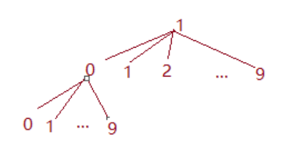
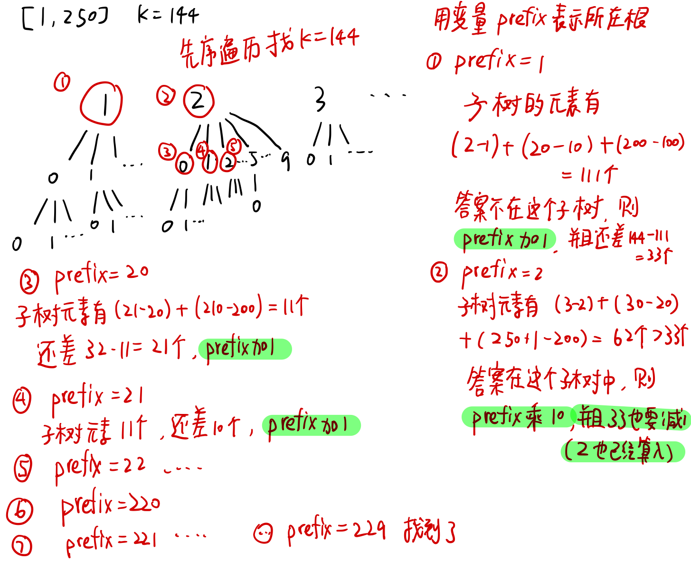
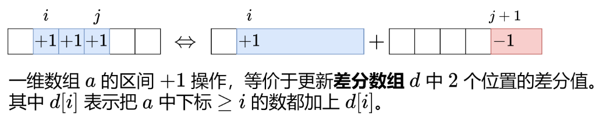
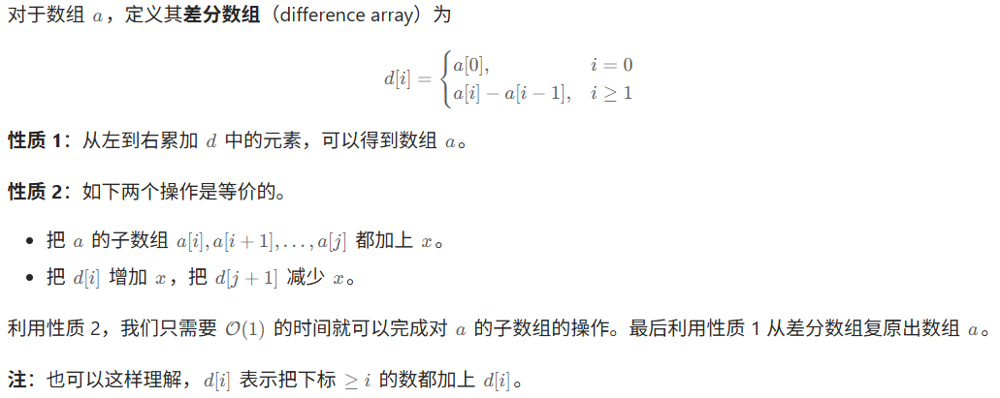

## [2831. 找出最长等值子数组](https://leetcode.cn/problems/find-the-longest-equal-subarray/)

**滑动窗口**

- 把相同元素分组，相同元素的下标记录到哈希表（或者数组）$posLists$ 中。

  例如 $nums = [1,3,2,3,1,3]$，元素 $3$ 在 $nums$ 中的下标有 1,3,5，那么 $posLists[3]=[1,3,5]$。

- 然后用**滑动窗口**计算。设窗口左右端点为 $left$ 和 $right$。

  - 假设 $nums$ 的等值子数组的元素下标从 $pos[left]$ 到 $pos[right]$，那么在删除前，子数组的长度为

    $pos[right]−pos[left]+1$ 

  - 这个子数组有$right−left+1$个数都是相同的，无需删除，其余元素都需要删除，那么需要删除的元素个数就是

    $pos[right]−pos[left]−(right−left)$

  - 如果上式大于 $k$，说明要删除的数太多了，那么移动左指针 $left$，直到上式小于等于 $k$，此时用 $right−left+1$ 更新答案的最大值。

- 还有，这样的数据结构，即每一个数都有他对应的数组，因为数的大小你不可预测，所以可以使用哈希表中放一个数组的结构，这样key是数字，对应的值为一个数组。如此，就不用开一个很大的二维数组了。

- 计算$vec[i] - vec[j] - (i - j)$ 时可以将数组的值简化为 $vec[i] - i$ ，因为仔细看就可以发现这个值从左到右会越来越大，因此这个滑动窗口就相当于在一个递增数组中找一个，值的差值小于等于k的最大子数组。

- 时间复杂度：O(n)，其中 n 为 nums 的长度。
  空间复杂度：O(n)。

```c++
class Solution {
public:
    int longestEqualSubarray(vector<int>& nums, int k) {
        int n = nums.size();
        unordered_map<int, vector<int>> pos;  // 用这样一个哈希表中放数组
        for (int i = 0; i < n; i++) {
            pos[nums[i]].emplace_back(i);  // 相当于push_back
        }
        int ans = 0;
        for (auto &[_, vec] : pos) {
            /* 缩小窗口，直到不同元素数量小于等于 k */
            for (int i = 0, j = 0; i < vec.size(); i++) {  // 这里j为left，i为right
                while (vec[i] - vec[j] - (i - j) > k) {
                    j++;
                }
                ans = max(ans, i - j + 1);
            }
        }
        return ans;
    }
};
```

## [307. 区域和检索 - 数组可修改](https://leetcode.cn/problems/range-sum-query-mutable/)

相见algorithm.md中的树状数组。

```c++
class NumArray {
private: 
    vector<int> tree;
    vector<int> original_nums;
    
    inline int lowbit(int x) {
        return x & (-x);
    }

    int getPrefixSum(int x) {
        int sum = 0;
        while (x > 0) {
            sum += tree[x];
            x -= lowbit(x);
        }
        return sum;
    }

public:
    NumArray(vector<int>& nums): original_nums(nums.size(), 0), tree(nums.size() + 1, 0) {
        for (int i = 0; i < nums.size(); i++) {
            update(i, nums[i]);
        }
    }
    
    void update(int index, int val) {
        int delta = val - original_nums[index];
        original_nums[index] = val;
        index++;
        while (index <= original_nums.size()) {
            tree[index] += delta;
            index += lowbit(index);
        }
        return;
    }
    
    int sumRange(int left, int right) {
        return getPrefixSum(right + 1) - getPrefixSum(left);
    }
};
```

## [2179. 统计数组中好三元组数目](https://leetcode.cn/problems/count-good-triplets-in-an-array/)

难题，思考量很大。

题目本质上是求：nums1 和 nums2 的长度恰好为 3 的**公共子序列**的个数。

如果使用 [1143. 最长公共子序列](https://leetcode.cn/problems/longest-common-subsequence/)则需要n*n的dp数组，时间为O(n^2^)，太大了。

因为0-n每个数只出现过一次，这道题使用**置换的办法将公共子序列变成递增子序列**的问题。

把 nums1=[4,0,1,3,2] 中的每个元素置换，变为nums1=[0,1,2,3,4]。根据这个置换，修改nums2: nums2=[0,2,1,4,3]。由此这是一个递增子序列的问题：即求在nums2中有多少个长度为3的递增子序列。

**长度为3的递增子序列**：

对中间的数nums2[i]枚举：在nums2中它左边且小于它的个数记为less，则右边比他大的个数为n - 1- nums2[i] - (i - less)个，根据乘法原理，两个相乘就是中间的数为num2[i]的递增子序列的个数。

现在只需要求less了：使用**值域树状数组**，值域树状数组的意思是，把元素值视作下标。添加一个值为 3 的数，就是调用树状数组的 update(3,1)，3为下标idx，1为值val。查询小于 3 的元素个数，即小于等于 2 的元素个数，就是调用树状数组的 prefixSum(2)。

```c++
class Solution {
private:
    vector<int> original_nums;
    vector<int> bit;

    inline int lowbit(int x) {
        return x & (-x);
    }

    int prefixSum(int idx) {
        idx++;
        int sum = 0;
        while (idx > 0) {
            sum += bit[idx];
            idx -= lowbit(idx);
        }
        return sum;
    }

    void update(int idx, int val) {
        int delta = val - original_nums[idx];
        original_nums[idx] = val;
        idx++;
        while (idx < bit.size()) {
            bit[idx] += delta;
            idx += lowbit(idx);
        }
        return;
    }

    long long IncreasedSequencesOfThree(vector<int>& nums) {
        long long ans = 0;
        bit.resize(nums.size() + 1, 0);
        original_nums.resize(nums.size(), 0);
        int less;
        for (int i = 0; i < nums.size(); i++) {
            less = prefixSum(nums[i] - 1);
            ans += less * (nums.size() - 1 - nums[i] - (i - less));
            update(nums[i], 1);
        }
        return ans;
    }

public:
    long long goodTriplets(vector<int>& nums1, vector<int>& nums2) {
        int n = nums1.size();
        vector<int> pos(n);
        for (int i = 0; i < n; i++) {
            pos[nums1[i]] = i;
        }
        for (int i = 0; i < n; i++) {
            nums2[i] = pos[nums2[i]];
        }
        return IncreasedSequencesOfThree(nums2);
    }
};
```

## [2537. 统计好子数组的数目](https://leetcode.cn/problems/count-the-number-of-good-subarrays/)

**滑动数组**：也有点难度，要好好想想。

**核心思路**：

- 如果窗口中有 c 个元素 x，再进来一个 x，会新增 c 个相等数对。

- 如果窗口中有 c 个元素 x，再去掉一个 x，会减少 c−1 个相等数对。

外层循环：从小到大枚举子数组右端点 right。现在准备把 x=nums[right] 移入窗口，那么窗口中有 cnt[x] 个数和 x 相同，所以 pairs 会增加 cnt[x]。然后把 cnt[x] 加一。

内层循环：如果发现 pairs≥k，说明子数组符合要求，右移左端点 left，先把 cnt[nums[left]] 减少一，然后把 pairs 减少 cnt[nums[left]]。

内层循环结束后，[left,right] 这个子数组是不满足题目要求的，但在退出循环之前的最后一轮循环，[left−1,right] 是满足题目要求的。由于子数组越长，越能满足题目要求，所以除了 [left−1,right]，还有 [left−2,right],[left−3,right],…,[0,right] 都是满足要求的。也就是说，当右端点固定在 right 时，左端点在 0,1,2,…,left−1 的所有子数组都是满足要求的，这一共有 left 个。

```c++
class Solution {
public:
    long long countGood(vector<int>& nums, int k) {
        long long ans = 0;
        int left = 0;
        unordered_map<int, int> hash;
        int pairs = 0;
        for (int right = 0; right < nums.size(); right++) {
            pairs += hash[nums[right]];
            hash[nums[right]]++;
            while (pairs >= k) {
                hash[nums[left]]--;
                pairs -= hash[nums[left]];
                left++;
            }
            ans += left;
        }
        return ans;
    }
};
```

## [1298. 你能从盒子里获得的最大糖果数](https://leetcode.cn/problems/maximum-candies-you-can-get-from-boxes/)

其实可以算作一个模拟的题目，并不困难，思路类似层序遍历：每次检查size个盒子（和层序遍历一样size要固定住），能开就打开，不能就push到队列后面去。终止条件是用一个flag来判断这次检查size个盒子有没有打开过，一个盒子都没打开说明结束了，另外也有可能所有盒子开完了队列变空了。

## [3403. 从盒子中找出字典序最大的字符串 I](https://leetcode.cn/problems/find-the-lexicographically-largest-string-from-the-box-i/)

暴力枚举即可。注意numFriends为1时的情况。

## [1061. 按字典序排列最小的等效字符串](https://leetcode.cn/problems/lexicographically-smallest-equivalent-string/)

复习了并查集，这道题只需要在union的时候保证并查集的根为字典序最小即可。

## [2434. 使用机器人打印字典序最小的字符串](https://leetcode.cn/problems/using-a-robot-to-print-the-lexicographically-smallest-string/)

这道题首先需要自己手写一遍，模拟出如何出栈入栈：问题相当于从左到右遍历 *s*，在允许用一个辅助栈的前提下，计算能得到的字典序最小的字符串。

首先，要先将字符串的所有最小的字符都放入ans中（这个过程中会入栈若干非最小字符），然后看剩下的字符串中的最小值与栈顶相比较，谁小谁进ans。循环这个过程。

其中，有个操作就是找到字符串的所有最小的字符，这就需要知道最小的字符是谁，和他们在哪里（或者最后一个在哪里也可以，因为遍历的时候遇到最小字符就能直接处理，遍历到最后一个就相当于知道了所有最小字符的位置，并且处理完了他们）。原本我使用了一个函数来单独遍历一遍，找最小字符，但是这样会超时。因此使用一个字符数组存储在这个位置之后的最小字符是谁，即一个**后缀字符数组**（思想有一点类似前缀和，前缀和相减能得到段和，这个后缀字符数组指示了当前有没有处理完所有的最小字符），这样就可以完成前面所说的功能。

（上面说的有点乱，看不懂就直接理解代码）

以 s=caba 为例。对于 s[1]=a，应该立刻出栈。如果不出栈，遍历到 s[3]=a 才出栈，那么结果是 abac，但正确答案是 aabc。在错误答案中，因为没有及时把 a 出栈，我们把更大的 b 插在了两个 a 中间。所以如果栈顶等于剩余字母（后缀 s[i+1:]）中的最小值，也应该立刻出栈。

总结：如果栈顶 ≤ 剩余字母（后缀 s[i+1:]）中的最小值，就立刻出栈。

```c++
class Solution {
public:
    string robotWithString(string s) {
        int n = s.size();	
        // 计算后缀最小值
        vector<char> suf_min(n + 1);
        suf_min[n] = 'z';  // 这样方便找后缀最小值，并且后面要用到suf_min[n]，这样处理了边界
        for (int i = n - 1; i >= 0; i--) {
            suf_min[i] = min(suf_min[i + 1], s[i]);
        }

        string ans;
        stack<char> st;
        for (int i = 0; i < n; i++) {
            st.push(s[i]);
            while (!st.empty() && st.top() <= suf_min[i + 1]) {
                ans += st.top();
                st.pop();
            }
        }
        return ans;
    }
};
```

## [3170. 删除星号以后字典序最小的字符串](https://leetcode.cn/problems/lexicographically-minimum-string-after-removing-stars/)

使用一个哈希表来记录即可。直接使用map可以用m.begin()直接得到哈希表中最小key，map自动按照key升序排列。

```
map<char, stack<int>> m;
```

## [386. 字典序排数](https://leetcode.cn/problems/lexicographical-numbers/)

这实际上是一个深度优先搜索。因此，使用递归：

```c++
class Solution {
public:
    void getAns(int x, int n) {
        x *= 10;
        if (x > n) return;
        for (int i = 0; i <= 9; i++) {
            if (x + i > n) return;
            ans.emplace_back(x + i);
            getAns(x + i, n);
        }
        return;
    }

    vector<int> lexicalOrder(int n) {
        for (int i = 1; i <= 9; i++) {
            if (i > n) return ans;
            ans.emplace_back(i);
            getAns(i, n);
        }
        return ans;
    }

private:
    vector<int> ans;
};
```

题目要求使用O(1)，因此可以直接按照排序的逻辑来完成这个

```c++
class Solution {
public:
    vector<int> lexicalOrder(int n) {
        int x = 1;
        for (int i = 0; i < n; i++) {
            ans.emplace_back(x);
            if (10 * x <= n) {
                x *= 10;
            } else {
                while (x % 10 == 9 || x + 1 > n) {
                    x /= 10;
                }
                x++;
            }
        }
        return ans;
    }

private:
    vector<int> ans;
};
```

## [440. 字典序的第K小数字](https://leetcode.cn/problems/k-th-smallest-in-lexicographical-order/)

上面一道题目的进化版本，数据给得很大。重新思考这道题，实际上，这个字典序是一个完全十叉树。排序就是使用先序遍历。现在题目就变成了完全十叉树找先序遍历的第k个位置，但是由于数据给的很大，不能先序遍历直接遍历找，因此我们需要计算每个叶子下有多少节点，然后一步步找。



下面有一个例子：



（上面写错了，最终prefix应该是228，在prefix=22乘10的时候剩下的值要多减1）根据上面的例子中的过程，我们需要构筑一个计算子树有多少元素的函数。

```c++
int numsOfTree(int n, long long prefix) {  // 注意使用long long，因为这下面有个乘10会超2^10
    int cnt = 0;
    long long next = prefix + 1;
    while (prefix <= n) {
        if (next < n + 1) cnt += next - prefix;
        else cnt += n + 1 - prefix;
        next *= 10;
        prefix *= 10;
    }
    return cnt;
}
```

整体代码：

```c++
class Solution {
public:
    int numsOfTree(int n, long long prefix) {
        int cnt = 0;
        long long next = prefix + 1;
        while (prefix <= n) {
            if (next < n + 1) cnt += next - prefix;
            else cnt += n + 1 - prefix;
            next *= 10;
            prefix *= 10;
        }
        return cnt;
    }

    int findKthNumber(int n, int k) {
        int prefix = 1;  // 作为一个指针，指向当前所在位置，当p == k时，也就是到了排位第k的数
        int cnt = 1;
        while (cnt < k) {
            int num = numsOfTree(n, prefix);
            if (cnt + num <= k) {
                cnt += num;
                prefix++;
            } else if (cnt + num > k) {
                cnt++;
                prefix *= 10;
            }
        }
        return prefix;
    }
};
```

## [165. 比较版本号](https://leetcode.cn/problems/compare-version-numbers/)

这道题使用了getline来分割诸如"1.23.345"这样的字符串

```cpp
class Solution {
    vector<string> split(const string& s, char delim) {
        vector<string> res;
        stringstream ss(s);  // 创建一个字符串流对象，使用s来初始化
        string token;
        while (getline(ss, token, delim)) {
            res.push_back(token);
        }
        return res;
    }

public:
    int compareVersion(string version1, string version2) {
        auto a = split(version1, '.');
        auto b = split(version2, '.');
        int n = a.size(), m = b.size();
        for (int i = 0; i < n || i < m; i++) {
            int ver1 = i < n ? stoi(a[i]) : 0;
            int ver2 = i < m ? stoi(b[i]) : 0;
            if (ver1 != ver2) {
                return ver1 < ver2 ? -1 : 1;
            }
        }
        return 0;
    }
};
```

## [611. 有效三角形的个数](https://leetcode.cn/problems/valid-triangle-number/)

排序+双指针：固定最大的一边，找另外两边，和大于第三边计算并右指针左移，和小于第三边左指针右移.

其中有个值得记录的一点是：

```cpp
if (nums[left] + nums[right] > nums[i]) {
    // 符合：两个小边大于最长边
    // 这里有个隐藏条件，由于排序了
    // 如果 nums[left] + nums[right] > nums[i]
    // 那么 [left, right - 1] 都符合（因为 nums[left] 是最小的边了）
    ans += right - left
    right--
} else {
    left++
}
```

这里不是`ans++`，而是`ans += right - left`，因为如果`nums[left] + nums[right] > nums[i]`即能形成三角形，则`nums[left+1]`一直到`nums[right-1]`都是可以替代`nums[left]`成为最左边一条边的。

## [1039. 多边形三角剖分的最低得分](https://leetcode.cn/problems/minimum-score-triangulation-of-polygon/)

非常好的一道动态规划题。和[516. 最长回文子序列](https://leetcode.cn/problems/longest-palindromic-subsequence/)有点类似。最长回文子序列的`dp[i][j]`每次只需要找到`dp[i+1][j]`和`dp[i][j-1]`进行对比即可，这道题是个平面图形，因此需要让`k`从i到j都来进行对比，如下

代码如下：

```cpp
class Solution {
public:
    int minScoreTriangulation(vector<int>& values) {
        int sz = values.size();
        vector<vector<int>> dp(sz, vector<int>(sz, 0));
        for (int i = sz - 1; i >= 0; i--) {
            for (int j = i + 2; j < sz; j++) {
                dp[i][j] = INT_MAX;
                for (int k = i + 1; k < j; k++) {
                    dp[i][j] = min(dp[i][j], dp[i][k] + dp[k][j] + values[i] * values[j] * values[k]);
                }
            }
        }
        return dp[0][sz - 1];
    }
};
```

## [3147. 从魔法师身上吸取的最大能量](https://leetcode.cn/problems/taking-maximum-energy-from-the-mystic-dungeon/)

动态规划题：

- Let `dp[i]` denote the energy we gain starting from index `i`.
- We can notice, that ` dp[i] = dp[i + k] + energy[i]`.

## 差分 [1094. 拼车](https://leetcode.cn/problems/car-pooling/)

使用差分数组：



考虑数组`a = [1,3,3,5,8]`，对其中的相邻元素两两作差（右边减左边），得到数组`[2,0,2,3]`。然后在开头补上`a[0]`，得到差分数组`d=[1,2,0,2,3]`，这有什么用呢？如果从左到右累加 d 中的元素，我们就「还原」回了 a 数组`[1,3,3,5,8]`。这类似求导与积分。

这又有什么用呢？现在把连续子数组 `a[1],a[2],a[3]`都加上 10，得到 `a’=[1,13,13,15,8]`。再次两两作差，并在开头补上 `a'[0]`，得到差分数组`d′=[1,12,0,2,−7]`。

对比 d 和 d′，可以发现只有`d[1]`和`d[4]`变化了，这意味着**对 a 中连续子数组的操作**，可以转变成对差分数组 d 中**两个数**的操作，**即`O(n)`变成`O(1)`**。



注：二维也可以使用差分数组。

到了这道题，由于你不知道他这个数组会有多大，因此可以使用map这个有序的哈希表来代替这个差分数组。

进行`map[from]+=numPassengers`和`map[to]-=numPassengers`，在差分数组里这意味着从from到to-1都是numPassengers个人。最后还原原来的数组时，使用迭代器遍历map，遍历的话只会遍历每个from和to节点的车上人数，但是从一个节点到下一个节点中间人数不会变化，所以没啥事。

```c++
class Solution {
public:
    bool carPooling(vector<vector<int>>& trips, int capacity) {
        map<int, int> mp;
        for (auto trip: trips) {
            mp[trip[1]] += trip[0];
            mp[trip[2]] -= trip[0];
        }
        int sum = 0;
        for (auto it = mp.begin(); it != mp.end(); it++) {
            sum += it->second;
            if (sum > capacity) return false;
        }
        return true;
    }
};
```

## [3347. 执行操作后元素的最高频率 II](https://leetcode.cn/problems/maximum-frequency-of-an-element-after-performing-operations-ii/)

和[3346. 执行操作后元素的最高频率 I](https://leetcode.cn/problems/maximum-frequency-of-an-element-after-performing-operations-i/)一样，数据范围不一样，这题不可以枚举。

两个方法，1：差分数组，2：滑动窗口

**差分数组**：

根据题意，求一个数组a，a[i]为原数组执行完所有操作后i的最大出现次数。对于nums数组中的每个num，它可以变成[num-k,num+k]中任意一个数，因此，只需要对所有的[num-k,num+k]范围叠加起来，i在k个范围中，则其最大出现次数就是k。

根据上面的解释，我们发现他需要范围内每个下标”++“的操作，因此我们想到了**差分数组**来把`O(n)`变成`O(1)`。

但是这道题有一个numOperations最大操作次数，最大出现次数不等于操作的次数，比如i=4时原数组中已经有了4，那么4就自己不用操作，因此操作的次数要减去cnt[i]，即i在原数组中出现的次数。

有以下代码：

```c++
class Solution {
public:
    int maxFrequency(vector<int>& nums, int k, int numOperations) {
        unordered_map<int, int> cnt;
        map<int, int> diff;
        for (int x : nums) {
            cnt[x]++;
            diff[x]; // 把 x 插入 diff，以保证下面能遍历到 x
            diff[x - k]++; // 把 [x-k, x+k] 中的每个整数的出现次数都加一
            diff[x + k + 1]--;
        }

        int ans = 0, sum_d = 0;
        for (auto& [x, d] : diff) {
            sum_d += d;
            ans = max(ans, cnt[x] + min(sum_d - cnt[x], numOperations));
        }
        return ans;
    }
};
```

这道题使用了map这个有序的哈希表来代替这个差分数组，但是最后由差分数组还原数组（数组a，a[i]为原数组执行完所有操作后i的最大出现次数）时，使用的是迭代器在map中遍历，因此在制作差分数组时要插入diff[num]=0，这样在num的位置能停一下，操作次数能减去cnt[num]，得到真正的操作次数（有不能超过numOperations的限制），而不是单纯的最大出现次数。
