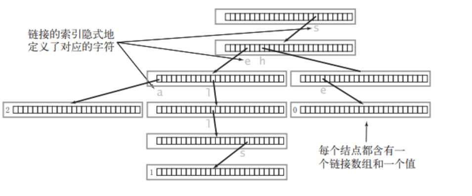
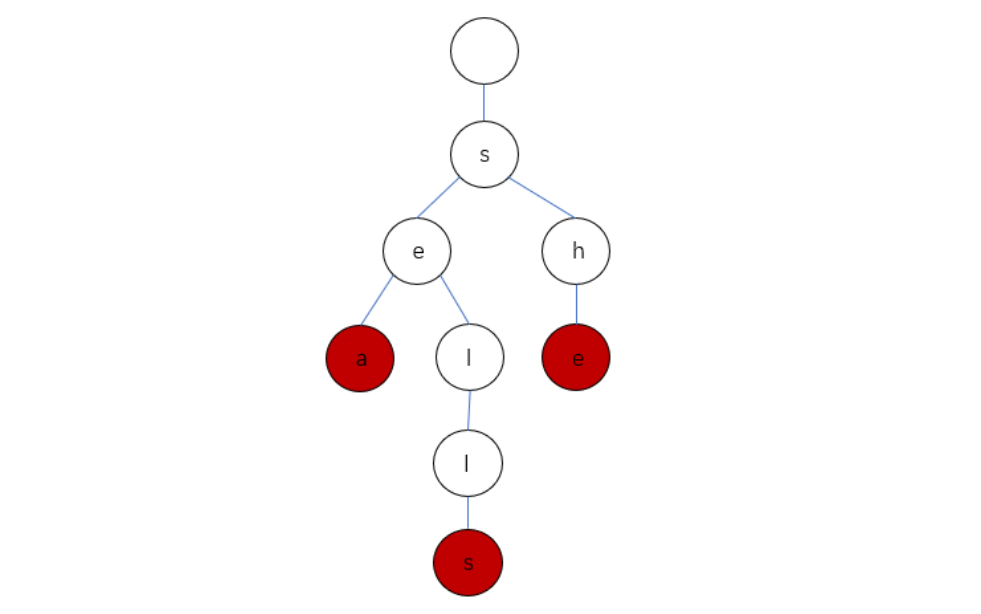

## [2831. 找出最长等值子数组](https://leetcode.cn/problems/find-the-longest-equal-subarray/)

**滑动窗口**

- 把相同元素分组，相同元素的下标记录到哈希表（或者数组）$posLists$ 中。

  例如 $nums = [1,3,2,3,1,3]$，元素 $3$ 在 $nums$ 中的下标有 1,3,5，那么 $posLists[3]=[1,3,5]$。

- 然后用**滑动窗口**计算。设窗口左右端点为 $left$ 和 $right$。

  - 假设 $nums$ 的等值子数组的元素下标从 $pos[left]$ 到 $pos[right]$，那么在删除前，子数组的长度为

    $pos[right]−pos[left]+1$ 

  - 这个子数组有$right−left+1$个数都是相同的，无需删除，其余元素都需要删除，那么需要删除的元素个数就是

    $pos[right]−pos[left]−(right−left)$

  - 如果上式大于 $k$，说明要删除的数太多了，那么移动左指针 $left$，直到上式小于等于 $k$，此时用 $right−left+1$ 更新答案的最大值。

- 还有，这样的数据结构，即每一个数都有他对应的数组，因为数的大小你不可预测，所以可以使用哈希表中放一个数组的结构，这样key是数字，对应的值为一个数组。如此，就不用开一个很大的二维数组了。

- 计算$vec[i] - vec[j] - (i - j)$ 时可以将数组的值简化为 $vec[i] - i$ ，因为仔细看就可以发现这个值从左到右会越来越大，因此这个滑动窗口就相当于在一个递增数组中找一个，值的差值小于等于k的最大子数组。

- 时间复杂度：O(n)，其中 n 为 nums 的长度。
  空间复杂度：O(n)。


```c++
class Solution {
public:
    int longestEqualSubarray(vector<int>& nums, int k) {
        int n = nums.size();
        unordered_map<int, vector<int>> pos;  // 用这样一个哈希表中放数组
        for (int i = 0; i < n; i++) {
            pos[nums[i]].emplace_back(i);  // 相当于push_back
        }
        int ans = 0;
        for (auto &[_, vec] : pos) {
            /* 缩小窗口，直到不同元素数量小于等于 k */
            for (int i = 0, j = 0; i < vec.size(); i++) {  // 这里j为left，i为right
                while (vec[i] - vec[j] - (i - j) > k) {
                    j++;
                }
                ans = max(ans, i - j + 1);
            }
        }
        return ans;
    }
};
```

## [49. 字母异位词分组](https://leetcode.cn/problems/group-anagrams/)

用unordered_map作为哈希表。

```c++
unordered_map<string, vector<string>> mp;
```

用sort可以直接排序string

```c++
sort(key.begin(), key.end());
```

```c++
class Solution {
public:
    vector<vector<string>> groupAnagrams(vector<string>& strs) {
        unordered_map<string, vector<string>> mp;
        for (string& str: strs) {
            string key = str;
            sort(key.begin(), key.end());
            mp[key].emplace_back(str);
        }
        vector<vector<string>> ans;
        for (auto it = mp.begin(); it != mp.end(); ++it) {
            ans.emplace_back(it->second);
        }
        return ans;
    }
};
```

## [128. 最长连续序列](https://leetcode.cn/problems/longest-consecutive-sequence/)

实现时间复杂度为 `O(n)` 的算法解决此问题，不能用set（本质是红黑树，查询增删都需要logn，每个数放入set中总共就是nlogn），使用unordered_set（哈希表，o(1)）。

这道题的思路是：将所有数放到unordered_set哈希表中，然后遍历。如果num前面的数字不在哈希表里了，说明num可能是数字连续的最长序列的首个数字，那就循环去找num+1,num+2...，如果num前面的数字在哈希表里，就跳过。

记得直接用max取较大值

```c++
max_len = max{len, max_len};
```

```c++
class Solution {
public:
    int longestConsecutive(vector<int>& nums) {
        unordered_set<int> num_set;
        int max_len = 0;
        for (auto num: nums) {
            num_set.insert(num);
        }
        for (auto num: num_set) {
            if (num_set.find(num - 1) == num_set.end()) {
                int tmp_num = num;
                int len = 1;
                while (num_set.find(tmp_num + 1) != num_set.end()) {
                    tmp_num++;
                    len++;
                }
                max_len = max(max_len, len);
            }

        }
        return max_len;
    }
};
```

## [240. 搜索二维矩阵 II](https://leetcode.cn/problems/search-a-2d-matrix-ii/)

看到二维矩阵并且有二分标签，原本想像平面四叉树平面直接分成四块来二分，但是写的递归很麻烦，似乎还会sof

看了题解，两个办法：

1. 只在行/列使用二分
2. 根据行和列都是升序的，从某个角出发，根据升序的规则，每次减少一行或者一列，直到找到或超出边界

这里使用方法2：

```c++
class Solution {
    public:
        bool searchMatrix(vector<vector<int>>& matrix, int target) {
            int m = matrix.size(), n = matrix[0].size();
            int x = 0, y = n - 1;
            while (x < m && y >= 0) {
                if (matrix[x][y] == target) return true;
                else if (matrix[x][y] > target) y--;
                else if (matrix[x][y] < target) x++;
            }
            return false;
        }
};
```

## [283. 移动零](https://leetcode.cn/problems/move-zeroes/)

先遍历一遍：记录每个非0数之前有几个0。再遍历一遍：将每个非0数向前移动记录的数，然后将这个非0数的位置变为0，这里有个细节就是如果前面没有0，他是不移动的，要在变为0前判断一下。

## [22. 括号生成](https://leetcode.cn/problems/generate-parentheses/)

这括号生成一看就是要回溯的：

```c++
void backtracking(参数) {
    if (终止条件) {
        存放结果;
        return;
    }

    for (选择：本层集合中元素（树中节点孩子的数量就是集合的大小）) {
        处理节点;
        backtracking(路径，选择列表); // 递归
        回溯，撤销处理结果
    }
}
```

刚开始的做法是把这个for变成三种类型：str前面生成一个括号，str后面生成一个括号，str外套一个括号。但是这样的话像"(())(())"这样就生成不出来。看答案。

**暴力**的话就是生成n个(和n个)组成的字符串，然后判断是否合法。

**回溯：**

如果左括号数量不大于*n*，我们可以放一个左括号。如果右括号数量小于左括号的数量，我们可以放一个右括号。

这样刚开始有疑虑会不会生成不合法的")()("这样的，但是其实他每次都是push_back从后面加，然后只有当右括号数量小于左括号才会加右括号，所以不会不合法

```c++
class Solution {
    void backtrack(vector<string>& ans, string& cur, int open, int close, int n) {
        if (cur.size() == n * 2) {
            ans.push_back(cur);
            return;
        }
        if (open < n) {
            cur.push_back('(');
            backtrack(ans, cur, open + 1, close, n);
            cur.pop_back();
        }
        if (close < open) {
            cur.push_back(')');
            backtrack(ans, cur, open, close + 1, n);
            cur.pop_back();
        }
    }
public:
    vector<string> generateParenthesis(int n) {
        vector<string> result;
        string current;
        backtrack(result, current, 0, 0, n);
        return result;
    }
};
```

**动规：**

这是根据一个观察到的性质来的：任何一个括号序列都一定是由‘(’开头，并且第一个‘(’一定有一个唯一与之对应的‘)’。这样一来，每一个括号序列可以用(a)b来表示，其中a与b分别是一个合法的括号序列（可以为空）。

因此，n的所有答案为：( f(x) ) f(n - x - 1)，f(x)代表有x个括号的所有括号序列，这样组合一下就可以了

```c++
class Solution {
    shared_ptr<vector<string>> cache[100] = {nullptr};
public:
    shared_ptr<vector<string>> generate(int n) {
        if (cache[n] != nullptr)
            return cache[n];
        if (n == 0) {
            cache[0] = shared_ptr<vector<string>>(new vector<string>{""});
        } else {
            auto result = shared_ptr<vector<string>>(new vector<string>);
            for (int i = 0; i != n; ++i) {
                auto lefts = generate(i);
                auto rights = generate(n - i - 1);
                for (const string& left : *lefts)
                    for (const string& right : *rights)
                        result -> push_back("(" + left + ")" + right);
            }
            cache[n] = result;
        }
        return cache[n];
    }
    vector<string> generateParenthesis(int n) {
        return *generate(n);
    }
};
```

这里为了优化，使用shared_ptr为共享内存，减少不必要的数组的复制。可以看到都是直接用地址，而不是用参数，如`for (const string& left : *lefts)`

## [208. 实现 Trie (前缀树)](https://leetcode.cn/problems/implement-trie-prefix-tree/)

Trie的节点：

```c++
struct TrieNode {
    bool isEnd; //该结点是否是一个串的结束
    TrieNode* next[26]; //字母映射表
};
```

`TrieNode* next[26]`中保存了对当前结点而言下一个可能出现的所有字符的链接，因此我们可以通过一个父结点来预知它所有子结点的值：

```c++
for (int i = 0; i < 26; i++) {
    char ch = 'a' + i;
    if (parentNode->next[i] == NULL) {
        说明父结点的后一个字母不可为 ch
    } else {
        说明父结点的后一个字母可以是 ch
    }
}
```

包含三个单词 "sea","sells","she" 的 Trie 会长啥样呢？它的真实情况是这样的：



Trie 中一般都含有大量的空链接，因此在绘制一棵单词查找树时一般会忽略空链接，同时为了方便理解我们可以画成这样：



定义类：

```c++
class Trie {
private:
    bool isEnd;
    Trie* next[26];
public:
    //方法将在下文实现...
};
```

其他的所有操作：

```c++
class Trie {
public:
    Trie() {  // 构造函数
        isEnd = false;
        memset(next, 0, sizeof(next));
    }
    
    void insert(string word) {  // 插入一个单词
        Trie* node = this;
        for (char c: word) {
            if (node->next[c - 'a'] == NULL) {
                node->next[c - 'a'] = new Trie();
            }
            node = node->next[c - 'a'];
        }
        node->isEnd = true;
    }
    
    bool search(string word) {  // 查找一个单词在不在
        Trie* node = this;
        for (char c: word) {
            if (node->next[c - 'a'] == NULL) {
                return false;
            }
            node = node->next[c - 'a'];
        }
        if (node->isEnd == false) return false;
        return true;
    }
    
    bool startsWith(string prefix) {  // 查找是否有单词存在该前缀
        Trie* node = this;
        for (char c: prefix) {
            if (node->next[c - 'a'] == NULL) {
                return false;
            }
            node = node->next[c - 'a'];
        }
        return true;
    }

private:
    bool isEnd;
    Trie* next[26];
};
```

## [394. 字符串解码](https://leetcode.cn/problems/decode-string/)

显然用栈做，但是仔细写起来不好写。要满足下面这几个输出：

```
"3[a]2[bc]"
"3[a2[c]]"
"qwe2[abc]3[cd]ef"
```

如果写不出，就看看答案怎么写的。
