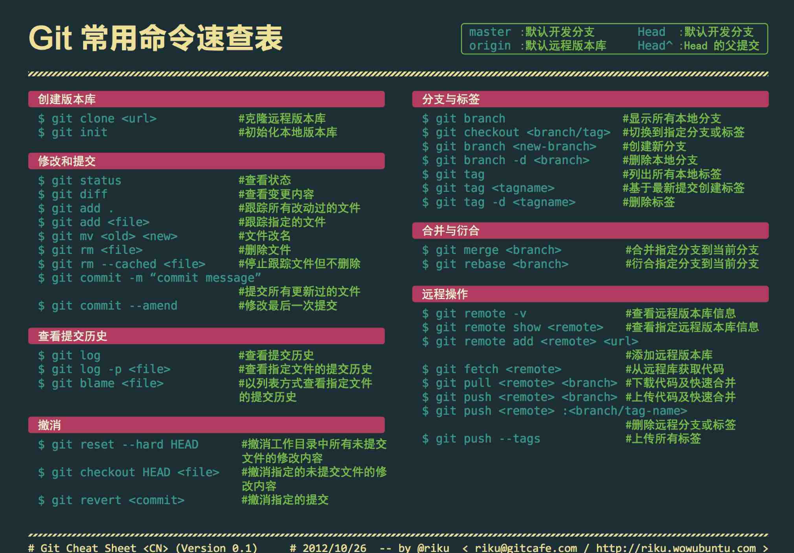
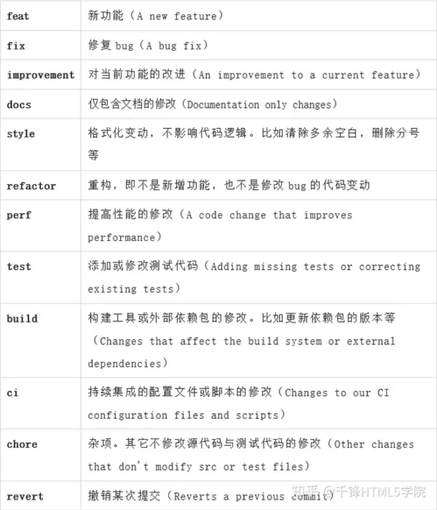

# git



## 简单的代码提交流程

1. git status 查看工作区代码相对于暂存区的差别
2. git add . 将当前目录下修改的所有代码从工作区添加到暂存区 . 代表当前目录
3. git commit -m ‘注释’ 将缓存区内容添加到本地仓库
4. git pull origin master先将远程仓库master中的信息同步到本地仓库master中
5. git push origin master 将本地版本库推送到远程服务器，
    origin是远程主机，master表示是远程服务器上的master分支和本地分支重名的简写，分支名是可以修改的

## Git add

git add [参数] <路径>　作用就是将我们需要提交的代码从工作区添加到暂存区，就是告诉git系统，我们要提交哪些文件，之后就可以使用git commit命令进行提交了。
 为了方便下面都用 . 来标识路径， . 表示当前目录，路径可以修改，下列操作的作用范围都在版本库之内。

1. git add .
    不加参数默认为将修改操作的文件和未跟踪新添加的文件添加到git系统的暂存区，注意不包括删除
2. git add -u .
    -u 表示将已跟踪文件中的修改和删除的文件添加到暂存区，不包括新增加的文件，注意这些被删除的文件被加入到暂存区再被提交并推送到服务器的版本库之后这个文件就会从git系统中消失了。
3. git add -A .
    -A 表示将所有的已跟踪的文件的修改与删除和新增的未跟踪的文件都添加到暂存区。

## Git commit

git commit 主要是将暂存区里的改动给提交到本地的版本库。每次使用git commit 命令我们都会在本地版本库生成一个40位的哈希值，这个哈希值也叫commit-id，
 commit-id 在版本回退的时候是非常有用的，它相当于一个快照,可以在未来的任何时候通过与git reset的组合命令回到这里.

1. git commit -m ‘message’
    -m 参数表示可以直接输入后面的“message”，如果不加 -m参数，那么是不能直接输入message的，而是会调用一个编辑器一般是vim来让你输入这个message，
    message即是我们用来简要说明这次提交的语句。
2. git commit -am ‘message’ -am等同于-a -m
    -a参数可以将所有已跟踪文件中的执行修改或删除操作的文件都提交到本地仓库，即使它们没有经过git add添加到暂存区，
    *注意:* 新加的文件（即没有被git系统管理的文件）是不能被提交到本地仓库的。

## Git push

在使用git commit命令将修改从暂存区提交到本地版本库后，只剩下最后一步将本地版本库的分支推送到远程服务器上对应的分支了，如果不清楚版本库的构成，可以查看我的另一篇，git 仓库的基本结构。
 git push的一般形式为 git push <远程主机名>   <本地分支名> <远程分支名> ，例如 git push origin master：refs/for/master ，即是将本地的master分支推送到远程主机origin上的对应master分支， origin 是远程主机名。第一个master是本地分支名，第二个master是远程分支名。

1. git push origin master
    如果远程分支被省略，如上则表示将本地分支推送到与之存在追踪关系的远程分支（通常两者同名），如果该远程分支不存在，则会被新建
2. git push origin ：refs/for/master
    如果省略本地分支名，则表示删除指定的远程分支，因为这等同于推送一个空的本地分支到远程分支，等同于 git push origin –delete master
3. git push origin
    如果当前分支与远程分支存在追踪关系，则本地分支和远程分支都可以省略，将当前分支推送到origin主机的对应分支
4. git push
    如果当前分支只有一个远程分支，那么主机名都可以省略，形如 git push，可以使用git branch -r ，查看远程的分支名

关于 refs/for：
 refs/for 的意义在于我们提交代码到服务器之后是需要经过code review 之后才能进行merge的，而refs/heads 不需要


链接：https://www.jianshu.com/p/2e1d551b8261

## Git pull报错分析

- 在进行代码开发时，忘了先git pull到本地之后，直接在台式机上的代码进行编写，突然想起忘了pull了，然后想用git pull来更新本地代码。结果报错：

```
error: Your local changes to the following files would be overwritten by merge: xxx/xxx/xxx.xx Please, commit your changes or stash them before you can merge. Aborting
```

- 出现这个问题的原因是其他人修改了项目中的代码文件xxx并提交到远程版本库中去了，而你本地也修改了改代码文件xxx，这时候你进行git pull操作就好出现冲突了，上面报错的意思是我台式机上新修改的代码的文件，将会被git服务器上的代码覆盖，我们当然不想刚刚写的代码被覆盖掉，那么我们应该如何解决呢。

- 在报错中我们看到官方推荐的解决方案是使用直接commit或者使用stash。那么我们来看看这两种操作方式的区别和使用：

### 方案一：使用stash

- 保留本地的方式修改（强烈推荐，还有一种是直接拉取服务器的（不推荐使用就不写了），这样你本地修改的代码的，就会舍弃，相当于你写的代码直接没，你还的重新写）。
- 主要方式如下：
  - 通过git stash将工作区恢复到上次提交的内容，同时备份并暂时隐藏本地所做的修改，之后就可以正常git pull了，git pull完成后，执行git stash pop将之前本地做的修改隐藏的应用拉取到当前工作区。
- stash翻译为“隐藏”，如下操作：

```shell
git stash
git pull
git stash pop
```

### 方案二：硬覆盖（谨慎使用，使用前先备份当前代码!!!）：

- 放弃本地修改，只保留服务器端代码，则直接回退到上一个版本，再进行pull：

```shell
git reset --hard
git pull origin master
```

- 注：其中origin master表示git的主分支。

https://blog.csdn.net/qq_41018861/article/details/118442711

## git commit规范

Commit Message 标准格式包括三个部分：Header，Body，Footer

```text
<type>(<scope>): <subject>
// 空一行
<body>
// 空一行
<footer>
```

其中，Header 是必需的，Body 和 Footer 可以省略

**一、Header**

Header 部分只有一行，包括三个字段：type（必需）、scope（可选）、subject（必需）

**1. type**

用于说明类型。可分以下几种类型



**2. scope**

用于说明影响的范围，比如数据层、控制层、视图层等等。

**3. subject**

主题，简短描述。一行

**二、Body**

对 subject 的补充。可以多行。

**三、Footer**

主要是一些关联 issue 的操作。

## git修改历史提交(commit)信息

修改最近一次commit

1. 先通过`git log`查看commit信息
2. 然后`git commit --amend`
3. `git push --force`到远程仓库，注意：必须加上`--force`。

修改最近两次及以上的commit

1. 使用命令：`git rebase -i HEAD~2`，这里2为git log后显示的从新到旧的commit中的第2个
2. 使用`git commit --amend`去修改具体的commit信息
3. 用`git rebase --continue`完成
4. `git push --force`到远程仓库

https://blog.csdn.net/FloraCHY/article/details/128968914
