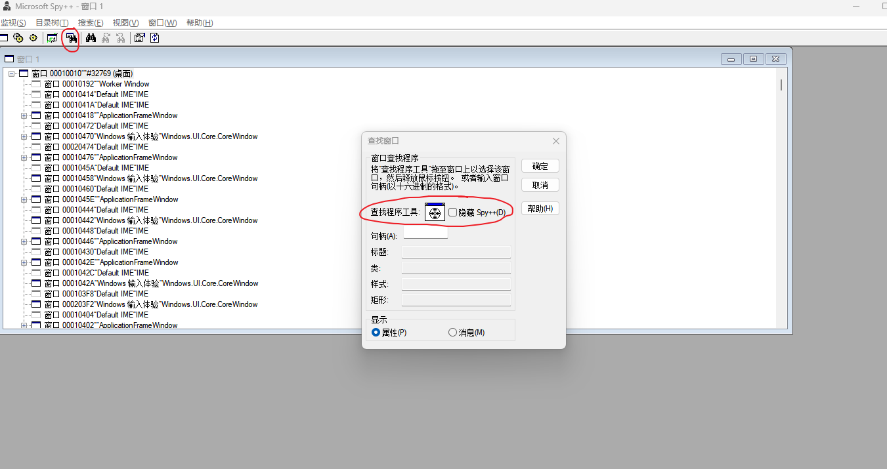
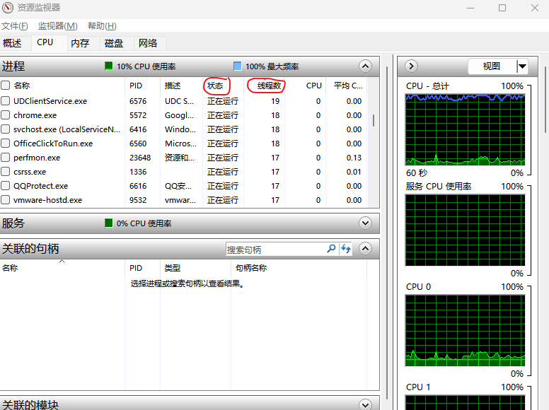

# Windows线程等信息查看

起因是更新了qq之后，打开qq之后弹出了一个弹窗


然后就像往常一样去任务管理器去找这个窗口的进程，然而并没有找到，因此上网搜索了一下

## spy++(spyxx.exe)

https://learn.microsoft.com/zh-cn/visualstudio/debugger/introducing-spy-increment?view=vs-2022

这是一个visual studio内置的程序，基于 Win32 ，用于提供系统进程、线程、窗口和窗口消息的图形视图。

**使用先决条件：**

从 Visual Studio 安装程序中选择这些组件。

- 在“调试和测试”下，选择“C++ 分析工具”
- 在“开发活动”下，选择“C++ 核心功能”

**使用：**

通常路径为...\VisualStudio\2022\Community\Common7\Tools\中，如果是64位系统使用spyxx_amd64.exe

启动后如图，使用查找窗口功能



然后拖动这个指针到窗口，确认，则能显示这个窗口的详细信息，其中最后一栏进程则显示其进程和线程的pid


将这个进程pid在任务管理器中搜索，能发现这个弹窗是qq.exe这个进程的一个线程，点击qq进程就能看到下面这个线程程序，尽管其没有显示pid

## win其他一些进程线程信息的查看

**使用命令提示符：**

```shell
tasklist // 查看进程

taskkill // 杀死进程

wmic process get threadcount // 列出当前系统上每个进程的线程数量
```

**资源监视器：**

这个只能查看进程的线程数以及其状态，在任务管理器的性能栏中，找到资源监视器打开



**第三方程序：Process Explorer**

这个我还没尝试

https://www.shiwaiyun.com/article/post/127595.html
