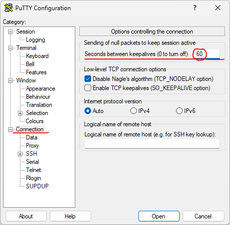

# session连接保持

**问题：**使用putty长时间登录远程主机没有操作后，服务器会断开连接

**解决：**在connection中修改Seconds between keepalives的值，这个值为多少秒客户端向服务器发送空数据包来保持会话连接

# 正确断开session

直接无视警告关闭窗口，实际上你的登录还在服务器上，占用了服务器的资源

**正确的注销登录：**

- 输入exit，再手动关闭窗口
- Ctrl+d来注销，会自动关闭窗口