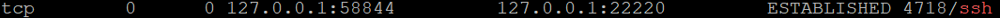
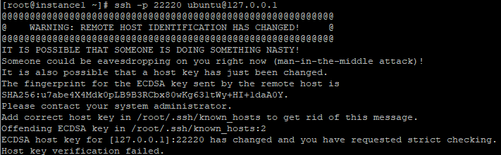
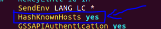

# 记录一次内网穿透

由于做计算机网络安全实验需要用到学校的虚拟机，然而学校的虚拟机需要在使用校园网的平台上申请并连接，同时，它还常常断连接，于是找到了一片内网穿透试验了一下。

**需要：**

1. 一台在内网才能访问的主机hostA
2. 一台具有公网IP的远程服务器hostB

**具体实现：**

1. 在hostA安装ssh

   ```shell
   sudo apt install ssh
   ```

2. 开启hostB的ssh路由功能，在/etc/ssh/sshd_config中修改

   ```c++
   GatewayPorts yes
   AllowAgentForwarding yes
   AllowTcpForwarding yes
   ```

   注意需要重启sshd服务systemctl sshd restart

3. 在hostA中输入命令

   ```shell
   sudo ssh -fCNR 22220:127.0.0.1:22 -o ServerAliveInterval=60 root@exampleIP -p 23230 "vmstat 30"
   ```

   -f 表示后台运行

   -C 请求压缩所有数据

   -N 告诉ssh客户端，这个连接不需要执行任何命令，仅仅做端口转发

   -R 反向代理

   远程服务器开放的端口:127.0.0.1:内网服务器SSH端口

   -o ServerAliveInterval=60 服务器端向客户端请求消息的时间间隔为60s，这样能保持长时间连接

   root@远程服务器IP

   -p 远程服务器SSH端口

   "vmstat 30" 是为了防止远程服务器把长时间没有通讯的链接断开

4. 如果连接成功会让让你输入hostB的密码，输入后则连接完成

5. 回到hostB，使用

   ```shell
   sudo netstat -nap | grep ssh
   ```

   如果出现了hostB的开放端口（上面为22220）已经建立连接，则成功

   

   这里hostA不是使用命令输入的22端口可能是因为在学校的hostA是虚拟机

   最后，连接hostA

   ```shell
   ssh -p 22220 ubuntu@127.0.0.1
   ```

   输入hostA的密码即可

**ps:**

使用netstat查看服务器空闲的端口，以下是常用的参数

```
-a (all)显示所有选项，默认不显示LISTEN相关
-t (tcp)仅显示tcp相关选项
-u (udp)仅显示udp相关选项
-n 拒绝显示别名，能显示数字的全部转化成数字。
-l 仅列出有在 Listen (监听) 的服务状态
-p 显示建立相关链接的程序名
-r 显示路由信息，路由表
-e 显示扩展信息，例如uid等
-s 按各个协议进行统计
-c 每隔一个固定时间，执行该netstat命令。
```

如果是购买的云服务器，记得安全组策略开放一个端口用来代理。

https://www.cnblogs.com/xiaoxiaoxiaoxiaolin/p/14443312.html

https://zhuanlan.zhihu.com/p/73957254

https://blog.csdn.net/elysium_/article/details/135897091


# 问题

**出现问题：WARNING: REMOTE HOST IDENTIFICATION HAS CHANGED!**



**原因：**

当两个设备第一次进行链接时，会在`~/.ssh/konwn_hosts`中将被连接设备的公钥信息进行保存，后续再次链接时OpenSSH会核对公钥来进行一个简单的验证。

然而被连接的设备系统hostA被重装、IP 冲突等原因，我这里在学校的服务器，会多次释放和申请虚拟机，因此产生不同的公钥哈希值，与上一次连接对不上

**解决方法：**

- 直接打开`~/.ssh/konwn_hosts`，删除过去的公钥信息。

  - 如果这个文件是密文存储的，可以编辑路径`/etc/ssh/ssh_config`中的字段`HashKnownHosts`改为no，保存退出，删除公钥信息重新连接，新保存的公钥就是明文。

    

- 另一种办法

  - 输入`ssh-keygen -R XXX（ip地址）`，这里ip地址是hostA的地址，然后会能不管公钥来重新连接

  - 这个指令的意思就是删除`XXX（ip地址）`的公钥信息，重新建立一个连接，同时他也会备份`~/.ssh/konwn_hosts`文件

    

https://blog.csdn.net/qq_41884002/article/details/123358315