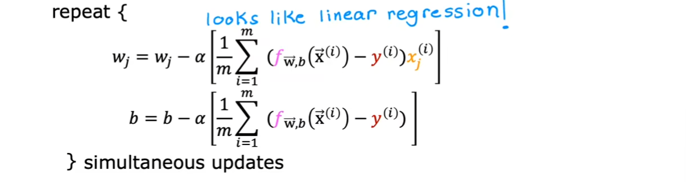
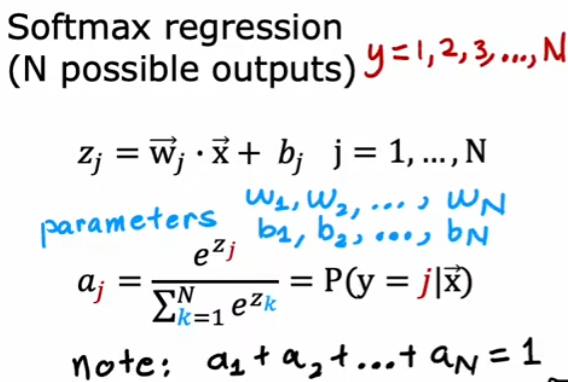
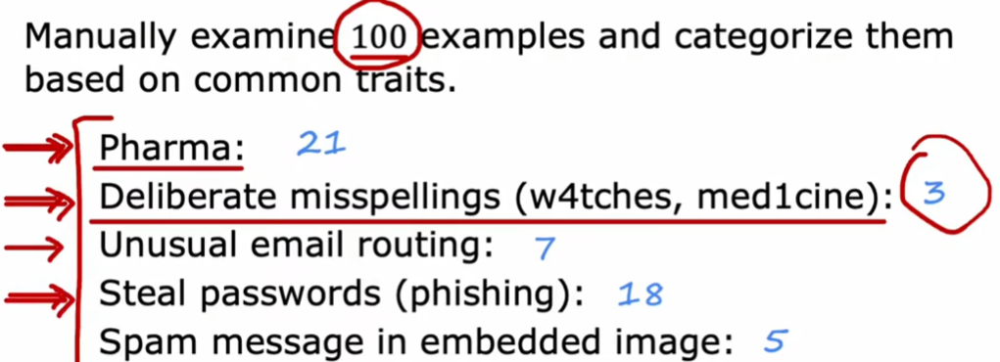
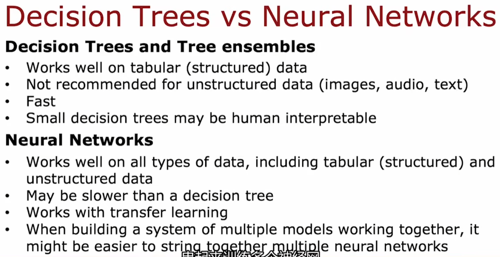

2022吴恩达机器学习Deeplearning.ai课程：https://www.coursera.org/learn/machine-learning

b站：https://www.bilibili.com/video/BV1Pa411X76s

# 监督学习：回归与分类

## 定义

- 对于棋类游戏，如果给程序过少的数据（10盘游戏），他会表现得更差
- 分为监督学习与无监督学习

## 分类

### 监督学习（Spervised Learning）

- x到y的映射输出的算法

  

- 回归算法（Regression）

  应用：房价预测

  拟合：多数据点拟合曲线

  输出：可能的数据（数字），输出有无限可能

  

- 分类算法（Classification）

  应用：乳腺癌肿瘤探测

  拟合：一条边界线，边界线一边的某一输出类别可能性更大

  输出：一个类别（Class/Category），类别有限，可以不是数字，比如一张图可能是猫还是狗

  

  

### 无监督学习（Unsupervised Learning）

- 任由程序在数据中找到一些特殊的结构或模式

- 聚类算法（Clustering）

  - 应用：Google新闻（提取相似词语的文章进行分类），DNA微阵列，客户分类将没有标签的数据自动分组到集群中

  

- 异常检测算法（Anomaly Detection）

  - 应用：诈骗检测

- 降维算法（Dimensionality Reduction）

  - 在少丢失信息的情况下压缩大数据集到一个小数据集


## 线性回归（linear regression）

- 监督学习中的一个算法
- 用一条直线拟合
- 术语：
  - 训练集（training set）：用来训练的数据
  - 特征/输入特征（feature）：输入，常记为x
  - 目标变量（target）：输出，常记为y
  - y-hat：输出的预测值
  - 误差：y-hat - y = f(x) - y

- 

## 代价函数（cost function） 

- 越小越好，拟合程度越高，能够很好的**泛化（generalization）**，即能够非常好的预测；越大，说明训练数据的**拟合不足（underfitting）**或者说算法具有**高偏差（high bias ）**

- 平方误差代价函数：

  - 平方误差代价函数最通常用于**线性回归**
  - 分母中的2使后面的计算简洁，在算偏导数时与平方的2相消
  - 线性回归的平方误差代价函数：3D视图


  - 线性回归的平方误差代价函数：等高线视图


## 梯度下降（gradient descent）

- 每次对代价函数中的每个参数进行移动，使在相同的学习率的移动下，代价函数更小。最后到达一个局部最小值（local minima）。

- 

- 

- 注意：每个参数都要同时进行移动

- $\alpha$ 为学习率（learning rate），需要选取合适的值：

  - 如果太小，会导致过多步到达局部最小
  - 如果太大，会导致一步迈太大越过了局部最小

-   对于平方误差代价函数，计算偏导数后：

  

- 对于线性回归的平方误差代价函数，只会有一个全局最小值（global minimum），因为代价函数是一个凸函数（convex function），图片见前

- 批量梯度下降（Batch gradient descent）
  - 使用整个数据集，而不是其子集
  - 

### 如何判断梯度下降是否有效

- 绘制学习曲线（learning curve），或者给一个小值$\epsilon$来作为判断学习曲线是否收敛的标准
- 

### 选取合适的学习率

- 学习曲线**上下波动**或者学习曲线**递增**往往是学习率过大（也有可能是程序有bug）
  - 从小到大增加倍数来测试学习率，选择比合理的学习率略小的值
  - 0.001 -> 0.003 -> 0.01 -> 0.03 -> 0.1 -> 0.3

## 特征

### 多维特征，向量化

```python
import numpy as np

w = np.array([1.0, 2.5, -3.3])
b = 4
x = np.array([10, 20, 30])

// f = w1 * x1 + w2 * x2 + w3 * x3 + b
f = np.dot(w, x) + b
```

- numpy使用计算机硬件来高效完成矩阵相乘，因此向量化使机器学习高效
- 

### 正规方程（normal equation）

- 只用于线性回归
- 不用迭代来找到最佳的w1,w2....,b
- 不能用于其他机器学习算法
- 当特征特别大（>10000）时非常慢
- 有些机器学习库会在后端使用它来找到w和b

### 特征放缩（scale the features）

- 线性回归中的特征范围与参数往往成反比，即特征范围越小，其参数越大
- 放缩特征，选择合适的坐标轴和数值，会让代价函数图更合理，这样使用梯度下降时能更高效地到达最低代价函数
- 

#### 最大值放缩

- 每个特征值除以其最大值，得到范围小于等于1，来得到一个代价函数图

  

#### 均值标准化（mean normalization）

- **均值标准化（mean normalization）**：重新放缩特征值，让他们环绕在零点处，这样的特征值可以有负数，通常范围在[-1, 1]

  - $\mu$为特征$x$的平均值
  -  $x = \frac {x - \mu}{x_{max} - x_{min}}$

  

#### 标准分数标准化（Z-score normalization）

- **标准分数标准化（Z-score normalization）**：计算每个特征的标准差
  - $\mu$为特征$x$的平均值，$\sigma$为标准差
  -  $x = \frac {x - \mu}{\sigma}$
  -  新$x$即为标准分数（z-score）。当一组数据为正态分布或近似正态分布时，相当于平均数的点的标准分数为0，在平均数以上各点的标准分数为正值，在平均数以下的各点的标准分数为负值。

#### 如果不进行特征放缩

- 若$w_0 >> w_{1-3}$，则
- 
- 

### 特征工程

- 使用原始的特征通过运算来设计新特征，使算法更容易做出准确的预测
- 例如
  - $f_{\vec{w},b}(\vec{x}) = w_1x_1 + w_2x_2 + b$
  - 制作一个新特征： $x_3 = x_1 * x_2$
  - 新的预测公式：$f_{\vec{w},b}(\vec{x}) = w_1x_1 + w_2x_2 + w_3x_3 + b$

### 多项式回归（Polynomial Regression）

- 对于下图进行拟合曲线（房价预测）
- 
- 相比线性，使用幂次来进行拟合能得到更合理的曲线
  - 平方
    - $f_{\vec{w},b}(\vec{x}) = w_1x + w_2x^2 + b$
    - 但是最后$f$会下降，不是很符合
  - 三次方
    - $f_{\vec{w},b}(\vec{x})  = w_1x + w_2x^2 + w_3x^3 + b$
    - 符合曲线
    - 这里$x^3$的范围会增大很多，因此需要特征放缩
  - 根号
    - $f_{\vec{w},b}(\vec{x})  = w_1x + w_2\sqrt{x} + b$
    - 符合曲线
- 对于一次多项式回归的递归下降算法：
  - 先放缩特征使特征的大小合理 
  - 权重$w$更大，说明该特征更适合用于拟合该曲线
  - 
  - 对上式来说， $x^2$ 特征远比 $x$ 或 $x^3$ 更适合拟合的曲线

## 逻辑回归（logistic regression）

- 与回归算法无关，属于分类算法，特别是二元分类（binary classification），需要给出类别0和1

- 

- $g(x) = \frac{1}{1+e^{-z}}$

  - 叫**逻辑函数**或者**sigmoid函数**

  - 对于这个式子，输出为一个在0到1之间的值

  - 图像

    

- $f_{\vec{w},b}(\vec{x}) = g(\vec{w} * \vec{x} + b) = \frac{1}{1+e^{-(\vec{w} \cdot \vec{x} + b)}}$

  -  输入 $\vec{x},\vec{w},b$，输出类别是1的概率
  - $f_{\vec{w},b}(\vec{x}) =P(y=1|\vec{x};\vec{w},b)$
  - 输出大于等于0.5，预测类别为1；小于0.5，预测类别为0
    - $f_{\vec{w},b}(\vec{x}) >= 0$
    - $g(z) >= 0$
    - $z>=0$ 即 $\vec{w} \cdot \vec{x} + b >=0$
  - **决策边界（decision boundary）**
    - 即 $z = \vec{w} \cdot \vec{x} + b =0$
    - 一个线性的边界
    - 一个非线性的边界

### 逻辑回归的代价函数

- 如果使用平方误差代价函数，则其代价函数图像不是一个凸函数，这样无法使用梯度下降收敛代价

  

- 因此，逻辑回归中单个数据的损失函数（loss function）为

  

  - $f$ 为逻辑回归的预测值，属于 $[0,1]$，$y^{(i)}$ 为真实值
  - 这是一个 $log$ 函数，如果预测值越靠近真实值， $loss$ 越小；预 测值越偏离真实值，$loss$ 趋向于正无穷
  - 简化上方损失函数：
  
  
  
- 故得到逻辑回归的代价函数：

  

  - 该代价函数是凸函数，可以使用梯度下降到达最小值
  - 这个代价函数源于最大似然估计（maximum likelihood）的统计学原理

### 逻辑回归的梯度下降

- 

  

  - 看起来和线性回归的梯度下降算法一样，但是其中的算法 $f_{\vec{w},b}(\vec{x}^{(i)})$ 是逻辑回归的算法，即 $f_{\vec{w},b}(\vec{x}) = \frac{1}{1+e^{-(\vec{w} \cdot \vec{x} + b)}}$

## 过拟合（overfitting）

- 回归算法的过拟合：同样是房价预测问题

  

  - 使用一次方会导致拟合不足，算法具有高偏差
  - 使用二次方能够很好的泛化，恰到好处
  - 使用四次方，看起来每个数据都准确符合算法，但是这是一个明显不合理的曲线，这就导致了**过拟合（overfitting）**，则这个算法具有**高偏差（high variance）**
  - 使用更多的特征，会存在更高的过拟合的风险

- 分类算法的过拟合

  

### 解决过拟合问题

1. 收集更多数据用于训练
2. 特征选择（feature selection）：使用更少的多项式特征；选择最小的特征子集，选择可能的对预测影响大的特征，抛弃掉影响小的特征
3. 正则化

### 正则化（regularization）

- 举例：

  - 对于右边过拟合的算法，$w_3$ 和 $w_4$ 作为三次方和四次方的参数，极大的导致曲线不符合我们期望的形状
  - 但是直接去掉 $x^3$ 和 $x^4$ 的项会损失许多的信息
  - 因此，在代价函数后增加 $1000{w_3}^2 + 1000{w_4}^2$，这样在梯度下降时，$w_3$ 和 $w_4$ 会不断地趋近于0，这样既没有丢失 $x^3$ 和 $x^4$ 的项，又可以减少他们的影响
  - 那么，为什么不去考虑缩小 $x^3$ 和 $x^4$ 呢？很简单，你不知道下一个样本想x输入的是什么，所以你不知道如何去考虑x
  - 人们普遍认为：更小的权值w，从某种意义上说，表示网络的复杂度更低，对数据的拟合刚刚好（这个法则也叫做奥卡姆剃刀）。而在实际应用中，也验证了这一点，L2正则化的效果往往好于未经正则化的效果。

- 因此，加入正则化（L2正则化）的新的代价函数为：

  

  - 左边依旧是平方误差，右边则是一个正则化项（regularization term）
  - 左边的平方误差项努力拟合曲线来**符合数据**，右边的正则化项用于**使参数的影响减小**
  - 对于正则项：$\frac {\lambda}{2m}\sum_{n}^{j=1} {w_j}^2$
    - 由于我们不知道哪些参数对我们拟合曲线是重要的，那我们就正则化所有的参数
    - b作为参数不放入正则化，因为求完偏导后b没了
    - 分母的2依旧求偏导后能消掉
    - $\lambda$ 用于平衡平方误差的功能和正则项的功能
      - 如果 $\lambda = 0$ ,则未正则化，将过度拟合
      - 如果 $\lambda$ 为一个很大的数，则所有的参数都会很小，除了b，因此最后的曲线会是 $y=b$ ，一条水平直线，则欠拟合
      - 当 $\lambda$ 恰到好处时，它将使曲线非常合理

#### 线性回归正则化

- L2正则化后的梯度下降

  

  - 上式与未正则化的梯度下降相比只是在$w_j$前多了一个系数：$(1-\alpha\frac{\lambda}{m})w_j$
  - 这相当于给$w_j$乘了一个小于1的系数，即收缩了$w_j$

#### 逻辑回归正则化

- L2正则化后的梯度下降
  - 与线性回归公式一样，除了预测算法 $f_{\vec{w},b}(\vec{x}) = \frac{1}{1+e^{-(\vec{w} * \vec{x} + b)}}$

#  神经网络（neural network）


- 层（layer）
  - 输入层（input layer）：又叫第0层
  - 隐藏层（hidden layer）：有若干神经元（neuron）又叫hidden unit，能输出激活值（activation value）
  - 输出层（output layer）
- 神经网络又叫多层感知器（multiple perception）


## 图像感知

- 面部识别
  - 每一层会由神经网络自己找出需要寻找的特征，同时每一层的特征的窗口大小也会不同，例如第二层的特征是五官，第三层的特征是脸，此时第三层的窗口大小会比第二层更大
  - 
- 

## 神经网络层

- 第一层
  - 三个神经元每一个接受输入向量，使用逻辑函数（sigmoid函数）计算得出一个0到1之间的激活值，因此这个函数又叫激活函数（activation function）
  - 三个值组成第1层的激活值向量输出
  - $a_j^{[l]} = g(\vec{w}_j^{[l]} \cdot \vec{a}^{[l-1]} + b_2^{[l]})$
  - 以上a为激活值，l为第几层，j为这一层的第几个神经元
  - 

- 输出层
  - 与中间的隐藏层一样，不过只输出一个激活值，而非一个向量，最后根据是否大于等于0.5进行分类
  - 
  - 

## 前向传播（forward propagation）


## 代码实现

模型训练的具体过程：

1. 设置 $f_{\vec{w},b}(\vec{x})$，即定义这个模型和参数
2. 设置代价函数
3. 在数据训练集上最小化代价函数

以下使用tensorflow实现

```python
import tensorflow as tf
from tensorflow.keras import Sequential
from tensorflow.keras.layers import Dense

'''设置模型和参数'''
layer_1 = Dense(units = 25, activation = 'sigmoid')
a1 = layer_1(x)
layer_2 = Dense(units = 15, activation = 'sigmoid')
# 将多层聚合成一个神经网络
model = Sequential([layer_1, layer_2])
# 已有的数据：x为输入，y为输出
x = np.array([200.0, 17.0],
            [120.0, 5.0],
            [425.0, 20.0],
            [212.0, 18.0])
y = np.array([1, 0, 0, 1])

'''设置代价函数'''
# model.compile defines a loss function and specifies a compile optimization
model.compile(
    loss = tf.keras.losses.BinaryCrossentropy(),
    optimizer = tf.keras.optimizers.Adam(learning_rate=0.01),
)

'''训练'''
model.fit(x, y, epochs = 100)  # epochs代表训练100次
# 预测
model.predict(x_new)
```


## 激活函数

如果没有激活函数（或者说只是用线性函数），则神经网络与线性回归相同，以下是三个常用的激活函数：

- 线性函数：$g(z)=z$，有时候会说没有使用激活函数
- Sigmoid函数
- **ReLU函数**（Rectified Linear Unit）：$g(z)=max(0, z)$


### 选择激活函数

- 二元分类算法：Sigmoid函数
- 回归算法且预测值可正可负：线性函数
- 回归算法且预测值非负：ReLU函数

如今Sigmoid函数除了二元分类否则不使用，主要使用ReLU函数，原因：

1. ReLU更快
2. Sigmoid在整个数轴上有更多平坦的曲线，而ReLU只有小于0为平坦，而更多的平坦的曲线则让梯度下降更慢

## 多分类问题

如下图，左边是二元分类，判断预测值y为0或1即可。右边为多分类问题，需要判断y值为1/2/3/4。


### softmax regression

- 如下为softmax regression，与逻辑回归模型有些类似



- 则其**损失函数**：（这里的y是数据集的值，也就是让$a_1$预测值靠近y）


- 如下为在模型中的使用


#### 减少数据误差

例如 $x = 2 / 10000$ 和 $x = (1+1 / 10000)-(1-1/10000)$ 实际浮点数的值在计算机中会不一样，第一个精度更高更准确。

因此在损失函数中加上一句 $from\_logits =True$，这一句中logits相当于z的值，其意思是直接将z放入激活函数中，然后再计算，这样准确度更高

```py
model.compile(
    loss = tf.keras.losses.BinaryCrossentropy(from_logits =True)
)
```

### 多标签分类（multi-label classification）


除了训练三个神经网络，还可以就训练一个神经网路但是输出的向量中有多维

## Adam算法

- 自动更改学习率，让梯度下降更准确。例如：如果下降得慢，它会增大学习率；如果损失函数在振荡，则它会减少学习率。
- 对于每个参数都是用不同的学习率

```
model.compile(
    loss = tf.keras.losses.BinaryCrossentropy(from_logits =True),
    optimizer = tf.keras.optimizers.Adam(learning_rate=0.01),
)
```

## 卷积神经网络（CNN）

- 相比于前面说的，每一层的每一个神经元都接受了前一层所有的激活值。卷积层（convolutional layer）只接受一部分激活值，例如在手写识别中，每一个神经元只接受一块区域的像素值。
- 其优点：
  - 更快的计算
  - 使用更少的数据，不容易过拟合  

 **Convolutional Neural Network：**

例如从心电图判断心脏疾病，每一个神经元只输入心电图或者前一层的一小部分，然后最后一层放一个sigmoid函数来做二元分类


# 模型

## debug一个性能差的模型

- 使用更大的训练集——防止高方差
- 使用更少的特征——防止高方差
- 使用更多的特征——防止高偏差
- 特征工程，使用新的特征如$x^{2}，x_1x_2$等等——防止高偏差
- 减小正则化参数——防止高偏差
- 增大正则化参数 ——防止高方差

## 模型评估

对多于2个特征参数的模型（3维及以上），无法画图来了解是否合理的拟合了实际的模型：

- 划分训练集和测试集：7:3常见
  - 梯度下降时使用的是带了正则化的损失函数
  - 计算训练集和测试集不带正则化项
  - 逻辑回归时除了可以看损失函数的大小，也可以看预测正确的比例即精确率、召回率和F值

### 模型评估的基准

- 人类的水平表现（在非结构化数据上如语音、文本和图像）
- 一些过去的算法
- 一些过去的经验

## 选择模型

划分数据集为训练集、**交叉测试集（cross validation，又名验证集、开发集dev set）**和测试集：


选择模型：

1. 对不同模型，使用训练集的损失函数$J_{train}$（带正则化项）梯度下降得到最佳参数
2. 使用上述的最佳参数在交叉测试集上计算损失函数$J_{cv}$（不带正则化项）
3. 通过这个交叉测试集上的损失选择模型（损失最小）
4. 使用测试集的损失来说明这个模型的泛化能力


## 偏差与方差（bias&variance）

### 普通模型的方差与偏差

下图d为模型多项式的次数（d越大，模型越复杂），可以看到：

- 训练集的损失函数$J_{train}$随着次数d增大而减小
- 交叉测试集的损失函数$J_{cv}$随次数d增大先减小后增加


则有结论： 

- 当$J_{train}$较大，$J_{train}$约等于$J_{cv}$，则具有**高偏差**（high bias, underfit）（次数d较小）

- 当$J_{cv}$远大于$J_{train}$（$J_{train}$可能很低），则具有（**高偏差**high variance, overfit）（次数d较大）

- 因此，需要权衡高方差与高偏差，来选择模型

- 当$J_{cv}$与$J_{train}$都很大，一般$J_{cv}$会远大于$J_{train}$，则既有**高偏差**又有**高偏差**，常出现在**神经网络**中，如下图

  

与模型评估的基准作比较：

- 基准与训练集损失$J_{train}$告诉你是否有高偏差
- 训练集损失$J_{train}$与交叉验证集损失$J_{cv}$告诉你是否有高方差


### 神经网络的方差与偏差

- 神经网络更大，它的偏差越小
- 合理地正则化较大的神经网络，往往优于较小的神经网络
- 神经网络模型选择如下：


### 学习曲线

- 随着训练集变大，$J_{train}$增大，因为训练集数据越多，模型更难完全拟合，只能近似拟合。


- 如果你选择一个差的模型，本来就有高偏差，则学习曲线如下：


- 如果你选择一个高方差的模型，则学习曲线如下


## 机器学习项目过程


- 当部署了该机器学习产品后，如下，可能用户有时会输入新的数据，然后推理输出效果不佳，这时候要再次训练模型。


### 误差分析

例如一个垃圾邮件分类器，500个数据的交叉验证集中错了100个，则对这100个进行手动分类（类别不需要互斥，可以即是Pharma类也是Steal passwords类），如：



通过对这100个False-negative例子进行分类，可以得到主要要解决Pharma类和Steal passwd类的垃圾邮件被误认的结论。

如果是5000个数据的交叉验证集中错了1000个，则可以从1000个中抽出100个进行手动分类。

### 数据增强

对已有的数据增强来制作成新的数据。

例如，手写识别，对同一类别的数据进行修改，如对A进行旋转、放大、缩小、改变分辨率等等。

但是注意，比如对每个分辨率格子增加相同的随机噪声就不会对模型有很好的提升，因为手写识别中不会遇到这种数据。


### 迁移学习（使用其他预训练的模型）

前提：相同类型的输入

例如：两个任务：一个是识别物体，有1000个类别；一个是识别手写数字，有0-9十个类别

- 将前一任务的神经网络模型用于后一任务，但由于最后输出的类别个数不同，故最后一层设置为新的参数，前面每层使用前一任务的参数
- 两个接下来的选项：
  - 只训练最后一层输出层的参数：用于训练集**很小**的情况
  - 前面每层的参数使用前一任务的参数作为初始值，训练整个神经网络模型：用于**大**训练集的情况


## 精确率、召回率（precision&recall）

- 分类模型中，四类结果：

 

- 精确率：预测为c中有多少确实为c，即反映误报率


- 召回率：所有为c中预测成功多少，既反映漏报率


- F1率：精确率和召回率的调和平均值，综合考虑两个参数


### 对于逻辑回归分类

本来：输出大于等于0.5，预测类别为1；小于0.5，预测类别为0

- 当输出大于等于0.9，预测类别为1；小于0.9，预测类别为0时：**高精确率和低召回率**，即误报率低但漏报率高
- 当输出大于等于0.1，预测类别为1；小于0.1，预测类别为0时：**低精确率和高召回率**，即误报率高但漏报率低
- 对于这个分界点，需要权衡，因此有以下图像：


# 决策树

- 就是二叉选择树，需要在所有二叉选择树中选取一个最好的
- 由于树对于数据集微小的变动都特别敏感，如果需要一个鲁棒性更高的模型，则训练多个树即**随机森林**（树集合，tree ensemble）
- 决策树适用于**结构化数据**（能列出来放在表格中的数据），不适用于非结构化数据（如图像、音频和文本） 
- 决策树最大的优点是：**快**。并且小一点的决策树是可解释的。


- 与神经网络对比：

  

## 熵（entropy）

- 熵（entropy）：衡量每个节点内的纯度。熵为1时最不纯，即二分类中两个类别各占节点的一半。
- 其函数为$H(p)=-p\log{p}-(1-p)\log{(1-p)}$，p为该类在节点中的占有比例，1-p为另一类在节点中的占有比例


- **通过特征拆分节点**：拆分节点后计算两个子节点的熵的平均加权值，使用平均加权值最低的拆分方法。

  - 信息增益：原来节点的熵值减去两个子节点的熵的平均加权值就是减少的熵，即增加的信息。

  - 如果特征是连续的数字值，则如下拆分节点

    

## 制作一个决策树

1. 首先，所有数据在根节点
2. 根据不同的特征，计算所有的信息增益
3. 选择信息增益最大的来分裂节点
4. 重复2-3直到符合停止的要求

停止的要求可以是：

- 一个节点中只有一个类别
- 分裂后树高大于阈值
- 节点内数据个数低于阈值
- 信息增益过低

## one-hot编码

变为

## 回归树（regression tree）

例如通过其他特征来预测一个数字，则如下，需要的是方差的平均加权值，其他拆分过程与决策树一致


## 随机森林（random forest）

- 由于树对于数据集微小的变动都特别敏感，如果需要一个鲁棒性更高的模型，则训练多个树即随即森林

- **有放回抽样**：每次从所有数据集中抽出一个数据，然后放回，重复n次（n与原始数据集大小相同），这n个数据组成了一个新的训练集
- 使用新的训练集训练x棵树组成tree ensemble，x通常约为100，远大于100时模型的效果没有变得更好
- 在制作每个决策树时，分裂节点时，选择一个随机的特征子集，如：有100个特征，则随机抽出根号100=10个特征作为子集，从这10个特征中找到信息增益最大的特征来分裂

## XGboost（eXtreme Gradient Boosting）

在每次抽样形成新的数据集时，那些之前的决策树判断错的数据更有可能被抽到

基本上都是是用XGboost的库


# 无监督学习：聚类与异常检测

## K-means

算法：

1. 随机初始化K个聚类中心（cluster centroid）
2. 对所有的数据点，找到离其最近的聚类中心，并将数据点分给该聚类中心
3. 对有同一聚类中心标记的数据点取平均值，然后移动聚类中心到该平均值上
4. 重复2-3直到聚类中心不再改变，则收敛

p.s.如果在第2步，存在聚类中心没有被分配数据点，要么变为K-1个聚类，要么重新随机初始化K个聚类中心


### 损失函数


- 其中x为数据点，$\mu_c(i)$为聚类中心的坐标
- 其实就是聚类中心到所有标记为同一类的距离的平方和的平均值
- 又叫distortion  
