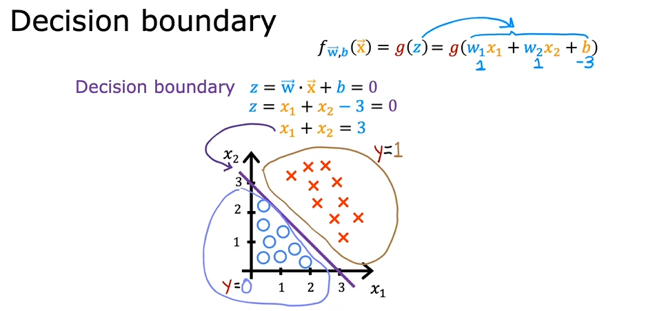

2022吴恩达机器学习Deeplearning.ai课程：https://www.coursera.org/learn/machine-learning

b站：https://www.bilibili.com/video/BV1Pa411X76s

# 监督学习：回归与分类

## 定义

- 对于棋类游戏，如果给程序过少的数据（10盘游戏），他会表现得更差
- 分为监督学习与无监督学习

## 监督学习（Spervised Learning）

- x到y的映射输出的算法

  

- 回归算法（Regression）

  应用：房价预测

  拟合：多数据点拟合曲线

  输出：可能的数据（数字），输出有无限可能

  

- 分类算法（Classification）

  应用：乳腺癌肿瘤探测

  拟合：一条边界线，边界线一边的某一输出类别可能性更大

  输出：一个类别（Class/Category），类别有限，可以不是数字，比如一张图可能是猫还是狗

  

  

## 无监督学习（Unsupervised Learning）

- 任由程序在数据中找到一些特殊的结构或模式

- 聚类算法（Clustering）

  - 应用：Google新闻（提取相似词语的文章进行分类），DNA微阵列，客户分类将没有标签的数据自动分组到集群中

  

- 异常检测算法（Anomaly Detection）

  - 应用：诈骗检测

- 降维算法（Dimensionality Reduction）

  - 在少丢失信息的情况下压缩大数据集到一个小数据集


## 线性回归（linear regression）

- 监督学习中的一个算法
- 用一条直线拟合
- 术语：
  - 训练集（training set）：用来训练的数据
  - 特征/输入特征（feature）：输入，常记为x
  - 目标变量（target）：输出，常记为y
  - y-hat：输出的预测值
  - 误差：y-hat - y = f(x) - y

- 

## 代价函数（cost function） 

- 越小越好，拟合程度越高，能够很好的**泛化（generalization）**，即能够非常好的预测；越大，说明训练数据的**拟合不足（underfitting）**或者说算法具有**高偏差（high bias ）**

- 平方误差代价函数：

  - 平方误差代价函数最通常用于**线性回归**
  - 分母中的2使后面的计算简洁，在算偏导数时与平方的2相消
  - 线性回归的平方误差代价函数：3D视图


  - 线性回归的平方误差代价函数：等高线视图


## 梯度下降（gradient descent）

- 每次对代价函数中的每个参数进行移动，使在相同的学习率的移动下，代价函数更小。最后到达一个局部最小值（local minima）。

- 

- 

- 注意：每个参数都要同时进行移动

- $\alpha$ 为学习率（learning rate），需要选取合适的值：

  - 如果太小，会导致过多步到达局部最小
  - 如果太大，会导致一步迈太大越过了局部最小

-   对于平方误差代价函数，计算偏导数后：

  

- 对于线性回归的平方误差代价函数，只会有一个全局最小值（global minimum），因为代价函数是一个凸函数（convex function），图片见前

- 批量梯度下降（Batch gradient descent）
  - 使用整个数据集，而不是其子集
  - 

### 如何判断梯度下降是否有效

- 绘制学习曲线（learning curve），或者给一个小值$\epsilon$来作为判断学习曲线是否收敛的标准
- 

### 选取合适的学习率

- 学习曲线**上下波动**或者学习曲线**递增**往往是学习率过大（也有可能是程序有bug）
  - 从小到大增加倍数来测试学习率，选择比合理的学习率略小的值
  - 0.001 -> 0.003 -> 0.01 -> 0.03 -> 0.1 -> 0.3

## 多维特征，向量化（vectorization）  

```python
import numpy as np

w = np.array([1.0, 2.5, -3.3])
b = 4
x = np.array([10, 20, 30])

// f = w1 * x1 + w2 * x2 + w3 * x3 + b
f = np.dot(w, x) + b
```

- numpy使用计算机硬件来高效完成矩阵相乘，因此向量化使机器学习高效
- 

## 正规方程（normal equation）

- 只用于线性回归
- 不用迭代来找到最佳的w1,w2....,b
- 不能用于其他机器学习算法
- 当特征特别大（>10000）时非常慢
- 有些机器学习库会在后端使用它来找到w和b

## 特征放缩（scale the features）

- 线性回归中的特征范围与参数往往成反比，即特征范围越小，其参数越大
- 放缩特征，选择合适的坐标轴和数值，会让代价函数图更合理，这样使用梯度下降时能更高效地到达最低代价函数
- 

### 最大值放缩

- 每个特征值除以其最大值，得到范围小于等于1，来得到一个代价函数图

  

### 均值标准化（mean normalization）

- **均值标准化（mean normalization）**：重新放缩特征值，让他们环绕在零点处，这样的特征值可以有负数，通常范围在[-1, 1]

  - $\mu$为特征$x$的平均值
  -  $x = \frac {x - \mu}{x_{max} - x_{min}}$

  

### 标准分数标准化（Z-score normalization）

- **标准分数标准化（Z-score normalization）**：计算每个特征的标准差
  - $\mu$为特征$x$的平均值，$\sigma$为标准差
  -  $x = \frac {x - \mu}{\sigma}$
  -  新$x$即为标准分数（z-score）。当一组数据为正态分布或近似正态分布时，相当于平均数的点的标准分数为0，在平均数以上各点的标准分数为正值，在平均数以下的各点的标准分数为负值。

### 如果不进行特征放缩

- 若$w_0 >> w_{1-3}$，则
- 
- 

## 特征工程（feature engineering）

- 使用原始的特征通过运算来设计新特征，使算法更容易做出准确的预测
- 例如
  - $f_{\vec{w},b}(\vec{x}) = w_1x_1 + w_2x_2 + b$
  - 制作一个新特征： $x_3 = x_1 * x_2$
  - 新的预测公式：$f_{\vec{w},b}(\vec{x}) = w_1x_1 + w_2x_2 + w_3x_3 + b$

## 多项式回归（Polynomial Regression）

- 对于下图进行拟合曲线（房价预测）
- 
- 相比线性，使用幂次来进行拟合能得到更合理的曲线
  - 平方
    - $f_{\vec{w},b}(\vec{x}) = w_1x + w_2x^2 + b$
    - 但是最后$f$会下降，不是很符合
  - 三次方
    - $f_{\vec{w},b}(\vec{x})  = w_1x + w_2x^2 + w_3x^3 + b$
    - 符合曲线
    - 这里$x^3$的范围会增大很多，因此需要特征放缩
  - 根号
    - $f_{\vec{w},b}(\vec{x})  = w_1x + w_2\sqrt{x} + b$
    - 符合曲线
- 对于一次多项式回归的递归下降算法：
  - 先放缩特征使特征的大小合理 
  - 权重$w$更大，说明该特征更适合用于拟合该曲线
  - 
  - 对上式来说， $x^2$ 特征远比 $x$ 或 $x^3$ 更适合拟合的曲线

## 逻辑回归（logistic regression）

- 与回归算法无关，属于分类算法，特别是二元分类（binary classification），需要给出类别0和1

- 

- $g(x) = \frac{1}{1+e^{-z}}$

  - 叫**逻辑函数**或者**sigmoid函数**

  - 对于这个式子，输出为一个在0到1之间的值

  - 图像

    

- $f_{\vec{w},b}(\vec{x}) = g(\vec{w} * \vec{x} + b) = \frac{1}{1+e^{-(\vec{w} \cdot \vec{x} + b)}}$

  -  输入 $\vec{x},\vec{w},b$，输出类别是1的概率
  - $f_{\vec{w},b}(\vec{x}) =P(y=1|\vec{x};\vec{w},b)$
  - 输出大于等于0.5，预测类别为1；小于0.5，预测类别为0
    - $f_{\vec{w},b}(\vec{x}) >= 0$
    - $g(z) >= 0$
    - $z>=0$ 即 $\vec{w} \cdot \vec{x} + b >=0$
  - **决策边界（decision boundary）**
    - 即 $z = \vec{w} \cdot \vec{x} + b =0$
    - 一个线性的边界
    - 一个非线性的边界

### 逻辑回归的代价函数

- 如果使用平方误差代价函数，则其代价函数图像不是一个凸函数，这样无法使用梯度下降收敛代价

  

- 因此，逻辑回归中单个数据的损失函数（loss function）为

  

  - $f$ 为逻辑回归的预测值，属于 $[0,1]$，$y^{(i)}$ 为真实值
  - 这是一个 $log$ 函数，如果预测值越靠近真实值， $loss$ 越小；预 测值越偏离真实值，$loss$ 趋向于正无穷
  - 简化上方损失函数：
  
  
  
- 故得到逻辑回归的代价函数：

  

  - 该代价函数是凸函数，可以使用梯度下降到达最小值
  - 这个代价函数源于最大似然估计（maximum likelihood）的统计学原理

### 逻辑回归的梯度下降

- 

  

  - 看起来和线性回归的梯度下降算法一样，但是其中的算法 $f_{\vec{w},b}(\vec{x}^{(i)})$ 是逻辑回归的算法，即 $f_{\vec{w},b}(\vec{x}) = \frac{1}{1+e^{-(\vec{w} \cdot \vec{x} + b)}}$

## 过拟合（overfitting）

- 回归算法的过拟合：同样是房价预测问题

  

  - 使用一次方会导致拟合不足，算法具有高偏差
  - 使用二次方能够很好的泛化，恰到好处
  - 使用四次方，看起来每个数据都准确符合算法，但是这是一个明显不合理的曲线，这就导致了**过拟合（overfitting）**，则这个算法具有**高偏差（high variance）**
  - 使用更多的特征，会存在更高的过拟合的风险

- 分类算法的过拟合

  

### 解决过拟合问题

1. 收集更多数据用于训练
2. 特征选择（feature selection）：使用更少的多项式特征；选择最小的特征子集，选择可能的对预测影响大的特征，抛弃掉影响小的特征
3. 正则化

### 正则化（regularization）

- 举例：

  - 对于右边过拟合的算法，$w_3$ 和 $w_4$ 作为三次方和四次方的参数，极大的导致曲线不符合我们期望的形状
  - 但是直接去掉 $x^3$ 和 $x^4$ 的项会损失许多的信息
  - 因此，在代价函数后增加 $1000{w_3}^2 + 1000{w_4}^2$，这样在梯度下降时，$w_3$ 和 $w_4$ 会不断地趋近于0，这样既没有丢失 $x^3$ 和 $x^4$ 的项，又可以减少他们的影响
  - 那么，为什么不去考虑缩小 $x^3$ 和 $x^4$ 呢？很简单，你不知道下一个样本想x输入的是什么，所以你不知道如何去考虑x
  - 人们普遍认为：更小的权值w，从某种意义上说，表示网络的复杂度更低，对数据的拟合刚刚好（这个法则也叫做奥卡姆剃刀）。而在实际应用中，也验证了这一点，L2正则化的效果往往好于未经正则化的效果。

- 因此，加入正则化（L2正则化）的新的代价函数为：

  

  - 左边依旧是平方误差，右边则是一个正则化项（regularization term）
  - 左边的平方误差项努力拟合曲线来**符合数据**，右边的正则化项用于**使参数的影响减小**
  - 对于正则项：$\frac {\lambda}{2m}\sum_{n}^{j=1} {w_j}^2$
    - 由于我们不知道哪些参数对我们拟合曲线是重要的，那我们就正则化所有的参数
    - b作为参数不放入正则化，因为求完偏导后b没了
    - 分母的2依旧求偏导后能消掉
    - $\lambda$ 用于平衡平方误差的功能和正则项的功能
      - 如果 $\lambda = 0$ ,则未正则化，将过度拟合
      - 如果 $\lambda$ 为一个很大的数，则所有的参数都会很小，除了b，因此最后的曲线会是 $y=b$ ，一条水平直线，则欠拟合
      - 当 $\lambda$ 恰到好处时，它将使曲线非常合理

#### 线性回归正则化

- L2正则化后的梯度下降

  

  - 上式与未正则化的梯度下降相比只是在$w_j$前多了一个系数：$(1-\alpha\frac{\lambda}{m})w_j$
  - 这相当于给$w_j$乘了一个小于1的系数，即收缩了$w_j$

#### 逻辑回归正则化

- L2正则化后的梯度下降
  - 与线性回归公式一样，除了预测算法 $f_{\vec{w},b}(\vec{x}) = \frac{1}{1+e^{-(\vec{w} * \vec{x} + b)}}$

#  神经网络（neural network）


- 层（layer）
  - 输入层（input layer）：又叫第0层
  - 隐藏层（hidden layer）：有若干神经元（neuron）又叫hidden unit，能输出激活值（activation value）
  - 输出层（output layer）
- 神经网络又叫多层感知器（multiple perception）


## 图像感知

- 面部识别
  - 每一层会由神经网络自己找出需要寻找的特征，同时每一层的特征的窗口大小也会不同，例如第二层的特征是五官，第三层的特征是脸，此时第三层的窗口大小会比第二层更大
  - 
- 

## 神经网络层

- 第一层
  - 三个神经元每一个接受输入向量，使用逻辑函数（sigmoid函数）计算得出一个0到1之间的激活值，因此这个函数又叫激活函数（activation function）
  - 三个值组成第1层的激活值向量输出
  - $a_j^{[l]} = g(\vec{w}_j^{[l]} \cdot \vec{a}^{[l-1]} + b_2^{[l]})$
  - 以上a为激活值，l为第几层，j为这一层的第几个神经元
  - 

- 输出层
  - 与中间的隐藏层一样，不过只输出一个激活值，而非一个向量，最后根据是否大于等于0.5进行分类
  - 
  - 

## 前向传播（forward propagation）


## 代码实现

模型训练的具体过程：

1. 设置 $f_{\vec{w},b}(\vec{x})$，即定义这个模型和参数
2. 设置代价函数
3. 在数据训练集上最小化代价函数

以下使用tensorflow实现

```python
import tensorflow as tf
from tensorflow.keras import Sequential
from tensorflow.keras.layers import Dense

'''设置模型和参数'''
layer_1 = Dense(units = 25, activation = 'sigmoid')
a1 = layer_1(x)
layer_2 = Dense(units = 15, activation = 'sigmoid')
# 将多层聚合成一个神经网络
model = Sequential([layer_1, layer_2])
# 已有的数据：x为输入，y为输出
x = np.array([200.0, 17.0],
            [120.0, 5.0],
            [425.0, 20.0],
            [212.0, 18.0])
y = np.array([1, 0, 0, 1])

'''设置代价函数'''
# model.compile defines a loss function and specifies a compile optimization
model.compile(
    loss = tf.keras.losses.BinaryCrossentropy(),
    optimizer = tf.keras.optimizers.Adam(learning_rate=0.01),
)

'''训练'''
model.fit(x, y, epochs = 100)  # epochs代表训练100次
# 预测
model.predict(x_new)
```


## 激活函数

如果没有激活函数（或者说只是用线性函数），则神经网络与线性回归相同，以下是三个常用的激活函数：

- 线性函数：$g(z)=z$，有时候会说没有使用激活函数
- Sigmoid函数
- **ReLU函数**（Rectified Linear Unit）：$g(z)=max(0, z)$


### 选择激活函数

- 二元分类算法：Sigmoid函数
- 回归算法且预测值可正可负：线性函数
- 回归算法且预测值非负：ReLU函数

如今Sigmoid函数除了二元分类否则不使用，主要使用ReLU函数，原因：

1. ReLU更快
2. Sigmoid在整个数轴上有更多平坦的曲线，而ReLU只有小于0为平坦，而更多的平坦的曲线则让梯度下降更慢

## 多分类问题

如下图，左边是二元分类，判断预测值y为0或1即可。右边为多分类问题，需要判断y值为1/2/3/4。


